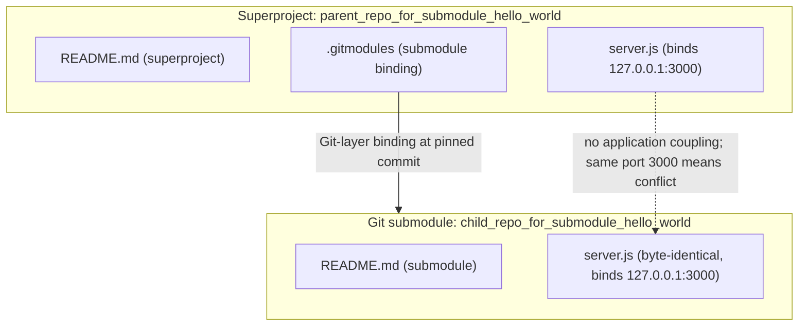
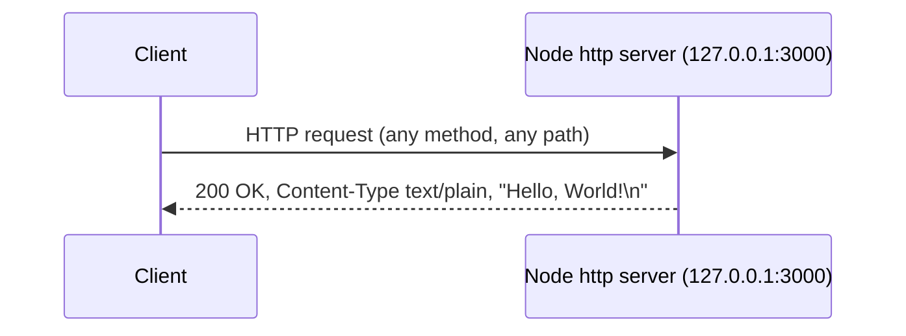
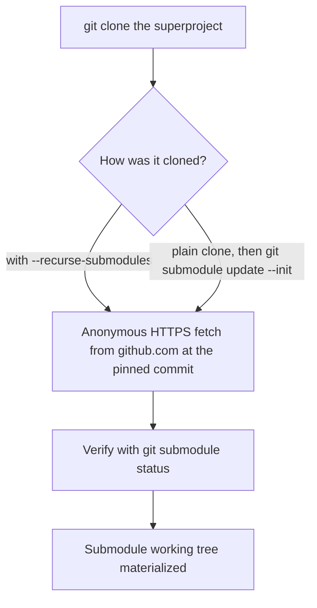

# ep_check_nested_submodule_15Jun_hello_world

A minimal, standard-library-only Node.js HTTP server, organized as a Git **superproject** that tracks one Git **submodule**; the project is used as an engineering/submodule-materialization validation fixture. Source: server.js:L1-L62, .gitmodules.

## Table of Contents

1. [Overview](#overview)
2. [Prerequisites](#prerequisites)
3. [Project Structure](#project-structure)
4. [Setup and Installation](#setup-and-installation)
5. [Running the Server](#running-the-server)
6. [API Documentation](#api-documentation)
7. [Code Explanation](#code-explanation)
8. [Deployment Guide](#deployment-guide)
9. [Submodule Notes](#submodule-notes)
10. [Diagrams](#diagrams)
11. [Source Citations](#source-citations)

## Overview

This repository is a minimal, **dependency-free** HTTP "Hello, World!" server implemented entirely with the Node.js built-in `http` module — there are no third-party packages. Source: server.js:L14.

It binds to the IPv4 loopback interface and responds to **every** request with a fixed `200 OK` plain-text greeting, regardless of HTTP method or URL path. Source: server.js:L46-L50.

Structurally, the repository is a Git **superproject** paired with one tracked Git **submodule**, `child_repo_for_submodule_hello_world`, whose `server.js` is byte-identical (in executable code) to this repository's `server.js`. The project exists to validate nested-submodule **materialization** — that is, that the submodule is correctly fetched and checked out at its recorded commit. Source: .gitmodules, server.js:L1-L62.

## Prerequisites

- **Node.js** — any maintained LTS release that supports CommonJS (`require`) and the built-in `http` module. **No specific version is pinned**: this repository has **no** `package.json` and **no** `.nvmrc`, so do not assume a specific major version is required. Source: server.js:L14.
- **Git** — required to clone the superproject and to initialize/update the tracked submodule. Source: .gitmodules.
- **No `npm install`** — there are **zero** third-party dependencies; the only dependency is the Node.js built-in `http` module, so there is nothing to install. Source: server.js:L14.

## Project Structure

The repository contains the superproject files at the root and the tracked submodule under `child_repo_for_submodule_hello_world/`:

```text
parent_repo_for_submodule_hello_world/
├── README.md      ← this file (superproject)
├── server.js      ← minimal HTTP server (Source: server.js:L1-L62)
├── .gitmodules    ← submodule binding (Source: .gitmodules)
└── child_repo_for_submodule_hello_world/   ← Git submodule
    ├── README.md
    └── server.js  ← byte-identical to root server.js
```

The submodule has its own documentation: see [`child_repo_for_submodule_hello_world/README.md`](child_repo_for_submodule_hello_world/README.md). The submodule's `server.js` is byte-identical (in executable code) to the root `server.js`. Source: server.js:L1-L62, .gitmodules.

## Setup and Installation

There is **no dependency installation step** — `node_modules`, `package.json`, and `npm install` are all unnecessary because the server uses only the Node.js built-in `http` module. Source: server.js:L14.

**Option A — clone and materialize the submodule in one step:**

```bash
git clone --recurse-submodules <superproject-repo-url>
```

**Option B — plain clone, then initialize the submodule afterward:**

```bash
git clone <superproject-repo-url>
cd parent_repo_for_submodule_hello_world
git submodule update --init
```

Both options materialize the `child_repo_for_submodule_hello_world` submodule at its recorded commit. Source: .gitmodules.

## Running the Server

From the repository root, start the server directly with the Node.js runtime — `server.js` is a single, self-contained script that needs no build step or dependency installation. Source: server.js:L1-L62.

```bash
node server.js
```

Once it binds successfully, it prints the following confirmation line to stdout:

```text
Server running at http://127.0.0.1:3000/
```

Source: server.js:L61.

## API Documentation

The server exposes a single **catch-all** HTTP responder — there is no routing, no separate endpoints, and no `404` handling. Source: server.js:L46-L50.

| Aspect | Value | Source |
|---|---|---|
| Methods | ALL (any method) | server.js:L46-L50 |
| Paths | ALL (any path) | server.js:L46-L50 |
| Status | `200 OK` | server.js:L47 |
| Content-Type | `text/plain` | server.js:L48 |
| Body | `Hello, World!\n` | server.js:L49 |
| Content-Length | `14` | server.js:L49 |

**Catch-all behavior:** every request — regardless of HTTP method or URL path — converges on the exact same `200 OK` `text/plain` response with the body `Hello, World!\n`. The handler never inspects the request method, URL, headers, or body. Source: server.js:L46-L50.

**Example — `GET /`:**

```bash
curl -i http://127.0.0.1:3000/
```

**Example — non-GET request to an arbitrary path (`POST /anything/else`):**

```bash
curl -i -X POST http://127.0.0.1:3000/anything/else
```

Both commands return the **identical** response shown below, demonstrating the catch-all behavior:

```text
HTTP/1.1 200 OK
Content-Type: text/plain
Content-Length: 14

Hello, World!
```

Note: the application code sets only the status code and `Content-Type`; the Node.js `http` runtime additionally emits standard auto-generated headers (for example `Date`, `Connection`, and `Keep-Alive`). Source: server.js:L47-L48.

## Code Explanation

A walkthrough of every executable statement in `server.js`, with physical line numbers that match the current file (verify with `cat -n server.js`). The lines in between are JSDoc comment blocks and blank separators. Source: server.js:L1-L62.

| Line | Statement | Explanation |
|---|---|---|
| `server.js:L14` | `const http = require('http');` | Imports Node's built-in `http` module — the only dependency (no third-party packages). |
| `server.js:L23` | `const hostname = '127.0.0.1';` | Defines the bind address as the IPv4 loopback interface (local-only). |
| `server.js:L32` | `const port = 3000;` | Defines the TCP port the server listens on. |
| `server.js:L46` | `const server = http.createServer((req, res) => {` | Creates the HTTP server and opens the catch-all request handler. |
| `server.js:L47` | `res.statusCode = 200;` | Sets the response status to `200 OK` for every request. |
| `server.js:L48` | `res.setHeader('Content-Type', 'text/plain');` | Sets the response `Content-Type` header to `text/plain`. |
| `server.js:L49` | `res.end('Hello, World!\n');` | Writes the response body `Hello, World!\n` and ends the response. |
| `server.js:L50` | `});` | Closes the request-handler callback. |
| `server.js:L60` | `server.listen(port, hostname, () => {` | Binds the server to `hostname:port` and registers the startup callback. |
| `server.js:L61` | ``console.log(`Server running at http://${hostname}:${port}/`);`` | Logs the startup confirmation line to stdout once the server is bound. |
| `server.js:L62` | `});` | Closes the `server.listen` callback. |

## Deployment Guide

- **Loopback-only.** The server binds to `127.0.0.1`, so it is reachable **only** from the local machine and is **not** exposed to other hosts on the network. Source: server.js:L23.
- **Port-3000 conflict.** The superproject server and the byte-identical submodule server both bind `127.0.0.1:3000`, so they **cannot run concurrently** — starting the second process fails with `EADDRINUSE`. Source: server.js:L23, L32.
- **No build step.** There is nothing to compile or bundle; run the file directly with `node server.js`. Source: server.js:L1-L62.
- **Process management (optional).** To keep the process running unattended, you may launch `node server.js` under any standard OS service manager or process supervisor. This adds no capability to the server itself — the runtime behavior remains the fixed catch-all response. Source: server.js:L46-L50.

## Submodule Notes

This repository tracks exactly one Git submodule, declared in `.gitmodules`. The child repository has no `.gitmodules` of its own, so there is no nesting — exactly one submodule. Source: .gitmodules.

| Field | Value | Source |
|---|---|---|
| Name / path | `child_repo_for_submodule_hello_world` | .gitmodules |
| Upstream URL | `https://github.com/lakshya-blitzy/child_repo_for_submodule_hello_world.git` | .gitmodules |
| Pinned commit (superproject gitlink) | `f07ea17f7fa07918f5a56b4b24790a5363d179ae` | git submodule status / git ls-tree HEAD |

The superproject records the submodule at a specific commit via its **gitlink** — currently `f07ea17f7fa07918f5a56b4b24790a5363d179ae` — which guarantees a **reproducible** submodule checkout: every clone materializes the exact same submodule contents. This commit is **not** stored in `.gitmodules` (which holds only the submodule path and URL); it is recorded by the superproject gitlink and reported by `git submodule status`. Source: git submodule status / git ls-tree HEAD child_repo_for_submodule_hello_world.

Verify which commit is currently checked out for the submodule with:

```bash
git submodule status
```

This prints the commit SHA the superproject pins for the submodule (its gitlink) next to the submodule path; it should match the **Pinned commit** listed above. Source: git submodule status / git ls-tree HEAD child_repo_for_submodule_hello_world.

## Diagrams

### Architecture / Component Graph

The superproject and the submodule are bound **only at the Git layer** (via `.gitmodules`). The two `server.js` files share no application-level coupling, and because both bind the same port they cannot run at the same time. Source: .gitmodules, server.js:L23, L32.



### HTTP Request / Response Sequence

Every method and every path converges on one fixed response, served from the loopback bind address `127.0.0.1:3000`. Source: server.js:L23, L32 (bind address and port), server.js:L46-L50 (catch-all response).



### Submodule Materialization Flow

Cloning materializes the submodule from its upstream URL (declared in `.gitmodules`) at the commit recorded by the superproject gitlink; `git submodule status` verifies the result. Source: .gitmodules (upstream URL); git submodule status / git ls-tree HEAD child_repo_for_submodule_hello_world (recorded commit).



## Source Citations

- `server.js:L1-L62` — the complete HTTP server implementation: the `http` import (L14), the `hostname`/`port` constants (L23 and L32), the catch-all request handler (L46-L50), and the `server.listen` call with its startup log (L60-L62).
- `.gitmodules` — submodule binding metadata: the submodule **name/path** and upstream **URL** only; it does **not** record the pinned commit.
- Superproject **gitlink** (via `git submodule status` / `git ls-tree HEAD child_repo_for_submodule_hello_world`) — the **pinned commit** `f07ea17f7fa07918f5a56b4b24790a5363d179ae` that the superproject records for the `child_repo_for_submodule_hello_world` submodule.
