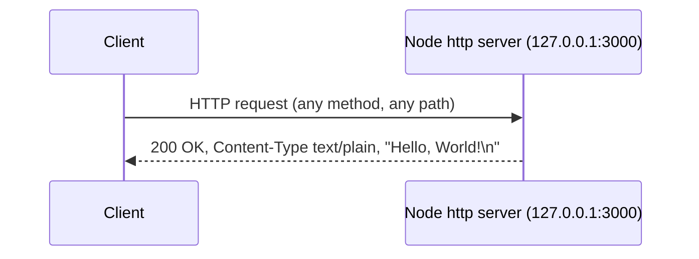

# Technical Specification

# 0. Agent Action Plan

## 0.1 Intent Clarification

### 0.1.1 Core Documentation Objective

Based on the provided requirements, the Blitzy platform understands that the documentation objective is to produce complete, first-time documentation for a minimal, standard-library-only Node.js HTTP server that is composed of a Git superproject and one tracked Git submodule. Two deliverables are required: (1) JSDoc comments annotating every function in each `server.js`, and (2) a comprehensive `README` covering setup instructions, API documentation, a deployment guide, and inline code explanations — applied across every submodule, with nothing skipped.

User Requirement (verbatim): "Add JSDoc comments to server.js functions, create a comprehensive README with setup instructions, API documentation, deployment guide, and inline code explanations. Go through each submodule, don't skip anything."

- Request category: **Create new documentation + Fix documentation gaps**. Both `README.md` files are title-only stubs containing a single H1 line and no body [README.md:L1] [child_repo_for_submodule_hello_world/README.md:L1], and neither `server.js` contains any comments [server.js:L1-L14] — existing documentation coverage is effectively 0%.
- Documentation type: **Inline code documentation (JSDoc)**, **README / quick-start**, **API documentation**, **Deployment guide**, and a **Git submodule materialization guide**.

Each explicit requirement, restated with enhanced clarity:

- R1 — Annotate functions with JSDoc: add JSDoc comment blocks to every function in each `server.js`. There are exactly two functions per file — the `http.createServer` request-handler callback [server.js:L6] and the `server.listen` startup callback [server.js:L12] — across the two byte-identical files, for four functions total.
- R2 — Comprehensive README: author a full `README` for the project that explicitly contains the four user-named parts — setup instructions, API documentation, a deployment guide, and inline code explanations.
- R3 — Cover each submodule, skip nothing: apply the same documentation treatment to the one tracked submodule, `child_repo_for_submodule_hello_world` [.gitmodules], which contains its own `server.js` and `README.md`.

### 0.1.2 Special Instructions and Constraints

- Comprehensiveness directive: the words "comprehensive" and "don't skip anything" establish a high-coverage bar — every function, every README section, and every submodule must be documented, and the code explanation is expected to be line-by-line for the 14-line server.
- Per-submodule directive: "Go through each submodule" mandates that the single child submodule receives full, independent documentation, and that the superproject `README` additionally documents the submodule binding.
- Scope constraint (documentation-only with one sanctioned exception): all changes are documentation. The sole permitted edits to source files are the explicitly-requested JSDoc **comments**; no executable statement in any `server.js` may change, and the verified runtime behavior must remain byte-for-byte identical.
- No user template or example was provided. No "USER PROVIDED TEMPLATE" and no "User Example" exist for this task; the documentation will therefore follow conventional Markdown and JSDoc best practices and adopt the terminology used by the existing Technical Specification (superproject, submodule, materialization, loopback, catch-all).
- Style preference: not specified by the user; default to clear, progressive-disclosure Markdown with Mermaid diagrams (GitHub-native) and short (2–3 line) code snippets.
- Web search requirement: documentation best practices (JSDoc block tags, canonical README structure, Mermaid syntax) are established conventions and require no live research; external research was attempted but returned no results in this environment, so stable conventional knowledge is applied.

### 0.1.3 Technical Interpretation

These documentation requirements translate to the following technical documentation strategy:

- To document the request-handling function, we will **update** `server.js` (root) and `child_repo_for_submodule_hello_world/server.js` by adding a JSDoc block on the `http.createServer` callback describing `@param {http.IncomingMessage} req`, `@param {http.ServerResponse} res`, `@returns {void}`, and the catch-all response semantics [server.js:L6-L10].
- To document the startup function, we will **update** both `server.js` files by adding a JSDoc block on the `server.listen` callback describing the startup-confirmation log and `@returns {void}` [server.js:L12-L14].
- To document module-level constructs, we will **extend** both `server.js` files with a file-level `@file`/`@module` header and `@constant` annotations for `hostname` [server.js:L3] and `port` [server.js:L4].
- To document setup, API, deployment, and internals, we will **update** the root `README.md` (replacing the stub) with a full superproject guide, and **update** `child_repo_for_submodule_hello_world/README.md` (replacing the stub) with a full submodule guide.

### 0.1.4 Inferred Documentation Needs

- Based on code analysis: each `server.js` contains an undocumented public runtime surface — one HTTP endpoint plus two callbacks and two configuration constants [server.js:L1-L14] — none of which are currently documented, so JSDoc and an API table are required.
- Based on structure: the project spans two repositories bound only at the Git layer [.gitmodules], so the root `README` must document the superproject↔submodule relationship and the materialization workflow, not just a single server.
- Based on behavior: the single handler responds identically to **all** methods and paths (verified: `GET /` and `POST /anything/else` both return `200 text/plain "Hello, World!\n"`). This catch-all behavior is non-obvious and must be explicitly documented so readers do not expect routing or `404` responses.
- Based on the operator journey: because both servers bind the same address `127.0.0.1:3000` [server.js:L3-L4], the deployment guide must warn that the two byte-identical servers cannot run concurrently (port conflict) and that binding is loopback-only (not externally reachable). Prerequisites (Node.js — any maintained LTS, none pinned; Git for submodule init) and verification steps (`curl`, `git submodule status`) are also inferred necessities.

## 0.2 Documentation Discovery and Analysis

### 0.2.1 Existing Documentation Infrastructure Assessment

Repository analysis reveals a near-empty documentation footprint with no documentation tooling of any kind. The repository root is `/tmp/blitzy/parent_repo_for_submodule_hello_world/1506_01_b8c0ee`, and no `.blitzyignore` files exist anywhere, so no paths are excluded from scope.

- Documentation framework / generator: **None**. There is no `mkdocs.yml`, `docusaurus.config.js`, Sphinx `conf.py`, `typedoc.json`, `.jsdoc.json`/`jsdoc.conf.json`, or `.readthedocs.yml` anywhere in the repository.
- Existing documentation files: exactly two Markdown files, both title-only stubs — the root `README.md` (45 bytes, single H1 "# ep_check_nested_submodule_15Jun_hello_world") [README.md:L1] and the submodule `README.md` (38 bytes, single H1 "# child_repo_for_submodule_hello_world") [child_repo_for_submodule_hello_world/README.md:L1]. There is no `docs/` directory, no wiki, and no `.mdx`/`.rst` content.
- API documentation tooling: **None**. No JSDoc generator is installed, there is no `package.json` to host doc scripts, and the two `server.js` files currently contain no JSDoc or other comments [server.js:L1-L14].
- Diagram tooling: **None detected** in the repository. Mermaid is adopted for the new documentation because it renders natively on common Git hosts and is already the diagram convention of this Technical Specification.
- Documentation hosting / deployment: **None**.
- Convention baseline: the only pre-existing convention is CommonMark Markdown with a single H1 title; the comprehensive README structure is therefore established by this effort.

### 0.2.2 Repository Code Analysis for Documentation

The documentable surface is small, fully inspected, and identical across both repositories.

- Modules to document: the root `server.js` [server.js:L1-L14] and the submodule `server.js` [child_repo_for_submodule_hello_world/server.js:L1-L14] are **byte-identical** (confirmed by `diff`). Each file exposes:
  - `require('http')` — the only dependency, a Node.js built-in [server.js:L1].
  - `const hostname = '127.0.0.1'` — bind address constant [server.js:L3].
  - `const port = 3000` — bind port constant [server.js:L4].
  - The `http.createServer((req, res) => { ... })` request-handler callback that sets `res.statusCode = 200`, `Content-Type: text/plain`, and ends `'Hello, World!\n'` [server.js:L6-L10].
  - The `server.listen(port, hostname, () => { ... })` startup callback that logs the running URL [server.js:L12-L14].
- Public API surface: the documentable "API" is the runtime HTTP surface — one catch-all endpoint — not a code-level export API. The files declare no module exports, no CLI, no classes, and no configuration files.
- Submodule binding: `.gitmodules` declares exactly one submodule with `path`/`name` `child_repo_for_submodule_hello_world` and `url https://github.com/lakshya-blitzy/child_repo_for_submodule_hello_world.git` [.gitmodules]; the submodule is pinned at commit `a7b8fe55c19504b8912fe655fb390a673dbe02ae`. The child repository contains no `.gitmodules`, so there is exactly one submodule (no nesting), and the root `README` must document this binding in its structure and setup sections.
- Key directories examined: repository root (`server.js`, `README.md`, `.gitmodules`) and the submodule working tree `child_repo_for_submodule_hello_world/` (`server.js`, `README.md`, empty `.gitignore`).

### 0.2.3 Web Search Research Conducted

External web research was attempted for current documentation tooling versions and best practices (JSDoc block tags, canonical README structure, Mermaid syntax) but returned no results in this environment. Because these are stable, well-established conventions rather than fast-moving data, the documentation applies conventional knowledge directly:

- JSDoc block-tag conventions for Node.js HTTP handlers: `@file`/`@module` headers, `@constant` for configuration literals, `@param {http.IncomingMessage}`/`@param {http.ServerResponse}` for the request callback, and `@returns {void}` for both callbacks.
- README structure conventions: title, overview, prerequisites, project structure, setup/installation, run instructions, API reference, code explanation, and deployment.
- Mermaid diagram conventions: `graph` for architecture/component relationships and `sequenceDiagram` for request/response and materialization flows.

## 0.3 Documentation Scope Analysis

### 0.3.1 Code-to-Documentation Mapping

The following maps every code construct to the documentation it requires. Because the two `server.js` files are byte-identical, the mapping applies symmetrically to the root and the submodule.

- Module: `server.js` (root) [server.js:L1-L14]
  - Functions: request-handler callback [server.js:L6-L10]; `server.listen` startup callback [server.js:L12-L14].
  - Constants: `hostname` [server.js:L3]; `port` [server.js:L4].
  - Current documentation: **missing** (no comments).
  - Documentation needed: file-level JSDoc header, `@constant` blocks for `hostname`/`port`, JSDoc blocks for both callbacks, and an inline code explanation in the root README.
- Module: `child_repo_for_submodule_hello_world/server.js` [child_repo_for_submodule_hello_world/server.js:L1-L14]
  - Functions/constants: identical to the root module.
  - Current documentation: **missing**.
  - Documentation needed: identical JSDoc treatment plus an inline code explanation in the submodule README.
- Runtime endpoint: single catch-all HTTP responder [server.js:L6-L10]
  - Current documentation: **missing**.
  - Documentation needed: API reference table (method = all, path = all, status `200`, `Content-Type: text/plain`, body `"Hello, World!\n"`) with a worked `curl` example demonstrating the catch-all behavior.
- Configuration constants: `hostname` `127.0.0.1`, `port` `3000` [server.js:L3-L4]
  - Current documentation: **missing**.
  - Documentation needed: a configuration note in both READMEs explaining the hard-coded loopback bind address and port, with the port-conflict caveat for running both servers.
- Submodule binding: `.gitmodules` [.gitmodules]
  - Current documentation: **missing**.
  - Documentation needed: project-structure description, materialization/setup commands, and a `git submodule status` verification note in the root README.

There are no configuration files (e.g., YAML/`.env`), no CLI commands, and no module exports to document — these categories are not applicable to this codebase.

### 0.3.2 Documentation Gap Analysis

Given the requirements and repository analysis, documentation gaps include:

- Undocumented functions: 4 of 4 functions lack JSDoc (request handler and listen callback in each of the two `server.js`) [server.js:L6] [server.js:L12].
- Undocumented configuration: 2 of 2 constants per file lack documentation (`hostname`, `port`) [server.js:L3-L4].
- Missing READMEs: both `README.md` files are title-only stubs with no setup, API, deployment, or code-explanation content [README.md:L1] [child_repo_for_submodule_hello_world/README.md:L1].
- Missing API documentation: the single catch-all endpoint is entirely undocumented [server.js:L6-L10].
- Missing submodule documentation: neither README explains the superproject↔submodule relationship or the materialization workflow [.gitmodules].
- Missing diagrams: there are no architecture, request-flow, or submodule-materialization diagrams anywhere.
- Outdated documentation: none — there is no prior substantive documentation to update; the work is net-new content replacing stubs.

## 0.4 Documentation Implementation Design

### 0.4.1 Documentation Structure Planning

Documentation is delivered **in place** — as JSDoc comments inside the existing `server.js` files and as comprehensive content inside the existing `README.md` files. No new `docs/` site or documentation-generator tree is introduced, because the request targets README content and JSDoc comments only. The repository layout and the documentation each file receives:

```
parent_repo_for_submodule_hello_world/
├── README.md                 (UPDATE: comprehensive superproject README)
├── server.js                 (UPDATE: add JSDoc comments)
├── .gitmodules               (REFERENCE: describes the submodule binding)
└── child_repo_for_submodule_hello_world/   (Git submodule)
    ├── README.md             (UPDATE: comprehensive submodule README)
    └── server.js             (UPDATE: add JSDoc comments)
```

Both READMEs follow one consistent section template; the root README additionally carries the submodule-binding and materialization content:

- Title and one-line description
- Overview (purpose: minimal standard-library HTTP server / engineering-validation fixture)
- Prerequisites (Node.js — any maintained LTS, no version pinned in the repo; Git for submodule init)
- Project Structure (file tree; root README also documents the submodule)
- Setup / Installation (clone with `--recurse-submodules`, or clone then `git submodule update --init`; no `npm install` because there are zero dependencies)
- Running the Server (`node server.js`; expected startup log)
- API Documentation (endpoint table + catch-all note + worked `curl` example)
- Code Explanation (line-by-line walkthrough of the 14-line `server.js`)
- Deployment Guide (loopback-only caveat; port-3000 conflict caveat; process-manager note; no build step)
- Submodule Notes (root README only: binding, `git submodule status`, pinned-commit integrity)
- Diagrams (Mermaid)
- Source citations footer

### 0.4.2 Content Generation Strategy

- Information extraction approach: extract API behavior and signatures directly from `server.js` [server.js:L1-L14]; derive request/response examples from the empirically verified behavior (`GET /` → `200 text/plain "Hello, World!\n"`, `Content-Length: 14`; `POST /anything/else` → identical response); derive setup/materialization commands from `.gitmodules` [.gitmodules] and the verified toolchain (Node v22.22.2, Git 2.43.0).
- Template application: no user template was provided; apply the consistent section template defined in 0.4.1 to both READMEs and a consistent JSDoc block template to both `server.js` files so the superproject and submodule documentation remain parallel.
- JSDoc strategy (applied identically to both byte-identical files): a file-level `@file`/`@module` header summarizing the catch-all, loopback-bound server; `@constant {string} hostname` and `@constant {number} port`; a request-handler block with `@param {http.IncomingMessage} req`, `@param {http.ServerResponse} res`, `@returns {void}`; and a `server.listen` callback block describing the startup log with `@returns {void}`. Comments only — no executable statement changes.
- Documentation standards: Markdown headings (`#`/`##`/`###`); Mermaid fenced blocks for diagrams; language-tagged fenced blocks for code and shell examples; inline source citations of the form `Source: server.js:L6`; tables for the endpoint reference; and consistent terminology aligned with the Technical Specification.

### 0.4.3 Diagram and Visual Strategy

Mermaid diagrams to create (GitHub-native rendering, no tooling required):

- Component / architecture graph (root README): the superproject and submodule bound only at the Git layer, including the dotted "no application coupling / port conflict" relationship between the two identical servers.
- HTTP request/response sequence diagram (both READMEs): client → Node `http` server → fixed `200 text/plain "Hello, World!\n"` response, illustrating that all methods and paths converge on one response.
- Submodule materialization flow (root README): `git clone --recurse-submodules` or `git submodule update --init` → anonymous HTTPS fetch from `github.com` at the pinned commit → verification via `git submodule status`.

A representative request/response diagram:



No screenshots or UI images are applicable — the system has no user interface.

## 0.5 Documentation File Transformation Mapping

### 0.5.1 File-by-File Documentation Plan

Every documentation target is listed below with the target file first. Transformation modes: **CREATE** (new file), **UPDATE** (modify existing file), **DELETE** (remove obsolete file), **REFERENCE** (read-only input used for accuracy). Both `README.md` files already exist as title-only stubs, so they are **UPDATE** (their stub content is replaced with comprehensive documentation). Both `server.js` files are **UPDATE** because only JSDoc comments are added — no executable statement changes.

| Target Documentation File | Transformation | Source Code/Docs | Content/Changes |
|---------------------------|----------------|------------------|-----------------|
| `README.md` | UPDATE | `server.js`, `.gitmodules`, `child_repo_for_submodule_hello_world/README.md` | Replace title-only stub [README.md:L1] with a comprehensive superproject README: overview, prerequisites, project structure, setup (incl. submodule init), run, API table + catch-all note, line-by-line code explanation, deployment guide (loopback + port-conflict caveats), submodule notes, and Mermaid diagrams (architecture, request/response, materialization) |
| `child_repo_for_submodule_hello_world/README.md` | UPDATE | `child_repo_for_submodule_hello_world/server.js` | Replace title-only stub [child_repo_for_submodule_hello_world/README.md:L1] with a comprehensive submodule README: overview, prerequisites, run, API table + catch-all note, line-by-line code explanation, deployment guide, and request/response Mermaid diagram; link back to the superproject |
| `server.js` | UPDATE | `server.js` | Add JSDoc only: file-level `@file`/`@module` header, `@constant` for `hostname` [server.js:L3] and `port` [server.js:L4], a request-handler block [server.js:L6], and a `server.listen` callback block [server.js:L12]; no behavior change |
| `child_repo_for_submodule_hello_world/server.js` | UPDATE | `child_repo_for_submodule_hello_world/server.js` | Add identical JSDoc blocks to the byte-identical file; no behavior change |
| `.gitmodules` | REFERENCE | `.gitmodules` | Read-only input describing the single submodule binding (name/path/url, pinned commit); cited in the root README's structure and setup sections; not edited |
| Tech Spec §1.2, §1.3, §4.4, §5.1, §3.1 | REFERENCE | Technical Specification | Terminology and behavior corroboration for the documentation (catch-all response, loopback bind, materialization workflow, unpinned Node engine); not files in the repository |

All documentation files are enumerated above; none are left as "pending" or "to be discovered." There are no **CREATE** targets (every target file already exists) and no **DELETE** targets (no obsolete documentation exists).

### 0.5.2 Documentation Files to Update — Detail

```
File: README.md  (repository root / superproject)
Type: Comprehensive README (replaces stub)
Source Code: server.js, .gitmodules, child_repo_for_submodule_hello_world/README.md
Sections:
    - Overview (minimal standard-library HTTP server; engineering-validation fixture)
    - Prerequisites (Node.js any maintained LTS — none pinned; Git)
    - Project Structure (file tree incl. the submodule)
    - Setup / Installation (clone --recurse-submodules OR clone + git submodule update --init; no npm install)
    - Running the Server (node server.js; expected startup log)
    - API Documentation (endpoint table; catch-all note; curl example)
    - Code Explanation (line-by-line of server.js:L1-L14)
    - Deployment Guide (loopback-only; port-3000 conflict; no build step)
    - Submodule Notes (binding, git submodule status, pinned commit)
Diagrams:
    - Architecture/component graph (superproject + submodule, Git-layer binding, port-conflict edge)
    - HTTP request/response sequence diagram
    - Submodule materialization flow
Key Citations: server.js:L1-L14, .gitmodules
```

```
File: child_repo_for_submodule_hello_world/README.md  (submodule)
Type: Comprehensive README (replaces stub)
Source Code: child_repo_for_submodule_hello_world/server.js
Sections:
    - Overview (standalone identical HTTP server)
    - Prerequisites (Node.js any maintained LTS; Git)
    - Running the Server (node server.js; expected startup log)
    - API Documentation (endpoint table; catch-all note; curl example)
    - Code Explanation (line-by-line of server.js:L1-L14)
    - Deployment Guide (loopback-only; port-3000 conflict with the superproject server)
    - Relationship to superproject (link back to ../README.md)
Diagrams:
    - HTTP request/response sequence diagram
Key Citations: child_repo_for_submodule_hello_world/server.js:L1-L14
```

```
File: server.js  (root)  AND  child_repo_for_submodule_hello_world/server.js  (identical treatment)
Type: Inline code documentation (JSDoc comments only)
Source Code: the file itself
JSDoc blocks to add:
    - File-level @file / @module header (purpose; catch-all + loopback summary)
    - @constant {string} hostname  (server.js:L3)
    - @constant {number} port      (server.js:L4)
    - Request handler callback (server.js:L6): @param {http.IncomingMessage} req, @param {http.ServerResponse} res, @returns {void}; note catch-all
    - server.listen callback (server.js:L12): startup-log description, @returns {void}
Constraint: comments ONLY; runtime behavior must remain byte-identical
Key Citations: server.js:L1-L14
```

### 0.5.3 Documentation Configuration Updates

None. The repository has no documentation-generator configuration (`mkdocs.yml`, `docusaurus.config.js`, `sphinx/conf.py`, `.readthedocs.yml`, `typedoc.json`) and none is introduced, because the deliverables are README content and JSDoc comments only. There is no `package.json`, so no documentation build scripts are added.

### 0.5.4 Cross-Documentation Dependencies

- Navigation links: the root `README.md` links to the submodule README via the relative path `child_repo_for_submodule_hello_world/README.md`; the submodule README links back via `../README.md`.
- Shared content / includes: none — each README is self-contained (no partials, no generator includes).
- Table of contents: each README maintains its own in-document anchor-based TOC; there is no cross-repository navigation/sidebar configuration (no doc-site generator exists).
- External link rewrites: none required.

## 0.6 Dependency Inventory

### 0.6.1 Documentation Dependencies

This documentation exercise introduces **no new dependencies**. JSDoc annotations are plain source-code comments that require no package to be valid or useful, and the READMEs are plain CommonMark Markdown that requires no generator. The repository has no `package.json` and zero third-party packages — the application uses only the Node.js built-in `http` module [server.js:L1] — and that posture is unchanged by this work.

| Registry | Package Name | Version | Purpose |
|----------|--------------|---------|---------|
| — | (none added) | — | No documentation dependencies are added, updated, or removed. JSDoc comments and Markdown READMEs require no tooling. |

Toolchain present and used only for verifying the setup/deployment instructions documented in the READMEs (not added to the project): Node.js `v22.22.2`, npm `11.1.0`, Git `2.43.0`.

Optional, **not adopted** by this task: if the team later wants generated HTML API docs, the conventional choice is the `jsdoc` CLI; if Mermaid diagrams must be exported to static images, `@mermaid-js/mermaid-cli` is the conventional choice. Neither is introduced here, neither is required for the deliverables, and exact versions should be verified against the npm registry before any future adoption — therefore no version is pinned for them in this plan.

### 0.6.2 Documentation Reference Updates

- Internal documentation links to add: the root `README.md` links to `child_repo_for_submodule_hello_world/README.md`, and the submodule README links to `../README.md`. No pre-existing links require rewriting, because the current files are title-only stubs containing no links [README.md:L1] [child_repo_for_submodule_hello_world/README.md:L1].
- No link-transformation rules apply (there are no legacy documentation paths to migrate).

## 0.7 Coverage and Quality Targets

### 0.7.1 Documentation Coverage Metrics

Current coverage is effectively 0% across every category; the target is full coverage of the defined documentable surface, justified by the user directives "comprehensive" and "don't skip anything."

| Metric | Current | Target |
|--------|---------|--------|
| JSDoc function coverage | 0 / 4 functions | 4 / 4 (100%) |
| Documented constants (per file) | 0 / 2 | 2 / 2 (`hostname`, `port`) |
| README content completeness | 0% (two title-only stubs) | 100% of the defined section template, both repos |
| API endpoint coverage | 0 / 1 | 1 / 1 (the catch-all endpoint) |
| Submodule coverage | 0 / 1 | 1 / 1 (`child_repo_for_submodule_hello_world`) |
| Diagrams | 0 | ≥ 3 (architecture, request/response, materialization) |

The four functions counted are the request-handler callback and the `server.listen` callback in each of the two byte-identical `server.js` files [server.js:L6] [server.js:L12].

### 0.7.2 Documentation Quality Criteria

- Completeness: each README includes all four user-named parts — setup instructions, API documentation, deployment guide, and inline code explanations — plus prerequisites and project structure; JSDoc covers the file header, both constants, and both callbacks.
- Accuracy: every command must be the verified one (`node server.js`; `git submodule update --init`; `curl http://127.0.0.1:3000/`). The API table must match the empirically verified behavior — `GET /` and `POST /anything/else` both return `200`, `Content-Type: text/plain`, `Content-Length: 14`, body `"Hello, World!\n"` [server.js:L6-L10]. Line numbers in the code explanation must match the actual 14-line file, and JSDoc `@param` types must match the Node `http` API (`http.IncomingMessage`, `http.ServerResponse`).
- Clarity: progressive disclosure (overview → setup → run → API → internals → deploy); plain language; terminology consistent with the Technical Specification (superproject, submodule, materialization, loopback, catch-all).
- Maintainability: per-section source citations (e.g., `Source: server.js:L6`); consistent heading hierarchy; code snippets limited to 2–3 lines.

### 0.7.3 Example and Diagram Requirements

- Minimum examples per endpoint: 1 worked `curl` example showing the full request and response; additionally a non-`GET` example (e.g., `POST`) to demonstrate the catch-all behavior.
- Startup example: each README shows the expected stdout line `Server running at http://127.0.0.1:3000/` [server.js:L13].
- Diagram types required: ≥ 3 Mermaid diagrams total — an architecture/component graph (root README), an HTTP request/response sequence diagram (both READMEs), and a submodule materialization flow (root README).
- Example verification: documented commands and the response payload were validated against the running server during environment setup, so all examples reflect actual behavior.

## 0.8 Scope Boundaries

### 0.8.1 Exhaustively In Scope

- README documentation (UPDATE, replacing title-only stubs):
  - `README.md` (root / superproject) [README.md:L1]
  - `child_repo_for_submodule_hello_world/README.md` (submodule) [child_repo_for_submodule_hello_world/README.md:L1]
- Inline code documentation (UPDATE, JSDoc comments only — no behavior change):
  - `server.js` (root) [server.js:L1-L14]
  - `child_repo_for_submodule_hello_world/server.js` [child_repo_for_submodule_hello_world/server.js:L1-L14]
- Documentation content elements (within the files above):
  - JSDoc: file-level `@file`/`@module` header, `@constant` for `hostname` and `port`, and blocks for the request handler and the `server.listen` callback.
  - README: overview, prerequisites, project structure, setup/installation, run instructions, API reference table, line-by-line code explanation, deployment guide, submodule notes (root), and Mermaid diagrams.

Because the entire repository consists of two `server.js` and two `README.md` (plus `.gitmodules`), the in-scope file set is the complete, fixed list above; there are no wildcard-expandable directories of documentation to discover.

### 0.8.2 Explicitly Out of Scope

- Any executable or behavioral change to `server.js` — routing, additional endpoints, `404`/error handling, status/Content-Type/body changes, host/port changes, graceful shutdown, or clustering. The server must remain byte-identical in behavior [server.js:L1-L14].
- Adding dependencies or creating a `package.json`, lockfile, or `node_modules`.
- Tests, CI/CD pipelines, Dockerfiles/containerization, or any deployment automation.
- Introducing a documentation-site generator or `docs/` tree (e.g., MkDocs, Docusaurus, Sphinx, TypeDoc) and its configuration.
- Editing `.gitmodules`, changing the submodule URL, or moving the submodule pin to a different commit.
- Documentation for capabilities the system does not have (HTTPS/TLS, authentication, persistence, external API integration, environment-variable configuration) — these are confirmed absent and must not be invented.
- Generating HTML/PDF output artifacts from the documentation; the deliverables are in-repository Markdown and source comments.

## 0.9 Execution Parameters

### 0.9.1 Documentation-Specific Instructions

- Documentation build command: **none** — the deliverables are Markdown (`README.md`) and in-source JSDoc comments, which require no build step. There is no `package.json` and no documentation generator [server.js:L1].
- Documentation preview command: render Markdown in any Markdown viewer or directly on the Git host; Mermaid diagrams render natively. No local preview server is required.
- Diagram generation command: **none** — Mermaid blocks are embedded in Markdown and render in place; no image export is performed.
- Documentation deployment command: **not applicable** — documentation lives in the repository alongside the code; there is no documentation hosting target.
- Default format: Markdown (CommonMark) with embedded Mermaid diagrams.
- Citation requirement: every technical statement in the documentation must cite its source file, e.g., `Source: server.js:L6`.
- Style guide: no repository style guide exists; follow the consistent section template defined in this plan and standard JSDoc block-tag conventions.
- Documentation validation: verify that all documented commands run as written (`node server.js`; `git submodule update --init`; `curl http://127.0.0.1:3000/`), that the API table matches the verified `200 text/plain "Hello, World!\n"` response, and that all internal README links resolve.

### 0.9.2 Runtime and Toolchain Context for Setup Documentation

- Verified runtime: Node.js `v22.22.2`, with npm `11.1.0` and Git `2.43.0` available. The repository pins **no** Node.js version (no `package.json` engines field, no `.nvmrc`), so the setup documentation states that any maintained Node.js LTS supporting CommonJS and the built-in `http` module is sufficient and must avoid asserting a specific required major version.
- Verified run sequence to document: clone with submodules (`git clone --recurse-submodules <url>`, or `git submodule update --init` after a plain clone) → `node server.js` → confirm stdout `Server running at http://127.0.0.1:3000/` [server.js:L13] → `curl http://127.0.0.1:3000/` returns `Hello, World!\n`.
- Concurrency note to document: the root and submodule servers bind the same `127.0.0.1:3000` [server.js:L3-L4] and therefore cannot run at the same time without a port conflict.

## 0.10 Rules for Documentation

No separate user-specified implementation rules were provided (the rules input was empty). The directives below are therefore derived from the user's prompt itself and govern this documentation effort:

- Cover every submodule, skip nothing: document the one tracked submodule `child_repo_for_submodule_hello_world` in full, in addition to the superproject (from "Go through each submodule, don't skip anything") [.gitmodules].
- Produce comprehensive documentation: the README must include all four explicitly named parts — setup instructions, API documentation, deployment guide, and inline code explanations.
- Document every function with JSDoc: add JSDoc to all functions in each `server.js` — the request-handler callback and the `server.listen` callback in both files [server.js:L6] [server.js:L12].
- Preserve runtime behavior: JSDoc additions are comments only; no executable statement may change and the server's verified behavior must remain byte-identical [server.js:L1-L14].
- Document-only scope: make no source changes other than the requested JSDoc comments; do not add dependencies, tests, CI, containers, or a documentation site.
- Cite sources: every technical claim in the documentation must reference the originating source file and location.
- Use Mermaid for diagrams: include Mermaid diagrams for the architecture, the request/response flow, and the submodule materialization workflow.
- Document actual behavior only: describe the catch-all `200 text/plain` response and the loopback bind exactly as verified; do not document capabilities the system does not have (no routing, auth, TLS, persistence, or configuration).

## 0.11 Attachments

- File attachments: none. The project contains no PDF, image, or other file attachments (`review_attachments` returned "No attachments found for this project").
- Figma designs: none. No Figma frames or URLs were provided, and no component library or design system was specified; consequently the Design System Alignment protocol, the Figma Design Analysis sub-section, and the Token Mapping table are not applicable to this documentation task.

