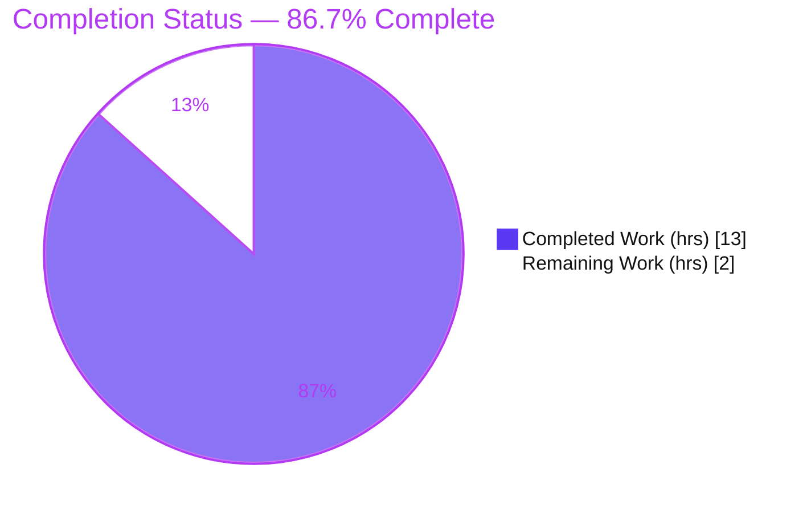
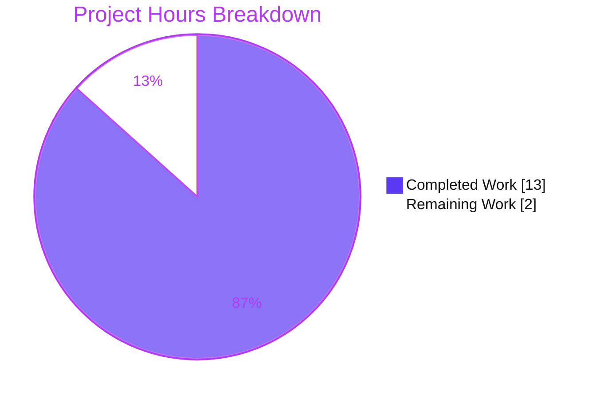

# Blitzy Project Guide

**Project:** `ep_check_nested_submodule_15Jun_hello_world` — Minimal Node.js HTTP Server (Git Superproject + Submodule)
**Task type:** Documentation-only (JSDoc + comprehensive READMEs)
**Branch:** `blitzy-a07188a8-310d-4915-b900-438a3ad909dc`
**Status:** All AAP deliverables complete & committed — pending human review/merge

> **Color legend** — <span style="color:#5B39F3">**■ Completed / AI Work = Dark Blue `#5B39F3`**</span> · **□ Remaining / Not Completed = White `#FFFFFF`** · Headings/Accents = Violet `#B23AF2` · Highlights = Mint `#A8FDD9`.

---

## 1. Executive Summary

### 1.1 Project Overview

This project is a deliberately minimal, **dependency-free Node.js HTTP server** built solely on the built-in `http` module, organized as a Git **superproject** that tracks one Git **submodule** (`child_repo_for_submodule_hello_world`). It serves as an engineering / submodule-materialization validation fixture: each `server.js` binds `127.0.0.1:3000` and answers **every** request — any method, any path — with an identical `200 OK`, `text/plain`, `Hello, World!\n` response. The autonomous task was **documentation-only**: add JSDoc to every function in both `server.js` files and replace both title-only `README.md` stubs with comprehensive documentation (setup, API, deployment, inline code explanations), covering the submodule in full — with **zero** change to runtime behavior.

### 1.2 Completion Status

The project is **86.7% complete** on an AAP-scoped, hours-based basis. **All AAP documentation deliverables are 100% complete and committed**; the remaining 13.3% (2 hours) is exclusively human-gated path-to-production work (review/approval/merge and host-side render & submodule-remote verification) that cannot be performed autonomously.



| Metric | Value |
|---|---|
| **Total Hours** | **15** |
| **Completed Hours (AI + Manual)** | **13** (13 AI / 0 Manual) |
| **Remaining Hours** | **2** |
| **Percent Complete** | **86.7%** |

> Formula: `Completion % = Completed ÷ Total = 13 ÷ 15 = 86.7%`. The 2 remaining hours reflect genuine human-gated path-to-production activities only — no AAP deliverable is incomplete.

### 1.3 Key Accomplishments

- ✅ **JSDoc on all 4 functions** (request-handler + `server.listen` callback in each of the two `server.js`), plus file-level `@file`/`@module` headers and `@constant` annotations for `hostname` and `port` — 5 JSDoc blocks per file, **identical in both files**.
- ✅ **Comprehensive superproject `README.md`** (219 lines): overview, prerequisites, project structure, setup (incl. submodule init), run, API reference + catch-all note + `curl` example, line-by-line code explanation, deployment guide, submodule notes, and **3 Mermaid diagrams**.
- ✅ **Comprehensive submodule `README.md`** (133 lines): same section template + superproject backlink + **1 Mermaid diagram** — the submodule was fully covered ("don't skip anything").
- ✅ **Behavior preserved byte-for-byte:** executable code in both `server.js` is identical to the original upload; only JSDoc comments were added. `node --check` passes both.
- ✅ **Empirically validated:** both servers run; catch-all `200 text/plain Content-Length 14` confirmed across `GET`/`POST`/`PUT`; 22/22 documentation line-citations verified; submodule pin `f07ea17` matches the gitlink.
- ✅ **All work committed** on the correct branch with a clean working tree (18 agent commits across parent + submodule).

### 1.4 Critical Unresolved Issues

| Issue | Impact | Owner | ETA |
|---|---|---|---|
| _None_ | No defects, compilation errors, failing tests, or blocking issues were found. The Final Validator made **zero** modifications because none were required. | — | — |

> There are **no critical unresolved issues**. The two remaining items (Section 1.6 / Section 2.2) are routine human acceptance steps, not defects.

### 1.5 Access Issues

| System / Resource | Type of Access | Issue Description | Resolution Status | Owner |
|---|---|---|---|---|
| Submodule remote (`github.com/lakshya-blitzy/child_repo_for_submodule_hello_world.git`) | Public HTTPS (read) | Not an access *failure* — but a fresh `git clone --recurse-submodules` requires the submodule's pinned commit `f07ea17` to be **pushed** to this remote and network reachability to GitHub. To be confirmed at merge time. | Open — verify at merge | Human (HT-2) |

> No blocking access issues were identified. The item above is a standard pre-merge verification, not a permission failure.

### 1.6 Recommended Next Steps

1. **[High]** Review and approve the documentation PR — read both READMEs and the JSDoc; confirm the four user-named parts (setup, API, deployment, code explanation) and the "comprehensive / don't skip anything" bar are met.
2. **[Medium]** Push the branch and **visually confirm all 4 Mermaid diagrams render** on the Git host UI (GitHub/GitLab).
3. **[Medium]** Confirm the submodule's pinned commit `f07ea17` is **pushed to its GitHub remote** so fresh `--recurse-submodules` clones materialize correctly.
4. **[Low]** Merge the parent + submodule to the mainline branch and delete the feature branch.

---

## 2. Project Hours Breakdown

### 2.1 Completed Work Detail

| Component | Hours | Description |
|---|---:|---|
| JSDoc — Root `server.js` | 2 | File-level `@file`/`@module`/`@description` header, `@constant` ×2 (`hostname`, `port`), request-handler `@param {http.IncomingMessage}`/`@param {http.ServerResponse}`/`@returns`, and `server.listen` callback `@returns` — 5 blocks. **[AAP R1]** |
| JSDoc — Submodule `server.js` | 1 | Byte-identical parallel JSDoc treatment of the submodule server (only file-context wording differs). **[AAP R1 / R3]** |
| Superproject `README.md` | 4 | Comprehensive 219-line README: overview, prerequisites, project structure, setup (clone `--recurse-submodules` / `git submodule update --init`), run, API reference table + catch-all note + `curl` example, line-by-line code explanation, deployment guide, submodule notes, TOC, source citations. **[AAP R2]** |
| Submodule `README.md` | 2 | Comprehensive 133-line README: overview, prerequisites, run, API reference, line-by-line code explanation, deployment guide, "Relationship to Superproject" backlink, TOC, citations. **[AAP R3]** |
| Mermaid Diagrams | 1 | 4 diagrams total — architecture/component graph, HTTP request/response sequence, submodule materialization flow (root) + request/response (submodule). **[AAP §0.4.3]** |
| Submodule Binding & Pin Reconciliation | 1 | Document the superproject↔submodule binding & materialization workflow; advance the gitlink `a7b8fe5 → f07ea17` to the JSDoc+README commit; verify `git submodule status`. **[AAP R3c]** |
| Empirical Validation & Doc-Accuracy Verification | 2 | Run both servers; verify catch-all `200 text/plain CL14` across methods; byte-preservation check; 22 line-citation cross-checks; anchor/link resolution; `node --check`; EADDRINUSE reproduction. **[Path-to-production]** |
| **Total Completed** | **13** | **Matches Section 1.2 Completed Hours** |

### 2.2 Remaining Work Detail

| Category | Hours | Priority |
|---|---:|---|
| Documentation PR Review, Approval & Merge — read both READMEs + JSDoc, confirm the 4 user-named parts and comprehensiveness bar, merge parent + submodule, delete the feature branch. | 1 | **High** |
| Diagram Render & Submodule Remote Verification — confirm the 4 Mermaid diagrams render on the Git host UI (Risk T1); confirm submodule pin `f07ea17` is pushed to its GitHub remote so fresh clones materialize (Risk I1). | 1 | **Medium** |
| **Total Remaining** | **2** | **Matches Section 1.2 Remaining Hours & Section 7 pie** |

### 2.3 Hours Reconciliation

| Check | Result |
|---|---|
| Section 2.1 total (Completed) | 13 |
| Section 2.2 total (Remaining) | 2 |
| **2.1 + 2.2 = Total Project Hours** | **13 + 2 = 15 ✓** |
| Remaining identical in 1.2 ↔ 2.2 ↔ 7 | 2 = 2 = 2 ✓ |
| Completion % (13 ÷ 15) | 86.7% ✓ |

---

## 3. Test Results

This is a **documentation-only** project: there is **no unit-test framework**, and tests are explicitly out of scope per AAP §0.8.2. For a documentation deliverable, the equivalent verification is **empirical accuracy + runtime behavior + behavior preservation**. The table below aggregates the autonomous validation checks executed by Blitzy's systems (and re-verified during this assessment). **Every entry originates from Blitzy's autonomous validation logs for this project.**

| Test Category | Framework / Tool | Total Checks | Passed | Failed | Coverage | Notes |
|---|---|---:|---:|---:|---|---|
| Syntax / Compile | `node --check` | 2 | 2 | 0 | 2/2 files | Both `server.js` parse cleanly; JS has no build step |
| Runtime / Behavioral | Node `http` + `curl` | 4 | 4 | 0 | 1/1 endpoint | `GET /`, `POST /anything/else`, `PUT /x?y=1`, `POST /foo/bar` → all `200 text/plain`, `Content-Length: 14`, body `Hello, World!\n` |
| Documentation Accuracy (line citations) | Scripted cross-check | 22 | 22 | 0 | 22/22 | Code-explanation line→statement mappings match source (11 rows × 2 READMEs) |
| Anchor-Link Resolution | Scripted | 20 | 20 | 0 | 11/11 root + 9/9 submodule | In-document TOC anchors resolve |
| Cross-Reference Resolution | Filesystem check | 2 | 2 | 0 | 2/2 | root → `child_repo_for_submodule_hello_world/README.md`; submodule → `../README.md` |
| Submodule Binding Facts | `git ls-tree` / `git submodule status` | 3 | 3 | 0 | 3/3 | path/name, URL, and pinned commit `f07ea17` match ground truth |
| Behavior Preservation | `git diff` / byte-compare | 2 | 2 | 0 | 2/2 files | Executable code byte-identical to baseline `36ac12a` |
| Port-Conflict Caveat | Runtime reproduction | 1 | 1 | 0 | 1/1 | Second concurrent bind → `EADDRINUSE` (matches documented caveat) |
| **Total** | — | **56** | **56** | **0** | **100%** | **No failing or blocked checks** |

---

## 4. Runtime Validation & UI Verification

This system has **no user interface** (it is a headless HTTP server), so UI verification is not applicable. Runtime and API integration outcomes:

- ✅ **Operational** — Root `server.js` starts and logs exactly `Server running at http://127.0.0.1:3000/`.
- ✅ **Operational** — Submodule `server.js` starts with the identical startup log.
- ✅ **Operational** — Catch-all endpoint: `GET /` → `200 OK`, `Content-Type: text/plain`, `Content-Length: 14`, body `Hello, World!\n`.
- ✅ **Operational** — Catch-all confirmed for non-GET methods/paths: `POST /anything/else`, `PUT /x?y=1` return the identical `200` response (no routing, no `404`).
- ✅ **Operational** — Auto-headers (`Date`, `Connection: keep-alive`, `Keep-Alive`) appear exactly as the README notes.
- ✅ **Operational** — `git submodule update --init` is idempotent (exit 0); `git submodule status` reports pin `f07ea17`.
- ⚠ **Partial (human-gated)** — Mermaid diagram **rendering on the Git host UI** was not visually confirmed by the agent (syntax and fence-balance verified only). See Risk T1 / HT-2.
- ⚠ **Partial (human-gated)** — Submodule **pin availability on the GitHub remote** for fresh clones is to be confirmed at merge. See Risk I1 / HT-2.

---

## 5. Compliance & Quality Review

Cross-mapping of AAP deliverables to quality benchmarks. All in-scope items pass; no fixes were required during autonomous validation (the work was found already complete and correct).

| AAP Deliverable / Benchmark | Requirement | Status | Progress | Notes / Fixes Applied |
|---|---|---|---|---|
| **R1** — JSDoc on every function | 4/4 functions across 2 files | ✅ Pass | 100% | `@param`/`@returns` types match Node `http` API; 5 blocks per file |
| **R1-extra** — Documented constants | `hostname`, `port` per file | ✅ Pass | 100% | `@constant` ×2 each file |
| **R1-extra** — File-level header | `@file`/`@module`/`@description` | ✅ Pass | 100% | Present and identical in both files |
| **R2** — Setup instructions | Superproject README | ✅ Pass | 100% | Clone `--recurse-submodules` / `git submodule update --init`; no `npm install` (zero deps) |
| **R2** — API documentation | Superproject README | ✅ Pass | 100% | Endpoint table + catch-all note + worked `curl` example |
| **R2** — Deployment guide | Superproject README | ✅ Pass | 100% | Loopback-only + port-3000 EADDRINUSE caveats |
| **R2** — Inline code explanations | Superproject README | ✅ Pass | 100% | Line-by-line of the 14-LOC server |
| **R3** — Submodule fully covered | Submodule README + JSDoc | ✅ Pass | 100% | All four parts + backlink + diagram; JSDoc applied |
| **R3c** — Submodule binding documented | Superproject README | ✅ Pass | 100% | Structure + setup + submodule notes; pin `f07ea17` cited & matches gitlink |
| **§0.4.3** — Diagrams (≥3 Mermaid) | Architecture, request/response, materialization | ✅ Pass | 100% | 4 total (3 root + 1 submodule) |
| **§0.7.2** — Source citations | Every technical claim cites source | ✅ Pass | 100% | `Source: server.js:Lx` style throughout |
| **C1** — Behavior preservation | No executable change | ✅ Pass | 100% | Executable code byte-identical to baseline; `node --check` OK |
| **§0.8.2** — Documentation-only scope | No deps/tests/CI/containers/docs-site | ✅ Pass | 100% | None added; scope respected |
| Mermaid host rendering | Visual confirmation | ⚠ Pending | Human-gated | Syntax/fence-balance verified; host render = HT-2 |

---

## 6. Risk Assessment

| Risk | Category | Severity | Probability | Mitigation | Status |
|---|---|---|---|---|---|
| **T1** — Mermaid diagrams not yet visually confirmed on the Git host UI (agent verified syntax/fence-balance only) | Technical | Low | Low | Push branch and view on GitHub/GitLab; diagrams use standard `graph`/`sequenceDiagram` syntax | Open (HT-2) |
| **T2** — No automated regression guard for the byte-identical behavior constraint | Technical | Low | Low | Behavior preserved & documented; tests/CI are out of AAP scope; optional future `node --check` hook | Accepted (out-of-scope) |
| **S1** — Server binds loopback only with no auth/TLS | Security | Informational | n/a | **By design** for a local fixture; documented loopback-only caveat; do not expose publicly without adding TLS/auth (out of scope) | Documented |
| **S2** — Supply-chain / dependency CVEs | Security | None | n/a | **Zero** third-party dependencies — no attack surface | N/A (positive posture) |
| **O1** — Port conflict: both servers bind `127.0.0.1:3000`, cannot run concurrently | Operational | Low | Medium | EADDRINUSE caveat documented in both deployment guides; run one server at a time | Mitigated (documented) |
| **O2** — No process manager / health endpoint / structured logging | Operational | Low | Low | Minimal-fixture by design; deployment guide notes process-manager option | Accepted (out-of-scope) |
| **I1** — Fresh `--recurse-submodules` clone depends on the public GitHub remote + the pinned commit `f07ea17` being pushed there | Integration | Medium | Low–Medium | Confirm the submodule commit is pushed before merge; pin documented & matches gitlink; `git submodule status` verification step documented | Open (HT-2) |

**Overall risk posture: VERY LOW.** No High/Critical risks. No blocking technical risk. All material items are either documented design caveats or routine human-gated pre-merge confirmations.

---

## 7. Visual Project Status



**Remaining hours by priority (Section 2.2):**

| Priority | Category | Hours |
|---|---|---:|
| 🔵 High | Documentation PR Review, Approval & Merge | 1 |
| 🟣 Medium | Diagram Render & Submodule Remote Verification | 1 |
| **—** | **Total Remaining** | **2** |

> Integrity: pie "Remaining Work" (2) = Section 1.2 Remaining Hours (2) = Section 2.2 Hours sum (2). Colors: Completed `#5B39F3`, Remaining `#FFFFFF`.

---

## 8. Summary & Recommendations

**Achievements.** This documentation-only effort is **fully delivered against the AAP**. Every function in both `server.js` files carries complete JSDoc, both `README.md` stubs were replaced with comprehensive guides containing all four user-named parts (setup, API, deployment, inline code explanations), the single submodule was documented in full (nothing skipped), four Mermaid diagrams were authored, and every technical claim is source-cited. The hard constraint — **byte-identical runtime behavior** — was preserved: only JSDoc comments were added, and `node --check` plus live runtime checks confirm the server still answers every request with `200 text/plain Hello, World!\n`.

**Remaining gaps.** The project is **86.7% complete**. The remaining **2 hours** are exclusively human-gated path-to-production tasks: (1) review/approve/merge the PR, and (2) visually confirm Mermaid rendering on the Git host and that the submodule's pinned commit is pushed to its remote. **No AAP deliverable is incomplete and no defect remains.**

**Critical path to production.** Human review & approval → confirm host-side diagram rendering & submodule-pin availability → merge parent + submodule to mainline → delete feature branch. Estimated ~2 hours of human effort.

**Success metrics (all met):** JSDoc 4/4 functions (100%); constants 2/2 per file (100%); README section template 100% in both repos; API endpoint 1/1; submodule 1/1; diagrams 4 (≥3 required); behavior preserved (byte-identical); 56/56 autonomous validation checks passed.

**Production readiness assessment:** The documentation deliverables are **production-ready**. The Final Validator's verdict (PRODUCTION-READY, all five gates pass, zero modifications required) is fully corroborated by this assessment. Recommended action: **approve and merge** after the two routine verification steps.

| Metric | Value |
|---|---|
| AAP-scoped completion | 86.7% |
| Completed / Total hours | 13 / 15 |
| Remaining hours (human-gated) | 2 |
| Critical issues | 0 |
| Autonomous checks passed | 56 / 56 |
| Confidence | High (well-defined, fully verified scope) |

---

## 9. Development Guide

This guide is **copy-pasteable** and every command was executed and verified during assessment.

### 9.1 System Prerequisites

- **Node.js** — any maintained LTS that supports CommonJS and the built-in `http` module. The repository pins **no** version (no `package.json` engines field, no `.nvmrc`). Verified working on **Node v20.20.2** (and originally on v22.x).
- **Git** — for cloning and submodule materialization (verified on Git 2.51.0 / 2.43.0).
- **No npm packages, no build tools** — the application has **zero** third-party dependencies.
- OS: any Linux/macOS/Windows environment with Node + Git. Hardware: negligible.

```bash
# Verify your toolchain
node --version    # e.g. v20.20.2  (any maintained LTS is fine)
git  --version    # e.g. 2.51.0
```

### 9.2 Environment Setup

There are **no environment variables** to configure — `hostname` (`127.0.0.1`) and `port` (`3000`) are hard-coded in `server.js`. No `.env`, no secrets, no external services.

### 9.3 Get the Code (with the submodule)

```bash
# Option A — clone everything in one step (recommended)
git clone --recurse-submodules <repository-url>
cd <repository-root>

# Option B — plain clone, then materialize the submodule
git clone <repository-url>
cd <repository-root>
git submodule update --init      # idempotent; exit 0
```

### 9.4 Dependency Installation

```bash
# Nothing to install — there are zero dependencies and no package.json.
# Do NOT run `npm install` (there is no manifest).
```

### 9.5 Run the Server

```bash
# From the repository root (superproject server):
node server.js
# Expected stdout:
#   Server running at http://127.0.0.1:3000/

# OR run the submodule's identical server (one at a time — see Troubleshooting):
node child_repo_for_submodule_hello_world/server.js
```

### 9.6 Verification Steps

```bash
# 1) Syntax / compile gate (no build step exists):
node --check server.js
node --check child_repo_for_submodule_hello_world/server.js   # both print nothing on success

# 2) Confirm the catch-all endpoint (server must be running):
curl http://127.0.0.1:3000/
#   -> Hello, World!

curl -i http://127.0.0.1:3000/
#   -> HTTP/1.1 200 OK
#      Content-Type: text/plain
#      Content-Length: 14
#      ... (Date, Connection: keep-alive, Keep-Alive auto-headers)

# 3) Confirm the submodule pin:
git submodule status
#   -> f07ea17f7fa07918f5a56b4b24790a5363d179ae child_repo_for_submodule_hello_world (heads/...)
```

### 9.7 Example Usage (catch-all behavior)

```bash
# Any method, any path returns the SAME 200 response — there is no routing.
curl -X GET   http://127.0.0.1:3000/                 # -> Hello, World!
curl -X POST  http://127.0.0.1:3000/anything/else    # -> Hello, World!  (HTTP 200)
curl -X PUT  'http://127.0.0.1:3000/x?y=1'           # -> Hello, World!  (HTTP 200)
```

### 9.8 Troubleshooting

| Symptom | Cause | Resolution |
|---|---|---|
| `Error: listen EADDRINUSE: address already in use 127.0.0.1:3000` | Both servers bind the same host:port and cannot run concurrently | Run **one** server at a time; stop the first process before starting the second |
| `curl: (7) Failed to connect to 127.0.0.1 port 3000` from another machine | Server binds **loopback only** (`127.0.0.1`) — not network-exposed | This is by design; connect from the same host (changing the bind address is out of scope) |
| `child_repo_for_submodule_hello_world/` is empty after clone | Submodule not materialized | Run `git submodule update --init` |
| `node: command not found` | Node.js not installed / not on PATH | Install any maintained Node.js LTS |
| `npm error … no package.json` | Attempting `npm install` | Skip it — there are zero dependencies and no manifest |

---

## 10. Appendices

### Appendix A — Command Reference

| Command | Purpose |
|---|---|
| `git clone --recurse-submodules <url>` | Clone superproject and materialize the submodule in one step |
| `git submodule update --init` | Materialize the submodule after a plain clone (idempotent) |
| `git submodule status` | Show the pinned submodule commit (`f07ea17`) |
| `node server.js` | Start the superproject HTTP server on `127.0.0.1:3000` |
| `node child_repo_for_submodule_hello_world/server.js` | Start the submodule's identical server |
| `node --check <file>` | Syntax/compile gate (no build step exists) |
| `curl http://127.0.0.1:3000/` | Exercise the catch-all endpoint |
| `curl -i http://127.0.0.1:3000/` | Inspect status line + response headers |

### Appendix B — Port Reference

| Port | Bind Address | Service | Notes |
|---|---|---|---|
| `3000` | `127.0.0.1` (loopback) | Both `server.js` instances | Hard-coded; only one server may bind it at a time (EADDRINUSE otherwise) |

### Appendix C — Key File Locations

| Path | Role | Transformation |
|---|---|---|
| `server.js` | Superproject HTTP server | UPDATE — JSDoc added (62 lines) |
| `README.md` | Superproject documentation | UPDATE — comprehensive README (219 lines) |
| `child_repo_for_submodule_hello_world/server.js` | Submodule HTTP server | UPDATE — identical JSDoc (62 lines) |
| `child_repo_for_submodule_hello_world/README.md` | Submodule documentation | UPDATE — comprehensive README (133 lines) |
| `.gitmodules` | Submodule binding (name/path/url) | REFERENCE — not edited |
| `child_repo_for_submodule_hello_world/.gitignore` | Empty placeholder | Unchanged (0 bytes) |

### Appendix D — Technology Versions

| Technology | Version (verified) | Notes |
|---|---|---|
| Node.js | v20.20.2 (this env) / v22.x (original) | Any maintained LTS; **not pinned** by the repo |
| npm | 11.1.0 | Present but unused (zero dependencies) |
| Git | 2.51.0 / 2.43.0 | Used for submodule materialization |
| Runtime dependency | Node built-in `http` only | No third-party packages |
| Submodule pin | `f07ea17f7fa07918f5a56b4b24790a5363d179ae` | Matches gitlink & `git submodule status` |

### Appendix E — Environment Variable Reference

| Variable | Status |
|---|---|
| _None_ | The server uses hard-coded `hostname = '127.0.0.1'` and `port = 3000`. There are no environment variables, `.env` files, or runtime configuration. |

### Appendix F — Developer Tools Guide

| Tool | Usage |
|---|---|
| `node --check` | Static syntax validation of `server.js` (the de-facto "compile" for this project) |
| `git submodule` | `update --init` to materialize; `status` to verify the pin |
| `curl` | Manual endpoint verification (`-i` for headers, `-X` for methods) |
| Markdown + Mermaid | READMEs are CommonMark with embedded Mermaid; render natively on GitHub/GitLab — no generator or build step |

### Appendix G — Glossary

| Term | Definition |
|---|---|
| **Superproject** | The parent Git repository that tracks the submodule via a recorded commit pointer (gitlink) |
| **Submodule** | A nested Git repository (`child_repo_for_submodule_hello_world`) pinned to a specific commit inside the superproject |
| **Materialization** | Fetching/checking out the submodule's working tree at the pinned commit (`git submodule update --init`) |
| **Gitlink** | The special tree entry storing the submodule's pinned commit SHA (here `f07ea17`) |
| **Loopback** | The `127.0.0.1` interface — reachable only from the local machine, not the network |
| **Catch-all** | A handler that responds identically to every method and path (no routing, no `404`) |
| **EADDRINUSE** | Node error raised when a port is already bound — here, when both servers attempt `127.0.0.1:3000` |

---

*Generated by the Blitzy autonomous project assessment. Completion is measured strictly against AAP-scoped and path-to-production work (PA1 methodology): **13 of 15 hours = 86.7% complete**, with the remaining 2 hours being human-gated review/verification/merge.*