# Technical Specification

# 1. Introduction

## 1.1 Executive Summary

### 1.1.1 Project Overview

The `ep_check_nested_submodule_15Jun_hello_world` project is an intentionally minimal Node.js repository constructed as a Git superproject containing a single nested submodule, `child_repo_for_submodule_hello_world`. Both the superproject and the embedded submodule implement a byte-identical, dependency-free HTTP server that responds with a static `"Hello, World!\n"` payload over the loopback network interface.

The naming convention of the artifact — its `ep_check_` prefix and the `15Jun` date marker — together with the deliberate absence of any package manifest, dependency declarations, tests, or build tooling, indicates that the repository functions as an engineering validation artifact for exercising Git submodule nesting behavior rather than as a customer-facing application.

### 1.1.2 Core Business Problem Being Solved

The repository materializes a Git superproject ↔ submodule binding so that downstream tooling can exercise clone, init, update, and fetch workflows against a known, reproducible reference layout. The substantive engineering concern is the correctness of the submodule wiring declared in `.gitmodules`, not any business capability delivered by the embedded HTTP servers. The HTTP servers themselves serve as the minimum-viable executable content required to render the parent and child repositories non-empty and runnable.

No statement of business problem, target market, or commercial objective is present in either `README.md` file or any other source-tracked artifact.

### 1.1.3 Key Stakeholders and Users

| Stakeholder Category | Evidence in Repository |
|---|---|
| Repository owner / publisher | GitHub user/organization `lakshya-blitzy` (derived from submodule URL in `.gitmodules`) |
| Intended audience | Not documented in source |
| End users / customers | Not documented in source |
| Maintainers / contributors | No `CONTRIBUTORS`, `AUTHORS`, `CODEOWNERS`, or `LICENSE` file is present |

### 1.1.4 Expected Business Impact and Value Proposition

The repository's value is operational and diagnostic in nature: it provides a minimal, deterministic fixture against which Git submodule operations and downstream automation can be exercised reliably. No business KPIs, revenue projections, cost-savings estimates, or strategic value statements are documented within the source. Any quantified business-impact claim is therefore outside the bounds of what the repository's evidence supports.

## 1.2 System Overview

### 1.2.1 Project Context

#### Business Context and Market Positioning

The repository contains no business-context, market-positioning, or product-description artifacts. Both `README.md` files consist of a single first-level Markdown heading and no body content. There is no marketing copy, no product brief, no service-level commitment, and no competitive-positioning statement. Any positioning narrative must therefore be supplied externally to this specification.

#### Current System Limitations

There is no in-repository evidence of an existing system being replaced or upgraded. The repository is self-contained and stands alone as a fixture; it neither imports legacy modules nor declares a migration path from a prior implementation.

#### Integration with Existing Enterprise Landscape

The repository declares no external integrations. The `server.js` implementations import only the Node.js built-in `http` core module. The servers perform no outbound network calls, read no environment variables, write to no persistent store, and emit no events to any message broker. The sole inter-repository relationship is the Git-level submodule binding declared in `.gitmodules`, which references `https://github.com/lakshya-blitzy/child_repo_for_submodule_hello_world.git` as the upstream of the nested submodule.

### 1.2.2 High-Level Description

#### Primary System Capabilities

| Capability | Implementation Location | Configurability |
|---|---|---|
| Bind an HTTP server to `127.0.0.1:3000` | `server.js` (root and submodule, identical) | Hard-coded literal |
| Respond `200 OK` with `text/plain` body `"Hello, World!\n"` to every request | `server.js` inline handler | None — single inline handler |
| Emit one startup log line to stdout via `console.log` | `server.js` `server.listen` callback | None |
| Declare a nested Git submodule mapping | `.gitmodules` (root) | Path and URL fixed |

#### Major System Components

The system comprises two structurally separable but functionally identical components, bound to each other only at the Git layer:

- **Superproject HTTP Server** — Defined in the root-level `server.js`, this CommonJS module uses the Node.js `http` core API to create and start an HTTP listener on the loopback interface. It is the entry point of the parent repository.
- **Submodule HTTP Server** — Defined in `child_repo_for_submodule_hello_world/server.js`, this file is byte-for-byte identical to the superproject's `server.js`. It represents an independent process if executed and would compete for the same `127.0.0.1:3000` socket if both servers were launched concurrently.

The two components share no application-layer linkage; neither file `require`s, imports, or invokes the other. Their relationship is established exclusively through the Git submodule mapping declared in `.gitmodules`.

The following diagram illustrates the composition and the boundary between Git-level and application-level relationships:

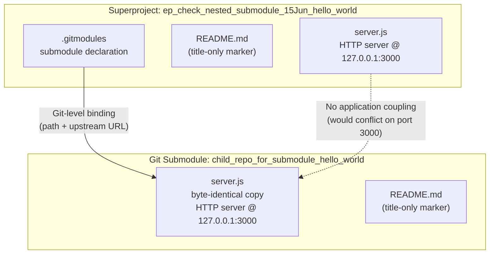

#### Core Technical Approach

- **Runtime**: Node.js with CommonJS module resolution; the only `require` invocation in either source file is `require('http')`.
- **Dependencies**: Zero third-party packages. The Node.js standard `http` module is the sole import. No `package.json` exists, so no dependencies are declared and no Node engine version is pinned.
- **Composition**: A Git superproject embeds the `child_repo_for_submodule_hello_world` repository as a tracked submodule, pinned to a specific commit on its independent upstream remote.
- **Concurrency model**: Single-process, single-event-loop HTTP server with no clustering, no worker threads, and no explicit asynchronous orchestration beyond the `server.listen` callback.
- **Configuration**: None. All operational parameters — hostname (`127.0.0.1`), port (`3000`), HTTP status code (`200`), `Content-Type` (`text/plain`), and response body (`"Hello, World!\n"`) — are inline literals.

### 1.2.3 Success Criteria

#### Measurable Objectives

No measurable objectives, performance targets, or service-level agreements are documented in the source repository. The criteria enumerated below are derived strictly from observable functional behavior of the committed code and the structural integrity of the submodule binding.

| Criterion | Verifiable Condition |
|---|---|
| HTTP server reachability | A request to `http://127.0.0.1:3000/` (any path, any HTTP method) returns `200 OK` |
| Response payload correctness | Response body equals `"Hello, World!\n"` and `Content-Type` header equals `text/plain` |
| Submodule binding integrity | `git submodule status` reports `child_repo_for_submodule_hello_world` as initialized at the pinned commit |
| Startup observability | A single log line of the form `Server running at http://127.0.0.1:3000/` appears on stdout |

#### Critical Success Factors

- Faithful preservation of the `.gitmodules` declaration across clone, fork, and mirror operations.
- Availability of a Node.js runtime capable of executing CommonJS modules and the `http` core module.
- TCP port `3000` on the loopback interface being free when the server is launched.
- Network reachability to the submodule's upstream Git remote at the time of submodule initialization.

#### Key Performance Indicators (KPIs)

No KPIs are defined in the source material. The repository contains no instrumentation, no metrics endpoints, no structured logging, and no tracing hooks against which throughput, latency, or error rates could be measured. Any KPI requirements would need to be specified externally and implemented as an additive scope of work; they are not delivered by the current artifact.

## 1.3 Scope

### 1.3.1 In-Scope Elements

#### Core Features and Functionalities

| Feature | Source Artifact | Notes |
|---|---|---|
| Static HTTP response server | `server.js` (both copies) | Serves `"Hello, World!\n"` for every request |
| Loopback-only network binding | `server.js` hostname literal `127.0.0.1` | Not exposed to external interfaces |
| Fixed TCP port allocation | `server.js` port literal `3000` | No environment-variable override |
| Single startup log line | `server.js` `server.listen` callback | Written to stdout via `console.log` |
| Git submodule declaration | `.gitmodules` | Pinned to upstream `https://github.com/lakshya-blitzy/child_repo_for_submodule_hello_world.git` |
| README marker files | `README.md` (both copies) | Title heading only — no body content |

#### Primary User Workflows

The repository supports two workflows by virtue of its committed artifacts:

- **HTTP request workflow** — A client (typically `curl`, a browser, or an automated probe) issues any HTTP request to `127.0.0.1:3000` after starting either `server.js`, and receives the fixed response.
- **Git submodule workflow** — An operator clones the superproject and runs `git submodule init` followed by `git submodule update` (or `git clone --recurse-submodules`) to materialize the nested `child_repo_for_submodule_hello_world` directory at its pinned commit.

#### Essential Integrations

The only integration in scope is the Git-level binding between the superproject and the upstream Git repository of the submodule, declared in `.gitmodules`. No application-runtime integrations are in scope.

#### Key Technical Requirements

- A Node.js runtime supporting CommonJS and the standard `http` module.
- A Git client capable of resolving submodule references over HTTPS.
- An operating system loopback interface and a free TCP port `3000` for HTTP service operation.

#### Implementation Boundaries

| Boundary Dimension | Defined Scope |
|---|---|
| System boundary | The two `server.js` processes and the `.gitmodules` Git binding |
| Network boundary | TCP loopback interface (`127.0.0.1`) on port `3000` only |
| Data domain | No persisted data; the only "domain" is the fixed `"Hello, World!\n"` string |
| User-group / geographic coverage | Not explicitly defined in source; effective audience is anyone exercising the loopback HTTP endpoint or Git submodule tooling locally |

### 1.3.2 Out-of-Scope Elements

The following capabilities are explicitly absent from the repository and are therefore out of scope for this specification. Each item below has been verified by exhaustive inspection of the file inventory and the full source of both `server.js` files.

#### Excluded Application Capabilities

| Excluded Capability | Evidence of Exclusion |
|---|---|
| URL routing or multi-endpoint handling | Single inline request handler responds identically to every URL and HTTP method |
| Request body, query string, or header processing | The `req` parameter is received by the handler but never read |
| HTTPS / TLS termination | Server is constructed via `http.createServer`, not `https.createServer` |
| Authentication, authorization, or session management | No middleware layer, no identity primitives, no credential handling |
| Persistence (database or filesystem state) | No database driver, no file I/O for state, no caching layer |
| External API integration | No outbound HTTP, RPC, or message-broker calls |
| Environment-variable–based configuration | No `process.env` references; no `.env` files; no configuration loader |
| Error handling and graceful shutdown | No `try/catch` blocks, no `process` signal handlers, no `server.close` orchestration |
| Clustering, worker processes, or load balancing | No `cluster` module usage, no worker threads, no proxy configuration |
| Public-network exposure | Bound exclusively to `127.0.0.1` — not reachable from external interfaces |

#### Excluded Engineering Practices

| Excluded Practice | Evidence of Exclusion |
|---|---|
| Automated testing | No test files, no test runner configuration, no `package.json` scripts |
| Continuous Integration / Continuous Delivery | No `.github/` directory, no `.gitlab-ci.yml`, no pipeline configuration |
| Build, transpilation, or bundling | No `tsconfig.json`, no `webpack`/`rollup`/`esbuild` configuration; plain JavaScript only |
| Containerization or orchestration | No `Dockerfile`, no `docker-compose.yml`, no Kubernetes manifests |
| Production observability | No metrics endpoints, no structured logging, no distributed tracing |
| Dependency management | No `package.json`, no lockfile of any kind |
| Licensing declaration | No `LICENSE` file is present |

#### Excluded Documentation Artifacts

- Roadmap, backlog, or future-phase planning documents
- Architectural Decision Records (ADRs)
- Operational runbooks or incident-response procedures
- API reference documentation
- Contributor or governance guides

#### Future-Phase Considerations

No future-phase considerations are documented within the repository. There is no roadmap, no `TODO` annotations in source, and no issue tracker references. Any forward-looking statements about feature evolution must originate outside the current source material.

#### Integration Points Not Covered

- Any non-Git integration with external systems (databases, message brokers, identity providers, observability platforms, CDNs, or cloud services).
- Any cross-repository runtime linkage between the superproject's `server.js` and the submodule's `server.js`. The two files are independent processes with no application-layer relationship.

#### Unsupported Use Cases

- Production deployment of the HTTP server, given the absence of error handling, TLS, configuration, and observability.
- Concurrent execution of both `server.js` files on the same host without changing their port bindings, since both bind to the same `127.0.0.1:3000` socket and would conflict.
- Use of the submodule as a reusable library by the superproject, since no `require` linkage exists between the two `server.js` files.

### 1.3.3 References

#### Files Examined

- `server.js` (root) — Established the Node.js HTTP server pattern, hostname/port bindings, response payload, and the absence of external dependencies and configuration.
- `README.md` (root) — Confirmed the project title `ep_check_nested_submodule_15Jun_hello_world` and the absence of any descriptive body content.
- `.gitmodules` — Sole evidence of the submodule composition architecture; established the submodule name, local path, and upstream URL.
- `child_repo_for_submodule_hello_world/server.js` — Confirmed byte-identical implementation to the root `server.js`.
- `child_repo_for_submodule_hello_world/README.md` — Confirmed the submodule's title and the absence of descriptive content.

#### Folders Explored

- `/` (repository root) — Top-level survey enumerated all four first-order children (three files plus one submodule folder); confirmed no configuration, build, test, or CI directories exist.
- `child_repo_for_submodule_hello_world/` — Submodule contents enumeration confirmed exactly two tracked files with no nested folders, no `package.json`, and no test or build artifacts.

# 2. Product Requirements

## 2.1 FEATURE CATALOG

The repository delivers exactly four discrete, testable features. Each feature is derived strictly from observable artifacts in the source tree: the two byte-identical `server.js` files, the `.gitmodules` declaration, and the two title-only `README.md` markers. Because the artifact is, per Section 1.1.2, an engineering-validation fixture rather than a commercial product, the "Business Value" and "User Benefits" entries below reflect operational/diagnostic value only and do not extrapolate beyond what the source evidence supports.

### 2.1.1 F-001: Static HTTP Hello-World Response Server

#### Feature Metadata

| Attribute | Value |
|---|---|
| Unique ID | F-001 |
| Feature Name | Static HTTP Hello-World Response Server |
| Feature Category | Runtime / HTTP Service |
| Priority Level | Critical |
| Status | Completed |

#### Description

- **Overview**: A single-handler HTTP server implemented in `server.js` using the Node.js `http` core module. It binds to the loopback interface on TCP port `3000` and returns an identical `200 OK` response with `Content-Type: text/plain` and body `"Hello, World!\n"` to every inbound request, irrespective of URL path, HTTP method, headers, or body. This feature is implemented identically in the root `server.js` and the submodule's `server.js` (byte-for-byte identical).
- **Business Value**: Provides the minimum viable executable content required to render both the superproject and the submodule non-empty and runnable, which in turn enables Git submodule wiring (F-003) to be exercised against a known, deterministic reference layout (see Section 1.1.2).
- **User Benefits**: Allows downstream automation and operators to verify that a cloned, submodule-initialized checkout produces a working HTTP listener via a single `node server.js` invocation, with no dependency installation or build step required.
- **Technical Context**: CommonJS module; sole `require` is `require('http')`; no third-party packages; no configuration loader; no environment-variable references; no error handler; no shutdown handler. All operational parameters are inline literals (see Section 1.2.2 Capabilities Table).

#### Dependencies

| Dependency Type | Specification |
|---|---|
| Prerequisite Features | None |
| System Dependencies | Node.js runtime supporting CommonJS and the `http` core module |
| External Dependencies | None (zero third-party packages) |
| Integration Requirements | Free TCP port `3000` on the loopback interface |

### 2.1.2 F-002: Startup Log Emission

#### Feature Metadata

| Attribute | Value |
|---|---|
| Unique ID | F-002 |
| Feature Name | Startup Log Emission |
| Feature Category | Observability (Minimal) |
| Priority Level | Medium |
| Status | Completed |

#### Description

- **Overview**: Inside the `server.listen` callback of `server.js`, a single `console.log` invocation writes the line `Server running at http://127.0.0.1:3000/` to standard output after the listener is successfully bound. This is the only observability primitive present in the repository; there are no metrics, no structured logging, and no tracing hooks (see Section 1.2.3).
- **Business Value**: Provides a one-shot ready signal that downstream automation can use as a synchronization barrier between process launch and traffic generation.
- **User Benefits**: Communicates the bound URL to the operator on stdout immediately after listener readiness, removing the need to inspect process state via external tooling for basic startup verification.
- **Technical Context**: Single `console.log` call; no log level, no timestamp, no JSON envelope, no transport beyond the inherited stdout stream.

#### Dependencies

| Dependency Type | Specification |
|---|---|
| Prerequisite Features | F-001 (the log line is emitted from the `listen` callback of F-001's HTTP server) |
| System Dependencies | A writable stdout file descriptor on the host process |
| External Dependencies | None |
| Integration Requirements | None |

### 2.1.3 F-003: Git Submodule Composition Binding

#### Feature Metadata

| Attribute | Value |
|---|---|
| Unique ID | F-003 |
| Feature Name | Git Submodule Composition Binding |
| Feature Category | Source-Control Composition |
| Priority Level | Critical |
| Status | Completed |

#### Description

- **Overview**: The root `.gitmodules` file declares a single submodule named `child_repo_for_submodule_hello_world`, maps it to the local directory `child_repo_for_submodule_hello_world`, and pins it to the upstream URL `https://github.com/lakshya-blitzy/child_repo_for_submodule_hello_world.git`. This binding is the substantive engineering concern of the repository per Section 1.1.2.
- **Business Value**: Materializes the superproject ↔ submodule wiring under test, providing a deterministic fixture against which clone, init, update, and fetch workflows can be exercised by downstream tooling (per Section 1.1.2).
- **User Benefits**: Enables a single-command recursive clone (`git clone --recurse-submodules`) to reproduce both the parent and child repositories at their pinned commits, with no out-of-band coordination.
- **Technical Context**: Git submodule declaration using standard `path` and `url` keys; no `branch` key (commit-pinned tracking); no `update` key (defaults to `checkout`); no `shallow` key.

#### Dependencies

| Dependency Type | Specification |
|---|---|
| Prerequisite Features | None |
| System Dependencies | Git client capable of HTTPS submodule resolution |
| External Dependencies | HTTPS reachability to `github.com` at submodule init time |
| Integration Requirements | Network access during `git submodule init`/`update` |

### 2.1.4 F-004: Repository Identification Marker

#### Feature Metadata

| Attribute | Value |
|---|---|
| Unique ID | F-004 |
| Feature Name | Repository Identification Marker |
| Feature Category | Documentation (Minimal) |
| Priority Level | Low |
| Status | Completed |

#### Description

- **Overview**: Each repository (superproject and submodule) contains a `README.md` consisting of a single first-level Markdown heading and no body content. The root README contains `# ep_check_nested_submodule_15Jun_hello_world`; the submodule README contains `# child_repo_for_submodule_hello_world`.
- **Business Value**: Satisfies code-hosting platform conventions whereby a top-level heading is rendered as the repository's primary identifier on the landing page.
- **User Benefits**: Allows visitors to confirm the repository identity at a glance without reading source.
- **Technical Context**: Plain CommonMark Markdown; no front-matter, no badges, no body, no embedded references.

#### Dependencies

| Dependency Type | Specification |
|---|---|
| Prerequisite Features | None |
| System Dependencies | None |
| External Dependencies | None |
| Integration Requirements | None |

---

## 2.2 FUNCTIONAL REQUIREMENTS TABLES

Each requirement below is testable against the committed source. Acceptance criteria are derived from the verifiable conditions enumerated in Section 1.2.3 and from direct inspection of `server.js` and `.gitmodules`.

### 2.2.1 F-001 Static HTTP Hello-World Response Server Requirements

#### Requirement Details

| Requirement ID | Description | Priority | Complexity |
|---|---|---|---|
| F-001-RQ-001 | Server SHALL bind a TCP listener to host `127.0.0.1` on port `3000` | Must-Have | Low |
| F-001-RQ-002 | Server SHALL return HTTP status code `200` for every received request | Must-Have | Low |
| F-001-RQ-003 | Server SHALL set the `Content-Type` response header to exactly `text/plain` | Must-Have | Low |
| F-001-RQ-004 | Server SHALL return a response body equal to the byte sequence `"Hello, World!\n"` (14 bytes, including the trailing line feed) | Must-Have | Low |
| F-001-RQ-005 | Server SHALL produce the identical response for every URL path and every HTTP method (no routing, no method discrimination) | Must-Have | Low |

#### Acceptance Criteria

| Requirement ID | Verifiable Acceptance Criterion |
|---|---|
| F-001-RQ-001 | `ss -ltn` (or `netstat -an`) shows a LISTEN socket on `127.0.0.1:3000` after `node server.js` is launched |
| F-001-RQ-002 | `curl -i http://127.0.0.1:3000/` reports `HTTP/1.1 200 OK` on the first response line |
| F-001-RQ-003 | The response includes header `Content-Type: text/plain` exactly (no charset suffix) |
| F-001-RQ-004 | The response body, captured via `curl --output -`, equals `Hello, World!` followed by a single `\n` byte |
| F-001-RQ-005 | `curl -X POST`, `curl -X PUT`, `curl -X DELETE`, `curl -X PATCH` against any path each return responses byte-identical to a `GET /` |

#### Technical Specifications

| Aspect | Specification |
|---|---|
| Input Parameters | Any HTTP request received on `127.0.0.1:3000`; request line, headers, and body are not inspected |
| Output / Response | HTTP/1.1 `200 OK`; `Content-Type: text/plain`; body `"Hello, World!\n"` |
| Performance Criteria | Not specified in source; no SLA, no throughput target, no latency target (Section 1.2.3 KPIs) |
| Data Requirements | None — no persistent state, no in-memory state beyond the static response literal |

#### Validation Rules

| Rule Type | Specification |
|---|---|
| Business Rules | None documented; the response is unconditional |
| Data Validation | None — request payload is not inspected |
| Security Requirements | Loopback-only binding enforces the boundary defined in Section 1.3.1; no other security controls are present |
| Compliance Requirements | None declared in repository (no `LICENSE`, no policy documents) |

### 2.2.2 F-002 Startup Log Emission Requirements

#### Requirement Details and Acceptance

| Requirement ID | Description | Priority | Complexity |
|---|---|---|---|
| F-002-RQ-001 | After successful binding, the process SHALL emit exactly one line `Server running at http://127.0.0.1:3000/` to stdout | Must-Have | Low |

| Requirement ID | Verifiable Acceptance Criterion |
|---|---|
| F-002-RQ-001 | Capturing stdout of `node server.js` for one second after launch yields the single expected line and no additional lines |

#### Technical Specifications

| Aspect | Specification |
|---|---|
| Input Parameters | None (triggered by `server.listen` callback completion) |
| Output / Response | A single stdout line: `Server running at http://127.0.0.1:3000/` followed by a newline emitted by `console.log` |
| Performance Criteria | None specified |
| Data Requirements | None |

#### Validation Rules

| Rule Type | Specification |
|---|---|
| Business Rules | Log line content is fixed and includes the literal hostname/port |
| Data Validation | None |
| Security Requirements | None (no sensitive data emitted) |
| Compliance Requirements | None |

### 2.2.3 F-003 Git Submodule Composition Binding Requirements

#### Requirement Details

| Requirement ID | Description | Priority | Complexity |
|---|---|---|---|
| F-003-RQ-001 | The root repository SHALL contain a `.gitmodules` file declaring a submodule named `child_repo_for_submodule_hello_world` | Must-Have | Low |
| F-003-RQ-002 | The submodule declaration SHALL specify `path = child_repo_for_submodule_hello_world` | Must-Have | Low |
| F-003-RQ-003 | The submodule declaration SHALL specify `url = https://github.com/lakshya-blitzy/child_repo_for_submodule_hello_world.git` | Must-Have | Low |
| F-003-RQ-004 | The submodule SHALL be pinned to a specific commit such that `git submodule status` reports a clean checkout at the recorded SHA | Must-Have | Low |

#### Acceptance Criteria

| Requirement ID | Verifiable Acceptance Criterion |
|---|---|
| F-003-RQ-001 | `cat .gitmodules` includes `[submodule "child_repo_for_submodule_hello_world"]` |
| F-003-RQ-002 | The `path` key under the submodule section equals `child_repo_for_submodule_hello_world` |
| F-003-RQ-003 | The `url` key equals the upstream URL string exactly |
| F-003-RQ-004 | `git submodule status` returns a line with no `+`/`-` prefix, indicating the working tree matches the recorded commit |

#### Technical Specifications

| Aspect | Specification |
|---|---|
| Input Parameters | None (declarative configuration) |
| Output / Response | A materialized `child_repo_for_submodule_hello_world/` directory at the pinned commit after `git submodule update --init` |
| Performance Criteria | None specified |
| Data Requirements | Network reachability to the upstream remote at init time |

#### Validation Rules

| Rule Type | Specification |
|---|---|
| Business Rules | Submodule path must equal submodule name (as committed) |
| Data Validation | INI-format integrity of `.gitmodules` enforced by Git client |
| Security Requirements | Transport is HTTPS; no credentials embedded in URL |
| Compliance Requirements | None |

### 2.2.4 F-004 Repository Identification Marker Requirements

#### Requirement Details and Acceptance

| Requirement ID | Description | Priority | Complexity |
|---|---|---|---|
| F-004-RQ-001 | The root `README.md` SHALL contain a first-level Markdown heading reading `# ep_check_nested_submodule_15Jun_hello_world` | Should-Have | Low |
| F-004-RQ-002 | The submodule `README.md` SHALL contain a first-level Markdown heading reading `# child_repo_for_submodule_hello_world` | Should-Have | Low |

| Requirement ID | Verifiable Acceptance Criterion |
|---|---|
| F-004-RQ-001 | The first non-empty line of root `README.md` equals the expected heading |
| F-004-RQ-002 | The first non-empty line of submodule `README.md` equals the expected heading |

#### Technical Specifications

| Aspect | Specification |
|---|---|
| Input Parameters | None |
| Output / Response | Markdown rendered as an `<h1>` element by hosting platforms |
| Performance Criteria | None |
| Data Requirements | None |

#### Validation Rules

| Rule Type | Specification |
|---|---|
| Business Rules | Title heading must match repository directory name |
| Data Validation | CommonMark `#` ATX heading syntax |
| Security Requirements | None |
| Compliance Requirements | None |

---

## 2.3 FEATURE RELATIONSHIPS

Per Section 1.2.2, the two `server.js` files share no application-layer linkage; neither file `require`s, imports, or invokes the other. The only inter-feature relationships present are (a) the in-process dependency of the startup log on the HTTP listener, and (b) the Git-level binding of the submodule onto the upstream repository.

### 2.3.1 Feature Dependency Map

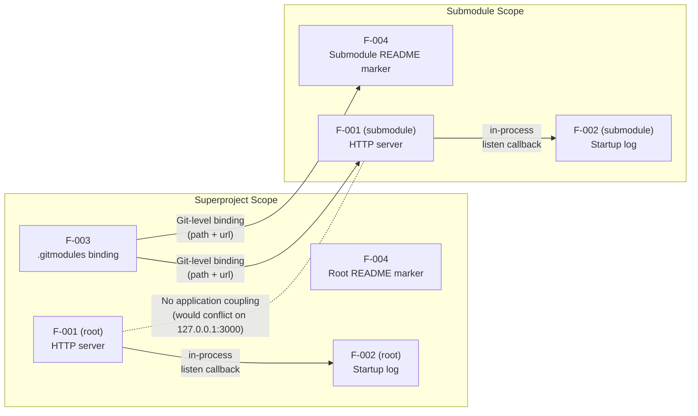

### 2.3.2 Integration Points

| Integration Point | Boundary | Mechanism |
|---|---|---|
| F-001 ↔ F-002 (in-process) | Process-internal | Node.js `server.listen` callback invocation |
| F-003 ↔ Submodule files | Git layer | `.gitmodules` `path` and `url` keys resolved by `git submodule update` |
| F-001 (root) ↔ F-001 (submodule) | None | Explicitly absent; both bind the same loopback socket and would conflict if launched concurrently (Section 1.3.2) |

### 2.3.3 Shared Components

| Shared Asset | Used By | Notes |
|---|---|---|
| Node.js `http` core module | F-001 (both copies) | The sole runtime dependency in either `server.js` |
| Stdout file descriptor | F-002 (both copies) | Inherited from the launching shell |
| Git client and configuration | F-003 | Required to resolve the submodule declaration |

### 2.3.4 Common Services

No application-layer common services exist. There is no shared library, no configuration loader, no logger module, no telemetry pipeline, and no middleware framework. The two `server.js` files are independent process boundaries (Section 1.2.2).

---

## 2.4 IMPLEMENTATION CONSIDERATIONS

### 2.4.1 Technical Constraints

| Constraint | F-001 | F-002 | F-003 | F-004 |
|---|---|---|---|---|
| Runtime | Node.js with `http` core module | Node.js with `console` global | Git client (HTTPS) | None |
| Engine version pinning | Not declared (no `package.json`) | Not declared | N/A | N/A |
| Configuration surface | None — all literals inline | None | `.gitmodules` keys only | None |
| Persistence | None | None | Git object database (out of scope) | None |

### 2.4.2 Performance Requirements

No performance requirements, SLAs, or KPIs are defined in the source material (Section 1.2.3). The repository contains no instrumentation, no metrics endpoints, no structured logging, and no tracing hooks against which throughput, latency, or error rates could be measured. Any performance assertions must originate from external specifications.

| Feature | Documented Target | Notes |
|---|---|---|
| F-001 | None | No load profile, throughput, or latency target specified |
| F-002 | None | Emission is one-shot at startup |
| F-003 | None | Clone/init duration depends on network conditions |
| F-004 | None | Static file, no runtime cost |

### 2.4.3 Scalability Considerations

| Feature | Scalability Posture |
|---|---|
| F-001 | Single-process, single-event-loop; no clustering, no worker threads, no load balancer (Section 1.3.2). Horizontal scaling is out of scope. |
| F-002 | Tied to a single process instance; no aggregation across instances. |
| F-003 | Declarative; scales trivially to N clones. |
| F-004 | Static markup; no scalability concern. |

### 2.4.4 Security Implications

| Feature | Security Posture |
|---|---|
| F-001 | Loopback-only binding (`127.0.0.1`) prevents external network exposure entirely (Section 1.3.2). No authentication, authorization, TLS, or input validation is present because no protected resources or untrusted inputs exist. The server is explicitly unsuitable for production deployment (Section 1.3.2 Unsupported Use Cases). |
| F-002 | Emits a fixed string with no user-supplied data; no log-injection risk. |
| F-003 | HTTPS transport; no credentials embedded in `.gitmodules` URL; submodule pin (commit SHA) is the integrity anchor. |
| F-004 | Static Markdown; no executable content. |

### 2.4.5 Maintenance Requirements

| Feature | Maintenance Profile |
|---|---|
| F-001 | No dependencies to update (no `package.json`); no test suite to maintain (Section 1.3.2). Any change is a direct edit of the literal in `server.js`. |
| F-002 | Maintenance equivalent to F-001; the log line is one literal in the same file. |
| F-003 | Submodule pin (commit SHA) is the only mutable Git-level configuration. Updating the pin requires `git submodule update --remote` followed by a parent commit. |
| F-004 | Title heading edits only. |

---

## 2.5 TRACEABILITY MATRIX

### 2.5.1 Feature → Source Artifact Mapping

| Feature | Primary Source Artifact | Secondary Artifact |
|---|---|---|
| F-001 | `server.js` (root) | `child_repo_for_submodule_hello_world/server.js` (byte-identical) |
| F-002 | `server.js` (root) — `listen` callback | `child_repo_for_submodule_hello_world/server.js` — same callback |
| F-003 | `.gitmodules` (root) | `child_repo_for_submodule_hello_world/` directory entry in Git index |
| F-004 | `README.md` (root) | `child_repo_for_submodule_hello_world/README.md` |

### 2.5.2 Requirement → Success Criterion Mapping

The criteria below correspond to the verifiable conditions enumerated in Section 1.2.3.

| Requirement ID | Section 1.2.3 Criterion | Source Evidence |
|---|---|---|
| F-001-RQ-001 | HTTP server reachability | `server.js` lines binding host/port |
| F-001-RQ-002 | HTTP server reachability | `server.js` `res.statusCode = 200` |
| F-001-RQ-003 | Response payload correctness | `server.js` `res.setHeader('Content-Type', 'text/plain')` |
| F-001-RQ-004 | Response payload correctness | `server.js` `res.end('Hello, World!\n')` |
| F-001-RQ-005 | HTTP server reachability | `server.js` handler with no method/path branching |
| F-002-RQ-001 | Startup observability | `server.js` `console.log` inside `listen` callback |
| F-003-RQ-001 to F-003-RQ-004 | Submodule binding integrity | `.gitmodules` declaration |
| F-004-RQ-001, F-004-RQ-002 | Not formally listed in 1.2.3 | `README.md` files |

### 2.5.3 Feature → Scope Element Mapping

| Feature | Section 1.3.1 In-Scope Item |
|---|---|
| F-001 | "Static HTTP response server"; "Loopback-only network binding"; "Fixed TCP port allocation" |
| F-002 | "Single startup log line" |
| F-003 | "Git submodule declaration" |
| F-004 | "README marker files" |

---

## 2.6 ASSUMPTIONS AND CONSTRAINTS

### 2.6.1 Documented Assumptions

| Assumption | Source | Implication |
|---|---|---|
| Node.js runtime is available on the host | Section 1.2.3 Critical Success Factors | Process cannot be launched without a runtime |
| TCP port `3000` on loopback is free | Section 1.2.3 Critical Success Factors | Concurrent execution of both `server.js` files on the same host is unsupported (Section 1.3.2) |
| HTTPS reachability to `github.com` exists at submodule init | Section 1.2.3 Critical Success Factors | First-time submodule materialization requires network |
| Git client supports submodule resolution | Section 1.2.3 Critical Success Factors | Reproducibility of the composition depends on standard Git tooling |

### 2.6.2 Verified Constraints

| Constraint | Evidence |
|---|---|
| No configurability — all operational parameters are inline literals | Section 1.2.2 Capabilities Table; `server.js` source |
| No `process.env` references; no `.env` files | Section 1.3.2 Excluded Capabilities |
| No error handling, no graceful shutdown, no signal handlers | Section 1.3.2 Excluded Capabilities |
| No automated tests, CI/CD, build tooling, or containerization | Section 1.3.2 Excluded Engineering Practices |
| No `LICENSE` file; no governance artifacts | Section 1.3.2 Excluded Engineering Practices |
| No KPIs, SLAs, or performance targets | Section 1.2.3 KPIs paragraph |

### 2.6.3 Requirement Version Control

All requirements catalogued in this section reflect the current committed state of the repository as observed during specification authoring. Status for every requirement is **Completed** because there is no roadmap, no `TODO` annotations in source, and no in-progress work documented within the artifact (Section 1.3.2 Future-Phase Considerations).

| Requirement Scope | Version State |
|---|---|
| F-001 through F-004 | v1.0 — Initial committed implementation; no prior versions |
| Change history | Tracked exclusively via Git commit history; no `CHANGELOG.md` |

---

## 2.7 REFERENCES

### 2.7.1 Files Examined

- `server.js` (root) — Provided the full source of the superproject HTTP server; established host/port bindings, status code, content type, response body, handler universality, and the startup log line. Source of evidence for F-001 and F-002.
- `child_repo_for_submodule_hello_world/server.js` — Confirmed byte-identical implementation to the root `server.js`; established that the submodule contributes an independent (not linked) process instance. Source of evidence for F-001 and F-002 in submodule scope.
- `.gitmodules` (root) — Provided submodule name, local path mapping, and upstream URL. Sole source of evidence for F-003.
- `README.md` (root) — Confirmed title-only content `# ep_check_nested_submodule_15Jun_hello_world`. Source of evidence for F-004 (superproject).
- `child_repo_for_submodule_hello_world/README.md` — Confirmed title-only content `# child_repo_for_submodule_hello_world`. Source of evidence for F-004 (submodule).
- `child_repo_for_submodule_hello_world/.gitignore` — Confirmed empty (0 bytes); contributes no requirements.

### 2.7.2 Folders Explored

- `/` (repository root) — Enumerated all four first-order children; confirmed absence of `package.json`, `Dockerfile`, test directories, CI configuration, and build tooling — substantiating the Out-of-Scope items in Section 1.3.2.
- `child_repo_for_submodule_hello_world/` — Enumerated all two tracked children plus the empty `.gitignore`; confirmed no nested folders, no manifests, no tooling.

### 2.7.3 Technical Specification Cross-References

- **Section 1.1 Executive Summary** — Established engineering-validation purpose (F-003 motivation) and absence of business/commercial documentation (constraining "Business Value" framing across all features).
- **Section 1.2 System Overview** — Provided the capabilities table that anchors F-001 and F-002, the component decomposition diagram, and the success criteria mapped in Section 2.5.2.
- **Section 1.3 Scope** — Provided the exhaustive in-scope/out-of-scope enumeration that bounds the feature catalog and justifies the absence of any further features beyond F-001 through F-004.

# 3. Technology Stack

This section enumerates the technologies that constitute the `ep_check_nested_submodule_15Jun_hello_world` system. Because the repository is intentionally minimal — an engineering-validation fixture exercising Git submodule nesting behavior — the technology surface is exceptionally narrow. The runtime consists entirely of pure CommonJS JavaScript executed on a Node.js runtime, using only the `http` core module from the Node.js standard library (Section 1.2.2 Core Technical Approach). There are **zero third-party packages, zero frameworks, zero databases, zero caches, zero containers, zero CI/CD pipelines, and zero infrastructure-as-code artifacts**, each of which has been verified as absent (Section 1.3.2 Excluded Engineering Practices; Section 2.6.2 Verified Constraints).

Per the documentation principle established in Section 1.3.2 and Section 2.6.2, this section explicitly catalogues the **verified absences** of technologies that a generic enterprise default stack would otherwise prescribe. The default technology stack specified in the authoring prompt (Python/Flask, MongoDB, Auth0, AWS, Docker, Terraform, GitHub Actions, React/TypeScript, TailwindCSS, etc.) is **not applicable** to this repository because every one of those technologies has been verified to be absent from source. Documenting these absences is itself a load-bearing function of this specification: it prevents accidental scope creep and anchors every claim to observable evidence.

---

## 3.1 PROGRAMMING LANGUAGES

### 3.1.1 Language Inventory by Component

The following table enumerates every language present in the repository, mapped to its source artifact and runtime consumer. The inventory is exhaustive; no additional languages are used at any layer.

| Language | File(s) | Purpose | Module System | Consumer |
|---|---|---|---|---|
| **JavaScript (ECMAScript, CommonJS)** | `server.js` (root) and `child_repo_for_submodule_hello_world/server.js` | HTTP server runtime — the entire executable surface of the system | CommonJS (`require('http')`) | Node.js runtime |
| **Markdown (CommonMark)** | `README.md` (root) and `child_repo_for_submodule_hello_world/README.md` | Title-only identification markers; no body content (Section 1.2.1) | Not applicable | Human readers, Git hosting platforms |
| **Git INI configuration** | `.gitmodules` | Declarative submodule binding: name, path, upstream URL | Not applicable — consumed by the Git client | `git submodule` tooling |

The two `server.js` files are byte-for-byte identical (Section 1.2.2 Major System Components); the submodule contains a verbatim duplicate of the superproject's executable content.

### 3.1.2 Language Selection Justification

The selection of plain JavaScript on Node.js is grounded entirely in the system's stated objective of remaining a minimal, dependency-free validation fixture. The justification follows directly from the functional scope:

- **No build or install step.** Choosing plain JavaScript (rather than TypeScript or any compiled-to-JS language) means that `node server.js` is the only command required to start either server. There is no transpilation, no bundling, and no install phase. Section 1.3.2 explicitly excludes "Build, transpilation, or bundling" and confirms the absence of `tsconfig.json` and any `webpack`/`rollup`/`esbuild` configuration.
- **CommonJS only.** The single `require('http')` invocation (line 1 of both `server.js` files) selects CommonJS resolution. The repository contains no ECMAScript Module (ESM) syntax (no `import`/`export` keywords) and no `"type": "module"` declaration (there is no `package.json` to host such a declaration; Section 1.3.2 Excluded Engineering Practices).
- **Standard-library-only.** The choice to write JavaScript that consumes only the Node.js standard library — specifically the `http` core module — eliminates every supply-chain consideration that a third-party-dependency posture would introduce.

### 3.1.3 Language Version and Engine Constraints

| Constraint | Status | Evidence |
|---|---|---|
| Node.js engine version pinning | **Not declared** | Section 2.4.1 Technical Constraints: "Engine version pinning — Not declared (no `package.json`)" |
| TypeScript compiler version | Not applicable | No TypeScript present; Section 1.3.2 |
| JavaScript language level (ES version) | Implicitly bounded by the host Node.js runtime's V8 capabilities; no language features beyond CommonJS, plain function expressions, and template-string-free string literals are used | `server.js` source inspection |
| Required runtime capability | A Node.js version that supports CommonJS module resolution and the standard `http` core module (Section 1.3.1 Key Technical Requirements) | All currently-supported Node.js LTS major versions satisfy this requirement |

Because there is no `engines` field, the specification deliberately makes no commitment to a specific Node.js major version. Any host with a CommonJS-capable Node.js (effectively all maintained LTS lines) will execute `server.js` correctly.

---

## 3.2 FRAMEWORKS & LIBRARIES

### 3.2.1 Application Frameworks

**There are no application frameworks in this repository.** The following table catalogues the categories of framework that are typically present in a Node.js HTTP service and verifies their absence here.

| Framework Category | Representative Examples | Status | Evidence of Absence |
|---|---|---|---|
| Web/HTTP framework | Express, Koa, Fastify, Hapi, NestJS, Restify | **Absent** | No `package.json`; sole import is `require('http')` (line 1 of both `server.js` files) |
| HTTP middleware layer | body-parser, cors, helmet | **Absent** | Handler reads no headers, no body, no query string (Section 1.3.2) |
| Logging framework | Winston, Pino, Bunyan, log4js | **Absent** | Sole logging primitive is one `console.log` call inside the `server.listen` callback (Section 1.2.2 Capabilities) |
| Testing framework | Jest, Mocha, Vitest, Tap, AVA, Jasmine | **Absent** | Section 1.3.2: "no test files, no test runner configuration, no `package.json` scripts" |
| Configuration loader | dotenv, convict, node-config, rc | **Absent** | Section 2.6.2: "No `process.env` references; no `.env` files" |
| Validation library | Joi, Zod, Yup, ajv, class-validator | **Absent** | Section 1.3.2: "The `req` parameter is received by the handler but never read" |
| ORM / data-access layer | Sequelize, TypeORM, Prisma, Mongoose | **Absent** | No persistence layer exists at all (Section 2.4.1; Section 1.3.2) |
| Authentication framework | Passport, express-session, JWT libraries | **Absent** | Section 1.3.2: "No authentication, authorization, or session management" |

### 3.2.2 Node.js Standard Library Usage

The **sole** runtime API surface consumed by either `server.js` is the Node.js standard library. Two standard primitives are used:

| Standard-Library Primitive | API Members Used | Source Location | Role |
|---|---|---|---|
| `http` core module | `http.createServer(requestListener)`; `server.listen(port, hostname, callback)`; `res.statusCode` setter; `res.setHeader(name, value)`; `res.end(payload)` | `server.js` lines 6–9 and 12 | Constructs and starts the HTTP listener; formulates the static response |
| `console` global | `console.log(message)` | `server.js` line 13 (inside `server.listen` callback) | Emits the single startup log line |

Per Section 2.3.3, the Node.js `http` module is "the sole runtime dependency in either `server.js`." No other core modules (no `fs`, `path`, `url`, `crypto`, `cluster`, `os`, `events`, etc.) are imported or referenced.

### 3.2.3 Framework-Selection Justification

The deliberate absence of any framework is itself the architectural decision that defines this system. Per Section 1.2.2 Major System Components, "the HTTP servers themselves serve as the minimum-viable executable content required to render the parent and child repositories non-empty and runnable." Introducing a framework would:

- Require the addition of a `package.json`, lockfile, and `node_modules/`, all of which are verified absent (Section 2.6.2).
- Introduce a supply-chain surface that contradicts the zero-dependency posture (Section 2.4.5 Maintenance Requirements: "No dependencies to update (no `package.json`)").
- Add semantic surface area (routing, middleware, error pipelines) that exceeds the fixed-response functional contract documented in Section 1.2.2 Capabilities Table.

The framework-free design is therefore a load-bearing architectural choice, not an oversight.

---

## 3.3 OPEN SOURCE DEPENDENCIES

### 3.3.1 Third-Party Dependency Inventory

**Zero.** No third-party open-source libraries are declared or consumed by this repository. The evidence supporting this absolute claim is verified along multiple independent axes:

| Verification Axis | Observation | Cross-Reference |
|---|---|---|
| Manifest file | No `package.json` at the repository root or in the submodule | Section 1.3.2 Excluded Engineering Practices |
| Lockfile | No `package-lock.json`, `yarn.lock`, `pnpm-lock.yaml`, or `npm-shrinkwrap.json` exists | Section 1.3.2: "no `package.json`, no lockfile of any kind" |
| Installed modules | No `node_modules/` directory in either repository | File-system inventory; Section 1.3.3 References |
| `require` call surface | The only `require` invocation in the entire codebase is `require('http')` — a core Node.js module | Section 1.2.2 Core Technical Approach; Section 2.3.3 |
| Transitive dependencies | Not applicable — without a manifest, no transitive tree can exist | Logical consequence of the above |

### 3.3.2 Package Registry Usage

| Registry | Usage Status | Rationale |
|---|---|---|
| npm registry (`registry.npmjs.org`) | **Not used** | No `package.json` and no installable artifacts; `npm install` is not part of the run procedure |
| GitHub Packages | **Not used** | No private-registry references in any configuration |
| Yarn / pnpm registries | **Not used** | No lockfile or workspace declaration |
| Vendored / git-submodule libraries | **Not used as libraries** | The single Git submodule is a content fixture, not a code dependency; the submodule's `server.js` is never `require`d by the superproject (Section 1.3.2 Unsupported Use Cases) |

### 3.3.3 Maintenance Implications of the Zero-Dependency Posture

Per Section 2.4.5 Maintenance Requirements, the zero-dependency posture eliminates entire categories of operational toil:

- **No dependency-update cadence.** Because no manifest exists, there is no `dependabot.yml`, no `renovate.json`, and no version-bump pull-request stream to manage.
- **No vulnerability-scan surface.** With no third-party code in the runtime, CVE-tracking of upstream packages is unnecessary.
- **No license-compliance audit.** No third-party licenses are vendored. (The repository itself carries no `LICENSE` file either — Section 1.3.2 Excluded Engineering Practices — which is a separate concern called out in this specification.)
- **No reproducibility risk from registry availability.** The system can be cloned, materialized, and executed without any registry being reachable; only the Git remote for the submodule is required at materialization time (Section 2.6.1).

---

## 3.4 THIRD-PARTY SERVICES

### 3.4.1 Runtime External Services

**There are no runtime third-party services.** Per Section 1.2.1 Integration with Existing Enterprise Landscape: "The servers perform no outbound network calls, read no environment variables, write to no persistent store, and emit no events to any message broker." The runtime networking surface consists solely of accepting inbound connections on the loopback interface.

| Service Category | Representative Examples | Status |
|---|---|---|
| External HTTP / REST APIs | Any third-party API gateway | **Absent** (Section 1.3.2: "No outbound HTTP, RPC, or message-broker calls") |
| Authentication / Identity Provider | Auth0, Okta, Cognito, Firebase Auth | **Absent** (Section 1.3.2: "No middleware layer, no identity primitives, no credential handling") |
| Monitoring / APM | Datadog, New Relic, Sentry, Honeycomb | **Absent** (Section 1.3.2: "No metrics endpoints, no structured logging, no distributed tracing") |
| Log aggregation | Splunk, Elasticsearch, Loki, CloudWatch Logs | **Absent** — only `console.log` to stdout, no shipping layer |
| Feature flags / Remote config | LaunchDarkly, ConfigCat, Unleash | **Absent** — Section 2.6.2: no `process.env` references |
| Message broker / queue | Kafka, RabbitMQ, SQS, Pub/Sub | **Absent** (Section 1.2.1) |
| CDN / edge | Cloudflare, Fastly, CloudFront | **Absent** — loopback-only binding precludes edge interposition |
| Email / SMS / notification | SendGrid, Twilio, SES | **Absent** |
| Cloud platform | AWS, GCP, Azure | **Absent** — no SDK imports, no platform-specific configuration |

### 3.4.2 Composition-Time External Service: GitHub.com

A single external service participates in the system, but **only at composition time** (i.e., during `git clone --recurse-submodules` or `git submodule update --init`), not at runtime.

| Attribute | Value | Source |
|---|---|---|
| Service | **GitHub.com** (origin host for the submodule's upstream Git repository) | `.gitmodules` `url` key |
| Protocol | HTTPS | URL scheme in `.gitmodules` |
| URL | `https://github.com/lakshya-blitzy/child_repo_for_submodule_hello_world.git` | `.gitmodules` line 3 |
| Authentication | Anonymous HTTPS (public-read access); no credentials embedded in the URL | Section 2.4.4 Security Implications for F-003 |
| Integrity anchor | The submodule pin (specific commit SHA recorded in the parent's tree object) | Section 2.4.4: "submodule pin (commit SHA) is the integrity anchor" |
| When invoked | Once per fresh clone, on `git submodule init`/`update`; never invoked again during runtime | Section 2.6.1 Documented Assumptions |
| Documented assumption | "HTTPS reachability to `github.com` exists at submodule init" | Section 2.6.1 |
| Implication of unreachability | "First-time submodule materialization requires network" — runtime is unaffected once materialized | Section 2.6.1 |

### 3.4.3 Authentication, Monitoring, and Cloud-Platform Services

For completeness, this subsection confirms the explicit non-applicability of each third-party service category named in the standard documentation template:

- **Authentication services.** No authentication is implemented anywhere in the system. There is no Auth0, no Okta, no Cognito, no JWT library, no session store, and no credential handling. Per Section 2.4.4 (F-001 Security Posture): "No authentication, authorization, TLS, or input validation is present because no protected resources or untrusted inputs exist."
- **Monitoring tools.** No observability stack is wired up. There is no Prometheus exporter, no OpenTelemetry instrumentation, no Sentry SDK, and no APM agent. The only operational signal is the one-shot `console.log` line emitted at startup (Section 1.2.2 Capabilities Table).
- **Cloud services.** No cloud-platform SDK, configuration file, or service binding exists. There is no AWS, GCP, or Azure footprint at any layer — neither at runtime, nor at composition time, nor in any infrastructure-as-code artifact (none exist; Section 1.3.2).

---

## 3.5 DATABASES & STORAGE

### 3.5.1 Persistent Data Stores

**There is no persistence layer.** Per Section 2.4.1 Technical Constraints, the "Persistence" row for every functional requirement (F-001, F-002, F-003 application persistence, F-004) is recorded as **None**. Per Section 1.3.1 Implementation Boundaries: "Data domain — No persisted data; the only 'domain' is the fixed `\"Hello, World!\\n\"` string."

| Storage Category | Representative Technologies | Status |
|---|---|---|
| Primary relational database | PostgreSQL, MySQL, SQL Server, Oracle | **Absent** — no driver, no connection string, no schema |
| Primary document database | MongoDB, DynamoDB, Couchbase, Firestore | **Absent** — explicitly contradicts the user-provided default stack but verified absent |
| Key-value store | Redis (as primary), etcd, ZooKeeper | **Absent** |
| Search index | Elasticsearch, OpenSearch, Solr | **Absent** |
| Time-series / metrics store | InfluxDB, Prometheus TSDB, Timestream | **Absent** |
| Graph database | Neo4j, JanusGraph, Amazon Neptune | **Absent** |
| Object storage | Amazon S3, GCS, Azure Blob | **Absent** |
| File-system writes for state | `fs.writeFile*`, `fs.appendFile*` | **Absent** — `server.js` performs zero `fs.*` calls |

### 3.5.2 Caching, Session, and Message Broker Components

| Component Category | Status | Evidence |
|---|---|---|
| Distributed cache | **Absent** (no Redis, no Memcached) | Section 1.3.2: "no caching layer" |
| In-process cache | **Absent** (no LRU library, no `Map`-based cache) | `server.js` handler is stateless |
| Session store | **Absent** | Section 1.3.2: "No authentication, authorization, or session management" |
| Message broker | **Absent** (no Kafka, RabbitMQ, NATS, SQS) | Section 1.2.1: "emit no events to any message broker" |

### 3.5.3 Git Object Database (Composition-Layer Only)

The only data-store-like construct that participates in the system is the **Git object database**, which holds the source artifacts and — most importantly for this specification — the submodule pin (commit SHA) that anchors the composition. Per Section 2.4.1, this is explicitly noted as "(out of scope)" for application persistence concerns, but it is documented here for completeness:

- **Function in the system.** The Git object database stores both repositories' tracked content and records the specific commit of the submodule to which the superproject is bound.
- **Integrity role.** Per Section 2.4.4, the submodule pin is the **integrity anchor** for the composition: clones at the same parent commit always materialize the same submodule content.
- **Mutability.** Per Section 2.4.5 Maintenance for F-003: "Submodule pin (commit SHA) is the only mutable Git-level configuration. Updating the pin requires `git submodule update --remote` followed by a parent commit."
- **Out of scope for application data.** No business data, user data, telemetry data, or runtime state is stored. The Git object database is a build/composition concern, not a runtime persistence layer.

---

## 3.6 DEVELOPMENT & DEPLOYMENT

### 3.6.1 Required Development Tools

The minimum tool surface required to develop, materialize, and execute this system is intentionally tiny:

| Tool | Required For | Evidence / Source |
|---|---|---|
| **Node.js runtime** (any version supporting CommonJS and the `http` core module) | Executing `server.js` | Section 1.3.1 Key Technical Requirements; Section 2.6.1 Documented Assumptions |
| **Git client** (HTTPS-capable, with submodule support) | Cloning the superproject and materializing the submodule | Section 1.3.1 Key Technical Requirements; Section 2.4.1 Technical Constraints for F-003 |
| **Free TCP port 3000 on loopback** | Binding the HTTP listener at runtime | Section 1.2.3 Critical Success Factors; Section 2.6.1 |

No other tooling is required, recommended, or referenced.

### 3.6.2 Verified Absences (Build, CI/CD, Containerization, IaC)

The following table inventories the categories of development and deployment tooling that are typically present in modern Node.js projects, alongside the verified absence of each in this repository. Every absence is anchored to either Section 1.3.2 Excluded Engineering Practices or to direct file-system inspection (Section 1.3.3 References).

| Category | Representative Technologies | Status | Evidence |
|---|---|---|---|
| **Build / bundling** | webpack, Rollup, esbuild, Parcel, Vite | **Absent** | "No `tsconfig.json`, no `webpack`/`rollup`/`esbuild` configuration; plain JavaScript only" (Section 1.3.2) |
| **Transpilation** | Babel, SWC, TypeScript `tsc` | **Absent** | Same evidence as above |
| **Linting / formatting** | ESLint, Prettier, StandardJS | **Absent** | No `.eslintrc*`, no `.prettierrc*`, no `.editorconfig` in the file inventory (Section 1.3.3) |
| **Testing** | Jest, Mocha, Vitest, Tap, Cypress, Playwright | **Absent** | "No test files, no test runner configuration, no `package.json` scripts" (Section 1.3.2) |
| **Continuous Integration** | GitHub Actions, GitLab CI, CircleCI, Jenkins, Travis | **Absent** | "No `.github/` directory, no `.gitlab-ci.yml`, no pipeline configuration" (Section 1.3.2) |
| **Continuous Delivery** | Argo CD, Spinnaker, Flux | **Absent** | Logical consequence of the above |
| **Containerization** | Docker, Podman, Buildah | **Absent** | "No `Dockerfile`, no `docker-compose.yml`" (Section 1.3.2) |
| **Container orchestration** | Kubernetes, Nomad, ECS, GKE | **Absent** | "No Kubernetes manifests" (Section 1.3.2) |
| **Infrastructure as Code** | Terraform, Pulumi, CloudFormation, CDK, Ansible | **Absent** | No IaC files in either repository (Section 1.3.3 Folders Explored) |
| **Package / dependency manifest** | `package.json`, `package-lock.json`, `yarn.lock`, `pnpm-lock.yaml` | **Absent** | "No `package.json`, no lockfile of any kind" (Section 1.3.2) |
| **Licensing / governance** | `LICENSE`, `CONTRIBUTING.md`, `CODE_OF_CONDUCT.md` | **Absent** | "No `LICENSE` file is present" (Section 1.3.2 Excluded Engineering Practices) |
| **Production observability** | Prometheus exporters, OpenTelemetry SDK, log shippers | **Absent** | "No metrics endpoints, no structured logging, no distributed tracing" (Section 1.3.2) |

This catalogue of absences is **prescriptive**, not aspirational: per Section 2.6.3 Requirement Version Control, every requirement in this repository has status **Completed** with "no roadmap, no `TODO` annotations in source, and no in-progress work documented within the artifact."

### 3.6.3 Local Run Procedure

Because the system has no build phase, no install phase, and no deployment pipeline, the entire "deployment" surface reduces to the following two-step local procedure derived directly from observable source artifacts. (No automated invocation method is documented in the repository; the procedure below is the minimal command sequence implied by the file inventory.)

1. **Materialize the composition.** Clone the superproject with submodules: `git clone --recurse-submodules <superproject-url>`. Alternatively, after a plain `git clone`, run `git submodule init` followed by `git submodule update`. Both invocations resolve the `.gitmodules` binding and fetch the submodule content from `https://github.com/lakshya-blitzy/child_repo_for_submodule_hello_world.git` (Section 1.3.1 Primary User Workflows).
2. **Execute the server.** From either the superproject root or the submodule directory, run `node server.js`. The server binds `127.0.0.1:3000` and emits the startup log line `Server running at http://127.0.0.1:3000/` (Section 1.2.3 Success Criteria).

Per Section 1.3.2 Unsupported Use Cases, this procedure is suitable only for local-loopback validation. Production deployment is explicitly outside scope, and concurrent execution of both `server.js` files on the same host is unsupported because both bind the same `127.0.0.1:3000` socket.

---

## 3.7 NETWORK & RUNTIME CONFIGURATION

### 3.7.1 Hard-Coded Network Parameters

Per Section 1.2.2 Core Technical Approach, "All operational parameters — hostname (`127.0.0.1`), port (`3000`), HTTP status code (`200`), `Content-Type` (`text/plain`), and response body (`\"Hello, World!\\n\"`) — are inline literals." The following table makes the hard-coded values and their non-configurability explicit:

| Parameter | Value | Source Location | Configurable? |
|---|---|---|---|
| Hostname / interface | `127.0.0.1` (IPv4 loopback only) | `server.js` line 3 | No — inline string literal |
| TCP port | `3000` | `server.js` line 4 | No — inline numeric literal |
| Protocol | HTTP (cleartext); explicitly **not** HTTPS | `http.createServer` call on line 6 (not `https.createServer`) | No — call-site choice |
| HTTP response status code | `200 OK` | `server.js` line 7 (`res.statusCode = 200`) | No — inline literal |
| `Content-Type` response header | `text/plain` (no charset suffix) | `server.js` line 8 (`res.setHeader('Content-Type', 'text/plain')`) | No — inline literal |
| Response body | `Hello, World!\n` (14 bytes including the trailing line feed) | `server.js` line 9 (`res.end(...)`) | No — inline literal |
| Startup log line | `Server running at http://127.0.0.1:3000/` | `server.js` `server.listen` callback (line 13) | No — inline literal |

No environment-variable overrides, command-line flags, or external configuration files affect these values (Section 2.6.2 Verified Constraints).

### 3.7.2 Security Implications of Technology Choices

The technology choices documented above yield a deliberate, narrow security posture. The implications are summarized per Section 2.4.4 Security Implications:

- **No TLS / cleartext only.** The system uses `http.createServer` rather than `https.createServer` (Section 1.3.2). No TLS certificates, no private-key material, and no certificate-management tooling exist in the repository. Cleartext is acceptable here **only** because of the loopback binding.
- **Loopback-only network exposure.** Per Section 2.4.4 (F-001): "Loopback-only binding (`127.0.0.1`) prevents external network exposure entirely." This is the system's sole security boundary at the network layer.
- **No authentication, authorization, or input validation.** Per Section 2.4.4: "No authentication, authorization, TLS, or input validation is present because no protected resources or untrusted inputs exist." The handler does not read the `req` parameter (Section 1.3.2), so no untrusted input enters the system at runtime.
- **No log injection risk.** Per Section 2.4.4 (F-002): the startup log emits a fixed string with no user-supplied data.
- **No embedded credentials.** Per Section 2.4.4 (F-003): "HTTPS transport; no credentials embedded in `.gitmodules` URL; submodule pin (commit SHA) is the integrity anchor." Submodule resolution uses anonymous HTTPS against a public repository.
- **Static content only in Markdown.** Per Section 2.4.4 (F-004): the README files are static Markdown with no executable content.

### 3.7.3 Integration Boundaries Between Components

The system comprises two components — the Superproject HTTP Server and the Submodule HTTP Server — bound exclusively at the Git layer (Section 1.2.2 Major System Components). The integration boundary inventory follows:

| Integration | Boundary Type | Mechanism | Source |
|---|---|---|---|
| `server.listen` callback ↔ `http.createServer` | Process-internal | Node.js event loop / standard library | `server.js` lines 6 and 12 |
| `.gitmodules` ↔ Submodule working tree | Git layer | `git submodule update` resolves `path` and `url` keys | `.gitmodules`; Section 2.3.2 |
| Root `server.js` ↔ Submodule `server.js` | **None — no application coupling** | Neither file `require`s the other; both bind the same socket and would conflict if launched concurrently | Section 1.2.2 Major System Components; Section 1.3.2 Unsupported Use Cases |

The cross-component contract is **structural** (a Git submodule pin) rather than **functional** (an API contract). This is the central architectural property the repository is designed to exercise.

---

## 3.8 TECHNOLOGY STACK VISUALIZATION

### 3.8.1 Layered Technology Diagram

The following diagram depicts the layered technology stack actually in use, anchored to verified source evidence. Every node corresponds to a present artifact or runtime; no aspirational technologies are shown.

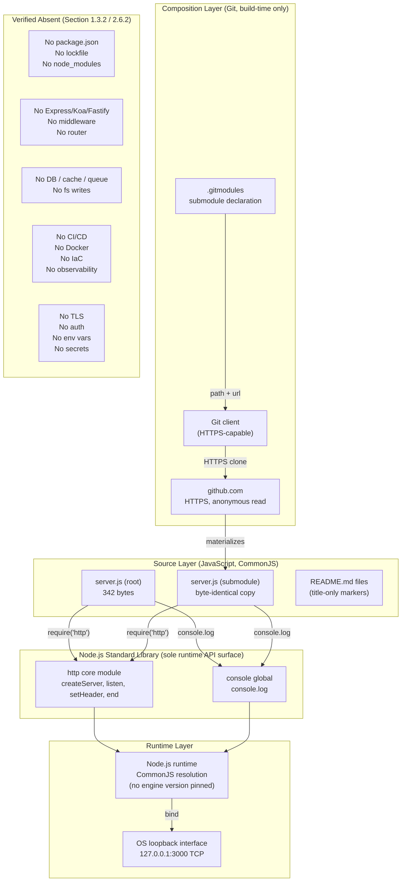

### 3.8.2 Build-Time vs Runtime Dependency Surface

To clarify the temporal separation between Git-layer composition and Node.js runtime execution, the following diagram contrasts what each phase requires.

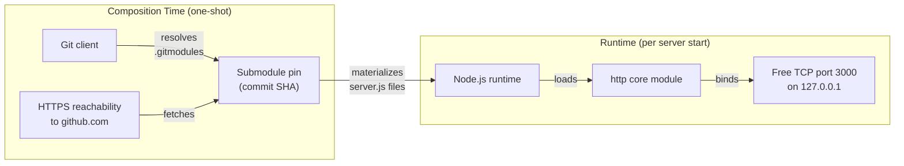

The two dependency surfaces are **disjoint**: once the submodule has been materialized, runtime operation requires no network reachability, no Git client, and no further composition-time tooling (Section 2.6.1 Documented Assumptions).

---

## 3.9 DEPARTURE FROM DEFAULT TECHNOLOGY STACK

### 3.9.1 Default Stack Items Not Applicable

The authoring prompt provided a default technology stack typical of enterprise full-stack applications. Per the evidence assembled in Sections 1.3.2, 2.4.1, and 2.6.2, **none** of these defaults are applicable to this repository. The following table maps each default-stack item to its verified status:

| Default Stack Item | Status in This Repository | Anchoring Evidence |
|---|---|---|
| AWS (Cloud Platform) | Not used | No SDK, no service binding, no platform-specific configuration |
| Docker (Containerization) | Not used | Section 1.3.2: "No `Dockerfile`, no `docker-compose.yml`" |
| Terraform (Infrastructure as Code) | Not used | No IaC files in either repository (Section 1.3.3) |
| GitHub Actions (CI/CD) | Not used | Section 1.3.2: "No `.github/` directory, no `.gitlab-ci.yml`, no pipeline configuration" |
| Python (Backend Language) | Not used | Source language is JavaScript on Node.js |
| Flask (Backend Framework) | Not used | No framework; raw `http` core module only |
| Auth0 (Authentication) | Not used | Section 1.3.2: "No authentication, authorization, or session management" |
| MongoDB (Database) | Not used | Section 2.4.1: "Persistence — None" for all features |
| Langchain (AI Framework) | Not used | No AI/ML code surface |
| React + TypeScript (Web Frontend) | Not used | No web frontend exists; system is a server-only HTTP fixture |
| TailwindCSS (CSS Framework) | Not used | No CSS, no HTML templates, no static asset pipeline |
| React Native + TypeScript (Mobile) | Not used | No mobile surface |
| Swift / Kotlin / Objective-C / Electron (Native) | Not used | No native client surface |

### 3.9.2 Rationale for Non-Adoption

Adopting any default-stack item would contradict observable source evidence and would violate the documentation principle established in Sections 1.3.2 and 2.6.2: every claim in this specification must be anchored to verified repository contents. The repository's stated purpose, per Section 1.2.2 Major System Components — "the HTTP servers themselves serve as the minimum-viable executable content required to render the parent and child repositories non-empty and runnable" — is fundamentally incompatible with the introduction of framework, database, or platform technologies. Therefore, the user-provided default stack is documented here strictly as a **non-applicability list**, not as a recommendation.

---

## 3.10 References

### 3.10.1 Source Files Examined

- `server.js` (repository root, 342 bytes, 15 lines) — Provided the entire runtime surface: CommonJS `require('http')` import (line 1), hostname literal `127.0.0.1` (line 3), port literal `3000` (line 4), `http.createServer` handler (line 6), `res.statusCode = 200` (line 7), `Content-Type: text/plain` header (line 8), response body `"Hello, World!\n"` (line 9), `server.listen` invocation (line 12), and the single `console.log` startup line (line 13). Sole source of evidence for all of Section 3.1 and Section 3.7.
- `child_repo_for_submodule_hello_world/server.js` (342 bytes) — Byte-for-byte identical to root `server.js`; confirms the duplication relationship documented in Section 3.1.1 and Section 3.7.3.
- `.gitmodules` (178 bytes) — Sole evidence of the Git-layer submodule binding: submodule name `child_repo_for_submodule_hello_world`, local path `child_repo_for_submodule_hello_world`, and upstream URL `https://github.com/lakshya-blitzy/child_repo_for_submodule_hello_world.git`. Source for Section 3.4.2 and Section 3.7.3.
- `README.md` (root, 45 bytes) — Confirmed title-only content (`# ep_check_nested_submodule_15Jun_hello_world`); contributed to the Markdown row of Section 3.1.1.
- `child_repo_for_submodule_hello_world/README.md` (38 bytes) — Confirmed title-only content (`# child_repo_for_submodule_hello_world`); contributed to the Markdown row of Section 3.1.1.
- `child_repo_for_submodule_hello_world/.gitignore` (0 bytes, empty) — Confirmed by file-system inspection; contributes no requirements to the technology stack.

### 3.10.2 Folders Explored

- `/` (repository root, depth 0) — Enumerated all four first-order children (three files plus one submodule directory). Confirmed absence of `package.json`, `package-lock.json`, `Dockerfile`, `docker-compose.yml`, `.github/`, `.gitlab-ci.yml`, `tsconfig.json`, `webpack.config.*`, `rollup.config.*`, `esbuild.config.*`, `terraform/`, `cloudformation/`, `k8s/`, `LICENSE`, `.eslintrc*`, `.prettierrc*`, and `node_modules/`. This negative inventory underpins Sections 3.3.1, 3.5.1, and 3.6.2.
- `child_repo_for_submodule_hello_world/` (depth 1) — Enumerated all tracked files: `server.js`, `README.md`, and the empty `.gitignore`. Confirmed no nested folders, no manifests, no tooling files.

### 3.10.3 Cross-Referenced Specification Sections

- **Section 1.2.1 Project Context** — Established the absence of all external runtime integrations and the singular role of the `.gitmodules` Git-level binding; foundational for Section 3.4.
- **Section 1.2.2 High-Level Description** — Provided the capabilities table, two-component decomposition, and the canonical statement that all operational parameters are inline literals; foundational for Sections 3.1, 3.2.2, 3.7.1, and 3.8.
- **Section 1.2.3 Success Criteria** — Sourced the success criteria (loopback reachability, fixed payload, submodule pin integrity, startup log) referenced throughout Sections 3.6.3 and 3.7.2.
- **Section 1.3.1 In-Scope Elements** — Sourced the key technical requirements (Node.js runtime supporting CommonJS and `http`; Git client supporting submodule resolution; free loopback port 3000); foundational for Sections 3.1.3 and 3.6.1.
- **Section 1.3.2 Out-of-Scope Elements** — The primary anchor for every verified-absence claim across Sections 3.2.1, 3.3.1, 3.4.1, 3.4.3, 3.5.1, 3.5.2, 3.6.2, and 3.9.1.
- **Section 2.3.2 Feature Relationships** — Sourced the no-application-coupling determination between the root and submodule servers (Section 3.7.3).
- **Section 2.3.3 Shared Components** — Sourced the determination that the Node.js `http` module is the sole runtime dependency (Section 3.2.2).
- **Section 2.4.1 Technical Constraints** — Sourced the per-feature runtime, configuration, and persistence constraints used throughout Sections 3.1.3, 3.5.1, and 3.7.1.
- **Section 2.4.4 Security Implications** — Sourced every claim in Section 3.7.2, including the loopback-only boundary, the absence of authentication/authorization/TLS, and the role of the submodule pin as integrity anchor.
- **Section 2.4.5 Maintenance Requirements** — Sourced the maintenance-implications discussion in Section 3.3.3 (no dependencies to update; submodule pin as the only mutable Git-level configuration).
- **Section 2.6.1 Documented Assumptions** — Sourced the build-time vs runtime distinction articulated in Section 3.8.2, including the assumption of HTTPS reachability to `github.com` at submodule init.
- **Section 2.6.2 Verified Constraints** — Sourced the catalogue of absences (no env vars, no error handling, no CI/CD, no tests, no `LICENSE`, no KPIs) referenced throughout Sections 3.3, 3.4, 3.6.2, and 3.9.
- **Section 2.6.3 Requirement Version Control** — Sourced the determination that all features are at status Completed with no roadmap and no `TODO` annotations (Section 3.6.2).

# 4. Process Flowchart

This section catalogs the complete set of processes implemented by this repository and renders each one as an evidence-grounded flowchart, sequence diagram, or state diagram. The repository's process surface is intentionally narrow: per Section 1.2.2, "All operational parameters — hostname (`127.0.0.1`), port (`3000`), HTTP status code (`200`), `Content-Type` (`text/plain`), and response body (`\"Hello, World!\\n\"`) — are inline literals," and per Section 1.3.2 the application contains "no `try/catch` blocks, no `process` signal handlers, no `server.close` orchestration." Consequently, this section documents two — and only two — workflows: a **runtime HTTP request/response workflow** and a **composition-time Git submodule materialization workflow**. All workflow concerns enumerated in the generic prompt that are not represented in source (error handling paths, retry mechanisms, business rules, validation, authorization, transactions, caching, batch processing) are explicitly catalogued as verified absences in Section 4.9 rather than fabricated.

## 4.1 OVERVIEW OF SYSTEM PROCESSES

### 4.1.1 Process Inventory

The following table enumerates every process flow present in the repository, the source artifact that defines it, and its temporal phase relative to system operation.

| Process Flow | Phase | Source Artifact | Frequency |
|---|---|---|---|
| HTTP request/response handling | Runtime | `server.js` lines 6–10 | Per request (once the server is bound) |
| Server bind and startup log emission | Runtime (one-shot) | `server.js` lines 12–14 | Once per process invocation |
| Git submodule materialization | Composition-time (one-shot) | `.gitmodules` resolved by `git submodule update` | Once per clone (or on operator-initiated update) |
| Acceptance verification (operator-initiated) | Validation | Derived from Section 1.2.3 Success Criteria | On demand |

No other processes exist in the repository. Per Section 2.6.2 Verified Constraints, there is "no error handling, no graceful shutdown, no signal handlers," "no automated tests, CI/CD, build tooling, or containerization," and "no KPIs, SLAs, or performance targets" — each of these absences eliminates entire classes of process flow that would otherwise be present in a typical production system.

### 4.1.2 Actors and Systems (Swim-Lane Definitions)

The process flowcharts in this section consistently use the following actor and system boundaries. The set is closed: no additional actor or system participates in any process documented here.

| Lane | Type | Role |
|---|---|---|
| **Operator** | Human actor | Issues local shell commands (`git`, `node`, `curl`) |
| **HTTP Client** | External process | Sends arbitrary HTTP requests to `127.0.0.1:3000` (`curl`, browser, probe) |
| **Git Client** | Local tool | Resolves `.gitmodules` and fetches submodule content |
| **GitHub.com** | Third-party service | Hosts the submodule's upstream Git repository (composition-time only) |
| **Local Filesystem** | Host resource | Holds materialized submodule directory and source files |
| **Node.js Process** | Runtime container | Hosts the `http.createServer` instance; owns the loopback socket on `127.0.0.1:3000` |
| **Node.js `http` Core Module** | Standard library | Provides server construction, request parsing, and response emission |
| **Stdout** | Host resource | Receives the single startup log line |

Note that **GitHub.com is involved only at composition-time** (Section 3.4 and Section 3.8.2). The runtime process surface involves no third-party service.

### 4.1.3 Process Surface Boundary

The end-to-end process surface is delimited by the following boundaries. Each boundary is anchored to a verified source location.

- **Composition-time boundary**: HTTPS reachability between the Git client and `https://github.com/lakshya-blitzy/child_repo_for_submodule_hello_world.git` (Section 2.6.1 Documented Assumptions). After successful materialization, the system requires no further Git or network access (Section 3.8.2 Build-Time vs Runtime).
- **Runtime network boundary**: TCP loopback (`127.0.0.1`) on port `3000` only. Per Section 2.4.4, "Loopback-only binding (`127.0.0.1`) prevents external network exposure entirely."
- **Runtime data boundary**: The fixed 14-byte payload `"Hello, World!\n"`. No persistent data store participates in any process (Section 3.5).
- **Runtime computation boundary**: Single Node.js process, single event loop, no clustering and no worker threads (Section 1.2.2 Core Technical Approach).

## 4.2 HIGH-LEVEL SYSTEM WORKFLOW

### 4.2.1 Two-Track Workflow Diagram

The system exposes two workflows that are temporally and dependency-wise **disjoint**. Composition-time and runtime form non-overlapping surfaces per Section 3.8.2. The following diagram renders both tracks with swim lanes for each participating actor or system.

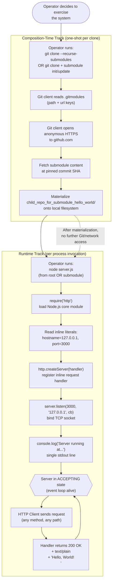

### 4.2.2 Composition-Time vs Runtime Surfaces

The two tracks share **no dependency surface**. Per Section 3.8.2, the build-time (composition-time) dependency surface — Git client and HTTPS access to GitHub.com — is **disjoint** from the runtime dependency surface, which consists exclusively of the Node.js runtime and the `http` core module. The following matrix clarifies this disjointness:

| Surface Element | Composition-Time | Runtime |
|---|---|---|
| Git client | Required | Not used |
| HTTPS to `github.com` | Required | Not used |
| Node.js runtime | Not used | Required |
| Node.js `http` core module | Not used | Required |
| TCP port `3000` (loopback) | Not used | Required (must be free) |
| Network reachability to external hosts | Required (one-shot) | Not required |

This disjointness has a direct workflow implication: once the composition-time track completes, the runtime track can execute fully offline.

### 4.2.3 Workflow Sequencing

The composition-time track is a **prerequisite** for the runtime track only when running the submodule's `server.js`. Running the root `server.js` does not require submodule materialization, because the root file is self-contained (per Section 1.2.2, neither file `require`s the other). The following table makes the sequencing explicit:

| Operator Goal | Prerequisite Tracks | Notes |
|---|---|---|
| Run root `server.js` only | Plain `git clone` of superproject | Submodule directory may be empty |
| Run submodule `server.js` only | `git clone --recurse-submodules` OR plain clone followed by `git submodule init` + `git submodule update` | Submodule must be materialized |
| Run both `server.js` files simultaneously | **Unsupported** | Both bind `127.0.0.1:3000` and would conflict (Section 1.3.2 Unsupported Use Cases) |

## 4.3 RUNTIME WORKFLOW: HTTP REQUEST/RESPONSE

### 4.3.1 End-to-End Process Flow

The runtime workflow comprises a **startup sequence** (one-shot) followed by an **accept-loop** (repeating). The handler logic itself is strictly linear: per Section 1.3.2, "Single inline request handler responds identically to every URL and HTTP method," and per Section 1.3.2 Excluded Capabilities, "The `req` parameter is received by the handler but never read." There are no decision diamonds in the handler.

```mermaid
flowchart LR
    subgraph StartupPhase["Startup Phase (one-shot)"]
        direction LR
        S1["Process invoked<br/>(node server.js)"]
        S2["require('http')"]
        S3["http.createServer<br/>(register handler)"]
        S4["server.listen<br/>(127.0.0.1:3000)"]
        S5["Bind callback fires"]
        S6["console.log emits<br/>startup line to stdout"]
    end

    subgraph AcceptLoop["Accept Loop (per request)"]
        direction LR
        R1["HTTP request arrives<br/>on socket"]
        R2["Handler invoked with<br/>(req, res)"]
        R3["res.statusCode = 200<br/>(unconditional)"]
        R4["res.setHeader<br/>('Content-Type','text/plain')<br/>(unconditional)"]
        R5["res.end<br/>('Hello, World!\n')<br/>(unconditional)"]
        R6["Response transmitted<br/>to client"]
    end

    S1 --> S2 --> S3 --> S4 --> S5 --> S6 --> R1
    R1 --> R2 --> R3 --> R4 --> R5 --> R6 --> R1
```

### 4.3.2 Process Step Detail

Each numbered step in the diagram above corresponds to a specific line range in `server.js`. The following table provides the exact source attribution:

| Step | Source Location | Operation | Branching? |
|---|---|---|---|
| S1 | Process boundary | Operator invokes `node server.js` | N/A |
| S2 | `server.js` line 1 | `const http = require('http')` — CommonJS load | None |
| S3 | `server.js` lines 6–10 | `http.createServer((req, res) => {...})` — handler registered | None |
| S4 | `server.js` line 12 | `server.listen(port, hostname, callback)` | None |
| S5 | `server.js` line 12 (callback) | Bind callback fires upon successful listen | None |
| S6 | `server.js` line 13 | `console.log(\`Server running at http://${hostname}:${port}/\`)` | None |
| R1 | Node.js `http` module | Inbound TCP segment parsed into an HTTP request | None (parser-internal) |
| R2 | `server.js` line 6 | Handler invoked with `(req, res)` | None |
| R3 | `server.js` line 7 | `res.statusCode = 200` | None (literal assignment) |
| R4 | `server.js` line 8 | `res.setHeader('Content-Type', 'text/plain')` | None (literal assignment) |
| R5 | `server.js` line 9 | `res.end('Hello, World!\n')` | None (literal payload) |
| R6 | Node.js `http` module | Response serialized to client | None |

### 4.3.3 Non-Branching Property and Absence of Decision Points

The HTTP request workflow contains **zero decision points**. This is a structural property of the handler, not an oversight in this documentation. The following matrix demonstrates the absence of every commonly-expected decision point:

| Commonly-Expected Decision | Status in This System | Anchoring Evidence |
|---|---|---|
| Branch on URL path | **Not present** — same response for every path | F-001-RQ-005 in Section 2.2.1 |
| Branch on HTTP method | **Not present** — same response for every method | F-001-RQ-005 in Section 2.2.1 |
| Branch on request headers | **Not present** — `req` parameter is never read | Section 1.3.2 Excluded Capabilities |
| Branch on query string | **Not present** — query string is never parsed | Section 1.3.2 Excluded Capabilities |
| Branch on request body | **Not present** — body is never inspected | Section 2.2.1 Technical Specifications |
| Branch on authentication state | **Not present** — no authentication exists | Section 2.4.4 Security Implications |
| Branch on validation outcome | **Not present** — no validation exists | Section 2.2.1 Validation Rules |
| Branch on error condition | **Not present** — no error handling exists | Section 1.3.2 Excluded Capabilities |

Therefore, the runtime flow diagram in Section 4.3.1 deliberately contains no decision diamonds. Any decision diamonds in a flowchart of this system would be fabrications.

### 4.3.4 State Sequence: Server Lifecycle

The Node.js process passes through a small, deterministic set of lifecycle states. The transitions are observable but **uninstrumented** — no metric is emitted on state change (Section 1.3.2 Excluded Capabilities does not list observability tooling).

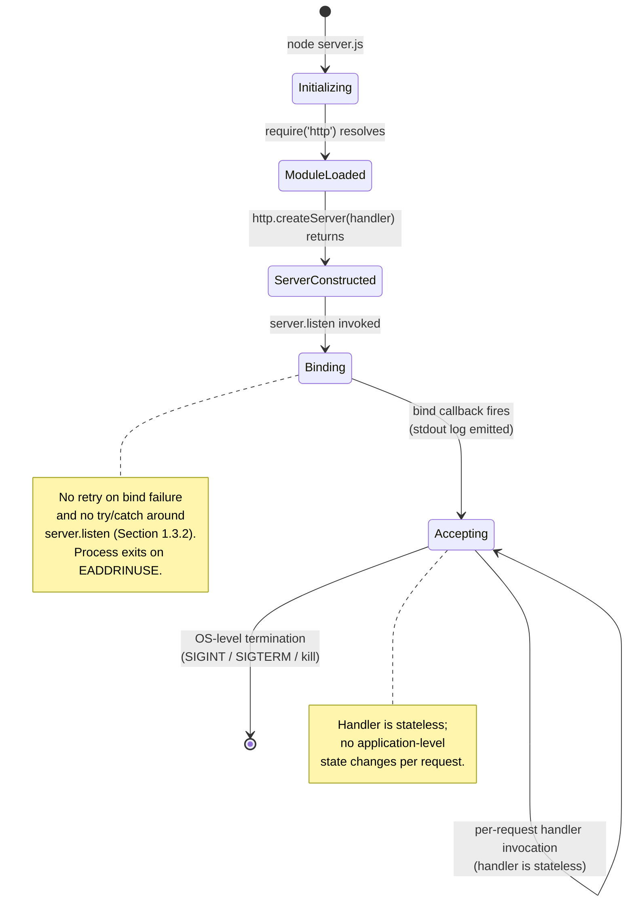

Two notes on this state diagram:

- The transition from **Accepting** to **`[*]`** (termination) is **uncoordinated**. Per Section 1.3.2 Excluded Capabilities, there are "no `process` signal handlers, no `server.close` orchestration." The process exits whenever the host OS kills it; there is no graceful-shutdown state.
- The per-request loop in **Accepting** does not change application state. The handler is stateless: each invocation reads only its inline literals (status code, header, body) and emits the response.

### 4.3.5 Validation, Authorization, and Compliance Checkpoints (Verified Absences)

The prompt for this section requests documentation of "business rules at each step," "data validation requirements," "authorization checkpoints," and "regulatory compliance checks." Each of these is verifiably absent in this system, anchored to Section 2.2.1 Validation Rules:

| Checkpoint Category | Status | Evidence |
|---|---|---|
| Business rules | **None documented; the response is unconditional** | Section 2.2.1 F-001 Validation Rules |
| Data validation | **None — request payload is not inspected** | Section 2.2.1 F-001 Validation Rules |
| Security checkpoint | Only the loopback binding (network-layer boundary) | Section 2.2.1 F-001 Validation Rules |
| Compliance | **None declared in repository (no `LICENSE`, no policy documents)** | Section 2.2.1 F-001 Validation Rules |

No checkpoint diamonds therefore appear in the HTTP workflow diagrams.

## 4.4 COMPOSITION-TIME WORKFLOW: GIT SUBMODULE MATERIALIZATION

### 4.4.1 Composition Process Flow

The composition-time workflow resolves the `.gitmodules` declaration into a materialized working tree on disk. Per Section 3.6.3 Local Run Procedure, the operator has two equivalent invocation paths.

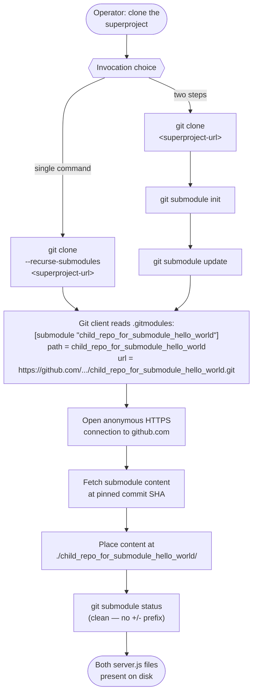

### 4.4.2 Materialization Sequence Diagram

The following sequence diagram renders the composition-time workflow across all participating actors and systems. It is the only sequence diagram in this specification that involves an external third party (`github.com`).

```mermaid
sequenceDiagram
    autonumber
    actor Operator
    participant GitClient as Git Client
    participant FS as Local Filesystem
    participant GitHub as github.com<br/>(HTTPS, anonymous)

    Operator->>GitClient: git clone --recurse-submodules &lt;url&gt;<br/>(or git clone + submodule init/update)
    GitClient->>GitHub: HTTPS fetch superproject
    GitHub-->>GitClient: superproject objects + .gitmodules
    GitClient->>FS: write superproject working tree<br/>(server.js, README.md, .gitmodules)
    Note over GitClient: Read .gitmodules:<br/>name=child_repo_for_submodule_hello_world<br/>path=child_repo_for_submodule_hello_world<br/>url=https://github.com/.../...git
    GitClient->>GitHub: HTTPS fetch submodule<br/>at pinned commit SHA
    GitHub-->>GitClient: submodule objects (pinned)
    GitClient->>FS: write submodule working tree<br/>(child_repo_for_submodule_hello_world/server.js,<br/>README.md, empty .gitignore)
    GitClient-->>Operator: completion (exit 0)
    Operator->>GitClient: git submodule status
    GitClient-->>Operator: clean status<br/>(no +/- prefix, SHA matches pin)
```

### 4.4.3 Critical Success Factors and Failure Modes

Per Section 1.2.3 Critical Success Factors and Section 2.6.1 Documented Assumptions, the composition-time workflow has the following success preconditions:

| Precondition | Source |
|---|---|
| Git client supports submodule resolution | Section 2.6.1 |
| HTTPS reachability to `github.com` exists at submodule init | Section 2.6.1 |
| Faithful preservation of `.gitmodules` declaration across clone/fork/mirror | Section 1.2.3 |

The repository defines **no application-level recovery** for composition-time failures (no retry loops, no fallback URLs, no mirror configuration). Recovery is an **operator-level concern**, handled by re-running `git submodule update --init` once network conditions permit. There is no `branch`, `update`, or `shallow` key in `.gitmodules`; the configuration is the minimum INI surface (name + path + url).

### 4.4.4 Integrity Anchors

Per Section 2.4.4 (F-003), the composition workflow has a single integrity anchor: the **submodule pin (commit SHA)** recorded in the superproject's tree. This anchor is enforced by Git itself — no application code participates. The following table summarizes the integrity properties:

| Property | Value / Source |
|---|---|
| Pin mechanism | Submodule entry in superproject tree (recorded SHA) |
| Transport | HTTPS (no credentials embedded; anonymous public read) |
| Verification command | `git submodule status` |
| Detection of drift | `+` prefix in `git submodule status` indicates working tree differs from pin |
| Detection of uninitialized state | `-` prefix in `git submodule status` |

## 4.5 INTEGRATION WORKFLOWS

### 4.5.1 In-Process Integration: HTTP Server ↔ Startup Log

The only application-layer integration in the system is the in-process binding between F-001 (HTTP server) and F-002 (startup log). Per Section 2.3.2 Integration Points, the mechanism is "Node.js `server.listen` callback invocation." The following sequence diagram renders this single integration.

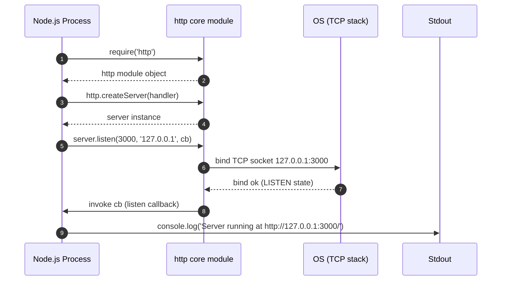

### 4.5.2 Git-Layer Integration: `.gitmodules` ↔ Submodule Working Tree

Per Section 2.3.2 and Section 3.7.3, the Git-layer integration between the superproject and the submodule is **structural, not functional**. The sequence diagram in Section 4.4.2 documents this integration end-to-end. The contract is enforced by the Git client; no application code participates at runtime.

### 4.5.3 Verified Absences (No Runtime Integrations)

The prompt for this section requests documentation of "data flow between systems," "API interactions," "event processing flows," and "batch processing sequences." None of these exist in this system. The following table catalogs the absences with evidence:

| Integration Category | Status | Anchoring Evidence |
|---|---|---|
| Outbound API calls | **None** | Section 1.2.1: "perform no outbound network calls" |
| Inbound API from external systems | **None** beyond the loopback HTTP listener | Section 2.3.2 |
| Message broker / event bus | **None** | Section 1.2.1: "emit no events to any message broker" |
| Database read/write | **None** | Section 3.5 |
| Batch / scheduled jobs | **None** | Section 3.6.2 (no CI/CD, no schedulers) |
| Webhooks (in or out) | **None** | Section 3.4 (only GitHub anonymous read at composition-time) |
| Service discovery / DNS resolution | **None** (loopback is hard-coded IPv4) | Section 3.7.1 |

Consequently, **no runtime integration sequence diagrams beyond the in-process and Git-layer ones above can be constructed from source evidence**.

## 4.6 STATE MANAGEMENT AND TRANSITIONS

### 4.6.1 Server Lifecycle State Transitions

The single state machine of substance in this system is the server lifecycle, rendered in Section 4.3.4. It has five states: `Initializing`, `ModuleLoaded`, `ServerConstructed`, `Binding`, `Accepting`. The terminal transition is uncoordinated (OS-level kill) because no signal handler is registered.

### 4.6.2 Submodule Working-Tree State Transitions

A second state machine exists at the Git layer, governing the submodule working tree.

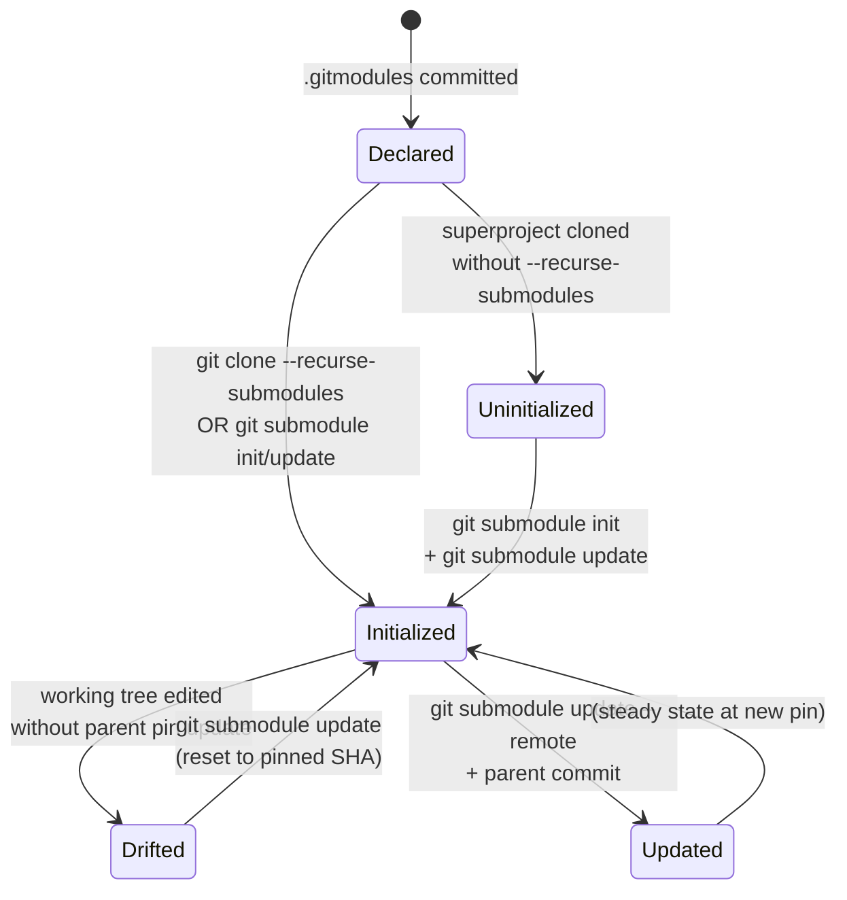

This diagram reflects only operator-driven transitions. No application code in this repository participates in these transitions; they are wholly orchestrated by the Git client.

### 4.6.3 Statelessness of Request Handler

The request handler is **stateless**. Per Section 3.5, there is no persistence layer; per Section 1.3.2, there is no caching layer. The following matrix demonstrates the absence of every commonly-expected persistence point:

| Persistence Concern | Status | Evidence |
|---|---|---|
| Database read/write per request | **None** — no database driver | Section 3.5; Section 1.3.2 |
| File I/O for state per request | **None** — no `fs` import | Section 1.2.1 |
| In-memory cache | **None** — no cache structures | Section 1.3.2: "no caching layer" |
| Session storage | **None** — no session middleware | Section 1.3.2: "no session management" |
| Transaction boundaries | **None** — no transactions exist | Section 3.5.1 |

Because no state is mutated per request, no state-transition diagram for request handling can be constructed from source evidence beyond the single self-loop in Section 4.3.4.

## 4.7 ERROR HANDLING AND RECOVERY

### 4.7.1 Verified Absence of In-Application Error Handling

The repository contains **no in-application error handling**. Per Section 1.3.2 Excluded Capabilities, "No `try/catch` blocks, no `process` signal handlers, no `server.close` orchestration." Per Section 2.6.2 Verified Constraints, "No error handling, no graceful shutdown, no signal handlers." Therefore, no error-handling flowchart can be constructed from source evidence.

The following diagram catalogs the failure modes that **could** occur at the process boundary (i.e., that are produced by the Node.js runtime or OS, not by application code) and documents the **uniform default behavior** that results from the absence of application-level handling.

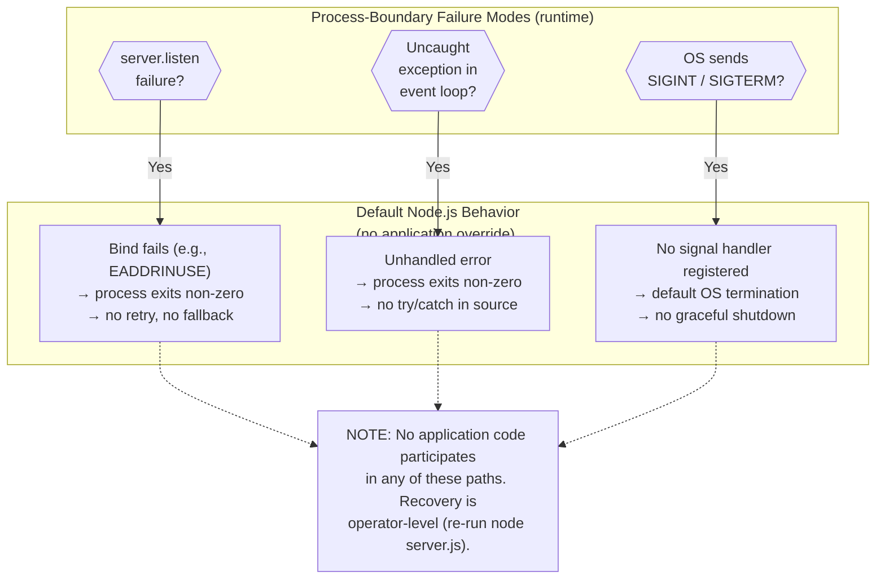

This diagram is presented as a **catalog of absences**, not as a description of application logic. Every arrow represents a default Node.js or OS behavior; no source line in this repository implements any of these branches.

### 4.7.2 Failure Modes Documented at the Process Boundary

The following table enumerates each plausible failure mode, its detection mechanism (always external to this repository), and the operator-level recovery procedure.

| Failure Mode | Phase | Detection | Recovery |
|---|---|---|---|
| `EADDRINUSE` on port `3000` | Runtime (startup) | Process exits non-zero; no startup log line emitted | Operator stops competing process and re-runs `node server.js` |
| Missing Node.js runtime | Runtime (startup) | Shell error: `command not found: node` | Operator installs Node.js (Section 1.2.3 Critical Success Factors) |
| Submodule init fails (HTTPS unreachable) | Composition-time | `git submodule update` exits non-zero | Operator restores network and re-runs `git submodule update --init` |
| Submodule pin mismatch | Composition-time | `git submodule status` shows `+`/`-` prefix | Operator runs `git submodule update` to reset to pin |
| Concurrent execution of both `server.js` files | Runtime | Second invocation receives `EADDRINUSE` | Operator runs only one (Section 1.3.2 Unsupported Use Cases) |
| HTTP client cannot reach `127.0.0.1:3000` | Runtime | Connection refused at client | Operator verifies that `node server.js` is running |

### 4.7.3 Verified Absences in Error-Handling Concerns

The prompt for this section requests documentation of "retry mechanisms," "fallback processes," "error notification flows," and "recovery procedures." Each is absent from the source.

| Error-Handling Concern | Status | Anchoring Evidence |
|---|---|---|
| Retry mechanism (in source) | **None** — no retry logic exists | Section 1.3.2; Section 2.6.2 |
| Fallback process | **None** — no fallback logic exists | Section 1.3.2 |
| Error notification (email, webhook, pager) | **None** — no integrations exist | Section 1.2.1; Section 3.4 |
| Circuit breaker | **None** — no resilience library | Section 3.3 (zero third-party dependencies) |
| Dead-letter queue | **None** — no queue exists | Section 1.2.1 |
| Health check endpoint | **None** — single inline handler serves only the fixed response | F-001-RQ-005 (Section 2.2.1) |
| Graceful shutdown | **None** — no `server.close` orchestration | Section 1.3.2 |
| Application-level logging of errors | **None** — only the one-shot startup log | Section 2.2.1 F-002 |

These rows are not omissions in this documentation; they are the system's verified contract.

## 4.8 VERIFICATION WORKFLOW

### 4.8.1 Acceptance Criteria as Workflow Verification

The repository documents **acceptance criteria** (Section 1.2.3) rather than SLAs or KPIs (which Section 1.2.3 explicitly states are absent: "No KPIs are defined in the source material"). The acceptance criteria form an operator-initiated verification workflow that confirms the four committed features (F-001 through F-004) are functioning. The following sequence diagram renders this workflow.

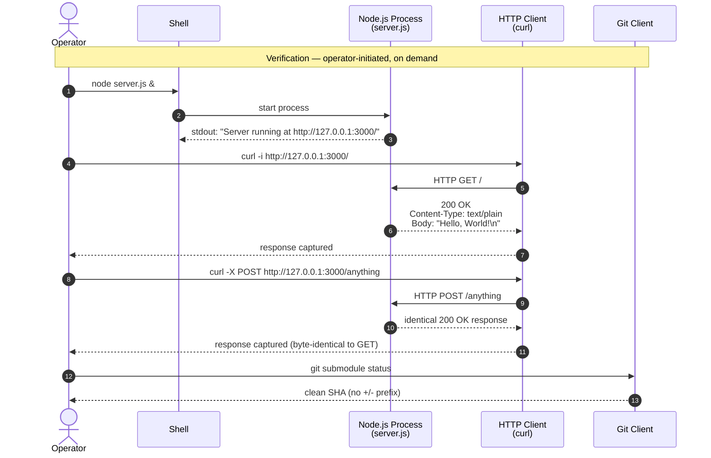

### 4.8.2 Verification Criteria Mapping

Each step in the verification workflow maps to one or more acceptance criteria. The table below provides full traceability:

| Verification Step | Acceptance Criterion | Source |
|---|---|---|
| Process starts and emits log line | F-002-RQ-001 | Section 2.2.1 |
| `curl http://127.0.0.1:3000/` returns `200 OK` | F-001-RQ-001, F-001-RQ-002 | Section 2.2.1 |
| Response header is `Content-Type: text/plain` | F-001-RQ-003 | Section 2.2.1 |
| Response body equals `"Hello, World!\n"` | F-001-RQ-004 | Section 2.2.1 |
| `POST`/`PUT`/`DELETE`/`PATCH` return identical response | F-001-RQ-005 | Section 2.2.1 |
| `git submodule status` reports clean | F-003-RQ-004 | Section 2.2.1 |
| Root README contains expected H1 | F-004-RQ-001 | Section 2.2.1 |
| Submodule README contains expected H1 | F-004-RQ-002 | Section 2.2.1 |

### 4.8.3 Timing and SLA Considerations

The prompt for this section requests documentation of "timing and SLA considerations." Per Section 1.2.3 KPIs and Section 2.4.2 Performance Requirements, the repository documents **no** timing constraints. The following matrix is exhaustive:

| Timing Concern | Status | Source |
|---|---|---|
| Latency target (per-request) | **None specified** | Section 2.4.2 |
| Throughput target | **None specified** | Section 2.4.2 |
| Startup time bound | **None specified** | Section 2.4.2 |
| Composition-time bound | **Dependent on network conditions; not specified** | Section 2.4.2 (F-003) |
| Availability target / SLA | **None specified** | Section 1.2.3 KPIs |
| Time-to-first-byte budget | **None specified** | Section 2.4.2 |

No timing annotations appear on any flowchart in this section, by design.

## 4.9 PROCESS-LEVEL ABSENCES (Verified Non-Applicable Items)

### 4.9.1 Categorical Absence Table

The following table is the consolidated catalog of generic-prompt items that are **verifiably non-applicable** to this repository. Each row is anchored to a section of this Technical Specification. This table serves as the authoritative reference for any reader expecting workflow content that is intentionally absent.

| Generic Prompt Item | Status | Anchoring Section |
|---|---|---|
| End-to-end user journeys (beyond HTTP request and Git submodule init) | Limited to the two flows in Section 4.2 | Section 1.3.1 Primary User Workflows |
| Decision points (in HTTP handler) | **None** — handler is non-branching | Section 1.3.2; Section 4.3.3 |
| Decision points (in composition workflow) | Only the operator's choice of one-shot vs two-step Git invocation (Section 4.4.1) | Section 3.6.3 |
| Error handling paths | **None in source** | Section 1.3.2; Section 2.6.2 |
| Data flow between systems | **None at application layer** | Section 1.2.1; Section 4.5.3 |
| API interactions | **None** | Section 3.4 |
| Event processing flows | **None** | Section 1.2.1 |
| Batch processing sequences | **None** | Section 3.6 |
| Timing and SLA considerations | **None** | Section 4.8.3 |
| Business rules at each step | **None — response is unconditional** | Section 2.2.1 Validation Rules |
| Data validation requirements | **None — request payload is not inspected** | Section 2.2.1 Validation Rules |
| Authorization checkpoints | **None — no authentication or authorization** | Section 2.4.4; Section 1.3.2 |
| Regulatory compliance checks | **None declared in repository** | Section 2.2.1 Validation Rules |
| State transitions in application data | **None — handler is stateless** | Section 4.6.3 |
| Data persistence points | **None** | Section 3.5 |
| Caching requirements | **None — no caching layer** | Section 1.3.2 |
| Transaction boundaries | **None — no transactions** | Section 4.6.3 |
| Retry mechanisms | **None in source** | Section 4.7.3 |
| Fallback processes | **None in source** | Section 4.7.3 |
| Error notification flows | **None — no integrations** | Section 4.7.3 |
| Recovery procedures (in source) | **None — recovery is operator-level only** | Section 4.7.2 |

### 4.9.2 Implications for Production Use

The absences enumerated above are not deficiencies to be remediated within scope. Per Section 1.3.2 Unsupported Use Cases, "Production deployment of the HTTP server" is explicitly outside scope "given the absence of error handling, TLS, configuration, and observability." Per Section 2.6.3 Requirement Version Control, "Status for every requirement is **Completed** because there is no roadmap, no `TODO` annotations in source, and no in-progress work documented within the artifact." The process surface described in this section is therefore both **minimal** and **complete**.

### 4.9.3 Cross-Reference Index

For readers who arrive at this section seeking content on a generic workflow concern, the following table redirects to the authoritative section that documents the absence:

| If you are looking for… | Go to… |
|---|---|
| Security/authentication flow | Section 2.4.4 (Security Implications); Section 3.7.2 |
| Persistence / database flow | Section 3.5 (Databases & Storage) |
| Build/CI/CD pipeline | Section 3.6.2 (Verified Absences) |
| Configuration management flow | Section 3.7.1 (Hard-Coded Network Parameters) |
| Inter-service integration flow | Section 2.3 (Feature Relationships); Section 4.5 |
| Observability / metrics flow | Section 1.2.3 (KPIs); Section 1.3.2 |
| Dependency-update flow | Section 3.3 (Open Source Dependencies); Section 2.4.5 |

## 4.10 References

#### Files Examined

- `server.js` (root) — Provided all 15 lines of evidence for the runtime workflow: CommonJS import (line 1), inline hostname/port literals (lines 3–4), non-branching request handler (lines 6–10), `server.listen` invocation (line 12), and startup log emission (line 13). Source of every step in Sections 4.3.1 and 4.3.2.
- `child_repo_for_submodule_hello_world/server.js` — Byte-identical to root `server.js`; confirms that the submodule HTTP server has the same workflow and the same socket conflict potential (Section 4.2.3).
- `.gitmodules` (root) — Sole source of evidence for the composition-time workflow: submodule name, `path`, and `url` keys. Anchors Sections 4.4.1 and 4.4.2.
- `README.md` (root) and `child_repo_for_submodule_hello_world/README.md` — Title-only marker files; participate only in the verification workflow (F-004-RQ-001 and F-004-RQ-002 in Section 4.8.2).
- `child_repo_for_submodule_hello_world/.gitignore` — Empty file; no workflow participation; documented for inventory completeness only.

#### Folders Explored

- `/` (repository root) — Top-level enumeration confirmed no CI/CD, build, test, or configuration directories that would introduce additional workflows.
- `child_repo_for_submodule_hello_world/` — Submodule contents enumeration confirmed exactly two tracked files plus the empty `.gitignore`; no nested workflow surfaces.

#### Technical Specification Sections Cross-Referenced

- **Section 1.2 System Overview** — Composition diagram, capabilities table, success criteria; basis of Sections 4.1, 4.2, and 4.8.
- **Section 1.3 Scope** — Primary User Workflows, Excluded Application Capabilities, Unsupported Use Cases; basis of every "verified absence" row in Sections 4.3.5, 4.5.3, 4.7.3, and 4.9.
- **Section 2.2 Functional Requirements Tables** — Per-feature requirements and validation rules; basis of Sections 4.3.2, 4.3.5, and 4.8.2.
- **Section 2.3 Feature Relationships** — Feature dependency map and Integration Points table; basis of Sections 4.5.1 and 4.5.2.
- **Section 2.4 Implementation Considerations** — Technical constraints, performance posture, security implications; basis of Sections 4.7 and 4.8.3.
- **Section 2.6 Assumptions and Constraints** — Documented Assumptions and Verified Constraints; basis of Sections 4.4.3 and 4.7.
- **Section 3.4 Third-Party Services** — Anchors the "GitHub.com is composition-time only" claim used throughout Section 4.4.
- **Section 3.5 Databases & Storage** — Anchors the statelessness claims in Section 4.6.3.
- **Section 3.6 Development & Deployment** — Local Run Procedure and Verified Absences; basis of Sections 4.2.3 and 4.4.1.
- **Section 3.7 Network & Runtime Configuration** — Hard-coded parameters and integration boundaries; basis of Sections 4.1.3 and 4.5.
- **Section 3.8 Technology Stack Visualization** — Build-time vs runtime disjointness; basis of Section 4.2.2.

# 5. System Architecture

## 5.1 HIGH-LEVEL ARCHITECTURE

### 5.1.1 System Overview

#### Architecture Style and Rationale

The system implements a **minimalist, standard-library-only, stateless HTTP server architecture composed through a Git submodule binding**. It is not a distributed system, a microservice mesh, or a layered enterprise application; it is a deliberately reduced executable fixture whose architectural shape is dictated by the requirement to function as an engineering-validation artifact for Git submodule workflows.

Four architectural posture statements characterize the system, each anchored to verified evidence in the repository:

- **Zero-framework, zero-dependency runtime.** Neither `server.js` file declares or consumes any third-party package; the sole runtime API surface is the Node.js standard library. No `package.json`, no lockfile, and no `node_modules/` exists in either the superproject or the submodule. The `require('http')` call on line 1 of each `server.js` is the only external API binding.
- **CommonJS, single-process, single-event-loop execution.** Module resolution is CommonJS (no `import`/`export` syntax appears anywhere; no `"type": "module"` declaration exists). There is no clustering, no worker thread orchestration, and no asynchronous control flow beyond the `server.listen` bind callback.
- **Two-track composition model with disjoint dependency surfaces.** A composition-time surface (Git client + `.gitmodules` + `github.com`) materializes the submodule on the local filesystem. A runtime surface (Node.js + `http` core module + OS loopback socket) executes the HTTP listener. Once the submodule has been materialized, runtime operation requires no network reachability, no Git client, and no further composition-time tooling.
- **Structural (not functional) coupling between the two HTTP servers.** The superproject `server.js` and the submodule `server.js` are byte-for-byte identical and share no application-layer linkage. Neither file `require`s, imports, or invokes the other. Their relationship exists exclusively at the Git layer through the `.gitmodules` declaration.

The rationale for this architecture is the repository's explicit purpose: the `ep_check_` prefix in the repository name and the `15Jun` date marker, combined with the deliberate absence of a package manifest, dependency declarations, tests, and build tooling, indicate that the system functions as an engineering-validation artifact. The HTTP servers themselves serve as the minimum-viable executable content required to render the parent and child repositories non-empty and runnable.

#### Key Architectural Principles and Patterns

| Principle | Manifestation in Source |
|---|---|
| Minimum-viable executable content | A 15-line `server.js` is the entire runtime; no helper modules, no router, no middleware |
| No configurability — inline literals only | Hostname (`127.0.0.1`), port (`3000`), status code (`200`), `Content-Type` (`text/plain`), and body (`Hello, World!\n`) are all hard-coded literals |
| Deterministic, non-branching request handling | The handler ignores `req` entirely and emits the same fixed response for every URL, method, and header set |
| Composition-time integrity through SHA pinning | The submodule pin (commit SHA recorded in the superproject tree) is the only integrity anchor — `.gitmodules` declares no `branch`, no `update`, and no `shallow` key |

#### System Boundaries and Major Interfaces

The system has four explicit, verifiable boundaries:

| Boundary | Defined Value |
|---|---|
| System scope | Two `server.js` processes + the `.gitmodules` Git binding |
| Network boundary | TCP loopback (`127.0.0.1`) on port `3000` only |
| Data domain | No persisted data; only the fixed 14-byte `Hello, World!\n` string |
| Composition-time external dependency | HTTPS to `https://github.com/lakshya-blitzy/child_repo_for_submodule_hello_world.git` |

Three interfaces cross these boundaries:

- **Inbound HTTP listener** on `127.0.0.1:3000` — cleartext HTTP via `http.createServer` and `server.listen`.
- **One-shot stdout startup log** — single `console.log` line in the bind callback (no log level, no timestamp, no structured envelope).
- **Declarative submodule reference** in `.gitmodules` — parsed by the Git client during `git submodule init` / `update`.

### 5.1.2 Core Components

The system contains exactly two structurally separable executable components and one configuration artifact that binds them.

#### Component Responsibility Table

| Component | Primary Responsibility | Key Dependencies |
|---|---|---|
| Superproject `server.js` (root) | Bind HTTP listener on `127.0.0.1:3000`; return fixed `Hello, World!\n` to every request; emit one startup log line | Node.js `http` core module; `console` global; OS loopback interface; free TCP port `3000` |
| Submodule `server.js` (`child_repo_for_submodule_hello_world/server.js`) | Byte-identical HTTP listener; independent process if executed | Same dependencies as superproject server (would conflict on the same socket if launched concurrently) |
| `.gitmodules` (root) | Declare submodule name, local path, and upstream URL for Git client resolution | Git client capable of resolving HTTPS submodule URLs |

#### Component Integration Points and Critical Considerations

| Component | Integration Points | Critical Considerations |
|---|---|---|
| Superproject `server.js` | Local TCP socket `127.0.0.1:3000`; stdout (inherited from launching shell) | No `try/catch`, no signal handlers, no `server.close`; process exits non-zero on `EADDRINUSE` or any uncaught exception |
| Submodule `server.js` | Same socket and stdout as superproject server | Concurrent execution with the superproject server on the same host is explicitly unsupported (port conflict guaranteed) |
| `.gitmodules` declaration | `https://github.com/lakshya-blitzy/child_repo_for_submodule_hello_world.git` (composition-time) | Submodule pin (commit SHA in superproject tree) is the sole integrity anchor; no branch tracking, no `update` mode override, no shallow-clone hint |

### 5.1.3 Data Flow Description

The system exhibits two narrowly-scoped data flows. Both are short, linear, and contain no transformation logic.

#### Primary Data Flows

**Runtime in-process flow (per-process, repeating).** The Node.js process is invoked via `node server.js`. The CommonJS loader resolves `require('http')` against the Node.js standard library. `http.createServer(handler)` registers the inline request handler. `server.listen(3000, '127.0.0.1', callback)` binds the TCP socket on the loopback interface. When the bind succeeds, the callback fires and emits `Server running at http://127.0.0.1:3000/` to stdout. From that point, each inbound HTTP request triggers the handler, which performs three unconditional operations: assign `res.statusCode = 200`, call `res.setHeader('Content-Type', 'text/plain')`, and call `res.end('Hello, World!\n')`. The response is then transmitted by the Node.js `http` module to the client. The handler never inspects `req`; there are no URL, method, header, query-string, or body branches.

**Composition-time flow (one-shot).** An operator invokes `git clone --recurse-submodules` (or the equivalent two-step `git submodule init` followed by `git submodule update`). The Git client reads `.gitmodules`, opens an anonymous HTTPS connection to `github.com`, fetches the submodule's tree at the pinned commit SHA, and materializes the `child_repo_for_submodule_hello_world/` directory on the local filesystem.

#### Integration Patterns and Protocols

| Pattern | Layer | Mechanism |
|---|---|---|
| Synchronous request-response | Runtime (HTTP/1.x cleartext) | Inline handler returns immediately; no async I/O in handler body |
| Declarative composition | Composition-time (Git) | `.gitmodules` INI keys (`path`, `url`) parsed by the Git client |
| One-shot stdout logging | Runtime (startup only) | `console.log` writing to the inherited stdout file descriptor |

#### Data Transformation Points

The runtime workflow contains **zero data transformations**. The request payload is received but never read; no parsing, decoding, or validation occurs. The response payload is a literal string emitted to every client. The only transformation at the composition layer is Git's deserialization of the `.gitmodules` INI keys into submodule configuration state; this is performed by the Git client itself, not by any code in this repository.

#### Data Stores and Caches

The system has **no persistence layer**: no relational database, no key-value store, no object storage, no file-system state writes, no session store, no message broker, and no in-process or distributed cache. The only data-store-like construct in the system is the **Git object database**, which is consulted only at composition time to retrieve the submodule's pinned commit. At runtime, the process holds no application state and writes nothing to disk.

### 5.1.4 External Integration Points

The system has exactly one external integration. All other commonly-expected external integrations (identity providers, APM/monitoring vendors, log aggregators, feature-flag services, message brokers, CDNs, email/SMS gateways, cloud platforms) are verifiably absent.

| System Name | Integration Type | Protocol / Format | Data Exchange Pattern |
|---|---|---|---|
| `github.com` (submodule remote) | Composition-time only (one-shot during `git submodule init`/`update`) | HTTPS (anonymous read); Git wire protocol | One-way fetch of submodule objects pinned to a specific commit SHA |

The integration carries no SLA requirements because no timing constraints, availability targets, or throughput budgets are documented anywhere in the source repository. The submodule pin (commit SHA recorded in the superproject's tree) acts as the integrity anchor; authentication is anonymous and no credentials are embedded in `.gitmodules`.

---

## 5.2 COMPONENT DETAILS

### 5.2.1 Superproject HTTP Server

#### Purpose and Responsibilities

The root-level `server.js` is the entry point of the parent repository. Its sole responsibility is to bind an HTTP listener on the loopback interface and serve a single fixed text response to every inbound request. It also emits one observability signal — the startup log line — when the bind callback fires.

#### Technologies and Frameworks

- **Runtime**: Node.js (version unpinned; no `engines` field exists because no `package.json` exists).
- **Module system**: CommonJS, established by the `require('http')` call on line 1.
- **Standard-library APIs**: `http.createServer`, `server.listen`, `res.statusCode`, `res.setHeader`, `res.end`, and the `console.log` global.
- **Frameworks**: None — no Express, Koa, Fastify, Hapi, NestJS, or any other web framework is declared or consumed.

#### Key Interfaces and APIs

- **Inbound**: TCP socket on `127.0.0.1:3000` accepting HTTP/1.x cleartext.
- **Outbound**: Process stdout, written once at startup.
- **No outbound HTTP, database, or message-bus calls.**

#### Data Persistence Requirements

None. The process is fully stateless; no data is written to disk, memory caches, or external stores.

#### Scaling Considerations

Not designed for scale. The server is single-process, single-event-loop. There is no clustering, no PM2 / forever wrapper, no Kubernetes deployment manifest, no horizontal-scaling guidance, and no load-balancer integration in the repository. Scaling beyond a single process would require additional code and infrastructure that is intentionally out of scope.

### 5.2.2 Submodule HTTP Server

#### Purpose and Responsibilities

The submodule's `server.js` is byte-for-byte identical to the superproject's `server.js`. Its purpose is structural — to render the submodule a non-empty, executable repository. If launched as a process, it would behave identically to the superproject server and would compete for the same `127.0.0.1:3000` socket.

#### Technologies, Interfaces, Persistence, and Scaling

Identical to the superproject server in every respect. The two files are not linked at the application layer; they share only the Git-level binding.

### 5.2.3 Git Submodule Binding (`.gitmodules`)

#### Purpose and Responsibilities

`.gitmodules` is a declarative configuration artifact, not executable code. It establishes the structural relationship between the superproject and the submodule by declaring three values: the submodule's logical name (`child_repo_for_submodule_hello_world`), its local checkout path (identical to the name), and its upstream URL (`https://github.com/lakshya-blitzy/child_repo_for_submodule_hello_world.git`).

#### Technologies and Mechanism

- **Format**: Git's INI dialect.
- **Consumer**: Git client (any version supporting submodule resolution).
- **Resolution**: Performed during `git submodule init` (registers entries in `.git/config`) and `git submodule update` (fetches submodule content at the pinned SHA and checks it out into the working tree).
- **Integrity anchor**: The commit SHA recorded in the superproject's tree object for the submodule directory. `.gitmodules` itself declares neither a branch nor a tag.

### 5.2.4 Component Interaction Diagram

The following diagram shows how the components and their dependencies interact across the composition-time and runtime surfaces. The two surfaces are intentionally disjoint after initial materialization.

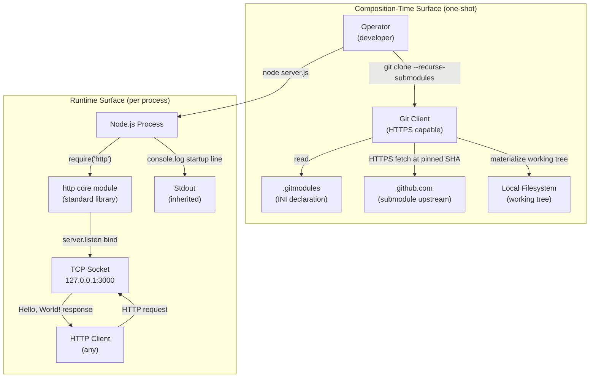

### 5.2.5 State Transition Diagrams

#### Server Lifecycle States

The Node.js process passes through a small deterministic state set. Transitions are observable but **uninstrumented** — only the `Binding → Accepting` transition emits a side effect (the stdout log line).

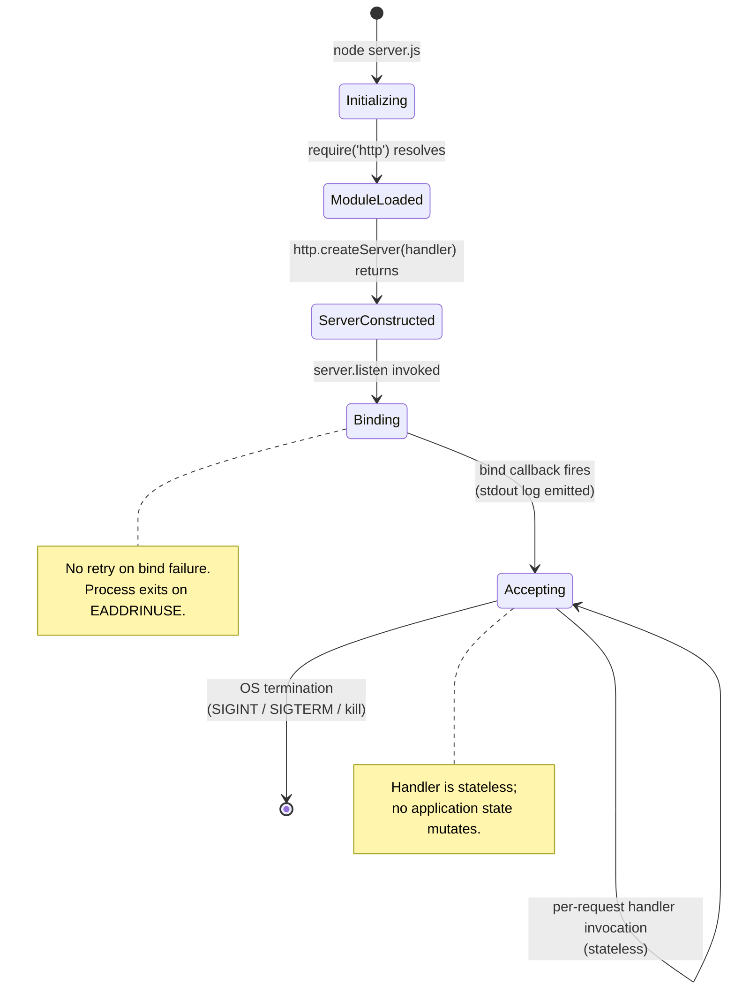

#### Submodule Working-Tree States

The submodule directory transitions through a separate state set governed by the Git client, not by application code.

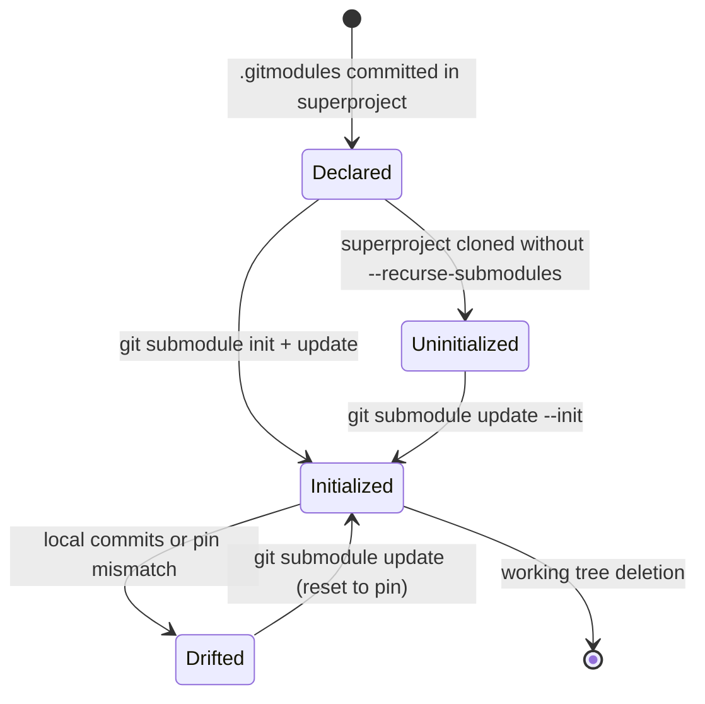

### 5.2.6 Sequence Diagrams for Key Flows

#### In-Process Runtime Sequence

The following sequence diagram captures the only runtime flow: process startup followed by the per-request response cycle.

```mermaid
sequenceDiagram
    participant Op as Operator
    participant Node as Node.js Process
    participant Http as http module
    participant Sock as OS Loopback Socket
    participant Out as Stdout
    participant Client as HTTP Client

    Op->>Node: node server.js
    Node->>Http: require('http')
    Http-->>Node: module reference
    Node->>Http: http.createServer(handler)
    Http-->>Node: server instance
    Node->>Sock: server.listen(3000, '127.0.0.1', cb)
    Sock-->>Node: bind succeeds; cb fires
    Node->>Out: console.log("Server running at http://127.0.0.1:3000/")

    loop For each inbound request
        Client->>Sock: HTTP request (any method, any path)
        Sock->>Http: parsed request
        Http->>Node: handler(req, res)
        Node->>Http: res.statusCode = 200
        Node->>Http: res.setHeader('Content-Type','text/plain')
        Node->>Http: res.end('Hello, World!\n')
        Http->>Sock: serialize response
        Sock-->>Client: 200 OK + body
    end
```

#### Composition-Time Sequence

```mermaid
sequenceDiagram
    participant Op as Operator
    participant Git as Git Client
    participant FS as Local Filesystem
    participant GH as github.com

    Op->>Git: git clone --recurse-submodules
    Git->>GH: HTTPS fetch superproject
    GH-->>Git: superproject objects + .gitmodules
    Git->>FS: write superproject working tree
    Git->>FS: read .gitmodules (path + url)
    Git->>GH: HTTPS fetch submodule at pinned SHA
    GH-->>Git: submodule objects
    Git->>FS: materialize child_repo_for_submodule_hello_world/
    Git-->>Op: clone complete; submodule initialized
```

---

## 5.3 TECHNICAL DECISIONS

### 5.3.1 Architecture Style Decisions and Tradeoffs

The dominant architectural decision is the choice of a **framework-free, zero-dependency standard-library implementation** over a typical Node.js web stack (Express, Koa, Fastify, NestJS). This decision is not an oversight; it is load-bearing relative to the system's purpose as an engineering-validation fixture.

| Decision | Rationale | Tradeoff Accepted |
|---|---|---|
| Use Node.js `http` core module instead of a framework | Maintains zero-dependency posture; `node server.js` is the only command needed to start either server | No router, no middleware pipeline, no built-in error-handling chain |
| Use CommonJS, not ESM | Avoids the need for `"type": "module"` declaration (which would require a `package.json` that the repository deliberately omits) | No `import`/`export` ergonomics; no top-level `await` |
| Hard-code all operational parameters | Eliminates the configuration-loader surface; no `process.env` references; no `.env` file format | The server cannot be reconfigured without editing source; both copies must be edited in lockstep if changed |
| Bind to `127.0.0.1` loopback only | Loopback binding is the sole network-layer security boundary, allowing cleartext HTTP to be acceptable | The server is not reachable from any other host; not deployable as a public service in this form |
| Omit `package.json`, lockfile, and `node_modules/` | Confirms zero-dependency posture and renders the install step a no-op | No supply-chain auditing tools (npm audit, dependabot) apply; no scripts hook for build/test/lint |
| Use a Git submodule rather than a vendored copy or npm dependency | Provides a deterministic fixture against which clone, init, update, and fetch workflows can be exercised; submodule pin is the integrity anchor | Operators must remember `--recurse-submodules` or run `git submodule init`/`update` separately |
| No error handling | The fixture purpose does not require resilience; default Node.js / OS behavior is sufficient | Process exits non-zero on `EADDRINUSE`, uncaught exceptions, or signals; no graceful shutdown |

Adopting a framework would require the addition of a `package.json`, a lockfile, and a `node_modules/` directory — all of which are verified absent. It would also introduce a supply-chain surface that directly contradicts the zero-dependency posture, and would add semantic surface area (routing, middleware, error pipelines) that exceeds the fixed-response functional contract.

### 5.3.2 Communication Pattern Choices

A **single synchronous HTTP request-response pattern** is the only application-layer communication mechanism. There is no asynchronous messaging, no event sourcing, no pub/sub, no RPC, no GraphQL, no WebSocket, no Server-Sent Events, and no gRPC. The handler returns immediately after invoking `res.end`; no async I/O occurs in the handler body.

At the composition layer, communication is **declarative**: `.gitmodules` is read by the Git client, which performs an HTTPS fetch. There is no programmatic API between the application and the Git layer; the binding is purely structural.

The only in-process orchestration is the `server.listen` callback that invokes `console.log`. There is no Promise chain, no `async`/`await` usage, no `EventEmitter` subscription beyond the implicit one within Node's `http` module, and no scheduled or recurring task.

### 5.3.3 Data Storage Solution Rationale

**No persistence layer exists**, and this is deliberate. The system has no domain entities, no business state, no user accounts, no audit trails, and no session data. The only durable artifact in the system is the Git object database, which is read only at composition time to retrieve the pinned submodule commit. Because no state is mutated per request, no state-transition diagram for application data can be constructed; the handler's behavior is fully described by its three unconditional literal assignments.

Adding any persistence layer (SQL, NoSQL, file-system, in-memory) would expand the system beyond its fixture role and is explicitly out of scope.

### 5.3.4 Caching Strategy Justification

**No caching strategy** is implemented at any layer. There is no HTTP cache header set beyond `Content-Type`, no `Cache-Control` directive, no ETag, no Last-Modified, no in-process LRU, no Redis or Memcached client, and no CDN integration. The rationale is purely a consequence of statelessness and determinism: every response is the identical 14-byte payload, and the handler is computationally trivial. There is no latency-sensitive path that would benefit from caching, and there is no source of truth that needs to be shielded from request volume.

### 5.3.5 Security Mechanism Selection

The system's security posture is minimal and deliberate:

| Security Mechanism | Decision | Justification |
|---|---|---|
| Network exposure | Loopback-only binding (`127.0.0.1`) | Only network-layer boundary; prevents external reachability entirely |
| Transport encryption | None — cleartext `http.createServer` (not `https.createServer`) | Acceptable only because the loopback binding eliminates external exposure |
| Authentication | None | No protected resources or user identities exist |
| Authorization | None | Same as above |
| Input validation | None | The `req` parameter is never inspected; no untrusted inputs are processed |
| Submodule integrity | HTTPS transport + commit SHA pin | Anonymous fetch is sufficient because no secrets are involved; SHA pin anchors the bytes |
| Secrets management | Not required | No credentials, API keys, or tokens are referenced anywhere in source |

The loopback binding is therefore the **sole** security control at the network layer. Cleartext HTTP is acceptable only because of that binding; if the server were ever bound to `0.0.0.0` or a non-loopback interface, the architecture would require revisiting the TLS decision.

### 5.3.6 Architecture Decision Records (Decision Tree)

The following decision tree consolidates the major architectural choices, traced from the system's purpose to the resulting commitments.

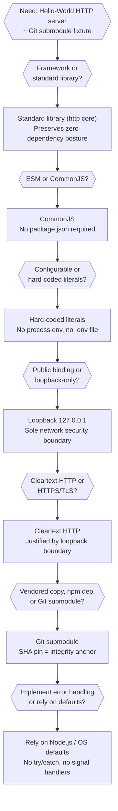

---

## 5.4 CROSS-CUTTING CONCERNS

### 5.4.1 Monitoring and Observability Approach

Production-grade observability is **absent by design**. The system has no metrics endpoints, no `/health` or `/ready` route, no Prometheus exporter, no OpenTelemetry instrumentation, no APM agent (Datadog, New Relic, Dynatrace, AppDynamics), no error-reporting SDK (Sentry, Rollbar, Bugsnag), and no distributed tracing.

The single observability primitive is the **one-shot startup log line** emitted by `console.log` inside the `server.listen` callback. Its content is hardcoded: `Server running at http://127.0.0.1:3000/`. There is no log level, no timestamp, no JSON envelope, no correlation ID, and no transport beyond the stdout file descriptor inherited from the launching shell.

| Observability Concern | Status | Detection of Issues |
|---|---|---|
| Application metrics (latency, throughput, error rate) | Not collected | External (operator must measure with curl, ab, etc.) |
| Process health | Implicit — process running implies serving | Connection-refused at client indicates process exit |
| Startup confirmation | Single stdout line on successful bind | Absence of the line indicates bind failure |
| Distributed tracing | Not applicable (single-process, no downstream calls) | N/A |
| Log aggregation | None — operator's terminal is the destination | N/A |

### 5.4.2 Logging and Tracing Strategy

No logging framework is used. There is no Winston, Pino, Bunyan, or log4js. No log rotation, no log shipping (Fluentd, Logstash, Vector), no syslog integration, and no cloud-logging client (CloudWatch, Stackdriver, Application Insights). The strategy is reduced to: **one line on startup, written to inherited stdout**.

Tracing is not implemented anywhere. There are no OpenTelemetry spans, no Zipkin/Jaeger integration, no AWS X-Ray, and no W3C `traceparent` header propagation. Because the system makes no outbound calls and has no downstream dependencies at runtime, distributed tracing has no application within this architecture.

### 5.4.3 Error Handling Patterns

The repository contains **no in-application error handling**. There are no `try/catch` blocks, no `process.on('uncaughtException')` or `process.on('unhandledRejection')` listeners, no `server.on('error', ...)` subscription, and no `server.close` orchestration. Failure-mode behavior is therefore entirely the default behavior of Node.js and the host operating system.

The following error-handling flow catalogs the failure modes that can occur, the default behavior produced in the absence of application handling, and the operator-level recovery action required.

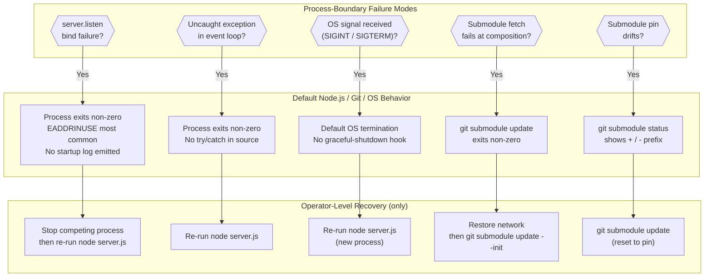

The following resilience patterns are **verifiably absent** and are not omissions in this documentation — they are the system's verified contract:

| Pattern | Status |
|---|---|
| Retry (in source) | None |
| Fallback / circuit breaker | None |
| Dead-letter queue | None |
| Health-check endpoint | None — handler serves only the fixed `Hello, World!` response |
| Graceful shutdown | None — no `server.close` orchestration |
| Application-level error logging | None — only the one-shot startup log |
| Error notification (email, webhook, pager) | None |

### 5.4.4 Authentication and Authorization Framework

No authentication framework is implemented anywhere in the system. There is no Auth0, no Okta, no AWS Cognito, no Keycloak, no Passport.js, no JWT library, no session store (express-session, connect-redis), no CSRF protection middleware, and no credential handling code.

No authorization framework is implemented either. There is no RBAC, no ABAC, no policy engine (OPA, Casbin), no scope checking, and no per-route guard.

The rationale is structural: no protected resources or untrusted inputs exist within the system. The fixed response is identical for every requester, the handler reads no part of the request, and the loopback binding ensures that only local processes can reach the listener. Authentication and authorization therefore have no application within the current scope.

### 5.4.5 Performance Requirements and SLAs

No performance requirements or SLAs are documented in the source repository. The following table enumerates each commonly-expected target and its verified status:

| Performance Target | Status |
|---|---|
| Per-request latency target | Not defined |
| Throughput target (requests per second) | Not defined |
| Startup time bound | Not defined |
| Time-to-first-byte budget | Not defined |
| Availability / uptime SLA | Not defined |
| Error-rate ceiling | Not defined |

There is no instrumentation, no metrics endpoints, no structured logging, and no tracing hooks against which throughput, latency, or error rates could be measured. Any performance commitments would need to be specified externally and added as additive scope; they are not delivered by the current artifact.

Implicit performance characteristics that follow from the architecture (without being formal commitments):

- The handler executes in O(1) work; it is dominated by socket I/O.
- Memory footprint is bounded by Node.js's `http` module overhead plus the handler closure; no in-process growth occurs per request.
- Throughput scales with a single event-loop thread; no parallelism is exploited.

### 5.4.6 Disaster Recovery Procedures

Disaster recovery is an **operator-level concern**, not an application-level concern. The repository defines no application-level recovery — there are no retry loops, no fallback URLs, no mirror configuration, no backup/restore scripts, no replication strategy, and no automated failover.

| Disaster Scenario | Recovery Procedure |
|---|---|
| Server process killed or crashed | Operator re-runs `node server.js` |
| Port `3000` occupied by a competing process | Operator stops the competing process, then re-runs `node server.js` |
| Submodule materialization fails (HTTPS to `github.com` unreachable) | Operator restores network connectivity, then re-runs `git submodule update --init` |
| Submodule pin drifts from upstream | Operator runs `git submodule update` to reset the working tree to the pinned SHA |
| Host filesystem loss | Operator re-clones the repository with `--recurse-submodules` |
| `github.com` outage during initial clone | Operator waits for upstream availability and retries the clone |

There is no defined RTO, no defined RPO, no backup schedule, no offsite-replica configuration, and no documented disaster-recovery drill. The Git superproject and its submodule are themselves the canonical recovery artifacts: any working clone is a complete, self-contained reconstruction of the runtime surface once the submodule has been initialized.

---

## 5.5 References

### 5.5.1 Files Examined

- `/server.js` — Root-level HTTP server source (15 lines, 342 bytes). Provided the complete runtime surface: CommonJS `require('http')`, hostname/port literals, three-line response handler, `server.listen` invocation with bind callback, and the single `console.log` line.
- `/.gitmodules` — Submodule declaration (4 lines, 178 bytes). Provided the submodule's logical name, local path, and upstream HTTPS URL.
- `/README.md` — Root title-only marker (45 bytes). Confirmed absence of business context, SLA commitments, or operational documentation.
- `/child_repo_for_submodule_hello_world/server.js` — Byte-identical copy of root `server.js`. Confirmed structural-only coupling between superproject and submodule HTTP servers.
- `/child_repo_for_submodule_hello_world/README.md` — Submodule title-only marker (38 bytes).
- `/child_repo_for_submodule_hello_world/.gitignore` — Empty file (0 bytes). Confirmed via filesystem inspection.

### 5.5.2 Folders Explored

- `/` (repository root) — Enumerated to confirm absence of `package.json`, `node_modules/`, `Dockerfile`, `.github/`, `tsconfig.json`, bundler configurations, `LICENSE`, lint/format configs, and IaC artifacts.
- `/child_repo_for_submodule_hello_world/` — Enumerated to confirm presence of only `server.js`, `README.md`, and `.gitignore`; no nested folders, manifests, or tooling.

### 5.5.3 Technical Specification Sections Referenced

- **1.1 Executive Summary** — Engineering-validation fixture purpose, `ep_check_` naming convention rationale.
- **1.2 System Overview** — System capabilities, two-component composition, success criteria, KPI absence.
- **1.3 Scope** — In-scope/out-of-scope enumeration; unsupported use cases; verified absences.
- **2.1 Feature Catalog** — F-001 through F-004 metadata.
- **2.2 Functional Requirements Tables** — Per-feature acceptance criteria, validation rules.
- **2.3 Feature Relationships** — In-process dependency F-001 → F-002; Git-level binding F-003 → submodule files.
- **2.4 Implementation Considerations** — Constraints, performance posture, security implications, scalability framing.
- **2.6 Assumptions and Constraints** — Documented assumptions, verified constraints.
- **3.1 Programming Languages** — JavaScript/CommonJS, Markdown, Git INI.
- **3.2 Frameworks & Libraries** — Framework-absence catalog and rationale; standard-library-only posture.
- **3.3 Open Source Dependencies** — Zero third-party dependencies.
- **3.4 Third-Party Services** — Sole external service (`github.com`, composition-time only).
- **3.5 Databases & Storage** — Persistence absence; Git object database as composition-only data store.
- **3.7 Network & Runtime Configuration** — Hard-coded parameters, security implications, integration boundaries.
- **3.8 Technology Stack Visualization** — Layered technology diagram; build-vs-runtime surface disjointness.
- **4.1 Overview of System Processes** — Process inventory, actors, boundaries.
- **4.2 High-Level System Workflow** — Two-track workflow diagram.
- **4.3 Runtime Workflow: HTTP Request/Response** — Linear startup + accept-loop; non-branching property; lifecycle state diagram.
- **4.4 Composition-Time Workflow** — Git submodule materialization flow and sequence.
- **4.5 Integration Workflows** — In-process and Git-layer integrations; verified absences.
- **4.6 State Management and Transitions** — Server lifecycle and submodule working-tree states; statelessness.
- **4.7 Error Handling and Recovery** — Verified absence of in-application error handling; failure-mode catalog; operator-level recovery.
- **4.8 Verification Workflow** — Acceptance criteria as verification, timing absences.
- **4.9 Process-Level Absences** — Consolidated catalog of verified non-applicable items.

# 6. SYSTEM COMPONENTS DESIGN

## 6.1 Core Services Architecture

### 6.1.1 Applicability Assessment

**Core Services Architecture is not applicable for this system.**

The repository under documentation does not implement a microservices architecture, a distributed-services architecture, or any decomposition into distinct service components that would necessitate the topic coverage prescribed by this section. The system is implemented as a deliberately minimal, single-process Node.js HTTP server (approximately fifteen lines of code) whose architectural shape is dictated by its purpose as an engineering-validation fixture for Git submodule workflows — not as a production-grade application.

#### 6.1.1.1 Authoritative Justification

The non-applicability finding is anchored in three converging lines of evidence from the Technical Specification:

| Evidence Pillar | Authoritative Statement | Anchoring Section |
|---|---|---|
| Architectural style | The system implements a "minimalist, standard-library-only, stateless HTTP server architecture" and is "not a distributed system, a microservice mesh, or a layered enterprise application" | Section 5.1.1 |
| Concurrency model | "Single-process, single-event-loop HTTP server with no clustering, no worker threads, and no explicit asynchronous orchestration beyond the `server.listen` callback" | Section 1.2.2 |
| Verified absences | Every microservices concern (load balancing, service discovery, retries, fallbacks, circuit breakers, dead-letter queues, health-check endpoints, graceful shutdown, error notification) is verifiably marked **None** | Sections 4.7.3, 4.9.1, 5.4.3 |

#### 6.1.1.2 Architectural Posture Statements

Four characterizations from the High-Level Architecture (Section 5.1.1) collectively rule out any services-oriented decomposition:

- **Zero-framework, zero-dependency runtime.** No `package.json`, no lockfile, no `node_modules/`. The sole runtime API surface is the Node.js standard library, accessed via a single `require('http')` call. Frameworks commonly associated with services architectures — Express, Koa, Fastify, Hapi, NestJS, Restify, Winston, Pino, Passport, JWT libraries, dotenv, convict, Joi, Zod, Sequelize, TypeORM, Prisma — are all verified absent (Section 3.2).
- **CommonJS, single-process, single-event-loop execution.** No clustering, no worker thread orchestration, no asynchronous control flow beyond the bind callback.
- **Two-track composition model with disjoint dependency surfaces.** A composition-time surface (Git client + `.gitmodules` + `github.com`) materializes the submodule; a runtime surface (Node.js + `http` + OS loopback socket) executes the HTTP listener. The two surfaces do not interact at runtime.
- **Structural (not functional) coupling between the two HTTP servers.** The superproject and submodule `server.js` files are byte-for-byte identical and share no application-layer linkage. Neither file `require`s, imports, or invokes the other.

#### 6.1.1.3 Document Convention for Non-Applicable Items

For clarity and traceability, the remainder of this section enumerates each prompt-required subtopic and explicitly marks it as non-applicable, with a citation to the anchoring evidence. This convention is consistent with the catalog established in Section 4.9.1, which treats verified absences as the system's intentional contract rather than as documentation gaps.

---

### 6.1.2 Service Components Assessment

The prompt requires coverage of service boundaries, inter-service communication, service discovery, load balancing, circuit breakers, and retry/fallback mechanisms. None of these concerns apply because no service decomposition exists.

#### 6.1.2.1 Service Boundary Analysis

The system consists of a single Node.js process that, when launched, binds an HTTP listener to `127.0.0.1:3000` and serves a fixed response for every request. There is no internal decomposition into discrete services, no module-level service abstractions, no facade or gateway layer, and no separation between application tiers. The "system boundary," per Section 5.1.1, is "two `server.js` processes + the `.gitmodules` Git binding" — and only one of those processes can execute at a time because both bind to the same loopback socket.

#### 6.1.2.2 Required Subtopic Coverage — Service Components

| Required Subtopic | Status | Evidence Anchor |
|---|---|---|
| Service boundaries and responsibilities | Not applicable — single-process script with one inline request handler | Section 5.1.1; Section 5.2.1 |
| Inter-service communication patterns | Not applicable — no asynchronous messaging, no pub/sub, no RPC, no gRPC, no WebSocket, no SSE, no GraphQL exist in the system | Section 5.1.3; Section 1.2.1 |
| Service discovery mechanisms | Not applicable — hostname `127.0.0.1` is a hard-coded loopback IPv4 literal; no DNS resolution, no service registry, no environment-based discovery | Section 1.2.2; Section 5.1.1 |
| Load balancing strategy | Not applicable — "no clustering, no PM2 / forever wrapper, no Kubernetes deployment manifest, no horizontal-scaling guidance, and no load-balancer integration in the repository" | Section 5.2.1 |
| Circuit breaker patterns | Not applicable — no resilience library is declared; zero third-party dependencies exist (no `package.json`) | Section 4.7.3; Section 3.3 |
| Retry and fallback mechanisms | Not applicable — no retry logic and no fallback logic exist in source | Section 4.7.3 |

#### 6.1.2.3 The "Two Servers" Clarification

The repository contains two `server.js` files (one at the repository root and one inside the `child_repo_for_submodule_hello_world/` submodule directory). A casual inspection might suggest a two-service architecture; the Technical Specification explicitly refutes that interpretation.

| Claim | Verified Reality |
|---|---|
| Are the two files coupled at the application layer? | No — "neither file `require`s, imports, or invokes the other" (Section 1.2.2) |
| Can the two processes run concurrently? | No — both bind to `127.0.0.1:3000`; the second invocation receives `EADDRINUSE` (Section 1.3.2 Unsupported Use Cases) |
| What relationship exists between them? | Only the structural Git binding declared in `.gitmodules` (Section 5.1.1) |
| Does this constitute two services? | No — they are byte-identical duplicates managed via Git submodule pinning, not independent services that communicate |

Consequently, even the most superficial pretext for a "two-service" treatment does not hold; the two files are duplicates of the same fixture, not collaborating microservices.

---

### 6.1.3 Scalability Design Assessment

The prompt requires coverage of horizontal/vertical scaling, auto-scaling triggers, resource allocation, performance optimization, and capacity planning. None of these concerns are addressed by the repository because scale is explicitly out of scope for the fixture.

#### 6.1.3.1 Scalability Posture in the Source Material

The Implementation Considerations table (Section 2.4.3) states the scalability posture of the primary feature unambiguously: "Single-process, single-event-loop; no clustering, no worker threads, no load balancer. Horizontal scaling is out of scope." The Component Details (Section 5.2.1) reinforce this: "Not designed for scale." No deployment artifacts that would enable scale — `Dockerfile`, `docker-compose.yml`, Kubernetes manifests, Helm charts, PM2 ecosystem files — exist anywhere in the repository (Section 1.3.2).

#### 6.1.3.2 Required Subtopic Coverage — Scalability Design

| Required Subtopic | Status | Evidence Anchor |
|---|---|---|
| Horizontal / vertical scaling approach | Not applicable — horizontal scaling is "out of scope"; vertical scaling is undefined because no resource specification exists | Section 2.4.3; Section 5.2.1 |
| Auto-scaling triggers and rules | Not applicable — no orchestration platform, no autoscaler, no triggering signal source | Section 1.3.2; Section 5.2.1 |
| Resource allocation strategy | Not applicable — no CPU/memory request or limit is declared; "memory footprint is bounded by Node.js's `http` module overhead plus the handler closure" with no in-process growth per request | Section 5.4.5 |
| Performance optimization techniques | Not applicable — "no instrumentation, no metrics endpoints, no structured logging, and no tracing hooks against which throughput, latency, or error rates could be measured" | Section 5.4.5; Section 2.4.2 |
| Capacity planning guidelines | Not applicable — every performance target is marked "Not defined" (latency, throughput, startup time, time-to-first-byte, availability SLA, error-rate ceiling) | Section 5.4.5; Section 1.2.3 |

#### 6.1.3.3 Implicit Performance Characteristics (Non-Commitments)

Section 5.4.5 enumerates three characteristics that follow structurally from the architecture but are not formal commitments. These are reproduced here as observable properties of the fixture, not as scalability guarantees:

| Characteristic | Description |
|---|---|
| Handler computational complexity | The handler executes in O(1) work and is dominated by socket I/O |
| Memory growth profile | No in-process growth occurs per request; footprint is bounded by `http` module overhead plus handler closure |
| Throughput ceiling | Throughput scales with a single event-loop thread; no parallelism is exploited |

These characteristics do not constitute capacity planning guidance. Any scaling commitment would need to be specified externally and added as an additive scope of work that is not delivered by the current artifact.

---

### 6.1.4 Resilience Patterns Assessment

The prompt requires coverage of fault tolerance, disaster recovery, data redundancy, failover, and service degradation. None of these are implemented at the application layer. Recovery, where it exists at all, is an **operator-level concern** invoked manually after process-boundary failures.

#### 6.1.4.1 Verified Absence of In-Application Resilience

Section 5.4.3 catalogs the verified absences as the system's "verified contract" — they are deliberate, not deficiencies. The repository contains "no `try/catch` blocks, no `process.on('uncaughtException')` or `process.on('unhandledRejection')` listeners, no `server.on('error', ...)` subscription, and no `server.close` orchestration." Per Section 5.4.6, disaster recovery is explicitly framed as "an operator-level concern, not an application-level concern": there are "no retry loops, no fallback URLs, no mirror configuration, no backup/restore scripts, no replication strategy, and no automated failover."

#### 6.1.4.2 Required Subtopic Coverage — Resilience Patterns

| Required Subtopic | Status | Evidence Anchor |
|---|---|---|
| Fault tolerance mechanisms | Not applicable — no `try/catch`, no signal handlers, no `server.on('error', ...)`, no graceful shutdown | Section 5.4.3; Section 4.7.1 |
| Disaster recovery procedures | Operator-level only (re-run `node server.js`); no application-level recovery exists | Section 5.4.6 |
| Data redundancy approach | Not applicable — no persistence layer, no domain entities, no business state, no user accounts, no audit trails, no session data | Section 5.1.3 |
| Failover configurations | Not applicable — "no defined RTO, no defined RPO, no backup schedule, no offsite-replica configuration, and no documented disaster-recovery drill" | Section 5.4.6 |
| Service degradation policies | Not applicable — no degradation paths; the handler unconditionally returns the same response | Section 5.4.3; Section 4.9.1 |

#### 6.1.4.3 Default Process-Boundary Failure Behavior

While application-level resilience is absent, the Node.js runtime and host operating system produce default behavior for several failure modes. The following table reproduces the authoritative catalog from Section 4.7.2. This is operator-level recovery, **not** service-architecture resilience.

| Failure Mode | Phase | Recovery |
|---|---|---|
| `EADDRINUSE` on port `3000` | Runtime (startup) | Operator stops competing process and re-runs `node server.js` |
| Missing Node.js runtime | Runtime (startup) | Operator installs Node.js |
| Submodule init fails (HTTPS unreachable) | Composition-time | Operator restores network and re-runs `git submodule update --init` |
| Submodule pin mismatch | Composition-time | Operator runs `git submodule update` to reset to pin |
| Concurrent execution of both `server.js` files | Runtime | Operator runs only one (the second receives `EADDRINUSE`) |
| HTTP client cannot reach `127.0.0.1:3000` | Runtime | Operator verifies that `node server.js` is running |

#### 6.1.4.4 Resilience Pattern Inventory (Authoritative)

The following pattern inventory is reproduced from Section 5.4.3. Every entry has been individually verified against the repository source. The rows are not omissions; they are the system's verified contract.

| Pattern | Status |
|---|---|
| Retry (in source) | None |
| Fallback / circuit breaker | None |
| Dead-letter queue | None |
| Health-check endpoint | None — handler serves only the fixed `Hello, World!` response |
| Graceful shutdown | None — no `server.close` orchestration |
| Application-level error logging | None — only the one-shot startup log |
| Error notification (email, webhook, pager) | None |

---

### 6.1.5 Architectural Diagrams Illustrating Non-Applicability

The prompt requires service interaction, scalability architecture, and resilience pattern diagrams. Because the system is not a multi-service architecture, the diagrams below illustrate the **non-applicability finding itself** rather than fabricate microservices artifacts. Each diagram is grounded in verified repository evidence and serves the same documentation purpose as the prompt's required diagrams.

#### 6.1.5.1 Diagram — Single-Process Service Boundary

This diagram shows that the entire system is **one** process boundary, with no internal service decomposition, no clustering, and no inter-service communication.

```mermaid
flowchart TB
    Client["HTTP Client<br/>(curl / browser / probe)"]

    subgraph SingleProcess["Single Node.js Process - The Entire 'Service'"]
        direction TB
        Socket["TCP Socket<br/>127.0.0.1:3000 (loopback only)"]
        EventLoop["Single Event Loop<br/>(no clustering, no workers)"]
        Handler["Inline Request Handler<br/>(always returns 200 + 'Hello, World!\n')"]
    end

    Stdout["Stdout<br/>(one startup log line)"]

    Client -->|"HTTP request (any method, any path)"| Socket
    Socket --> EventLoop
    EventLoop --> Handler
    Handler -->|"fixed response"| Socket
    Socket -->|"200 OK + body"| Client
    EventLoop -.->|"startup only"| Stdout
```

#### 6.1.5.2 Diagram — Microservices Concerns Versus Repository Reality

This diagram contrasts the prompt's required topics against the verified repository reality, making the non-applicability explicit and traceable.

```mermaid
flowchart LR
    subgraph RequiredTopics["Microservices Concerns (Prompt)"]
        direction TB
        SC["Service Components"]
        LB["Load Balancing"]
        SD["Service Discovery"]
        CB["Circuit Breakers"]
        RT["Retry / Fallback"]
        AS["Auto-Scaling"]
        FT["Fault Tolerance"]
        DR["Disaster Recovery"]
    end

    subgraph ActualReality["Repository Reality (Verified)"]
        direction TB
        OneProc["Single Node.js Process<br/>(~15-line script)"]
        ZeroDep["Zero third-party<br/>dependencies (no package.json)"]
        Loopback["Loopback-only binding<br/>127.0.0.1:3000"]
        NoHandlers["No try/catch,<br/>no signal handlers,<br/>no server.close"]
    end

    SC -.->|"N/A"| OneProc
    LB -.->|"N/A"| OneProc
    SD -.->|"N/A"| Loopback
    CB -.->|"N/A"| ZeroDep
    RT -.->|"N/A"| NoHandlers
    AS -.->|"N/A"| OneProc
    FT -.->|"N/A"| NoHandlers
    DR -.->|"N/A"| NoHandlers
```

#### 6.1.5.3 Diagram — Composition Versus Runtime (Submodule Is Not a Second Service)

This diagram clarifies that the structural Git binding between the superproject and the submodule is a **composition-time** artifact, not a runtime service relationship. Only one of the two `server.js` files can execute at a time.

```mermaid
flowchart TB
    subgraph CompositionPhase["Composition-Time (one-shot, no runtime role)"]
        direction TB
        Gitmod[".gitmodules<br/>(Git INI binding only)"]
        GH["github.com<br/>(anonymous HTTPS fetch)"]
        SHA["Pinned Commit SHA<br/>(integrity anchor)"]
    end

    subgraph RuntimePhase["Runtime (only ONE process executes at a time)"]
        direction TB
        ServerChoice["server.js (root)<br/>OR<br/>server.js (submodule)<br/>byte-identical; cannot coexist on :3000"]
        Conflict["Concurrent launch:<br/>second process fails with EADDRINUSE"]
    end

    GH -.->|"fetch at SHA"| Gitmod
    Gitmod -.->|"materialize working tree<br/>(structural only, NOT a service call)"| ServerChoice
    SHA -.-> Gitmod
    ServerChoice -.-> Conflict
```

#### 6.1.5.4 Diagram — Process-Boundary Failure Behavior (Operator-Level Recovery)

In place of a fabricated resilience-pattern diagram, this diagram reproduces (in summary form) the authoritative catalog from Section 4.7.1 showing the default Node.js / Git / OS behavior and the operator-only recovery action. No application code participates in any of these paths.

```mermaid
flowchart TB
    subgraph FailureModes["Process-Boundary Failure Modes"]
        direction TB
        FM1{{"server.listen<br/>bind failure?"}}
        FM2{{"Uncaught exception<br/>in event loop?"}}
        FM3{{"OS SIGINT / SIGTERM<br/>received?"}}
        FM4{{"Submodule fetch<br/>fails (composition)?"}}
    end

    subgraph DefaultBehavior["Default Node.js / Git / OS Behavior"]
        direction TB
        DB1["Process exits non-zero<br/>(EADDRINUSE most common)<br/>No startup log emitted"]
        DB2["Process exits non-zero<br/>No try/catch in source"]
        DB3["Default OS termination<br/>No graceful-shutdown hook"]
        DB4["git submodule update<br/>exits non-zero"]
    end

    subgraph OperatorRecovery["Operator-Level Recovery (only path)"]
        direction TB
        OR1["Stop competing process<br/>then re-run node server.js"]
        OR2["Re-run node server.js"]
        OR3["Re-run node server.js<br/>(new process)"]
        OR4["Restore network<br/>then git submodule update --init"]
    end

    FM1 -->|Yes| DB1 --> OR1
    FM2 -->|Yes| DB2 --> OR2
    FM3 -->|Yes| DB3 --> OR3
    FM4 -->|Yes| DB4 --> OR4
```

---

### 6.1.6 Cross-Reference Summary

For readers arriving at this section seeking content on a generic services-architecture concern, the following index redirects to the authoritative section of the Technical Specification that documents the absence.

| If you are looking for… | Go to… |
|---|---|
| Single-process architecture rationale | Section 5.1.1 High-Level Architecture |
| Component breakdown (the two `server.js` files and `.gitmodules`) | Section 5.2 Component Details |
| Verified absence catalog (every microservices concern marked None) | Section 4.9.1 Categorical Absence Table |
| Error handling, retry, fallback, circuit breaker absence | Section 4.7.3 Verified Absences in Error-Handling Concerns |
| Operator-level disaster recovery procedures | Section 5.4.6 Disaster Recovery Procedures |
| Performance / SLA / KPI absence | Section 5.4.5 Performance Requirements and SLAs |
| Scalability posture per feature | Section 2.4.3 Scalability Considerations |
| Why concurrent execution of both `server.js` files is unsupported | Section 1.3.2 Unsupported Use Cases |
| Loopback-only network boundary | Section 1.3.1 Implementation Boundaries |

---

### 6.1.7 Conclusion

The Core Services Architecture topic — encompassing service decomposition, inter-service communication, service discovery, load balancing, circuit breakers, retry/fallback mechanisms, horizontal/vertical scaling, auto-scaling, resource allocation, performance optimization, capacity planning, fault tolerance, disaster recovery, data redundancy, failover, and service degradation — is **not applicable** to this repository in its entirety.

The system is a single-process, single-event-loop, framework-free, zero-dependency Node.js HTTP listener bound to the loopback interface, composed alongside a byte-identical Git submodule copy through a structural `.gitmodules` declaration. It does not decompose into services, does not communicate across service boundaries, does not scale, and does not implement application-level resilience. These absences are the system's intentional contract as an engineering-validation fixture for Git submodule workflows, not deficiencies to be remediated within scope.

Per Section 4.9.2, "the absences enumerated above are not deficiencies to be remediated within scope," and per Section 1.3.2 Unsupported Use Cases, "production deployment of the HTTP server" is explicitly out of scope "given the absence of error handling, TLS, configuration, and observability." Any future requirement for a services-oriented architecture would constitute additive scope and would require a separate specification.

---

### 6.1.8 References

#### Files Examined

- `server.js` (repository root) — Verified the 15-line single-process implementation: `require('http')`, hard-coded `hostname = '127.0.0.1'`, hard-coded `port = 3000`, inline non-branching handler, and absence of `try/catch`, signal handlers, clustering, or `server.close` orchestration.
- `child_repo_for_submodule_hello_world/server.js` — Confirmed byte-for-byte identity with the root `server.js`; no `require` linkage to the parent; would conflict on `127.0.0.1:3000` if run concurrently.
- `.gitmodules` — Verified the 3-line INI declaration containing only `path` and `url` keys; no `branch`, no `update` mode, no `shallow` directive — establishing the Git-level (structural) binding, not an application-level service relationship.
- `README.md` (root) — Title-only Markdown heading; no architectural documentation present in source.
- `child_repo_for_submodule_hello_world/README.md` — Title-only Markdown heading; no architectural documentation present in source.

#### Folders Explored

- `/` (repository root, depth 0) — Enumerated all four first-order children. Confirmed absence of `package.json`, lockfiles, `node_modules/`, `Dockerfile`, `docker-compose.yml`, `kubernetes/`, `.github/`, `tests/`, `src/`, `lib/`, `services/`, and `microservices/` directories.
- `child_repo_for_submodule_hello_world/` (depth 1) — Enumerated exactly two tracked files; no nested folders, no build artifacts, no package manifest.

#### Technical Specification Sections Referenced

- Section 1.2 System Overview — Authoritative description of the two structurally separable but functionally identical components and the "no application coupling (would conflict on port 3000)" relationship.
- Section 1.2.3 Success Criteria — Verified absence of KPIs, performance targets, and SLAs.
- Section 1.3.1 In-Scope Elements — Loopback-only network boundary; declarative submodule integration only.
- Section 1.3.2 Out-of-Scope Elements — Verified absence catalog: clustering/workers/load balancing, error handling, graceful shutdown, containerization, orchestration, observability, dependency management.
- Section 2.4.2 Performance Requirements — Verified absence of all performance targets.
- Section 2.4.3 Scalability Considerations — F-001 posture: "Single-process, single-event-loop; no clustering, no worker threads, no load balancer. Horizontal scaling is out of scope."
- Section 3.2 Frameworks & Libraries — Exhaustive enumeration of absent frameworks (Express, Koa, Fastify, NestJS, Winston, Pino, Passport, JWT libraries, etc.).
- Section 4.7.1 Verified Absence of In-Application Error Handling — Anchoring evidence for the absence of `try/catch`, signal handlers, `server.on('error', ...)`, and `server.close`.
- Section 4.7.2 Failure Modes Documented at the Process Boundary — Authoritative catalog of operator-level recovery procedures.
- Section 4.7.3 Verified Absences in Error-Handling Concerns — Authoritative absence verification for retry, fallback, circuit breaker, dead-letter queue, health-check endpoint, graceful shutdown, error notification.
- Section 4.9.1 Categorical Absence Table — Consolidated catalog of microservices/distributed concerns marked "None."
- Section 4.9.2 Implications for Production Use — Authoritative framing of absences as intentional contract.
- Section 5.1.1 System Overview — Architectural style declaration: "not a distributed system, a microservice mesh, or a layered enterprise application."
- Section 5.2.1 Superproject HTTP Server — Scaling considerations: "Not designed for scale."
- Section 5.2.2 Submodule HTTP Server — Byte-identical to superproject server; no application-layer linkage.
- Section 5.2.3 Git Submodule Binding — `.gitmodules` is declarative configuration, not executable code; integrity anchor is the pinned commit SHA.
- Section 5.4.3 Error Handling Patterns — Authoritative resilience-pattern absence inventory.
- Section 5.4.5 Performance Requirements and SLAs — Verified absence of all performance/SLA/capacity targets.
- Section 5.4.6 Disaster Recovery Procedures — Operator-level recovery procedures; no RTO, no RPO, no automated failover.

## 6.2 Database Design

### 6.2.1 Applicability Assessment

**Database Design is not applicable to this system.**

The repository under documentation contains no database, no persistence layer, no caching layer, no message broker, no session store, no object storage, no filesystem state writes, and no in-process or distributed data store of any kind. The entire runtime is a fifteen-line, single-process Node.js HTTP listener whose handler returns a fixed fourteen-byte string for every request and inspects no input. Consequently, every prompt-required subtopic — schema design, data management, compliance considerations, and performance optimization — addresses a system property that this repository deliberately does not possess.

This finding is the system's intentional contract, not a documentation gap. The repository functions as an engineering-validation fixture for Git submodule workflows, and the absence of persistence is one of the boundary conditions that defines that fixture.

#### 6.2.1.1 Authoritative Justification

The non-applicability finding is anchored in four converging lines of evidence drawn from the Technical Specification. Each line is independently sufficient; together they constitute an exhaustive verification.

| Evidence Pillar | Authoritative Statement | Anchoring Section |
|---|---|---|
| Explicit declaration | "**There is no persistence layer.** ... the 'Persistence' row for every functional requirement (F-001, F-002, F-003 application persistence, F-004) is recorded as **None**." | Section 3.5.1 |
| Data domain boundary | "Data domain — No persisted data; the only 'domain' is the fixed `\"Hello, World!\\n\"` string." | Section 1.3.1; Section 5.1.1 |
| Data flow declaration | "The system has **no persistence layer**: no relational database, no key-value store, no object storage, no file-system state writes, no session store, no message broker, and no in-process or distributed cache." | Section 5.1.3 |
| Source-code verification | `server.js` (both copies, byte-identical) declares only `require('http')`; no database driver, no ORM, no `require('fs')`, no `require('redis')`, no `package.json`, and no environment-variable references for connection strings | Repository source (`server.js`, `.gitmodules`) |

#### 6.2.1.2 Architectural Posture Statements

Four characterizations from the High-Level Architecture and the Component Details collectively rule out any data-persistence concerns:

- **Zero-framework, zero-dependency runtime.** No `package.json`, no lockfile, and no `node_modules/` exist. The sole runtime API surface is the Node.js standard library accessed via a single `require('http')` call. No database driver (e.g., `pg`, `mysql2`, `mongodb`, `mongoose`, `sqlite3`, `sequelize`, `prisma`, `typeorm`, `knex`), no caching library (e.g., `redis`, `memcached`, `lru-cache`), and no message-broker client (e.g., `kafkajs`, `amqplib`, `nats`, `@aws-sdk/client-sqs`) is declared or required.
- **Stateless request handler.** The inline handler performs three unconditional operations — `res.statusCode = 200`, `res.setHeader('Content-Type', 'text/plain')`, and `res.end('Hello, World!\n')` — and never inspects `req`. No state is read, written, or transformed.
- **No filesystem state operations.** `server.js` performs zero `fs.*` calls. There are no `fs.writeFile`, `fs.appendFile`, `fs.createWriteStream`, `fs.readFile`, or `fs.readFileSync` invocations.
- **No external data integrations.** Per Section 5.2.1 "Outbound Calls": "No outbound HTTP, database, or message-bus calls." The only external integration in the entire system is composition-time anonymous HTTPS to `github.com` for submodule fetching — and this concerns Git source tree retrieval, not application data.

#### 6.2.1.3 Document Convention for Non-Applicable Items

Following the convention established in Section 4.9.1 ("Categorical Absence Table") and Section 6.1.1.3 (Core Services Architecture non-applicability template), the remainder of this section enumerates each prompt-required subtopic, marks it as non-applicable, and cites the anchoring evidence. Verified absences are treated as the system's intentional contract rather than as documentation gaps. The four prompt categories — Schema Design, Data Management, Compliance Considerations, and Performance Optimization — are addressed in turn, each with a dedicated assessment subsection, a 4-column traceability table, and an evidence-anchored prose narrative.

---

### 6.2.2 Schema Design Assessment

The prompt requires coverage of entity relationships, data models and structures, indexing strategy, partitioning approach, replication configuration, and backup architecture. None of these concerns apply because the repository defines no entities, no data models, no schemas, and no data stores against which any such structures could be designed.

#### 6.2.2.1 Posture on Persistent Data Stores

Section 3.5.1 ("Persistent Data Stores") provides an exhaustive absence catalog for every persistent-storage category that could plausibly host a schema. Every category is verified absent: there is no primary relational database (PostgreSQL, MySQL, SQL Server, Oracle), no primary document database (MongoDB, DynamoDB, Couchbase, Firestore), no key-value store (Redis as primary, etcd, ZooKeeper), no search index (Elasticsearch, OpenSearch, Solr), no time-series or metrics store (InfluxDB, Prometheus TSDB, Timestream), no graph database (Neo4j, JanusGraph, Amazon Neptune), and no object storage (Amazon S3, GCS, Azure Blob). Filesystem writes for state (`fs.writeFile*`, `fs.appendFile*`) are likewise absent — `server.js` performs zero `fs.*` calls.

#### 6.2.2.2 Required Subtopic Coverage — Schema Design

| Required Subtopic | Status | Evidence Anchor |
|---|---|---|
| Entity relationships | Not applicable — no entities exist; the runtime's only "domain" is the fixed 14-byte `Hello, World!\n` string | Section 1.3.1; Section 5.1.1 |
| Data models and structures | Not applicable — no schemas, no domain classes, no DTOs, no validation objects (no Joi/Zod), no `req` payload parsing | Section 2.2.1; Section 4.9.1 |
| Indexing strategy | Not applicable — no tables, no collections, no indexable structures, no query patterns to optimize | Section 3.5.1 |
| Partitioning approach | Not applicable — no data to partition; no sharding, no key-range distribution, no consistent-hash topology | Section 3.5.1 |
| Replication configuration | Not applicable — no data store exists to replicate; no leader/follower, no quorum, no synchronous or asynchronous replication | Section 3.5.1; Section 5.4.6 |
| Backup architecture | Not applicable — no data to back up; "no backup/restore scripts ... no replication strategy" | Section 5.4.6 |

#### 6.2.2.3 Storage Category Absence Catalog (Schema-Level Detail)

The following table reproduces and refines the storage-category catalog from Section 3.5.1 with explicit reference to schema-design artifacts that would normally accompany each category:

| Storage Category | Schema-Design Artifacts That Would Apply | Verified Status |
|---|---|---|
| Relational database | Tables, columns, foreign keys, constraints, indexes, ERD | **Absent** — no driver, no DDL, no migration tool, no ERD source |
| Document database | Collections, document shapes, JSON schemas, secondary indexes | **Absent** — no client library, no schema validator |
| Key-value / wide-column | Keysets, value encodings, TTL policies, partition keys | **Absent** — no client library, no key namespace declarations |
| Search index | Index mappings, analyzers, refresh intervals, replica counts | **Absent** — no client library, no index definitions |
| Graph database | Node/edge labels, property graphs, traversal patterns | **Absent** — no client library, no graph definitions |
| Object storage | Bucket layouts, prefix hierarchies, lifecycle rules | **Absent** — no SDK, no bucket references |
| Filesystem state | File layouts, lock files, journaling | **Absent** — zero `fs.*` calls in source |

#### 6.2.2.4 Indexes and Constraints Inventory

The prompt requires documentation of all indexes and constraints. The authoritative inventory is empty:

| Index / Constraint Class | Count | Notes |
|---|---|---|
| Primary keys | 0 | No tables or collections exist |
| Unique indexes | 0 | No tables or collections exist |
| Foreign-key constraints | 0 | No relational store exists |
| Secondary indexes (B-tree, hash) | 0 | No relational store exists |
| Composite indexes | 0 | No relational store exists |
| Full-text or geospatial indexes | 0 | No search or geospatial engine exists |
| Check constraints | 0 | No relational store exists |
| Not-null constraints | 0 | No relational store exists |

---

### 6.2.3 Data Management Assessment

The prompt requires coverage of migration procedures, versioning strategy, archival policies, data storage and retrieval mechanisms, and caching policies. None of these concerns apply because the system has no schemas to migrate, no datasets to archive, and no caches to populate or invalidate.

#### 6.2.3.1 Posture on Data Lifecycle Management

Per Section 5.2.1, the superproject HTTP server's "Data Persistence Requirements" are documented verbatim as: "None. The process is fully stateless; no data is written to disk, memory caches, or external stores." Section 3.5.2 confirms that distributed caches (Redis, Memcached), in-process caches (LRU libraries, `Map`-based caches), session stores, and message brokers (Kafka, RabbitMQ, NATS, SQS) are all verified absent. The Section 5.1.3 data-flow description further establishes that "the process holds no application state and writes nothing to disk."

#### 6.2.3.2 Required Subtopic Coverage — Data Management

| Required Subtopic | Status | Evidence Anchor |
|---|---|---|
| Migration procedures | Not applicable — no schemas to migrate; no migration tool present (no Flyway, Liquibase, Alembic, Knex migrations, Prisma Migrate, TypeORM migrations, db-migrate); no `migrations/` directory exists | Section 3.5.1 |
| Versioning strategy (schema) | Not applicable — no schema versions exist; only Git commits version source code, and the only Git-level versioned configuration is the submodule pin (Section 2.4.5) | Section 2.4.5; Section 3.5.3 |
| Archival policies | Not applicable — no historical data, no audit logs, no event logs, no time-series records, no document corpora exist to archive | Section 4.9.1 |
| Data storage and retrieval mechanisms | Not applicable — "no in-process or distributed cache"; "writes nothing to disk"; handler is non-branching and returns a literal | Section 5.1.3; Section 5.2.1 |
| Caching policies | Not applicable — "no caching layer"; no TTLs, no eviction policies, no cache-key namespaces, no invalidation strategy | Section 1.3.2; Section 3.5.2 |

#### 6.2.3.3 The Only "Versioned Data Construct" in the System

For completeness, one mutable Git-level configuration exists, but it is not application data: the submodule pin. Per Section 2.4.5 ("Maintenance for F-003"): "Submodule pin (commit SHA) is the only mutable Git-level configuration. Updating the pin requires `git submodule update --remote` followed by a parent commit." This pin is a composition-time integrity anchor, not a runtime persistence concern. It is discussed in detail in Section 6.2.7 below.

---

### 6.2.4 Compliance Considerations Assessment

The prompt requires coverage of data retention rules, backup and fault tolerance policies, privacy controls, audit mechanisms, and access controls. None of these concerns apply because no personal data is collected, no data is retained, no audit trail exists, and no authentication or authorization framework is in scope.

#### 6.2.4.1 Posture on Regulatory and Privacy Obligations

Section 5.2.1 establishes the foundational fact: the process is "fully stateless; no data is written to disk, memory caches, or external stores." Because the handler never reads `req` — Section 5.1.3 confirms "the handler never inspects `req`; there are no URL, method, header, query-string, or body branches" — no personal data, identifiers, credentials, or telemetry are ingested in the first place. Per Section 6.1.4.2, the system has "no persistence layer, no domain entities, no business state, no user accounts, no audit trails, no session data." Per Section 5.4.6, "There is no defined RTO, no defined RPO, no backup schedule, no offsite-replica configuration, and no documented disaster-recovery drill."

#### 6.2.4.2 Required Subtopic Coverage — Compliance Considerations

| Required Subtopic | Status | Evidence Anchor |
|---|---|---|
| Data retention rules | Not applicable — "fully stateless; no data is written" to any medium; no retention window can apply to data that is never persisted | Section 5.2.1; Section 5.1.3 |
| Backup and fault tolerance policies | Not applicable — "no backup/restore scripts ... no replication strategy, and no automated failover"; "no defined RTO, no defined RPO, no backup schedule" | Section 5.4.6 |
| Privacy controls | Not applicable — no personal data is collected (handler does not read `req`); no PII, PHI, financial data, or behavioral telemetry flows through the system | Section 5.1.3; Section 4.9.1 |
| Audit mechanisms | Not applicable — no audit log, no change journal, no access log (only a one-shot startup `console.log` line); "no audit trails, no session data" | Section 6.1.4.2; Section 5.4.3 |
| Access controls | Not applicable — no authentication framework, no authorization framework, no RBAC, no ABAC; handler responds identically to every caller on the loopback interface | Section 1.3.2; Section 2.4.4 |

#### 6.2.4.3 Regulatory Posture Summary

| Regulatory Domain | Applicability to This System | Rationale |
|---|---|---|
| GDPR / data subject rights | Not applicable | No personal data is collected, processed, or stored |
| HIPAA / PHI handling | Not applicable | No health information is collected, processed, or stored |
| PCI-DSS / cardholder data | Not applicable | No payment data is collected, processed, or stored |
| SOX / financial controls | Not applicable | No financial records are created or maintained |

Per Section 4.9.1, "Regulatory compliance checks: None declared in repository." These rows are not omissions; they are the consequence of the system's intentional zero-data contract.

---

### 6.2.5 Performance Optimization Assessment

The prompt requires coverage of query optimization patterns, caching strategy, connection pooling, read/write splitting, and batch processing approach. None of these concerns apply because no queries are issued, no caches exist, no database connections are opened, and no batch jobs are scheduled.

#### 6.2.5.1 Posture on Database Performance

The system has no query language in use, no result-set parsing, no prepared-statement caches, no connection pools, no read-replica routing, and no batch ingestion pipelines. Per Section 4.9.1, "Batch processing sequences: None." Per Section 1.3.2, "no caching layer." Per Section 5.2.1, "No outbound HTTP, database, or message-bus calls." The handler's computational complexity is O(1) and is dominated by socket I/O; no in-process growth occurs per request (Section 5.4.5).

#### 6.2.5.2 Required Subtopic Coverage — Performance Optimization

| Required Subtopic | Status | Evidence Anchor |
|---|---|---|
| Query optimization patterns | Not applicable — no queries exist; no SQL, no NoSQL query DSL, no Cypher, no GraphQL; handler executes O(1) work dominated by socket I/O | Section 5.4.5; Section 4.9.1 |
| Caching strategy | Not applicable — "no caching layer"; no cache-aside, no write-through, no write-behind, no read-through pattern; no TTL or invalidation logic | Section 1.3.2; Section 3.5.2 |
| Connection pooling | Not applicable — no database connections established; no pool libraries declared (no `pg-pool`, no `generic-pool`, no driver-internal pool) | Section 3.3; Section 5.2.1 |
| Read/write splitting | Not applicable — no reads, no writes against any store; only fixed in-memory response generation | Section 5.1.3; Section 5.2.1 |
| Batch processing approach | Not applicable — no batch jobs, no schedulers, no cron, no queue consumers; "Batch processing sequences: None" | Section 4.9.1; Section 3.6 |

#### 6.2.5.3 Implicit Performance Characteristics (Non-Database)

For traceability, the implicit (non-committal) performance properties that follow structurally from the architecture — and which are entirely independent of any database — are documented in Section 5.4.5 and reproduced in Section 6.1.3.3. They concern handler complexity, memory growth profile, and single-event-loop throughput ceiling. None of them constitute database-performance commitments because no database participates in the runtime path.

---

### 6.2.6 Architectural Diagrams Illustrating Non-Applicability

The prompt requires database schema diagrams, data flow diagrams, and replication architecture diagrams. Because no database, no schema, no replicated topology, and no inter-store data flow exist, the diagrams below illustrate the **non-applicability finding itself** rather than fabricate artifacts that do not exist in the repository. Each diagram is grounded in verified source evidence and the authoritative absence catalogs in Sections 3.5, 4.9, and 5.1.3.

#### 6.2.6.1 Diagram — Schema and Persistence Boundary (No Schema, No Store)

In place of an Entity-Relationship Diagram, the following diagram depicts the absence of every persistence surface that would normally host a schema. Solid arrows mark the actual runtime path; dashed arrows mark verified-absent connections to data stores that the system explicitly does not access.

```mermaid
flowchart TB
    Client["HTTP Client<br/>(curl / browser / probe)"]

    subgraph RuntimeProcess["Single Node.js Process - Stateless Runtime"]
        direction TB
        Socket["TCP Socket<br/>127.0.0.1:3000 (loopback only)"]
        Handler["Inline Request Handler<br/>(non-branching, O(1))"]
        Closure["Handler Closure<br/>(only transient memory)"]
    end

    subgraph AbsentStores["Verified Absent: Persistence and Cache Surfaces"]
        direction TB
        NoRDB[("Relational DB<br/>PostgreSQL / MySQL / Oracle")]
        NoDoc[("Document DB<br/>MongoDB / DynamoDB / Firestore")]
        NoKV[("Key-Value Store<br/>Redis / etcd / ZooKeeper")]
        NoSearch[("Search Index<br/>Elasticsearch / OpenSearch")]
        NoTS[("Time-Series Store<br/>InfluxDB / Prometheus TSDB")]
        NoGraph[("Graph DB<br/>Neo4j / Neptune")]
        NoObj[("Object Storage<br/>S3 / GCS / Azure Blob")]
        NoFS[("Filesystem State<br/>fs.writeFile* / fs.appendFile*")]
        NoCache[("Cache Layer<br/>in-process / distributed")]
        NoSession[("Session Store")]
        NoMQ[("Message Broker<br/>Kafka / RabbitMQ / NATS / SQS")]
    end

    Client -->|"HTTP request (any method, any path)"| Socket
    Socket --> Handler
    Handler --> Closure
    Handler -->|"fixed 'Hello, World!\n'"| Socket
    Socket -->|"200 OK + body"| Client

    Handler -.->|"NO driver, NO connection"| NoRDB
    Handler -.->|"NO driver, NO connection"| NoDoc
    Handler -.->|"NO client library"| NoKV
    Handler -.->|"NO client library"| NoSearch
    Handler -.->|"NO client library"| NoTS
    Handler -.->|"NO client library"| NoGraph
    Handler -.->|"NO SDK"| NoObj
    Handler -.->|"NO fs.* calls"| NoFS
    Handler -.->|"NO cache reads / writes"| NoCache
    Handler -.->|"NO session lookups"| NoSession
    Handler -.->|"NO publish / consume"| NoMQ
```

#### 6.2.6.2 Diagram — Runtime Data Flow (No Persistence Touch)

This sequence diagram shows that no point in the request-handling lifecycle reads from or writes to any persistence surface. The handler is fully closed-form: input arrives, a fixed response is emitted, and the cycle ends with no state transition anywhere.

```mermaid
sequenceDiagram
    autonumber
    participant Client as HTTP Client
    participant Socket as TCP Socket<br/>127.0.0.1:3000
    participant Handler as Inline Handler<br/>(in server.js)
    participant Persist as Any Persistence Surface

    Client->>Socket: HTTP request (any method, any path, any headers/body)
    Socket->>Handler: invoke handler(req, res)
    Note over Handler,Persist: NO read from relational DB
    Note over Handler,Persist: NO read from document DB
    Note over Handler,Persist: NO read from key-value cache
    Note over Handler,Persist: NO read from filesystem
    Note over Handler,Persist: NO message-broker consume
    Handler->>Handler: res.statusCode = 200
    Handler->>Handler: res.setHeader('Content-Type','text/plain')
    Handler->>Handler: res.end('Hello, World!\n')
    Note over Handler,Persist: NO write to relational DB
    Note over Handler,Persist: NO write to document DB
    Note over Handler,Persist: NO write to cache
    Note over Handler,Persist: NO write to filesystem
    Note over Handler,Persist: NO audit-log emission
    Note over Handler,Persist: NO message-broker publish
    Handler->>Socket: response payload (14 bytes)
    Socket->>Client: 200 OK + 'Hello, World!\n'
```

#### 6.2.6.3 Diagram — Replication Architecture (No Replication, No Failover)

In place of a primary/replica or leader/follower topology diagram, the following diagram catalogs the verified absence of every replication concept that the prompt could be expected to cover. A single Node.js process binds to the loopback interface; no second instance can coexist (both would conflict on port `3000`); and no replication or failover topology surrounds the process.

```mermaid
flowchart TB
    subgraph SingleInstance["Sole Runtime Instance"]
        direction TB
        OneProc["Node.js Process<br/>(server.js)<br/>bound to 127.0.0.1:3000"]
        EAddrInUse["Concurrent launch attempt:<br/>second process fails with EADDRINUSE"]
        OneProc -.-> EAddrInUse
    end

    subgraph AbsentTopology["Verified Absent: Replication Topology"]
        direction TB
        NoPrimary{{"NO Primary node"}}
        NoStandby{{"NO Standby / Follower"}}
        NoSync{{"NO synchronous replication"}}
        NoAsync{{"NO asynchronous replication"}}
        NoQuorum{{"NO Quorum / Consensus<br/>(no Raft, Paxos, ZAB)"}}
        NoFailover{{"NO automated failover"}}
        NoMultiAZ{{"NO multi-AZ / multi-region"}}
        NoReadReplica{{"NO read replicas /<br/>no read-write splitting"}}
    end

    subgraph AbsentTargets["Verified Absent: Recovery Targets"]
        direction TB
        NoRTO{{"NO defined RTO"}}
        NoRPO{{"NO defined RPO"}}
        NoBackup{{"NO backup schedule"}}
        NoRestore{{"NO restore procedure /<br/>no backup/restore scripts"}}
        NoDR{{"NO disaster-recovery drill"}}
    end

    OneProc -.->|"N/A"| NoPrimary
    OneProc -.->|"N/A"| NoStandby
    OneProc -.->|"N/A"| NoSync
    OneProc -.->|"N/A"| NoAsync
    OneProc -.->|"N/A"| NoQuorum
    OneProc -.->|"N/A"| NoFailover
    OneProc -.->|"N/A"| NoMultiAZ
    OneProc -.->|"N/A"| NoReadReplica
    OneProc -.->|"N/A"| NoRTO
    OneProc -.->|"N/A"| NoRPO
    OneProc -.->|"N/A"| NoBackup
    OneProc -.->|"N/A"| NoRestore
    OneProc -.->|"N/A"| NoDR
```

#### 6.2.6.4 Diagram — Git Object Database Scope (Composition-Time Only)

The repository contains exactly one data-store-like construct — the Git object database — and it participates only in composition-time materialization, never in runtime persistence. This diagram makes the boundary explicit so that no reader misinterprets the Git object database as an application persistence layer.

```mermaid
flowchart LR
    subgraph CompositionPhase["Composition-Time ONLY (one-shot)"]
        direction TB
        GH["github.com<br/>(anonymous HTTPS read)"]
        GitDB[("Git Object Database<br/>(tracked source + commit SHAs)")]
        Pin["Submodule Pin<br/>(commit SHA = integrity anchor,<br/>only mutable Git-level config)"]
        Gitmod[".gitmodules<br/>(path + url keys only)"]
    end

    subgraph RuntimePhase["Runtime (no persistence touch)"]
        direction TB
        Proc["Node.js Process<br/>(stateless, in-memory only)"]
        Loop["Single Event Loop"]
        Resp["Fixed 14-byte response<br/>'Hello, World!\n'"]
    end

    GH -.->|"fetch at SHA"| GitDB
    Pin -.-> Gitmod
    Gitmod -.-> GitDB
    GitDB -.->|"materialize working tree<br/>(NOT consulted at runtime)"| Proc
    Proc --> Loop
    Loop --> Resp
```

---

### 6.2.7 The Git Object Database Clarification

To preempt misinterpretation, the only data-store-like construct that exists anywhere in the system is the **Git object database**, and its role is strictly composition-time and out of scope for application persistence. Per Section 3.5.3, this distinction must be preserved in any reading of this section.

| Property | Authoritative Statement |
|---|---|
| Function | "Stores both repositories' tracked content and records the specific commit of the submodule to which the superproject is bound" (Section 3.5.3) |
| Integrity role | "The submodule pin is the **integrity anchor** for the composition: clones at the same parent commit always materialize the same submodule content" (Section 3.5.3 / Section 2.4.4) |
| Mutability | "Submodule pin (commit SHA) is the only mutable Git-level configuration. Updating the pin requires `git submodule update --remote` followed by a parent commit" (Section 2.4.5) |
| Scope | "No business data, user data, telemetry data, or runtime state is stored. The Git object database is a build/composition concern, not a runtime persistence layer" (Section 3.5.3) |

The Git object database is therefore **not** a database in the sense intended by this section. It is not consulted by `server.js` at runtime; it has no schema, no indexes, no queryable structure exposed to the application; and it carries no application data. Its presence does not invalidate the non-applicability finding.

---

### 6.2.8 Cross-Reference Summary

For readers arriving at this section seeking content on a generic database concern, the following index redirects to the authoritative section of the Technical Specification that documents the absence or the related design decision.

| If you are looking for… | Go to… |
|---|---|
| The primary "no persistence layer" declaration | Section 3.5.1 Persistent Data Stores |
| The cache, session, and message-broker absence catalog | Section 3.5.2 Caching, Session, and Message Broker Components |
| The Git object database (composition-layer construct) | Section 3.5.3 Git Object Database (Composition-Layer Only) |
| Data domain boundary ("no persisted data") | Section 1.3.1 Implementation Boundaries |
| Excluded persistence capability ("no caching layer") | Section 1.3.2 Out-of-Scope Elements |
| Per-feature persistence row ("None" for F-001, F-002, F-003, F-004) | Section 2.4.1 Technical Constraints |
| The runtime data-flow declaration ("writes nothing to disk") | Section 5.1.3 Data Flow Description |
| Component-level persistence requirements ("None") | Section 5.2.1 Superproject HTTP Server |
| Disaster recovery posture (no RTO, no RPO, no backup) | Section 5.4.6 Disaster Recovery Procedures |
| Data redundancy posture (no persistence, no entities) | Section 6.1.4.2 Resilience Patterns |
| Categorical absence of data persistence, caching, transactions | Section 4.9.1 Categorical Absence Table |
| Cross-reference index for persistence flow | Section 4.9.3 Cross-Reference Index |

---

### 6.2.9 Conclusion

The Database Design topic — encompassing schema design (entity relationships, data models, indexing, partitioning, replication, backup), data management (migrations, versioning, archival, storage/retrieval, caching), compliance considerations (retention, backup/fault tolerance, privacy, audit, access controls), and performance optimization (query optimization, caching, connection pooling, read/write splitting, batch processing) — is **not applicable** to this repository in its entirety.

The system is a stateless, single-process, single-event-loop Node.js HTTP listener whose handler returns a fixed string for every request and inspects no input. No database driver, ORM, cache client, session store, or message-broker library is declared. No `package.json` exists. No filesystem write operations are performed. No personal, financial, or telemetry data is collected. No replication topology, backup schedule, or recovery target is defined. These properties are intentional and constitute the system's verified contract as an engineering-validation fixture for Git submodule workflows.

Per Section 4.9.2, "the absences enumerated above are not deficiencies to be remediated within scope," and per Section 1.3.2 Unsupported Use Cases, "production deployment of the HTTP server" is explicitly out of scope "given the absence of error handling, TLS, configuration, and observability." Any future requirement for persistent data storage would constitute additive scope and would require a separate specification covering schema design, migration tooling, replication topology, backup policy, retention rules, and access controls in full.

---

### 6.2.10 References

#### Files Examined

- `server.js` (repository root) — Verified the 15-line single-process implementation: declares `require('http')` only; contains no `require('fs')`, no database driver imports (no `pg`, `mysql2`, `mongodb`, `mongoose`, `sqlite3`, `sequelize`, `prisma`, `typeorm`, `knex`), no caching libraries (no `redis`, `memcached`, `lru-cache`), and no message-broker clients (no `kafkajs`, `amqplib`, `nats`); hostname and port are hard-coded loopback literals; the inline handler performs only `res.statusCode`, `res.setHeader`, and `res.end` operations without inspecting `req`.
- `child_repo_for_submodule_hello_world/server.js` — Confirmed byte-for-byte identical to the root `server.js`; same complete absence of any database, cache, filesystem, or message-broker references; cannot run concurrently with the root server (both bind to `127.0.0.1:3000`).
- `.gitmodules` (root) — Verified the 3-line INI declaration containing only the `path` and `url` keys for the submodule; contains no database connection strings, no DSNs, no credentials; this is purely a Git submodule binding, not a persistence configuration.
- `README.md` (root) — Title-only Markdown heading; no schema documentation, no ERD references, no database guidance.
- `child_repo_for_submodule_hello_world/README.md` — Title-only Markdown heading; no schema documentation, no ERD references, no database guidance.

#### Folders Explored

- `/` (repository root, depth 0) — Enumerated all first-order children. Confirmed absence of `package.json`, lockfiles, `node_modules/`, `migrations/`, `db/`, `models/`, `schemas/`, `data/`, `prisma/`, `sequelize/`, `typeorm/`, `knex/`, SQL files (`.sql`), and any database configuration directories.
- `child_repo_for_submodule_hello_world/` (depth 1) — Enumerated exactly two tracked files; no nested database-related folders, no schema files, no migration directories.

#### Technical Specification Sections Referenced

- Section 1.2 System Overview — Confirmed the system contains only an HTTP server plus a Git submodule binding, with no external integrations beyond `github.com` at composition time only.
- Section 1.3.1 Implementation Boundaries — Provided the authoritative "no persisted data" data-domain boundary statement.
- Section 1.3.2 Out-of-Scope Elements — Enumerated database, caching, and persistence in the out-of-scope catalog; confirmed "no caching layer" and "No authentication, authorization, or session management."
- Section 2.4.1 Technical Constraints — Confirmed the per-feature "Persistence" row is "None" for F-001, F-002, F-004; F-003 references the Git object database only as "(out of scope)."
- Section 2.4.4 Security Implications — Confirmed no authentication or authorization framework that would govern access control to data.
- Section 2.4.5 Maintenance Requirements — Documented the submodule pin as the only mutable Git-level configuration.
- Section 3.5 Databases & Storage — Primary anchoring source for the non-applicability finding; provided the exhaustive absence catalog for relational, document, key-value, search, time-series, graph, and object storage; the cache/session/broker absence table; and the Git object database scope clarification.
- Section 4.9.1 Categorical Absence Table — Provided the authoritative catalog including "Data persistence points: None," "Caching requirements: None," and "Transaction boundaries: None."
- Section 4.9.2 Implications for Production Use — Established the framing of absences as the system's intentional contract.
- Section 4.9.3 Cross-Reference Index — Confirmed the routing of persistence/database queries to Section 3.5.
- Section 5.1.1 System Overview — Confirmed the "no persisted data" data domain and the four architectural posture statements.
- Section 5.1.3 Data Flow Description — Provided the authoritative "The system has no persistence layer" statement and the enumeration of every absent persistence surface.
- Section 5.2.1 Superproject HTTP Server — Confirmed component-level "Data Persistence Requirements: None" and "No outbound HTTP, database, or message-bus calls."
- Section 5.4.6 Disaster Recovery Procedures — Confirmed the absence of RTO, RPO, backup schedule, offsite replica configuration, replication strategy, automated failover, and backup/restore scripts.
- Section 6.1.4.2 Resilience Patterns — Provided the data-redundancy non-applicability statement: "no persistence layer, no domain entities, no business state, no user accounts, no audit trails, no session data."
- Section 6.1 Core Services Architecture — Provided the documentation template for non-applicability findings that this section follows.

## 6.3 Integration Architecture

### 6.3.1 Applicability Assessment

**Integration Architecture is largely not applicable for this system.** Following the convention established in Section 6.1 (Core Services Architecture) and Section 6.2 (Database Design), this section enumerates the prompt-required subtopics and marks each as non-applicable against verified repository evidence — with one narrow, explicitly-scoped exception.

The repository implements a deliberately minimal Node.js HTTP server fixture (15 lines of code) whose runtime makes no outbound network calls, exposes no machine-readable API contract, participates in no message-broker or event-bus topology, and consumes no third-party SaaS service. The only external integration anywhere in the system is the **composition-time-only** Git submodule fetch from `github.com`, which materializes the submodule working tree during `git clone --recurse-submodules` or `git submodule update --init` and is never invoked again at runtime.

These properties constitute the system's intentional contract as an engineering-validation fixture for Git submodule workflows. They are not deficiencies to be remediated within scope (per Section 4.9.2) and they are not documentation gaps to be filled with fabricated content.

#### 6.3.1.1 Authoritative Justification

The non-applicability finding is anchored in four converging lines of evidence drawn from the Technical Specification. Each line is independently sufficient; together they constitute an exhaustive verification.

| Evidence Pillar | Authoritative Statement | Anchoring Section |
|---|---|---|
| Outbound boundary | "The servers perform no outbound network calls, read no environment variables, write to no persistent store, and emit no events to any message broker." | Section 1.2.1; Section 3.4.1 |
| Inbound boundary | Loopback-only HTTP listener; no router, no middleware, no API version negotiation, no `req` inspection of any kind | Section 5.1.1; Section 5.1.3 |
| Communication patterns | "no asynchronous messaging, no event sourcing, no pub/sub, no RPC, no GraphQL, no WebSocket, no Server-Sent Events, and no gRPC" | Section 5.3.2 |
| Verified absences | Every integration concern (outbound API calls, broker/event bus, batch, webhooks, service discovery) is verifiably marked **None** | Section 4.5.3; Section 4.9.1 |

#### 6.3.1.2 Architectural Posture Statements

Four characterizations from the High-Level Architecture (Section 5.1.1) collectively define the system's integration boundary:

- **Zero-framework, zero-dependency runtime.** Neither `server.js` declares or consumes any third-party package. The sole runtime API surface is the Node.js standard library, accessed via a single `require('http')` call. There is no `package.json`, no lockfile, and no `node_modules/` directory — and therefore no API gateway client, no HTTP client library (e.g., `axios`, `got`, `node-fetch`), no message-broker client (e.g., `kafkajs`, `amqplib`, `nats`), no authentication middleware, and no observability SDK is present.
- **Two-track composition model with disjoint dependency surfaces.** A composition-time surface (Git client + `.gitmodules` + `github.com`) materializes the submodule on the local filesystem; a runtime surface (Node.js + `http` core module + OS loopback socket) executes the HTTP listener. Once the submodule has been materialized, runtime operation requires no network reachability beyond the loopback interface.
- **Structural (not functional) coupling between the two HTTP servers.** The superproject `server.js` and the submodule `server.js` are byte-for-byte identical and share no application-layer linkage. Neither file `require`s, imports, or invokes the other; their relationship exists exclusively at the Git layer through the `.gitmodules` declaration.
- **Loopback binding is the sole network-layer security boundary.** Per Section 5.3.5, "Loopback binding is therefore the **sole** security control at the network layer. Cleartext HTTP is acceptable only because of that binding." Consequently, every API-security concern (TLS, authentication, authorization, rate limiting, CORS) is structurally moot rather than implemented at the application layer.

#### 6.3.1.3 Document Convention for Non-Applicable Items

For clarity and traceability, the remainder of this section enumerates each prompt-required subtopic under three primary categories — API Design, Message Processing, and External Systems — and explicitly marks each as non-applicable, with a citation to the anchoring evidence. The single exception (composition-time `github.com` integration) is documented in its own dedicated subsection so that readers understand its narrow temporal phase and its non-runtime nature. This convention is consistent with the catalog established in Section 4.9.1 and the documentation templates already applied in Sections 6.1 and 6.2.

---

### 6.3.2 API Design Assessment

The prompt requires coverage of protocol specifications, authentication methods, authorization framework, rate limiting strategy, versioning approach, and documentation standards. With one structural exception — the loopback HTTP listener that exists as the system's only inbound surface — none of these concerns are present in the repository.

#### 6.3.2.1 The Only Inbound API Surface

A single inbound network surface exists. It is a loopback-only HTTP listener that exposes no formal API contract, parses no input, supports no versioning, and enforces no security policy beyond the OS-level loopback binding.

| Attribute | Verified Value | Source |
|---|---|---|
| Protocol | HTTP/1.x cleartext (via `http.createServer`, **not** `https.createServer`) | `server.js`; Section 5.3.5 |
| Bind address | `127.0.0.1` (loopback IPv4 literal, hard-coded) | `server.js`; Section 5.1.1 |
| Bind port | `3000` (hard-coded literal) | `server.js`; Section 5.1.1 |
| HTTP methods accepted | All — the handler never inspects `req.method` | Section 4.9.1; Section 5.1.3 |
| URL paths accepted | All — the handler never inspects `req.url` | Section 4.9.1; Section 5.1.3 |
| Request body / query / header parsing | None — "the handler never inspects `req`" | Section 5.1.3 |
| Response status | `200 OK` (unconditional) | `server.js`; Section 4.3 |
| Response headers | `Content-Type: text/plain` only | `server.js` |
| Response body | Fixed 14-byte literal `Hello, World!\n` | `server.js`; Section 5.1.1 |

This surface is **not an API** in any product-engineering sense: it has no resource model, no method semantics, no schema, no input contract, no error contract, and no version identifier. It is a fixed-response endpoint that exists solely to make the process observable as "running."

#### 6.3.2.2 Required Subtopic Coverage — API Design

Each item listed by the prompt is enumerated and anchored to the spec evidence that confirms its absence. The presence column reflects what is present in source; the anchor column traces each finding to a section that documents the broader rationale.

| Required Subtopic | Status | Evidence Anchor |
|---|---|---|
| Protocol specification (REST / GraphQL / gRPC / SOAP / OpenAPI / AsyncAPI) | Not applicable — no resource model, no GraphQL schema, no `.proto` file, no OpenAPI/Swagger spec; only an unconditional 200 OK on every request | Section 5.3.2; Section 5.1.3 |
| Authentication methods | Not applicable — no Auth0, Okta, Cognito, Firebase Auth, Passport.js, JWT library, OAuth client, or session store; "No authentication, authorization, TLS, or input validation is present because no protected resources or untrusted inputs exist" | Section 3.4.3; Section 5.3.5 |
| Authorization framework | Not applicable — no RBAC, ABAC, scope checking, per-route guard, or policy engine; handler responds identically to every caller on the loopback interface | Section 5.3.5; Section 6.1.4.2 |
| Rate limiting strategy | Not applicable — no rate-limit middleware (no token bucket, no leaky bucket, no Redis-backed counter); no `package.json` and therefore no rate-limit library declared | Section 3.3; Section 4.9.1 |
| Versioning approach | Not applicable — no URL versioning (no `/v1/`, `/v2/`), no `Accept-Version` header parsing, no media-type versioning, no content negotiation; the handler ignores all request elements | Section 5.1.3; Section 4.9.1 |
| Documentation standards (OpenAPI / Swagger / AsyncAPI / JSON Schema) | Not applicable — no schema files (`.yaml`, `.json`, `.graphql`, `.proto`), no API documentation generators (Redoc, Stoplight, Swagger UI), no documentation directory | Section 3.6.2; Repository source |
| Input validation (Joi / Zod / Ajv / express-validator) | Not applicable — `req` is never inspected; no validation library is declared | Section 5.1.3; Section 4.9.1 |
| TLS / HTTPS termination | Not applicable — uses `http.createServer`, not `https.createServer`; no certificate, no key file, no TLS configuration | Section 5.3.5 |
| CORS configuration | Not applicable — no `Access-Control-Allow-*` headers are set; only `Content-Type` is emitted | Section 5.3.4; Section 5.1.1 |
| Cache-Control / ETag / Last-Modified | Not applicable — "no HTTP cache header set beyond `Content-Type`, no `Cache-Control` directive, no ETag, no Last-Modified" | Section 5.3.4 |
| API gateway client (Kong / Apigee / AWS API Gateway) | Not applicable — loopback-only binding precludes gateway interposition | Section 3.4.1 |

#### 6.3.2.3 Network Boundary as the Sole Security Control

Per Section 5.3.5, the loopback binding is the **sole** security control at the network layer. Cleartext HTTP is acceptable only because the server is bound exclusively to `127.0.0.1`, making it unreachable from any external host. This single control structurally subsumes the roles that authentication, authorization, rate limiting, TLS termination, and CORS would otherwise play; their absence is therefore intentional, not accidental. Section 5.3.5 makes the conditionality explicit: "if the server were ever bound to `0.0.0.0` or a non-loopback interface, the architecture would require revisiting the TLS decision."

---

### 6.3.3 Message Processing Assessment

The prompt requires coverage of event processing patterns, message queue architecture, stream processing design, batch processing flows, and error handling strategy. None of these concerns apply because the system has no asynchronous communication channel of any kind.

#### 6.3.3.1 Posture on Asynchronous Communication

Per Section 5.3.2, "There is no asynchronous messaging, no event sourcing, no pub/sub, no RPC, no GraphQL, no WebSocket, no Server-Sent Events, and no gRPC." Per Section 1.2.1, the servers "emit no events to any message broker." Per Section 4.5.3, batch and scheduled jobs are **None** and webhooks (in or out) are **None**. The handler "returns immediately after invoking `res.end`; no async I/O occurs in the handler body" (Section 5.3.2). The only in-process orchestration is the `server.listen` callback that invokes `console.log` — a one-shot startup log emission, not an integration message.

#### 6.3.3.2 Required Subtopic Coverage — Message Processing

| Required Subtopic | Status | Evidence Anchor |
|---|---|---|
| Event processing patterns | Not applicable — no `EventEmitter` subscriptions beyond Node's internal `http` module; no event sourcing, no CQRS, no event store | Section 5.3.2; Section 4.9.1 |
| Message queue architecture (Kafka / RabbitMQ / SQS / Pub/Sub / NATS) | Not applicable — no broker client library declared; no `package.json` to host such a dependency | Section 3.4.1; Section 3.5.2 |
| Stream processing design (Kafka Streams / Spark Streaming / Flink / Node streams) | Not applicable — no streaming framework; no Node.js `stream` pipeline construction in source | Section 1.2.1; Section 5.3.2 |
| Batch processing flows | Not applicable — no cron, no scheduled jobs, no queue consumers, no ETL pipelines; "Batch processing sequences: None" | Section 4.9.1; Section 3.6 |
| Error handling strategy (in-process) | Not applicable — "no `try/catch` blocks, no `process.on('uncaughtException')` or `process.on('unhandledRejection')` listeners, no `server.on('error', ...)` subscription, and no `server.close` orchestration" | Section 5.4.3; Section 4.7.1 |
| Dead-letter queue | Not applicable — no message channel exists to fail | Section 4.7.3; Section 6.1.4.4 |
| Webhook publishers | Not applicable — no outbound HTTP client library; no webhook configuration | Section 4.5.3 |
| Webhook receivers | Not applicable — handler is non-branching and parses no payloads | Section 4.5.3; Section 5.1.3 |
| Pub/sub patterns | Not applicable — no broker, no topic abstractions | Section 5.3.2 |
| WebSocket / Server-Sent Events | Not applicable — no `ws` library, no `EventSource` support, no upgrade-handler registration | Section 5.3.2 |
| Async/await orchestration | Not applicable beyond `server.listen` callback — "no Promise chain, no `async`/`await` usage, no `EventEmitter` subscription beyond the implicit one within Node's `http` module, and no scheduled or recurring task" | Section 5.3.2 |

#### 6.3.3.3 The Only In-Process "Integration"

Per Section 4.5.1, the only application-layer integration in the entire system is the **in-process** binding between the HTTP server (F-001) and the startup log (F-002), mechanized via the Node.js `server.listen` callback. This is a single, one-shot, in-memory function invocation — not external messaging, not asynchronous communication, and not an integration with any external system. It is documented here for completeness and rendered in the sequence diagram in Section 6.3.5.2.

---

### 6.3.4 External Systems Assessment

The prompt requires coverage of third-party integration patterns, legacy system interfaces, API gateway configuration, and external service contracts. With a single composition-time exception, none of these concerns apply.

#### 6.3.4.1 The Sole External Integration: github.com (Composition-Time Only)

A single external system participates in the repository's lifecycle, but **only at composition time** (i.e., during `git clone --recurse-submodules` or `git submodule update --init`), never at runtime. Per Section 3.4.2, this integration is bounded as follows:

| Attribute | Value | Source |
|---|---|---|
| External system | `github.com` (origin host for the submodule's upstream Git repository) | `.gitmodules` `url` key |
| Integration phase | **Composition-time only**; never invoked at runtime | Section 3.4.2; Section 5.1.4 |
| Protocol | HTTPS (Git wire protocol over HTTPS) | URL scheme in `.gitmodules` |
| Full URL | `https://github.com/lakshya-blitzy/child_repo_for_submodule_hello_world.git` | `.gitmodules` line 3 |
| Authentication | Anonymous HTTPS (public-read access); no credentials embedded | Section 3.4.2; Section 2.4.4 |
| Integrity anchor | Submodule pin (commit SHA recorded in the superproject's tree) | Section 4.4.4; Section 5.1.4 |
| Invocation frequency | Once per fresh clone (one-shot) | Section 3.4.2 |
| Runtime impact | None — runtime track is fully offline once materialized | Section 5.1.1; Section 4.2 |
| Data direction | One-way fetch of submodule Git objects | Section 5.1.4 |
| SLA / availability target | None defined; no SLA, no error budget, no timing constraint | Section 5.1.4 |
| Recovery on failure | Operator-level: restore network, re-run `git submodule update --init` | Section 4.4.3; Section 4.7.2 |

The integration is **declarative**, not programmatic: `.gitmodules` is read by the Git client itself; no application code in this repository invokes any Git library, opens any HTTPS connection, or processes any response. The contract is enforced by the Git client and anchored by the submodule's pinned commit SHA in the superproject's tree object.

#### 6.3.4.2 Required Subtopic Coverage — External Systems

| Required Subtopic | Status | Evidence Anchor |
|---|---|---|
| Third-party API integration (runtime) | Not applicable at runtime; only composition-time `github.com` fetch via Git wire protocol | Section 3.4.1; Section 3.4.2 |
| Legacy system interfaces | Not applicable — no legacy system is referenced anywhere in the repository; no message-shape adapters, no protocol translators, no anti-corruption layer | Section 1.2.1; Repository source |
| API gateway configuration (Kong / Apigee / AWS API Gateway / Envoy) | Not applicable — loopback-only binding precludes edge interposition; no gateway client, no upstream registration | Section 3.4.1; Section 5.3.5 |
| External service contracts (OpenAPI / Swagger / AsyncAPI / JSON Schema / Avro / Protobuf) | Not applicable — no schema files exist anywhere in the repository | Section 3.6.2; Repository source |
| Service discovery (Consul / etcd / DNS-SD / Kubernetes Service) | Not applicable — hostname is the hard-coded loopback IPv4 literal `127.0.0.1`; no DNS resolution path is exercised at runtime | Section 6.1.2.2; Section 5.1.1 |
| Load balancer integration (NGINX / HAProxy / ELB / ALB) | Not applicable — single process, single socket, no upstream pool concept | Section 5.2; Section 6.1.2.2 |
| CDN integration (Cloudflare / Fastly / CloudFront) | Not applicable — loopback-only binding precludes edge interposition | Section 3.4.1 |
| Identity providers / SSO (Auth0 / Okta / Cognito / Firebase Auth) | Not applicable — no protected resources or user identities exist | Section 3.4.1; Section 3.4.3 |
| Monitoring / APM (Datadog / New Relic / Sentry / Honeycomb) | Not applicable — no instrumentation, no metrics endpoints, no APM agent | Section 3.4.1; Section 3.4.3 |
| Log aggregation (Splunk / ELK / Loki / CloudWatch Logs) | Not applicable — only one `console.log` line to inherited stdout; no log shipping layer | Section 3.4.1 |
| Feature flag services (LaunchDarkly / ConfigCat / Unleash) | Not applicable — no `process.env` references, no remote config client | Section 3.4.1 |
| Email / SMS / notification services (SendGrid / Twilio / SES / Pub/Sub) | Not applicable — no outbound communication channel of any kind | Section 3.4.1 |
| Cloud platform integration (AWS / GCP / Azure SDKs) | Not applicable — no SDK imports, no platform-specific configuration, no IaC artifacts | Section 3.4.1; Section 3.4.3 |
| Outbound HTTP / REST calls | Not applicable — "perform no outbound network calls" | Section 1.2.1 |
| RPC clients (gRPC / Thrift) | Not applicable — no RPC libraries declared | Section 5.3.2 |
| Database connections (any) | Not applicable — "No outbound HTTP, database, or message-bus calls" | Section 5.2.1; Section 6.2 |

#### 6.3.4.3 Why `.gitmodules` Is Not a Runtime External Service Contract

A potential reader confusion is whether the `.gitmodules` declaration constitutes an "external service contract." The Technical Specification disambiguates this clearly:

- **Phase.** Per Section 3.4.2, the `github.com` interaction is invoked only at `git submodule init`/`update`; per Section 5.1.1, "Once the submodule has been materialized, runtime operation requires no network reachability."
- **Actor.** The Git client (not application code) executes the fetch. Per Section 5.3.2, "At the composition layer, communication is **declarative**: `.gitmodules` is read by the Git client, which performs an HTTPS fetch. There is no programmatic API between the application and the Git layer; the binding is purely structural."
- **Contract shape.** `.gitmodules` declares only `path` and `url` (no `branch`, no `update`, no `shallow`). It is not a service contract; it is a Git submodule configuration record.

The `github.com` integration is therefore documented here for completeness and traceability, but it is explicitly out of the runtime integration scope.

---

### 6.3.5 Integration Architecture Diagrams

The prompt requires integration flow diagrams, API architecture diagrams, and message flow diagrams. Because the system is intentionally minimal at the integration layer, the diagrams below are constructed to illustrate the **non-applicability finding itself** alongside the one real integration (composition-time GitHub fetch) and the one in-process flow (HTTP server bind + startup log). Each diagram is grounded in verified evidence from the spec; no diagram fabricates integration topology that does not exist in the source.

#### 6.3.5.1 Diagram — Integration Surface vs. Verified-Absent Integrations

This flowchart contrasts the system's actual integration surface (solid arrows: loopback socket, stdout, composition-time GitHub fetch) against the verified-absent runtime integrations (dashed arrows: databases, brokers, gateways, identity providers, APM, CDNs, cloud platforms).

```mermaid
flowchart TB
    Client["HTTP Client<br/>(curl / browser / probe)"]
    Operator["Operator<br/>(at composition-time only)"]

    subgraph RuntimeProcess["Runtime: Single Node.js Process"]
        direction TB
        Socket["TCP Socket<br/>127.0.0.1:3000<br/>(loopback only)"]
        Handler["Inline Request Handler<br/>(non-branching, O(1))"]
        Stdout["Process stdout<br/>(one-shot startup log)"]
    end

    subgraph CompTime["Composition-Time ONLY"]
        direction TB
        GitClient["Git Client<br/>(operator-invoked)"]
        Gitmod[".gitmodules<br/>(path + url keys only)"]
        GitHub["github.com<br/>(anonymous HTTPS)"]
    end

    subgraph AbsentRuntime["Verified Absent: Runtime External Systems"]
        direction TB
        NoDB[("Databases<br/>Postgres / Mongo / Redis / etc.")]
        NoMQ[("Message Brokers<br/>Kafka / RabbitMQ / SQS / NATS")]
        NoIdP[("Identity Providers<br/>Auth0 / Okta / Cognito")]
        NoAPM[("APM / Observability<br/>Datadog / New Relic / Sentry")]
        NoGW[("API Gateways / CDNs<br/>Kong / Apigee / Cloudflare")]
        NoCloud[("Cloud Platform SDKs<br/>AWS / GCP / Azure")]
        NoOutHTTP[("Outbound HTTP<br/>third-party REST APIs")]
    end

    Client -->|"HTTP (any method, any path)"| Socket
    Socket --> Handler
    Handler -->|"200 OK + 14 bytes"| Socket
    Socket -->|"response"| Client
    Handler -.->|"startup only"| Stdout

    Operator -.->|"git clone --recurse-submodules<br/>(one-shot)"| GitClient
    GitClient -.->|"read"| Gitmod
    GitClient -.->|"HTTPS fetch at pinned SHA"| GitHub

    Handler -.->|"NO calls"| NoDB
    Handler -.->|"NO publish / consume"| NoMQ
    Handler -.->|"NO authn / authz"| NoIdP
    Handler -.->|"NO instrumentation"| NoAPM
    Handler -.->|"NO gateway / edge"| NoGW
    Handler -.->|"NO SDK"| NoCloud
    Handler -.->|"NO outbound HTTP"| NoOutHTTP
```

#### 6.3.5.2 Diagram — In-Process Integration Sequence (HTTP Server ↔ Startup Log)

This sequence diagram, reproduced from Section 4.5.1, renders the only application-layer integration in the system: the `server.listen` callback that triggers the one-shot startup log. It involves no external systems, no message bus, and no asynchronous channel — only the Node.js process, the `http` core module, the OS TCP stack, and stdout.

```mermaid
sequenceDiagram
    autonumber
    participant Node as Node.js Process
    participant Http as http core module
    participant OS as OS (TCP stack)
    participant Stdout

    Node->>Http: require('http')
    Http-->>Node: http module object
    Node->>Http: http.createServer(handler)
    Http-->>Node: server instance
    Node->>Http: server.listen(3000, '127.0.0.1', cb)
    Http->>OS: bind TCP socket 127.0.0.1:3000
    OS-->>Http: bind ok (LISTEN state)
    Http->>Node: invoke cb (listen callback)
    Node->>Stdout: console.log('Server running at http://127.0.0.1:3000/')
```

#### 6.3.5.3 Diagram — Composition-Time External Integration Sequence (github.com)

This sequence diagram, reproduced from Section 4.4.2, renders the only external integration in the entire system. It involves `github.com` strictly during the composition-time materialization of the Git submodule — never at runtime.

```mermaid
sequenceDiagram
    autonumber
    actor Operator
    participant GitClient as Git Client
    participant FS as Local Filesystem
    participant GitHub as github.com<br/>(HTTPS, anonymous)

    Operator->>GitClient: git clone --recurse-submodules <url><br/>(or git clone + submodule init/update)
    GitClient->>GitHub: HTTPS fetch superproject
    GitHub-->>GitClient: superproject objects + .gitmodules
    GitClient->>FS: write superproject working tree<br/>(server.js, README.md, .gitmodules)
    Note over GitClient: Read .gitmodules:<br/>name=child_repo_for_submodule_hello_world<br/>path=child_repo_for_submodule_hello_world<br/>url=https://github.com/.../...git
    GitClient->>GitHub: HTTPS fetch submodule<br/>at pinned commit SHA
    GitHub-->>GitClient: submodule objects (pinned)
    GitClient->>FS: write submodule working tree
    GitClient-->>Operator: completion (exit 0)
    Operator->>GitClient: git submodule status
    GitClient-->>Operator: clean status (no +/- prefix)
```

#### 6.3.5.4 Diagram — API Design Concerns vs. Repository Reality

This flowchart maps each prompt-required API design topic to its anchoring evidence of non-applicability. The mapping is one-way: prompt topics on the left, repository realities on the right.

```mermaid
flowchart LR
    subgraph PromptTopics["API Design Concerns (Prompt)"]
        direction TB
        Proto["Protocol Specification<br/>(REST/GraphQL/gRPC)"]
        Authn["Authentication"]
        Authz["Authorization"]
        Rate["Rate Limiting"]
        Ver["Versioning"]
        Doc["API Documentation<br/>(OpenAPI/AsyncAPI)"]
        TLS["TLS / HTTPS"]
        Val["Input Validation"]
        CORS["CORS"]
    end

    subgraph Reality["Repository Reality (Verified)"]
        direction TB
        NoSchema["No schema files,<br/>no OpenAPI / Swagger /<br/>GraphQL / proto"]
        NoPkg["No package.json,<br/>no authn / authz library,<br/>no rate-limit middleware"]
        Loopback["Loopback-only binding<br/>(127.0.0.1) is the<br/>sole security control"]
        NonBranching["Non-branching handler:<br/>req is never inspected;<br/>no req.method / req.url /<br/>req.headers / req.body read"]
        Cleartext["http.createServer used<br/>(NOT https.createServer)"]
    end

    Proto -.->|"N/A"| NoSchema
    Doc -.->|"N/A"| NoSchema
    Ver -.->|"N/A"| NonBranching
    Val -.->|"N/A"| NonBranching
    Authn -.->|"N/A"| Loopback
    Authz -.->|"N/A"| Loopback
    Rate -.->|"N/A"| NoPkg
    CORS -.->|"N/A"| NonBranching
    TLS -.->|"N/A"| Cleartext
```

#### 6.3.5.5 Diagram — Message Processing Absence Map

In place of a message flow diagram, this flowchart enumerates the verified-absent message processing surfaces and anchors each to the architectural property that excludes it.

```mermaid
flowchart TB
    subgraph SingleProcess["Single Node.js Process (the entire runtime)"]
        direction TB
        Loop["Single Event Loop<br/>(no clustering, no workers)"]
        Sync["Synchronous Handler<br/>(no async/await, no Promises)"]
        OneShot["One-shot console.log<br/>(startup only)"]
    end

    subgraph AbsentMessaging["Verified Absent: Message Processing Surfaces"]
        direction TB
        NoEvent{{"NO Event Sourcing /<br/>NO CQRS"}}
        NoBroker{{"NO Message Broker Client<br/>(no kafkajs / amqplib / nats / SQS)"}}
        NoStream{{"NO Stream Processing<br/>(no Kafka Streams /<br/>no Spark / no Flink)"}}
        NoBatch{{"NO Batch Jobs<br/>(no cron, no scheduler,<br/>no queue consumer)"}}
        NoDLQ{{"NO Dead-Letter Queue"}}
        NoWebhook{{"NO Webhook In/Out"}}
        NoWS{{"NO WebSocket / SSE"}}
        NoErrHandle{{"NO try/catch /<br/>NO process.on uncaughtException /<br/>NO server.on('error')"}}
    end

    Loop -.->|"N/A"| NoEvent
    Sync -.->|"N/A"| NoBroker
    Loop -.->|"N/A"| NoStream
    OneShot -.->|"N/A"| NoBatch
    Sync -.->|"N/A"| NoDLQ
    Sync -.->|"N/A"| NoWebhook
    Loop -.->|"N/A"| NoWS
    Sync -.->|"N/A"| NoErrHandle
```

---

### 6.3.6 External Dependencies Catalog

The prompt requires documentation of all external dependencies. The authoritative catalog consists of a single composition-time dependency and an exhaustive enumeration of verified-absent runtime dependencies. This table consolidates the catalog from Section 3.4 and Section 4.5.3.

#### 6.3.6.1 Composition-Time Dependencies (Present)

| Dependency | Phase | Authentication | Failure Mode |
|---|---|---|---|
| `github.com` (HTTPS, anonymous) — submodule remote | Composition-time only | Anonymous public read; no credentials | Operator restores network, re-runs `git submodule update --init` |
| Git client (operator-side tool) — submodule resolver | Composition-time only | n/a | Operator installs/updates Git |
| Node.js runtime (operator-side) — runs `server.js` | Runtime startup | n/a | Operator installs Node.js |
| OS loopback interface — provides `127.0.0.1` binding | Runtime | n/a | `EADDRINUSE` on port `3000` if conflicting process is running |

#### 6.3.6.2 Runtime External Dependencies (Verified Absent)

| Dependency Category | Status | Anchoring Evidence |
|---|---|---|
| Outbound HTTP / REST APIs | None | Section 1.2.1; Section 3.4.1 |
| Message brokers / event buses | None | Section 1.2.1; Section 3.4.1 |
| Databases / caches / session stores | None | Section 3.5; Section 6.2 |
| Identity providers / SSO | None | Section 3.4.1; Section 3.4.3 |
| API gateways / edge proxies / CDNs | None | Section 3.4.1 |
| Monitoring / APM / log aggregators | None | Section 3.4.1; Section 3.4.3 |
| Feature flag / remote config services | None | Section 3.4.1 |
| Cloud platform SDKs (AWS / GCP / Azure) | None | Section 3.4.1; Section 3.4.3 |
| Email / SMS / notification services | None | Section 3.4.1 |
| Service discovery / DNS | None | Section 4.5.3; Section 5.1.1 |
| RPC clients (gRPC / Thrift) | None | Section 5.3.2 |
| Webhook senders / receivers | None | Section 4.5.3 |

---

### 6.3.7 Cross-Reference Summary

For readers arriving at this section seeking content on a generic integration architecture concern, the following index redirects to the authoritative section of the Technical Specification that documents the absence or the related design decision.

| If you are looking for… | Go to… |
|---|---|
| Runtime third-party services (absence catalog) | Section 3.4.1 Runtime External Services |
| Composition-time GitHub integration | Section 3.4.2 Composition-Time External Service: GitHub.com |
| Authentication / monitoring / cloud service absence | Section 3.4.3 Authentication, Monitoring, and Cloud-Platform Services |
| In-process integration sequence (server.listen → console.log) | Section 4.5.1 In-Process Integration |
| Git-layer integration (structural, not functional) | Section 4.5.2 Git-Layer Integration |
| Verified absences of runtime integrations | Section 4.5.3 Verified Absences |
| Composition-time materialization sequence (the only external flow) | Section 4.4.2 Materialization Sequence Diagram |
| Categorical absence table (every integration concern marked None) | Section 4.9.1 Categorical Absence Table |
| Communication pattern decisions (no async, no pub/sub, no RPC) | Section 5.3.2 Communication Pattern Choices |
| Security mechanism selection (loopback as sole control) | Section 5.3.5 Security Mechanism Selection |
| External integration points (single row: github.com) | Section 5.1.4 External Integration Points |
| Why service decomposition does not apply | Section 6.1 Core Services Architecture |
| Why persistence (and any data-layer integration) does not apply | Section 6.2 Database Design |
| Cross-reference index for integration flow queries | Section 4.9.3 Cross-Reference Index |

---

### 6.3.8 Conclusion

The Integration Architecture topic — encompassing API design (protocol, authentication, authorization, rate limiting, versioning, documentation), message processing (event patterns, message queues, stream processing, batch flows, error handling), and external systems (third-party integration, legacy interfaces, API gateways, service contracts) — is **largely not applicable** to this repository, with one explicit and narrowly-scoped exception: the composition-time-only `github.com` Git submodule fetch documented in Section 6.3.4.1.

The runtime is a single-process, single-event-loop, framework-free, zero-dependency Node.js HTTP listener bound to the loopback interface. It exposes no formal API contract, parses no input, communicates with no external system, publishes to no message broker, consumes from no queue, and executes no batch job. The loopback binding is the sole network-layer security control; cleartext HTTP is acceptable only because of that binding. The submodule fetch from `github.com` occurs once per fresh clone via the operator's Git client and is structurally disjoint from the runtime track.

These properties are intentional and constitute the system's verified contract as an engineering-validation fixture for Git submodule workflows. Per Section 4.9.2, "the absences enumerated above are not deficiencies to be remediated within scope." Per Section 1.3.2 Unsupported Use Cases, "Production deployment of the HTTP server" is explicitly out of scope "given the absence of error handling, TLS, configuration, and observability." Any future requirement for runtime integration — REST APIs, message brokers, identity providers, observability platforms, gateways, or any third-party service — would constitute additive scope and would require a separate specification covering protocol design, authentication mechanisms, rate-limiting policy, versioning strategy, schema contracts, and error-handling pathways in full.

---

### 6.3.9 References

#### Files Examined

- `server.js` (repository root) — Verified the 15-line single-process HTTP server implementation: `require('http')` is the sole import; hostname `127.0.0.1` and port `3000` are hard-coded inline literals; the handler is non-branching and never inspects `req`; no `try/catch`, no signal handlers, no `server.close`, no outbound HTTP/database/message-broker calls of any kind; only `console.log` writes to stdout at startup.
- `child_repo_for_submodule_hello_world/server.js` — Confirmed byte-for-byte identical to the root `server.js`; same complete absence of any database, broker, gateway, or third-party integration references; cannot run concurrently with the root server (both bind to `127.0.0.1:3000`).
- `.gitmodules` (root) — Verified the 3-line INI declaration containing only the `path` and `url` keys; URL is `https://github.com/lakshya-blitzy/child_repo_for_submodule_hello_world.git` (HTTPS, anonymous); no `branch`, `update`, or `shallow` directive; no credentials embedded.
- `README.md` (root) — Title-only Markdown heading; no integration architecture documentation present in source.
- `child_repo_for_submodule_hello_world/README.md` — Title-only Markdown heading; no integration architecture documentation present in source.

#### Folders Explored

- `/` (repository root, depth 0) — Enumerated all four first-order children; confirmed absence of `package.json`, lockfiles, `node_modules/`, `Dockerfile`, `docker-compose.yml`, `kubernetes/`, `.github/`, `tests/`, `src/`, `lib/`, `services/`, `api/`, `routes/`, `controllers/`, `middleware/`, `gateway/`, `webhooks/`, `consumers/`, `producers/`, `integrations/`, and any other integration-related directories.
- `child_repo_for_submodule_hello_world/` (depth 1) — Enumerated exactly two tracked files; no nested folders, no integration-related artifacts, no service contracts.

#### Technical Specification Sections Referenced

- Section 1.2 System Overview — Authoritative source for the integration boundary: "perform no outbound network calls, read no environment variables, write to no persistent store, and emit no events to any message broker."
- Section 1.3 Scope — Loopback-only network boundary; submodule integration as the only essential integration; explicit out-of-scope catalog for HTTPS/TLS, authentication, persistence, and external APIs.
- Section 2.3 Feature Relationships — Authoritative integration points table; F-001 ↔ F-002 in-process listen callback; F-003 ↔ Submodule structural binding.
- Section 2.4 Implementation Considerations — Per-feature security and scaling posture; "Loopback-only binding prevents external network exposure entirely."
- Section 3.4 Third-Party Services — Primary anchoring source: complete absence catalog for runtime third-party services; authoritative documentation of `github.com` as the sole composition-time external service.
- Section 3.5 Databases & Storage — Confirms no database, cache, session store, or message broker is present.
- Section 4.4 Composition-Time Workflow: Git Submodule Materialization — Source of the materialization sequence diagram reproduced in Section 6.3.5.3; integrity anchor (submodule pin SHA) documentation.
- Section 4.5 Integration Workflows — Source of the in-process integration sequence diagram reproduced in Section 6.3.5.2; authoritative absence table for runtime integrations.
- Section 4.7 Error Handling and Recovery — Verified absence of retry, fallback, circuit breaker, dead-letter queue, health-check endpoint, error notification.
- Section 4.9 Process-Level Absences — Categorical absence table covering every integration concern; framing of absences as the system's intentional contract.
- Section 5.1 High-Level Architecture — Four architectural posture statements; single-row external integration table (`github.com` composition-time only).
- Section 5.2 Component Details — Component responsibility tables; "No outbound HTTP, database, or message-bus calls."
- Section 5.3 Technical Decisions — Architecture decision records: framework-free choice; synchronous request-response as the only communication pattern; "no asynchronous messaging, no event sourcing, no pub/sub, no RPC, no GraphQL, no WebSocket, no Server-Sent Events, and no gRPC"; loopback as sole security boundary.
- Section 5.4 Cross-Cutting Concerns — Authentication / authorization framework absence; resilience pattern inventory (all None); disaster recovery as operator-level only.
- Section 6.1 Core Services Architecture — Documentation template precedent for non-applicability findings: Applicability Assessment, evidence pillars table, per-subtopic coverage tables, non-applicability diagrams, cross-reference summary.
- Section 6.2 Database Design — Documentation template precedent confirming the non-applicability documentation pattern adopted here.

## 6.4 Security Architecture

### 6.4.1 Applicability Assessment

**Detailed Security Architecture is not applicable for this system.** Following the convention established in Section 6.1 (Core Services Architecture), Section 6.2 (Database Design), and Section 6.3 (Integration Architecture), this section enumerates the prompt-required subtopics — Authentication Framework, Authorization System, and Data Protection — and explicitly marks each as non-applicable against verified repository evidence. A single, narrowly-scoped network-layer control (loopback-only binding) is documented in detail because it is the **sole** security mechanism in the system, and the standard security practices that are in place by virtue of structural absence (zero credentials, zero dependencies, zero untrusted input, zero persistence) are catalogued so that no reader misinterprets the absence as a documentation gap.

The repository implements a deliberately minimal Node.js HTTP server fixture (fifteen lines of source code) whose runtime is bound exclusively to the IPv4 loopback interface, exposes no protected resources, processes no untrusted inputs, persists no data, and consumes no credentials. These properties together render the prompt's prescribed coverage — identity management, multi-factor authentication, session management, token handling, password policies, RBAC, ABAC, policy enforcement, audit logging, encryption standards, key management, data masking, secure communication, and compliance controls — structurally moot rather than implemented at the application layer.

#### 6.4.1.1 Authoritative Justification

The non-applicability finding is anchored in five converging lines of evidence drawn from the Technical Specification. Each line is independently sufficient; together they constitute an exhaustive verification.

| Evidence Pillar | Authoritative Statement | Anchoring Section |
|---|---|---|
| Authentication absence | "No authentication framework is implemented anywhere in the system. There is no Auth0, no Okta, no AWS Cognito, no Keycloak, no Passport.js, no JWT library, no session store (express-session, connect-redis), no CSRF protection middleware, and no credential handling code." | Section 5.4.4 |
| Authorization absence | "No authorization framework is implemented either. There is no RBAC, no ABAC, no policy engine (OPA, Casbin), no scope checking, and no per-route guard." | Section 5.4.4 |
| Structural rationale | "The rationale is structural: no protected resources or untrusted inputs exist within the system." | Section 5.4.4 |
| Network boundary | "Loopback-only binding (`127.0.0.1`) prevents external network exposure entirely. No authentication, authorization, TLS, or input validation is present because no protected resources or untrusted inputs exist." | Section 2.4.4 |
| Sole-control declaration | "The loopback binding is therefore the **sole** security control at the network layer. Cleartext HTTP is acceptable only because of that binding; if the server were ever bound to `0.0.0.0` or a non-loopback interface, the architecture would require revisiting the TLS decision." | Section 5.3.5 |

#### 6.4.1.2 Architectural Posture Statements

Five characterizations drawn from the Technical Decisions (Section 5.3), Cross-Cutting Concerns (Section 5.4), and Network & Runtime Configuration (Section 3.7) collectively define the system's security boundary:

- **Loopback-only binding is the sole network-layer security control.** Per Section 5.3.5, the loopback binding "is therefore the **sole** security control at the network layer." The system is hard-coded to `127.0.0.1`, making it unreachable from any external host, container, or network interface. Cleartext HTTP is acceptable only because of this binding.
- **No protected resources, no user identities, no untrusted inputs.** Per Section 5.3.5, "No protected resources or user identities exist" and "the `req` parameter is never inspected; no untrusted inputs are processed." The handler returns the identical 14-byte response for every request regardless of method, path, headers, query, or body.
- **No credentials anywhere in source or configuration.** Per Section 5.3.5, "No credentials, API keys, or tokens are referenced anywhere in source." There are no `process.env` references, no `.env` file, no secrets manager client, no KMS or HSM integration, and no key-material storage of any kind.
- **Zero third-party dependencies.** Per Section 6.1.1.2, the system declares "No `package.json`, no lockfile, no `node_modules/`. The sole runtime API surface is the Node.js standard library, accessed via a single `require('http')` call." This eliminates the supply-chain attack surface in its entirety.
- **No persistence and no data flow.** Per Section 6.2.1.2, the inline handler "performs three unconditional operations — `res.statusCode = 200`, `res.setHeader('Content-Type', 'text/plain')`, and `res.end('Hello, World!\n')` — and never inspects `req`. No state is read, written, or transformed." Data protection concerns (encryption-at-rest, key management, data masking, compliance) therefore have no applicable surface.

#### 6.4.1.3 Document Convention for Non-Applicable Items

For clarity and traceability, the remainder of this section enumerates each prompt-required subtopic under three primary categories — Authentication Framework, Authorization System, and Data Protection — and explicitly marks each as non-applicable, with a citation to the anchoring evidence. The standard security practices that **are** in place (loopback-only binding, anonymous HTTPS for submodule fetch with SHA pin, zero-dependency supply chain) are documented in their own dedicated subsection so that readers understand both the absences and the structural mitigations that compensate for them. This convention is consistent with the catalog established in Section 4.9.1 (Categorical Absence Table) and the documentation templates already applied in Sections 6.1, 6.2, and 6.3.

---

### 6.4.2 Standard Security Practices In Place

Although the prompt-required security subtopics are non-applicable at the application layer, four standard security practices are nonetheless present in the system by virtue of architectural choices. These practices constitute the system's complete security posture and are documented here so that the absences enumerated later in this section are not misread as deficiencies.

#### 6.4.2.1 The Sole Security Control — Loopback-Only Binding

The system's only application-relevant security control is the IPv4 loopback bind address. Per Section 3.7.1, the hostname `127.0.0.1` is an inline string literal on line 3 of `server.js`, and is "Not configurable" — there is no environment-variable override, command-line flag, or external configuration file capable of changing it. The TCP port `3000` is similarly hard-coded as an inline numeric literal on line 4.

| Network Parameter | Value | Configurable? |
|---|---|---|
| Bind hostname / interface | `127.0.0.1` (IPv4 loopback only) | No — inline string literal |
| TCP bind port | `3000` | No — inline numeric literal |
| Transport protocol | HTTP cleartext (not HTTPS) | No — call-site choice (`http.createServer`) |
| External reachability | None | Structural consequence of loopback binding |

Because the listener is bound only to the loopback interface, the listening socket is not reachable from any other host on any network. Per Section 2.4.4, this property "prevents external network exposure entirely." It is also the structural precondition that makes the absence of TLS, authentication, authorization, and input validation acceptable.

#### 6.4.2.2 Security Mechanism Selection Matrix

The authoritative security-mechanism inventory is reproduced from Section 5.3.5. Every row is a deliberate decision; no row is an oversight. The decisions are bounded — they hold only as long as the loopback-binding precondition holds.

| Security Mechanism | Decision | Justification |
|---|---|---|
| Network exposure | Loopback-only binding (`127.0.0.1`) | Sole network-layer boundary; prevents external reachability entirely |
| Transport encryption | None — cleartext `http.createServer` | Acceptable only because loopback binding eliminates external exposure |
| Authentication | None | No protected resources or user identities exist |
| Authorization | None | Same as above — no resources to protect |
| Input validation | None | The `req` parameter is never inspected; no untrusted inputs are processed |
| Submodule integrity | HTTPS transport + commit SHA pin | Anonymous fetch sufficient; no secrets involved; SHA pin anchors the bytes |
| Secrets management | Not required | No credentials, API keys, or tokens referenced anywhere in source |

#### 6.4.2.3 Per-Feature Security Posture

The following per-feature posture is reproduced from Section 2.4.4 (Security Implications). It documents the security stance for each of the four functional requirements (F-001 through F-004), without exception.

| Feature | Security Posture |
|---|---|
| F-001 HTTP Server | Loopback-only binding (`127.0.0.1`) prevents external network exposure entirely. No authentication, authorization, TLS, or input validation is present because no protected resources or untrusted inputs exist. The server is explicitly unsuitable for production deployment. |
| F-002 Startup Log | Emits a fixed string with no user-supplied data; no log-injection risk. |
| F-003 Git Submodule | HTTPS transport; no credentials embedded in `.gitmodules` URL; submodule pin (commit SHA) is the integrity anchor. |
| F-004 README | Static Markdown; no executable content. |

#### 6.4.2.4 Composition-Time Security (Submodule Fetch)

The system's only external integration is the composition-time `github.com` submodule fetch. Its security profile is fully documented in Section 6.3.4.1 and reproduced here in summary form. This is **not** a runtime control surface — it operates exclusively during `git clone --recurse-submodules` or `git submodule update --init` and is invoked by the operator's Git client, not by application code.

| Composition-Time Attribute | Value |
|---|---|
| Protocol | HTTPS (Git wire protocol over HTTPS) |
| Authentication | Anonymous HTTPS (public-read); no credentials embedded |
| Integrity anchor | Submodule pin (commit SHA recorded in superproject's tree) |
| Invocation frequency | Once per fresh clone (one-shot); never at runtime |

#### 6.4.2.5 Supply-Chain Security Posture

Per Section 5.3.1, the system maintains a "framework-free, zero-dependency standard-library implementation," with no `package.json`, no lockfile, and no `node_modules/` directory. This eliminates the supply-chain attack surface in its entirety: no transitive dependencies to audit, no CVE tracking required, no `npm audit` advisories applicable, no Dependabot configuration needed, no registry-availability reproducibility risk. The standard security practice in place is therefore **dependency elimination by design**.

| Supply-Chain Attribute | Status |
|---|---|
| `package.json` | Absent — no declared dependencies |
| Lockfile (`package-lock.json`, `yarn.lock`, `pnpm-lock.yaml`) | Absent |
| `node_modules/` directory | Absent |
| Transitive dependency surface | Zero |
| Runtime imports | Single `require('http')` (Node.js core module only) |

---

### 6.4.3 Authentication Framework Assessment

The prompt requires coverage of identity management, multi-factor authentication, session management, token handling, and password policies. Per Section 5.4.4, "No authentication framework is implemented anywhere in the system" — and per the same section, "The rationale is structural: no protected resources or untrusted inputs exist within the system." Each prompt-required subtopic is enumerated below and explicitly marked as non-applicable, with citations to the anchoring evidence.

#### 6.4.3.1 Posture on Authentication and Identity

Per Section 5.4.4, the verified absence of an authentication framework rests on three properties: (a) the fixed response is identical for every requester, (b) the handler reads no part of the request, and (c) the loopback binding ensures that only local processes can reach the listener. Per Section 5.3.5, no protected resources or user identities exist; per Section 3.7.2, "the handler does not read the `req` parameter, so no untrusted input enters the system at runtime."

#### 6.4.3.2 Required Subtopic Coverage — Authentication Framework

| Required Subtopic | Status | Evidence Anchor |
|---|---|---|
| Identity management (IdP, user directory, identity store) | Not applicable — no Auth0, Okta, AWS Cognito, Firebase Auth, Keycloak, LDAP, Active Directory, or other directory service is integrated; no user records exist anywhere | Section 5.4.4; Section 6.3.4.2 |
| Multi-factor authentication (MFA) | Not applicable — no authentication primary factor exists, so no second factor can be layered; no TOTP library, no WebAuthn/FIDO2 support, no SMS gateway, no push-notification service | Section 5.4.4; Section 5.3.5 |
| Session management | Not applicable — no session store (no `express-session`, no `connect-redis`, no `iron-session`, no in-memory session map); no `Set-Cookie` header is ever emitted; the handler is stateless | Section 5.4.4; Section 5.2.1 |
| Token handling (JWT, OAuth tokens, API keys, opaque tokens) | Not applicable — no JWT library (no `jsonwebtoken`, no `jose`, no `jose-jwt`); no OAuth/OIDC client; the handler does not parse `Authorization` headers; no token signing/verification key material exists | Section 5.4.4; Section 3.7.2 |
| Password policies (complexity, rotation, hashing) | Not applicable — no password collection (no login form, no `/login` route); no password hashing library (no `bcrypt`, no `argon2`, no `scrypt`); no credential store | Section 5.4.4; Section 5.3.5 |
| Credential transport / CSRF protection | Not applicable — no credentials transit the system; no CSRF middleware (no `csurf`, no `csrf`); the handler does not inspect cookies or headers | Section 5.4.4; Section 5.1.3 |
| Account lockout / brute-force protection | Not applicable — no authentication attempts to count; no rate-limit middleware exists in the zero-dependency runtime | Section 5.4.4; Section 6.3.2.2 |

#### 6.4.3.3 Authentication Flow Diagram — Illustrating the Absence

Because no authentication framework exists, the following flowchart depicts every request following the identical path with no identity check, no credential prompt, no session lookup, and no MFA challenge. This diagram is constructed to illustrate the verified non-applicability, not to fabricate an authentication topology that does not exist in source.

```mermaid
flowchart TB
    Client["HTTP Client<br/>(local process only — loopback bound)"]

    subgraph RuntimeProcess["Single Node.js Process — Stateless Runtime"]
        direction TB
        Socket["TCP Socket<br/>127.0.0.1:3000 (loopback only)"]
        NoAuth{{"NO Authentication Layer<br/>(no Passport.js, no JWT verify,<br/>no session lookup, no MFA challenge,<br/>no credential parse)"}}
        Handler["Inline Request Handler<br/>(non-branching; req never inspected)"]
        Resp["Unconditional Response:<br/>200 OK + 'Hello, World!\n'"]
    end

    subgraph AbsentAuthSurface["Verified Absent: Authentication Surfaces"]
        direction TB
        NoIdP[("Identity Provider<br/>Auth0 / Okta / Cognito / Keycloak")]
        NoMFA[("MFA Service<br/>TOTP / WebAuthn / SMS push")]
        NoSession[("Session Store<br/>express-session / Redis / Iron")]
        NoTokenStore[("Token Issuer<br/>JWT signer / OAuth AS")]
        NoPwdHash[("Password Hash Store<br/>bcrypt / argon2 / scrypt")]
    end

    Client -->|"HTTP request<br/>(any method, any path,<br/>any headers, any body)"| Socket
    Socket --> NoAuth
    NoAuth -->|"bypassed — no check exists"| Handler
    Handler --> Resp
    Resp -->|"identical response<br/>for every caller"| Socket
    Socket -->|"200 OK + 14 bytes"| Client

    NoAuth -.->|"NO federation"| NoIdP
    NoAuth -.->|"NO second factor"| NoMFA
    NoAuth -.->|"NO session lookup"| NoSession
    NoAuth -.->|"NO token verification"| NoTokenStore
    NoAuth -.->|"NO credential validation"| NoPwdHash
```

The dashed edges indicate verified-absent authentication infrastructure. The solid path shows the actual request flow: a loopback client's request reaches the socket, no authentication check exists in the handler, and the unconditional 200 OK response is returned. No credential, identity, session, or token is involved at any step.

---

### 6.4.4 Authorization System Assessment

The prompt requires coverage of role-based access control, permission management, resource authorization, policy enforcement points, and audit logging. Per Section 5.4.4, "No authorization framework is implemented either. There is no RBAC, no ABAC, no policy engine (OPA, Casbin), no scope checking, and no per-route guard." Per Section 4.9.1, "Authorization checkpoints: None — no authentication or authorization."

#### 6.4.4.1 Posture on Access Control

The handler responds identically to every caller on the loopback interface. Per Section 5.3.5, authorization is not implemented because "no protected resources" exist — the only resource is a fixed 14-byte literal that requires no protection. Per Section 6.3.2.2, "no per-route guard" is present and the handler "responds identically to every caller on the loopback interface."

#### 6.4.4.2 Required Subtopic Coverage — Authorization System

| Required Subtopic | Status | Evidence Anchor |
|---|---|---|
| Role-based access control (RBAC) | Not applicable — no roles defined, no role assignment registry, no role-to-permission mapping, no role-evaluation middleware | Section 5.4.4; Section 4.9.1 |
| Attribute-based access control (ABAC) / Permission management | Not applicable — no attributes evaluated, no permission catalog, no entitlement store; "no scope checking" | Section 5.4.4; Section 6.3.2.2 |
| Resource authorization | Not applicable — the only "resource" is the fixed `Hello, World!\n` literal, which is identical for all callers and requires no protection | Section 5.3.5; Section 5.1.3 |
| Policy enforcement points (PEPs / PDPs) | Not applicable — no policy engine (no OPA, Casbin, Cedar, XACML implementation); the handler is non-branching and applies no policy decision | Section 5.4.4; Section 4.9.1 |
| Audit logging | Not applicable — no audit log, no access log, no change journal (only a one-shot startup `console.log` line at process start); no structured logging framework (no Winston, Pino, Bunyan) | Section 5.4.1; Section 5.4.2 |
| Per-route guards / middleware | Not applicable — no router exists (no Express, Koa, Fastify); only one inline non-branching handler | Section 5.3.1; Section 6.3.2.2 |
| API scopes / OAuth scopes | Not applicable — no OAuth resource server, no scope catalog, no scope enforcement | Section 5.4.4 |

#### 6.4.4.3 Authorization Flow Diagram — Illustrating the Absence

Because no authorization framework exists, the following flowchart depicts every request reaching the response generator with no policy evaluation, no scope check, no role lookup, and no audit emission. The diagram illustrates the verified non-applicability of authorization, not a fabricated policy-enforcement topology.

```mermaid
flowchart TB
    Caller["Any Local Caller<br/>(no identity, no role,<br/>no scope, no attributes)"]

    subgraph RuntimeProcess["Single Node.js Process — No Policy Surface"]
        direction TB
        Inbound["Inbound Request<br/>via loopback socket"]
        NoPolicy{{"NO Authorization Layer<br/>(no RBAC, no ABAC,<br/>no policy engine,<br/>no per-route guard,<br/>no scope/permission check)"}}
        FixedResource["Fixed Resource:<br/>'Hello, World!\n'<br/>(14-byte literal; not protected)"]
        Emit["Emit 200 OK + body<br/>(unconditional)"]
    end

    subgraph AbsentAuthzSurface["Verified Absent: Authorization Surfaces"]
        direction TB
        NoRBAC[("RBAC Role Store")]
        NoABAC[("ABAC Attribute Store")]
        NoPolicyEngine[("Policy Engine<br/>OPA / Casbin / Cedar")]
        NoAuditLog[("Audit Log Sink<br/>(no Winston / Pino / Bunyan;<br/>only one-shot startup log)")]
        NoPermStore[("Permission Catalog /<br/>Scope Registry")]
    end

    Caller --> Inbound
    Inbound --> NoPolicy
    NoPolicy -->|"bypassed — no policy decision point exists"| FixedResource
    FixedResource --> Emit
    Emit -->|"identical for every caller"| Caller

    NoPolicy -.->|"NO role evaluation"| NoRBAC
    NoPolicy -.->|"NO attribute evaluation"| NoABAC
    NoPolicy -.->|"NO PDP invocation"| NoPolicyEngine
    NoPolicy -.->|"NO access-event emission"| NoAuditLog
    NoPolicy -.->|"NO permission/scope check"| NoPermStore
```

The dashed edges indicate verified-absent authorization infrastructure. The solid path shows that requests flow directly from inbound socket to fixed-resource emission with no policy evaluation. The handler is non-branching and applies no decision logic; consequently, no audit event can be emitted because no access decision is ever made.

---

### 6.4.5 Data Protection Assessment

The prompt requires coverage of encryption standards, key management, data masking rules, secure communication, and compliance controls. Per Section 6.2 (Database Design), no persistence layer of any kind exists; per Section 5.3.3, "No persistence layer exists, and this is deliberate. The system has no domain entities, no business state, no user accounts, no audit trails, and no session data." Per Section 6.2.4.2, "no personal data is collected (handler does not read `req`); no PII, PHI, financial data, or behavioral telemetry flows through the system." Each prompt-required subtopic is enumerated below and explicitly marked as non-applicable.

#### 6.4.5.1 Posture on Data Protection

Three structural properties together render every data-protection concern non-applicable:

1. **No data at rest.** Per Section 6.2.1.2, the handler "performs three unconditional operations ... and never inspects `req`. No state is read, written, or transformed," and `server.js` "performs zero `fs.*` calls."
2. **No data in transit beyond loopback.** Per Section 3.7.2, the loopback binding ensures that no network frame egresses the host; cleartext HTTP is acceptable only because of this binding.
3. **No data collected from callers.** Per Section 5.1.3 (referenced in Section 6.3.2.1), "the handler never inspects `req`; there are no URL, method, header, query-string, or body branches."

#### 6.4.5.2 Required Subtopic Coverage — Data Protection

| Required Subtopic | Status | Evidence Anchor |
|---|---|---|
| Encryption standards (at rest) | Not applicable — no data is persisted; "fully stateless; no data is written to disk, memory caches, or external stores" | Section 5.2.1; Section 6.2.4.2 |
| Encryption standards (in transit) | Not applicable — cleartext `http.createServer` is used (not `https.createServer`); no TLS certificates, no private-key material, no certificate-management tooling exist in the repository; acceptable only because of loopback binding | Section 5.3.5; Section 3.7.2 |
| Key management (KMS, HSM, Vault, key rotation, key escrow) | Not applicable — no key material to manage (no signing keys, no encryption keys, no API keys, no JWT secrets); no KMS or HSM integration | Section 5.3.5; Section 6.4.2.5 |
| Data masking / tokenization / pseudonymization | Not applicable — no data fields exist to mask; the handler reads no input and emits a fixed literal | Section 5.1.3; Section 6.2.4.2 |
| Secure communication (TLS termination, mTLS, certificate pinning) | Not applicable beyond the loopback-only HTTP listener; the composition-time submodule fetch uses HTTPS (operator-side Git client; out of application scope) | Section 5.3.5; Section 3.4.2 |
| Compliance controls (GDPR, HIPAA, PCI-DSS, SOX) | Not applicable — no personal, health, payment, or financial data is collected, processed, or stored | Section 6.2.4.3 |
| Audit trail for data access | Not applicable — no data access occurs; the only log line is a one-shot startup message | Section 5.4.1; Section 5.4.2 |
| Data classification / retention | Not applicable — no data to classify; "fully stateless; no data is written" | Section 5.2.1; Section 6.2.4.2 |

#### 6.4.5.3 Compliance Requirements Summary

The regulatory posture is reproduced from Section 6.2.4.3. Every regulatory domain that the prompt could be expected to address is verified non-applicable for the reasons documented in the rationale column. Per Section 4.9.1, "Regulatory compliance checks: None declared in repository."

| Regulatory Domain | Applicability | Rationale |
|---|---|---|
| GDPR / data subject rights | Not applicable | No personal data is collected, processed, or stored |
| HIPAA / PHI handling | Not applicable | No health information is collected, processed, or stored |
| PCI-DSS / cardholder data | Not applicable | No payment data is collected, processed, or stored |
| SOX / financial controls | Not applicable | No financial records are created or maintained |

#### 6.4.5.4 Data Masking Rules

The prompt requires documentation of data masking rules. Because no data fields are read, parsed, persisted, or logged, no masking rules exist. The following table records the explicit non-applicability of each masking class.

| Masking Class | Applicability | Rationale |
|---|---|---|
| PII field masking (names, emails, SSNs) | Not applicable | No PII flows through the system |
| Credential masking (passwords, tokens) | Not applicable | No credentials are received or emitted |
| Log redaction (sensitive fields in logs) | Not applicable | Only one-shot startup log with no user data |
| Response payload masking | Not applicable | Fixed 14-byte literal contains no sensitive data |

---

### 6.4.6 Security Zone Architecture

The prompt requires a security zone diagram. The system's trust topology is intentionally minimal: a single runtime trust zone (the loopback socket), a single composition-time trust zone (anonymous HTTPS to `github.com`), and the entire verified-absent external network surface. The diagrams below depict the actual security zones grounded in the repository evidence; no zone is fabricated.

#### 6.4.6.1 Trust Zone Inventory

| Trust Zone | Phase | Boundary Control |
|---|---|---|
| Loopback runtime zone | Runtime | OS-level loopback interface (`127.0.0.1`); inaccessible from any non-local host |
| Composition-time fetch zone | Composition-time only | HTTPS transport + commit SHA pin; anonymous public read of `github.com` |
| Local filesystem zone | Composition-time only | Operator's filesystem; receives materialized working tree (`server.js`, `.gitmodules`, README files) |
| Verified-absent external zone | N/A | Not reached — no outbound HTTP, no DNS lookup, no broker publish, no SDK calls |

#### 6.4.6.2 Security Zone Diagram

The following diagram renders the three security zones in their actual relationship. Solid arrows mark the actual runtime/composition paths; dashed arrows mark the verified-absent connections to external networks. The loopback zone and composition-time zone are temporally disjoint — the latter executes once (at clone) and never again.

```mermaid
flowchart TB
    subgraph LoopbackZone["Loopback Trust Zone (Runtime — sole network boundary)"]
        direction TB
        LocalClient["Local Process<br/>(curl / browser / probe<br/>on the same host)"]
        Socket["TCP Socket<br/>127.0.0.1:3000<br/>(IPv4 loopback only)"]
        Handler["Stateless Handler<br/>(non-branching;<br/>no req inspection;<br/>no auth/authz)"]
    end

    subgraph CompTimeZone["Composition-Time Trust Zone (one-shot, no runtime role)"]
        direction TB
        Operator["Operator"]
        GitClient["Git Client<br/>(operator-side)"]
        Gitmodules[".gitmodules<br/>(path + url; no credentials)"]
        GitHub["github.com<br/>(anonymous HTTPS;<br/>SHA-pinned fetch)"]
        SHAPin["Submodule Pin<br/>(commit SHA =<br/>integrity anchor)"]
    end

    subgraph AbsentExternalZone["Verified-Absent External Network Zone"]
        direction TB
        NoPublic[("Public Internet<br/>(no outbound HTTP,<br/>no third-party APIs)")]
        NoBroker[("Message Brokers<br/>Kafka / RabbitMQ /<br/>NATS / SQS")]
        NoIdP[("Identity Providers<br/>Auth0 / Okta /<br/>Cognito / Keycloak")]
        NoGW[("API Gateways / CDNs<br/>Kong / Cloudflare / etc.")]
        NoCloud[("Cloud Platforms<br/>AWS / GCP / Azure SDKs")]
        NoLogSink[("Log Aggregators<br/>Splunk / ELK / Loki /<br/>CloudWatch")]
    end

    LocalClient -->|"HTTP cleartext<br/>(loopback only)"| Socket
    Socket --> Handler
    Handler -->|"200 OK + 14 bytes"| Socket
    Socket -->|"response"| LocalClient

    Operator -.->|"git clone --recurse-submodules<br/>(one-shot)"| GitClient
    GitClient -.->|"read"| Gitmodules
    Gitmodules -.-> SHAPin
    GitClient -.->|"HTTPS fetch at pinned SHA"| GitHub

    Handler -.->|"NO outbound HTTP"| NoPublic
    Handler -.->|"NO broker traffic"| NoBroker
    Handler -.->|"NO federation"| NoIdP
    Handler -.->|"NO gateway / edge"| NoGW
    Handler -.->|"NO SDK calls"| NoCloud
    Handler -.->|"NO log shipping"| NoLogSink
```

#### 6.4.6.3 Network Boundary Conditionality

Per Section 5.3.5, the loopback security boundary is **conditional**: it holds only as long as the hostname literal in `server.js` remains `127.0.0.1`. The Technical Specification makes the conditionality explicit — "if the server were ever bound to `0.0.0.0` or a non-loopback interface, the architecture would require revisiting the TLS decision." Because the bind address is a hard-coded literal (Section 3.7.1, "No — inline string literal"), any change to expose the listener externally would require a source-code edit and would invalidate the entire security posture documented here. Such a change is out of scope for the current artifact.

| Bind Change Scenario | Required Security Re-Evaluation |
|---|---|
| Change to `0.0.0.0` (all interfaces) | TLS, authentication, authorization, input validation, rate limiting all become required |
| Change to a specific LAN interface | TLS and authentication become required at minimum |
| Change to an ingress controller / reverse proxy | Edge security controls (TLS, WAF, rate limiting, CORS) become required |
| Remain at `127.0.0.1` (current state) | No re-evaluation needed; loopback binding is the sole control |

---

### 6.4.7 Security Control Matrix

The following matrix consolidates the entire security control surface of the system. Each control row records the control name, its presence in the repository, and the structural reason for its presence or absence. The matrix is the authoritative reference for any reader who needs to enumerate the system's security controls in a single view.

#### 6.4.7.1 Present Controls

| Control | Implementation | Strength |
|---|---|---|
| Network isolation (loopback binding) | Hard-coded `127.0.0.1` literal in `server.js` (Section 3.7.1) | Strong — OS-enforced; unreachable from non-local hosts |
| Composition-time transport encryption | HTTPS URL in `.gitmodules` (Git wire protocol over HTTPS) | Strong — TLS-protected fetch from `github.com` |
| Composition-time integrity anchor | Submodule pin (commit SHA in superproject's tree) | Strong — deterministic byte-level reproducibility |
| Supply-chain attack surface elimination | Zero third-party dependencies (no `package.json`, no `node_modules/`) | Strong — no transitive packages to audit |
| Input attack surface elimination | `req` is never inspected by handler | Strong — no parsing logic to exploit |
| Credential exposure elimination | No `process.env`, no `.env`, no embedded secrets | Strong — no secrets to leak |
| Log injection prevention | Startup log emits fixed string only (no user data) | Strong — no untrusted data in log path |

#### 6.4.7.2 Verified-Absent Controls (Non-Applicable by Design)

| Control Category | Status | Anchoring Evidence |
|---|---|---|
| Authentication framework | None — Section 5.4.4 | No protected resources or user identities exist |
| Authorization framework | None — Section 5.4.4 | No protected resources exist; handler is non-branching |
| Multi-factor authentication | None | No primary authentication factor to layer upon |
| Session management | None — Section 5.4.4 | No session store; handler is stateless |
| Token issuance / verification | None — Section 5.4.4 | No JWT library; no OAuth client |
| Password handling | None — Section 5.4.4 | No password collection; no hash library |
| RBAC / ABAC / policy engines | None — Section 5.4.4 | No roles, attributes, or policies exist |
| Audit logging | None — Section 5.4.1 / 5.4.2 | Only one-shot startup `console.log` line |
| Transport encryption (runtime) | None — cleartext HTTP | Acceptable only because of loopback binding |
| Encryption at rest | None | No persistence layer exists |
| Key management (KMS/HSM/Vault) | None | No key material exists to manage |
| Data masking / tokenization | None | No data fields exist to mask |
| Rate limiting / DoS protection | None — Section 6.3.2.2 | Loopback-only binding precludes external traffic |
| CORS / CSRF / clickjacking headers | None — Section 6.3.2.2 | No cross-origin context exists |
| Input validation | None — Section 5.3.5 | `req` is never inspected |
| Secrets management | None — Section 5.3.5 | No credentials referenced anywhere |
| Vulnerability scanning (runtime) | None | No dependencies to scan |
| Compliance controls (GDPR/HIPAA/PCI-DSS/SOX) | None — Section 6.2.4.3 | No regulated data is collected |

---

### 6.4.8 Cross-Reference Summary

For readers arriving at this section seeking content on a generic security architecture concern, the following index redirects to the authoritative section of the Technical Specification that documents the absence or the related design decision.

#### 6.4.8.1 Routing Index

| If you are looking for… | Go to… |
|---|---|
| Authentication framework absence (primary declaration) | Section 5.4.4 Authentication and Authorization Framework |
| Authorization framework absence (primary declaration) | Section 5.4.4 Authentication and Authorization Framework |
| Security mechanism decisions (loopback, cleartext, no authn, no authz) | Section 5.3.5 Security Mechanism Selection |
| Per-feature security posture (F-001 through F-004) | Section 2.4.4 Security Implications |
| Security implications of technology choices | Section 3.7.2 Security Implications of Technology Choices |
| Hard-coded network parameters (bind address, port, protocol) | Section 3.7.1 Hard-Coded Network Parameters |
| Composition-time GitHub integration (HTTPS, anonymous, SHA-pinned) | Section 3.4.2 Composition-Time External Service: GitHub.com |
| Compliance posture (GDPR / HIPAA / PCI-DSS / SOX) | Section 6.2.4.3 Regulatory Posture Summary |
| Audit logging absence | Section 5.4.1 Monitoring and Observability Approach; Section 5.4.2 Logging and Tracing Strategy |
| TLS / CORS / rate limiting absence (API surface) | Section 6.3.2.2 Required Subtopic Coverage — API Design |
| Persistence absence (no data at rest to encrypt) | Section 6.2 Database Design |
| Categorical absence table (authorization checkpoints, regulatory checks, data validation) | Section 4.9.1 Categorical Absence Table |
| Zero-dependency supply-chain posture | Section 5.3.1; Section 6.1.1.2 |
| Disaster recovery (operator-level only; no backup/RTO/RPO) | Section 5.4.6 Disaster Recovery Procedures |
| Why loopback binding is conditionally sufficient | Section 5.3.5 (final paragraph) |

---

### 6.4.9 Conclusion

The Security Architecture topic — encompassing the Authentication Framework (identity management, MFA, session management, token handling, password policies), the Authorization System (RBAC, permission management, resource authorization, policy enforcement, audit logging), and Data Protection (encryption standards, key management, data masking, secure communication, compliance controls) — is **not applicable** to this repository in any of the senses prescribed by the prompt.

The system implements a single, deliberately narrow security control: a hard-coded loopback bind address (`127.0.0.1`) that renders the listener unreachable from any non-local host. This control is the **sole** network-layer security boundary, and it is the structural precondition that makes the absence of TLS, authentication, authorization, input validation, rate limiting, CORS, and session management acceptable. The handler never inspects `req`, never reads from any data store, never writes to any data store, and emits no audit events. No credentials, keys, tokens, or secrets exist anywhere in source or configuration. The system declares zero third-party dependencies, eliminating the supply-chain attack surface in its entirety. The only external integration — the composition-time `github.com` submodule fetch — uses HTTPS transport with an anonymous public-read profile and is anchored by the submodule's pinned commit SHA.

These properties are intentional and constitute the system's verified contract as an engineering-validation fixture for Git submodule workflows. Per Section 4.9.2, "the absences enumerated above are not deficiencies to be remediated within scope," and per Section 1.3.2 Unsupported Use Cases, "production deployment of the HTTP server" is explicitly out of scope "given the absence of error handling, TLS, configuration, and observability." The security posture documented here holds only as long as the loopback-binding precondition holds; per Section 5.3.5, "if the server were ever bound to `0.0.0.0` or a non-loopback interface, the architecture would require revisiting the TLS decision." Any future requirement for protected resources, authenticated users, authorized actions, encrypted communication, data persistence, or regulated data handling would constitute additive scope and would require a separate specification covering identity management, access-control policy, key management, encryption standards, audit logging, and compliance controls in full.

---

### 6.4.10 References

#### 6.4.10.1 Files Examined

- `server.js` (repository root) — Verified the 15-line single-process implementation: uses `http.createServer` (not `https.createServer`), hostname `127.0.0.1` is hard-coded on line 3, port `3000` is hard-coded on line 4, the handler is non-branching and never inspects `req`, no `try/catch` blocks, no signal handlers, no `process.env` references, no embedded credentials or secrets, no authentication or authorization middleware, no audit-logging emission beyond the one-shot startup `console.log`.
- `child_repo_for_submodule_hello_world/server.js` — Confirmed byte-for-byte identical to the root `server.js`; same complete absence of any authentication, authorization, encryption, or audit-logging primitives; would conflict on `127.0.0.1:3000` if launched concurrently with the root server.
- `.gitmodules` (root) — Verified the 3-line INI declaration: URL `https://github.com/lakshya-blitzy/child_repo_for_submodule_hello_world.git` uses HTTPS transport; no `branch`, no `update`, no `shallow` directives; no credentials embedded in the URL; the integrity anchor is the submodule pin (commit SHA in the superproject's tree).
- `README.md` (root) — Title-only Markdown heading; no executable content; no security guidance, no threat model, no compliance attestation.
- `child_repo_for_submodule_hello_world/README.md` — Title-only Markdown heading; no executable content; no security guidance.

#### 6.4.10.2 Folders Explored

- `/` (repository root, depth 0) — Enumerated all four first-order children; confirmed absence of `package.json`, lockfiles, `node_modules/`, `.env`, `auth/`, `security/`, `middleware/`, `routes/`, `controllers/`, `models/`, `policies/`, `keys/`, `certs/`, `secrets/`, `vault/`, `iam/`, `tests/`, `.github/`, `Dockerfile`, `docker-compose.yml`, Kubernetes manifests, or any other security-related directories.
- `child_repo_for_submodule_hello_world/` (depth 1) — Enumerated exactly two tracked files; no nested folders; no security-related artifacts, no certificates, no key files, no policy declarations.

#### 6.4.10.3 Technical Specification Sections Referenced

- Section 1.3.1 Implementation Boundaries — Authoritative loopback-only network boundary statement.
- Section 1.3.2 Out-of-Scope Elements — Confirmed HTTPS/TLS, authentication, authorization, session management, persistence, and external API integration as explicitly out of scope; "Production deployment of the HTTP server" is unsupported "given the absence of error handling, TLS, configuration, and observability."
- Section 2.4.4 Security Implications — Per-feature security posture for F-001 through F-004; reproduced in Section 6.4.2.3.
- Section 3.4.2 Composition-Time External Service: GitHub.com — HTTPS transport, anonymous public-read access, no embedded credentials, SHA-pinned integrity anchor.
- Section 3.7.1 Hard-Coded Network Parameters — Non-configurability of hostname (`127.0.0.1`) and port (`3000`).
- Section 3.7.2 Security Implications of Technology Choices — Cleartext acceptable only because of loopback binding; no TLS material; no log-injection risk; no embedded credentials; static Markdown only.
- Section 4.9.1 Categorical Absence Table — "Authorization checkpoints: None"; "Regulatory compliance checks: None declared"; "Data validation requirements: None"; "Data persistence points: None."
- Section 4.9.2 Implications for Production Use — Framing of absences as the system's intentional contract.
- Section 5.1.3 Data Flow Description — Authoritative "the handler never inspects `req`" statement.
- Section 5.2.1 Superproject HTTP Server — "Data Persistence Requirements: None"; "No outbound HTTP, database, or message-bus calls."
- Section 5.3.1 Architecture Style Decisions — Framework-free, zero-dependency posture; loopback binding as the sole network-layer security boundary justification for cleartext HTTP.
- Section 5.3.5 Security Mechanism Selection — Primary anchoring source: complete security mechanism inventory and the conditionality statement on loopback binding.
- Section 5.4.1 Monitoring and Observability Approach — Verified absence of metrics, health checks, APM, and audit-log endpoints.
- Section 5.4.2 Logging and Tracing Strategy — Verified absence of structured logging (Winston, Pino, Bunyan) and distributed tracing.
- Section 5.4.4 Authentication and Authorization Framework — Primary anchoring source: complete authentication/authorization framework absence declaration and structural rationale.
- Section 5.4.6 Disaster Recovery Procedures — Verified absence of RTO, RPO, backup schedule, and recovery automation; recovery is operator-level only.
- Section 6.1 Core Services Architecture — Established non-applicability documentation template; "no persistence layer, no domain entities, no business state, no user accounts, no audit trails, no session data" (Section 6.1.4.2).
- Section 6.2 Database Design — Persistence non-applicability and regulatory posture (GDPR/HIPAA/PCI-DSS/SOX) reproduced from Section 6.2.4.3; "fully stateless; no data is written" (Section 6.2.4.2).
- Section 6.3 Integration Architecture — API-level security non-applicability (TLS, authentication, authorization, rate limiting, CORS) documented in Section 6.3.2.2; loopback binding as sole security control reaffirmed in Section 6.3.2.3.

## 6.5 Monitoring and Observability

### 6.5.1 Applicability Assessment

**Detailed Monitoring Architecture is not applicable for this system.** Following the convention established in Section 6.1 (Core Services Architecture), Section 6.2 (Database Design), Section 6.3 (Integration Architecture), and Section 6.4 (Security Architecture), this section enumerates the prompt-required subtopics — Monitoring Infrastructure, Observability Patterns, and Incident Response — and explicitly marks each as non-applicable against verified repository evidence. The narrow set of basic monitoring practices that **are** in place — a one-shot startup log line, an implicit process-health signal, manual operator verification, and operator-level recovery — are documented in their own dedicated subsection so that no reader misinterprets the absence as a documentation gap.

The repository implements a deliberately minimal Node.js HTTP server fixture (fifteen lines of source code) that emits exactly one observability primitive: a single `console.log` line written to inherited stdout inside the `server.listen` callback. The handler is non-branching, never inspects `req`, executes no instrumentation, and emits no event on any state change. The runtime declares zero third-party dependencies and exposes no `/health`, `/ready`, or `/metrics` endpoint. These properties render the prompt's prescribed coverage — Prometheus metrics, OpenTelemetry tracing, APM agents (Datadog, New Relic, Dynatrace, AppDynamics), error-reporting SDKs (Sentry, Rollbar, Bugsnag), log aggregators (Splunk, ELK, Loki, CloudWatch), dashboards (Grafana, Kibana), alert managers, paging services (PagerDuty, Opsgenie), on-call rotations, runbooks, post-mortems, and improvement-tracking systems — structurally moot rather than implemented at the application layer.

#### 6.5.1.1 Authoritative Justification

The non-applicability finding is anchored in five converging lines of evidence drawn from the Technical Specification. Each line is independently sufficient; together they constitute an exhaustive verification.

| Evidence Pillar | Authoritative Statement | Anchoring Section |
|---|---|---|
| Production observability absent by design | "Production-grade observability is **absent by design**. The system has no metrics endpoints, no `/health` or `/ready` route, no Prometheus exporter, no OpenTelemetry instrumentation, no APM agent ... no error-reporting SDK ... and no distributed tracing." | Section 5.4.1 |
| Logging strategy reduced to one line | "No logging framework is used. There is no Winston, Pino, Bunyan, or log4js. No log rotation, no log shipping ... and no cloud-logging client. The strategy is reduced to: one line on startup, written to inherited stdout." | Section 5.4.2 |
| Distributed tracing has no application | "Because the system makes no outbound calls and has no downstream dependencies at runtime, distributed tracing has no application within this architecture." | Section 5.4.2 |
| SLAs are exhaustively undefined | "No performance requirements or SLAs are documented in the source repository." Every target row — latency, throughput, startup time, time-to-first-byte, availability/uptime, error-rate ceiling — is marked "Not defined." | Section 5.4.5 |
| Recovery is operator-level only | "Disaster recovery is an operator-level concern, not an application-level concern. The repository defines no application-level recovery — there are no retry loops, no fallback URLs, no mirror configuration, no backup/restore scripts, no replication strategy, and no automated failover." | Section 5.4.6 |

#### 6.5.1.2 Architectural Posture Statements

Five characterizations drawn from the High-Level Architecture (Section 5.1), the Technical Decisions (Section 5.3), and the Cross-Cutting Concerns (Section 5.4) collectively define the system's observability boundary:

- **Single observability primitive.** Per Section 5.4.1, "the single observability primitive is the one-shot startup log line emitted by `console.log` inside the `server.listen` callback." The content is hardcoded as `Server running at http://127.0.0.1:3000/`, with "no log level, no timestamp, no JSON envelope, no correlation ID, and no transport beyond the stdout file descriptor inherited from the launching shell."
- **Handler is uninstrumented and non-branching.** Per Section 4.3, request-response state transitions are "uninstrumented — no metric is emitted on state change." The handler returns the identical 14-byte response for every request and emits no per-request telemetry of any kind.
- **No outbound calls, no downstream dependencies.** Per Section 5.4.2, "the system makes no outbound calls and has no downstream dependencies at runtime, [so] distributed tracing has no application within this architecture." There is no W3C `traceparent` propagation, no Zipkin/Jaeger/X-Ray integration, and no OpenTelemetry span emission.
- **Zero third-party dependencies.** Per Section 6.1.1.2, "no `package.json`, no lockfile, no `node_modules/`" — therefore no observability SDK, no APM agent, no error-reporting client, and no log shipping library can be present. Per Section 3.4.1, every monitoring vendor (Datadog, New Relic, Sentry, Honeycomb, Splunk, ELK, Loki, CloudWatch) is marked **Absent**.
- **No application-level error handling.** Per Section 5.4.3, the repository contains "no `try/catch` blocks, no `process.on('uncaughtException')` or `process.on('unhandledRejection')` listeners, no `server.on('error', ...)` subscription, and no `server.close` orchestration." Every failure exits the process without emitting any in-application diagnostic.

#### 6.5.1.3 Document Convention for Non-Applicable Items

For clarity and traceability, the remainder of this section enumerates each prompt-required subtopic under three primary categories — Monitoring Infrastructure (metrics collection, log aggregation, distributed tracing, alert management, dashboard design), Observability Patterns (health checks, performance metrics, business metrics, SLA monitoring, capacity tracking), and Incident Response (alert routing, escalation procedures, runbooks, post-mortem processes, improvement tracking) — and explicitly marks each as non-applicable, with a citation to the anchoring evidence. The basic monitoring practices that **are** in place are catalogued in Section 6.5.2 so that readers understand both the absences and the minimal observable surface that compensates for them. This convention is consistent with the catalog established in Section 4.9.1 (Categorical Absence Table) and the documentation templates already applied in Sections 6.1, 6.2, 6.3, and 6.4.

---

### 6.5.2 Basic Monitoring Practices In Place

Although the prompt-required monitoring subtopics are non-applicable at the application layer, six basic operator-level monitoring practices are nonetheless present in the system by virtue of its architectural choices. These practices constitute the complete monitoring posture and are documented here so that the absences enumerated later in this section are not misread as deficiencies.

#### 6.5.2.1 The Sole Observability Primitive — One-Shot Startup Log

The system emits exactly one observability artifact during its lifetime: a single string written to stdout when the `server.listen` callback fires after a successful socket bind. Per Section 5.4.1, the message content is hardcoded as `Server running at http://127.0.0.1:3000/`; there is no log level prefix, no ISO-8601 timestamp, no JSON envelope, no correlation ID, no severity classification, and no transport beyond the stdout file descriptor inherited from the launching shell.

| Attribute | Value |
|---|---|
| Emission point | `server.listen` callback in `server.js` |
| Frequency | Exactly once per process lifetime (on successful bind) |
| Content | Fixed literal: `Server running at http://127.0.0.1:3000/` |
| Transport | Process stdout file descriptor (inherited from shell) |

The startup log line carries two operator-relevant signals: (a) its **presence** confirms successful socket bind and process readiness (acceptance criterion F-002-RQ-001 per Section 4.8.2); (b) its **absence** indicates a bind failure such as `EADDRINUSE`. No other application emission ever occurs.

#### 6.5.2.2 Implicit Process-Health Signal

Per Section 5.4.1, the system's process-health detection rests on a deliberately implicit semantic: "process running implies serving." Because there is no `/health` or `/ready` endpoint to probe, health-checking reduces to whether the Node.js process is alive and the TCP socket on `127.0.0.1:3000` is accepting connections. The detection channel is correspondingly minimal:

| Signal | Detection Mechanism | What It Indicates |
|---|---|---|
| Startup log line present | Operator inspects launching shell's stdout | Process bound socket successfully |
| Process listed by `ps` / Task Manager | Operator checks OS process table | Process is alive |
| `curl http://127.0.0.1:3000/` returns 200 OK | Manual probe from same host | Listener is accepting requests |
| Client receives "connection refused" | Operator's HTTP client surfaces error | Process exited or never started |

No automated health-check loop exists. No readiness probe is invoked by any orchestrator (because none is configured). No application code participates in health reporting; the signal is entirely a property of the OS process and TCP listener.

#### 6.5.2.3 Manual External Measurement (Substitute for Metrics)

Per Section 5.4.1, application metrics are "not collected" and detection of performance issues is **external** — "operator must measure with `curl`, `ab`, etc." The substitute for a metrics pipeline is therefore a set of operator-invoked, on-demand external tools that probe the listener and observe its responses. These tools are not part of the repository; they are general-purpose utilities that the operator may run from the same host as the server process.

| External Tool | Measures | Where Result Is Surfaced |
|---|---|---|
| `curl -i http://127.0.0.1:3000/` | Response status, headers, body | Operator's terminal stdout |
| `ab` / `wrk` / `hey` (benchmarking) | Throughput, latency percentiles | Tool's terminal output |
| `time curl ...` | Wall-clock per-request latency | Shell time output |
| `ps`, `top`, `htop` | Process CPU / memory footprint | Operator's terminal |

These external measurements are not recorded, persisted, aggregated, or alerted upon by the system; they are transient diagnostics the operator may consult as needed.

#### 6.5.2.4 Manual Operator Verification Workflow (Substitute for Health Checks)

Per Section 4.8.1, the repository documents **acceptance criteria** rather than SLAs or KPIs, and these criteria form an "operator-initiated verification workflow that confirms the four committed features (F-001 through F-004) are functioning." The workflow is invoked on demand by the operator and is the system's only sanctioned health-verification procedure. The sequence is reproduced from Section 4.8.1:

```mermaid
sequenceDiagram
    autonumber
    actor Operator
    participant Shell
    participant Node as Node.js Process<br/>(server.js)
    participant Curl as HTTP Client<br/>(curl)
    participant Git as Git Client

    Note over Operator,Git: Verification — operator-initiated, on demand
    Operator->>Shell: node server.js &
    Shell->>Node: start process
    Node-->>Shell: stdout: "Server running at http://127.0.0.1:3000/"
    Operator->>Curl: curl -i http://127.0.0.1:3000/
    Curl->>Node: HTTP GET /
    Node-->>Curl: 200 OK, Content-Type text/plain, body "Hello, World!\n"
    Curl-->>Operator: response captured
    Operator->>Git: git submodule status
    Git-->>Operator: clean SHA (no +/- prefix)
```

This manual workflow is the only sanctioned substitute for an automated readiness probe, liveness probe, or health-check endpoint.

#### 6.5.2.5 Operator-Level Recovery (Substitute for Automated Incident Response)

Per Section 5.4.6, disaster recovery is "an operator-level concern, not an application-level concern." There are no retry loops, no fallback URLs, no mirror configuration, no backup/restore scripts, no replication strategy, and no automated failover. The substitute for an automated incident-response pipeline is the operator running a small set of shell commands. The full recovery matrix is reproduced in Section 6.5.5.3 and is anchored in Section 5.4.6.

#### 6.5.2.6 Zero Third-Party Dependencies Eliminates CVE Tracking

Per Section 6.4.2.5, the system maintains "a framework-free, zero-dependency standard-library implementation," with no `package.json`, no lockfile, and no `node_modules/` directory. As a monitoring concern, this eliminates the entire dependency-update / CVE-tracking burden that would normally require its own monitoring surface: no transitive dependencies to audit, no CVE feed to subscribe to, no `npm audit` advisories to process, no Dependabot configuration, no Snyk/Renovate integration. The standard monitoring practice in place is therefore **dependency elimination by design**.

---

### 6.5.3 Monitoring Infrastructure Assessment

The prompt requires coverage of metrics collection, log aggregation, distributed tracing, alert management, and dashboard design. Per Section 5.4.1, "Production-grade observability is absent by design"; per Section 3.4.1, every monitoring/APM vendor and log-aggregation vendor is verified Absent. Each prompt-required subtopic is enumerated below and explicitly marked as non-applicable, with citations to the anchoring evidence.

#### 6.5.3.1 Posture on Monitoring Infrastructure

Three structural properties together render every monitoring-infrastructure concern non-applicable at the application layer:

1. **No instrumentation emits any signal.** Per Section 4.3 and Section 5.4.5, the handler executes without instrumentation hooks; "no metric is emitted on state change," and there are "no metrics endpoints, no structured logging, and no tracing hooks against which throughput, latency, or error rates could be measured."
2. **No third-party SDK can be present.** Per Section 6.1.1.2, the absence of `package.json` and `node_modules/` makes installation of any observability SDK (Prometheus client, StatsD client, OpenTelemetry SDK, Datadog tracer, Sentry SDK, Elastic APM agent) structurally impossible without a source-level change.
3. **Loopback binding precludes external probe.** Per Section 6.3.2.3, the listener is bound to `127.0.0.1:3000` and is unreachable from any non-local host. A monitoring agent running on a different host cannot scrape, probe, or fetch from the listener.

#### 6.5.3.2 Required Subtopic Coverage — Monitoring Infrastructure

| Required Subtopic | Status | Evidence Anchor |
|---|---|---|
| Metrics collection (Prometheus, StatsD, OpenTelemetry metrics, CloudWatch metrics) | Not applicable — no metrics endpoint exists; no exporter library declared; "no metrics endpoints, no `/health` or `/ready` route" | Section 5.4.1; Section 5.4.5 |
| Log aggregation (Splunk, ELK, Loki, CloudWatch Logs, Stackdriver, Datadog Logs) | Not applicable — only `console.log` to inherited stdout; "no log rotation, no log shipping (Fluentd, Logstash, Vector), no syslog integration, no cloud-logging client" | Section 5.4.2; Section 3.4.1 |
| Distributed tracing (OpenTelemetry, Jaeger, Zipkin, AWS X-Ray, Honeycomb) | Not applicable — "tracing is not implemented anywhere ... no W3C `traceparent` header propagation ... no application within this architecture" | Section 5.4.2 |
| Alert management (Alertmanager, PagerDuty, Opsgenie, VictorOps, OpsRamp) | Not applicable — no alert source exists (no metrics to threshold against); no alerting integration declared | Section 5.4.1; Section 4.7.3 |
| Dashboard design (Grafana, Kibana, Datadog Dashboards, CloudWatch Dashboards) | Not applicable — no metric or log source exists to populate a dashboard panel | Section 5.4.1; Section 5.4.5 |
| APM agents (Datadog, New Relic, Dynatrace, AppDynamics, Elastic APM) | Not applicable — explicitly enumerated as absent | Section 5.4.1; Section 3.4.1 |
| Error-reporting SDKs (Sentry, Rollbar, Bugsnag, Airbrake) | Not applicable — explicitly enumerated as absent; no `try/catch` to capture errors | Section 5.4.1; Section 5.4.3 |
| Structured logging frameworks (Winston, Pino, Bunyan, log4js) | Not applicable — "no logging framework is used" | Section 5.4.2 |
| Log shipping agents (Fluentd, Logstash, Vector, Filebeat) | Not applicable — "no log shipping" declared | Section 5.4.2 |
| Service-level observability platforms (Honeycomb, Lightstep, SignalFx) | Not applicable — no telemetry source exists | Section 3.4.1 |

#### 6.5.3.3 Monitoring Architecture Diagram — Actual Surface vs. Verified-Absent Backends

Because no monitoring infrastructure exists, the following diagram depicts the **actual** observability surface (solid arrows: the one-shot startup log, the unmeasured request flow, the operator's terminal as the sole sink) alongside the **verified-absent** monitoring backends (dashed arrows to monitoring platforms that do not exist). This diagram is constructed to illustrate the verified non-applicability, not to fabricate a monitoring topology that is not present in source.

```mermaid
flowchart TB
    Client["HTTP Client<br/>(local process only — loopback bound)"]
    OperatorTerm["Operator's Terminal<br/>(launching shell — sole log sink)"]

    subgraph RuntimeProcess["Single Node.js Process — Sole Observability Surface"]
        direction TB
        Socket["TCP Socket<br/>127.0.0.1:3000 (loopback only)"]
        Handler["Inline Request Handler<br/>(uninstrumented; non-branching;<br/>no metric emitted on state change)"]
        ListenCb["server.listen callback<br/>(fires once at startup)"]
        StartupLog["console.log:<br/>'Server running at<br/>http://127.0.0.1:3000/'"]
    end

    subgraph AbsentMetrics["Verified Absent: Metrics Infrastructure"]
        direction TB
        NoExporter[("Prometheus / StatsD<br/>exporter endpoint")]
        NoOTel[("OpenTelemetry SDK<br/>(metrics / traces)")]
        NoAPM[("APM Agent<br/>Datadog / New Relic /<br/>Dynatrace / AppDynamics")]
        NoErr[("Error Reporting SDK<br/>Sentry / Rollbar / Bugsnag")]
    end

    subgraph AbsentLogTrace["Verified Absent: Log / Trace Pipeline"]
        direction TB
        NoLogFW[("Logging Framework<br/>Winston / Pino / Bunyan")]
        NoShipping[("Log Shipping<br/>Fluentd / Logstash / Vector")]
        NoCloudLog[("Cloud Log Sink<br/>CloudWatch / Stackdriver /<br/>Splunk / ELK / Loki")]
        NoTracer[("Distributed Tracing<br/>Jaeger / Zipkin / X-Ray /<br/>traceparent header")]
    end

    subgraph AbsentAlertDash["Verified Absent: Alerting & Dashboards"]
        direction TB
        NoAM[("Alert Manager<br/>Prometheus AM / Grafana AM")]
        NoPaging[("Paging Service<br/>PagerDuty / Opsgenie /<br/>VictorOps")]
        NoDash[("Dashboard Platform<br/>Grafana / Kibana /<br/>Datadog Dashboards")]
    end

    Client -->|"HTTP request<br/>(any method, any path)"| Socket
    Socket --> Handler
    Handler -->|"200 OK + 14 bytes<br/>(no telemetry emitted)"| Socket
    Socket -->|"response"| Client
    ListenCb --> StartupLog
    StartupLog -->|"single line at startup<br/>(no level, no timestamp,<br/>no JSON, no correlation ID)"| OperatorTerm

    Handler -.->|"NO scrape / push"| NoExporter
    Handler -.->|"NO instrumentation"| NoOTel
    Handler -.->|"NO agent hook"| NoAPM
    Handler -.->|"NO error capture"| NoErr
    Handler -.->|"NO structured logging"| NoLogFW
    StartupLog -.->|"NO shipping"| NoShipping
    StartupLog -.->|"NO cloud log sink"| NoCloudLog
    Handler -.->|"NO span emission"| NoTracer
    Handler -.->|"NO alert source"| NoAM
    Handler -.->|"NO paging"| NoPaging
    Handler -.->|"NO dashboard feed"| NoDash
```

The dashed edges enumerate the verified-absent monitoring infrastructure. The solid path shows the actual observability surface: the request flow produces no telemetry, the handler emits no per-request signal, and the only emission is the one-shot startup log line written to the operator's terminal via inherited stdout.

---

### 6.5.4 Observability Patterns Assessment

The prompt requires coverage of health checks, performance metrics, business metrics, SLA monitoring, and capacity tracking. Per Section 5.4.5, "no performance requirements or SLAs are documented in the source repository"; per Section 4.7.3, no health-check endpoint exists; per Section 1.2.3 (referenced via Section 6.1.3.2), no KPIs are defined. Each prompt-required subtopic is enumerated below and explicitly marked as non-applicable.

#### 6.5.4.1 Posture on Observability Patterns

Per Section 5.4.5, "any performance commitments would need to be specified externally and added as additive scope; they are not delivered by the current artifact." The implicit performance characteristics noted in Section 5.4.5 (O(1) handler work, no per-request memory growth, single event-loop throughput) "do not constitute capacity planning guidance" per Section 6.1.3.3. Per Section 4.8.3, every timing concern is marked "None specified." The repository documents acceptance criteria (Section 4.8.2), not SLAs or KPIs.

#### 6.5.4.2 Required Subtopic Coverage — Observability Patterns

| Required Subtopic | Status | Evidence Anchor |
|---|---|---|
| Health checks (liveness, readiness, startup probes) | Not applicable — no `/health` endpoint; "handler serves only the fixed `Hello, World!` response"; implicit signal is "process running implies serving" | Section 5.4.1; Section 4.7.3 |
| Performance metrics (latency, throughput, error rate) | Not applicable — "no instrumentation, no metrics endpoints, no structured logging, and no tracing hooks against which throughput, latency, or error rates could be measured" | Section 5.4.5 |
| Business metrics (domain KPIs, conversion, usage) | Not applicable — no business logic, no domain entities, no user activity to measure; KPIs "are not defined in the source material" | Section 1.2.3; Section 5.1.3 |
| SLA monitoring (availability, error budget, burn rate) | Not applicable — every SLA target is "Not defined"; no error budget; no burn-rate calculator | Section 5.4.5; Section 4.8.3 |
| Capacity tracking (CPU/memory/disk utilization, queue depth) | Not applicable — no resource specification, no capacity baseline, no autoscaler triggering signal | Section 6.1.3.2; Section 5.4.5 |
| Synthetic monitoring (external probes, blackbox checks) | Not applicable — loopback binding prevents external probes; no synthetic agent declared | Section 6.3.2.3; Section 3.4.1 |
| Real user monitoring (RUM) | Not applicable — no client-side instrumentation; no JavaScript SDK; only a 14-byte text response | Section 5.1.3 |
| Service Level Indicators (SLIs) | Not applicable — no SLI catalog; no event source from which SLIs could be derived | Section 5.4.5 |
| Service Level Objectives (SLOs) | Not applicable — no SLO definition; no error-budget policy | Section 5.4.5 |
| Anomaly detection / ML observability | Not applicable — no metric stream; no baseline; no detector | Section 5.4.5 |

#### 6.5.4.3 SLA / Performance Target Matrix (Authoritative — Reproduced from Section 5.4.5)

The following matrix is reproduced verbatim from Section 5.4.5 and is exhaustive. Every performance commitment a monitoring system might verify is documented here as "Not defined."

| Performance Target | Status |
|---|---|
| Per-request latency target | Not defined |
| Throughput target (requests per second) | Not defined |
| Startup time bound | Not defined |
| Time-to-first-byte budget | Not defined |
| Availability / uptime SLA | Not defined |
| Error-rate ceiling | Not defined |

The corresponding timing matrix from Section 4.8.3 is consistent and is reproduced for completeness:

| Timing Concern | Status |
|---|---|
| Latency target (per-request) | None specified |
| Throughput target | None specified |
| Startup time bound | None specified |
| Composition-time bound | Not specified (network-dependent) |
| Availability target / SLA | None specified |
| Time-to-first-byte budget | None specified |

#### 6.5.4.4 Alert Threshold Matrix (None Defined)

The prompt requires an "alert threshold matrix." Because no metric is ever emitted, no threshold can be defined and no alert rule can be authored. The following matrix records the explicit non-applicability of each conventional alert class.

| Alert Class | Threshold | Status |
|---|---|---|
| High request latency (p95 / p99) | n/a — no latency metric | Not applicable |
| Elevated error rate (5xx ratio) | n/a — no error metric | Not applicable |
| Low throughput / traffic loss | n/a — no throughput metric | Not applicable |
| Service unavailability (uptime SLO breach) | n/a — no uptime SLA defined | Not applicable |
| CPU saturation | n/a — no host-metric source | Not applicable |
| Memory pressure / OOM | n/a — no host-metric source | Not applicable |
| Disk fill / I/O latency | n/a — no persistence, no disk write | Not applicable |
| Certificate expiry | n/a — no TLS certificates exist | Not applicable |
| Dependency CVE disclosure | n/a — zero dependencies | Not applicable |
| Queue depth / DLQ growth | n/a — no message broker | Not applicable |

#### 6.5.4.5 Dashboard Layout — Concerns vs. Repository Reality

The following diagram maps each prompt-anticipated dashboard panel against the architectural property that renders it non-applicable. No dashboard exists or is configurable; the only operator-visible "panel" is the launching shell's terminal where the startup log line appears.

```mermaid
flowchart LR
    subgraph TypicalDashboard["Typical Monitoring Dashboard Panels (Prompt)"]
        direction TB
        P1["Request Rate / RPS"]
        P2["Latency Percentiles<br/>(p50 / p95 / p99)"]
        P3["Error Rate<br/>(4xx / 5xx)"]
        P4["CPU / Memory / Host"]
        P5["Active Alerts"]
        P6["SLO Burn Rate"]
        P7["Trace Search"]
        P8["Log Stream"]
        P9["Business KPI<br/>(conversion / usage)"]
    end

    subgraph Reality["Repository Reality (Verified)"]
        direction TB
        NoInstr["No instrumentation;<br/>no metric is emitted<br/>(Section 4.3, 5.4.5)"]
        NoSLA["All SLA / KPI rows<br/>marked 'Not defined'<br/>(Section 5.4.5, 4.8.3)"]
        NoAlerts["No alert rules,<br/>no thresholds,<br/>no pages"]
        NoTraces["No spans, no traceparent;<br/>no downstream calls<br/>(Section 5.4.2)"]
        NoBiz["No business logic,<br/>no domain entities<br/>(Section 5.1.3)"]
        Terminal["Sole operator surface:<br/>launching shell's stdout<br/>(one log line at startup)"]
    end

    P1 -.->|"N/A"| NoInstr
    P2 -.->|"N/A"| NoInstr
    P3 -.->|"N/A"| NoInstr
    P4 -.->|"N/A"| NoInstr
    P5 -.->|"N/A"| NoAlerts
    P6 -.->|"N/A"| NoSLA
    P7 -.->|"N/A"| NoTraces
    P8 -.->|"only line"| Terminal
    P9 -.->|"N/A"| NoBiz
```

---

### 6.5.5 Incident Response Assessment

The prompt requires coverage of alert routing, escalation procedures, runbooks, post-mortem processes, and improvement tracking. Per Section 1.3.2, "Operational runbooks or incident-response procedures" are listed as excluded documentation artifacts; per Section 5.4.6, recovery is "an operator-level concern, not an application-level concern"; per Section 4.7.3, no error notification (email, webhook, pager) exists. Each prompt-required subtopic is enumerated below and explicitly marked as non-applicable.

#### 6.5.5.1 Posture on Incident Response

The system has no alerting source, no on-call rotation, no paging integration, no published runbook directory, no incident tracker, no issue board, no post-mortem template, and no improvement backlog. Per Section 4.9.2, "Status for every requirement is **Completed** because there is no roadmap, no `TODO` annotations in source, and no in-progress work documented within the artifact." Per Section 1.3.2, production deployment is explicitly unsupported "given the absence of error handling, TLS, configuration, and observability." The system's incident-response posture is therefore the operator's manual judgment, exercised at a terminal, after observing absence of expected outputs.

#### 6.5.5.2 Required Subtopic Coverage — Incident Response

| Required Subtopic | Status | Evidence Anchor |
|---|---|---|
| Alert routing (Alertmanager rules, severity routing, team mapping) | Not applicable — no alert source exists; "no error notification (email, webhook, pager)" | Section 5.4.3; Section 4.7.3 |
| Escalation procedures (on-call rotation, primary/secondary, escalation policy) | Not applicable — no on-call configuration; no paging integration; recovery is operator-level only | Section 5.4.6; Section 3.4.1 |
| Runbooks (remediation playbooks, troubleshooting guides) | Not applicable — "Operational runbooks or incident-response procedures" listed as excluded documentation artifacts; no `runbooks/` directory exists | Section 1.3.2 |
| Post-mortem processes (incident review, blameless retros, RCA) | Not applicable — no incident tracker, no ticket system, no incident registry; "no in-progress work documented" | Section 1.3.2; Section 4.9.2 |
| Improvement tracking (action items, backlog, KPIs against incidents) | Not applicable — no roadmap, no `TODO` annotations in source, no issue tracker configured | Section 4.9.2; Section 1.3.2 |
| Paging services (PagerDuty, Opsgenie, VictorOps) | Not applicable — no integration declared; no SDK present | Section 3.4.1 |
| Status page / customer communications | Not applicable — no status-page integration (Statuspage, Cachet); no notification flow | Section 3.4.1 |
| Chaos engineering / fire drills | Not applicable — no chaos-engineering tooling; "no documented disaster-recovery drill" | Section 5.4.6 |
| MTTD / MTTR tracking | Not applicable — no incident records from which detection or remediation times could be measured | Section 4.9.2 |
| Change/release correlation | Not applicable — no CI/CD pipeline declared (no `.github/`, no GitLab CI, no Jenkins) | Section 1.3.2 |

#### 6.5.5.3 Operator-Level Recovery Matrix (Authoritative — Reproduced from Section 5.4.6)

In place of automated incident response, the system relies on operator-level recovery. The matrix is reproduced from Section 5.4.6 and is exhaustive.

| Disaster Scenario | Recovery Procedure |
|---|---|
| Server process killed or crashed | Operator re-runs `node server.js` |
| Port `3000` occupied by a competing process | Operator stops competing process, then re-runs `node server.js` |
| Submodule materialization fails (HTTPS to `github.com` unreachable) | Operator restores network connectivity, then re-runs `git submodule update --init` |
| Submodule pin drifts from upstream | Operator runs `git submodule update` to reset to pinned SHA |
| Host filesystem loss | Operator re-clones the repository with `--recurse-submodules` |
| `github.com` outage during initial clone | Operator waits for upstream availability and retries |

Per Section 5.4.6, "there is no defined RTO, no defined RPO, no backup schedule, no offsite-replica configuration, and no documented disaster-recovery drill." The Git superproject and its submodule are themselves the canonical recovery artifacts.

#### 6.5.5.4 Failure-Mode Detection Catalog (Authoritative — Reproduced from Section 4.7.2)

The detection mechanism for each failure mode is **always external** to the application. The table is reproduced from Section 4.7.2.

| Failure Mode | Phase | Detection |
|---|---|---|
| `EADDRINUSE` on port `3000` | Runtime (startup) | Process exits non-zero; no startup log line emitted |
| Missing Node.js runtime | Runtime (startup) | Shell error: `command not found: node` |
| Submodule init fails (HTTPS unreachable) | Composition-time | `git submodule update` exits non-zero |
| Submodule pin mismatch | Composition-time | `git submodule status` shows `+` / `-` prefix |
| Concurrent execution of both `server.js` files | Runtime | Second invocation receives `EADDRINUSE` |
| HTTP client cannot reach `127.0.0.1:3000` | Runtime | Connection refused at client |

#### 6.5.5.5 Alert Flow Diagram — Failure → Detection → Operator Response

In place of a fabricated paging/escalation topology, this diagram renders the actual alert flow as it operates in the system: a failure occurs at the process boundary, the operator detects it externally (absence of the startup log line, non-zero exit, connection refused at client), and the operator responds by re-running a small set of shell commands. The diagram is grounded in Sections 4.7.2 and 5.4.6.

```mermaid
flowchart TB
    subgraph FailureSources["Process-Boundary Failure Modes"]
        direction TB
        F1{{"server.listen<br/>bind fails<br/>(EADDRINUSE)?"}}
        F2{{"Uncaught exception<br/>in event loop?"}}
        F3{{"OS signal received<br/>(SIGINT / SIGTERM)?"}}
        F4{{"HTTP client cannot<br/>reach 127.0.0.1:3000?"}}
        F5{{"Submodule fetch fails<br/>(composition-time)?"}}
        F6{{"Submodule pin<br/>drifts from upstream?"}}
    end

    subgraph DetectionChannels["Detection Channels (all external to source)"]
        direction TB
        D1["Absence of startup<br/>log line + non-zero exit"]
        D2["Process disappears;<br/>no error log<br/>(no try/catch in source)"]
        D3["Process terminates;<br/>no graceful-shutdown hook"]
        D4["Client-side<br/>'connection refused'"]
        D5["git submodule update<br/>exits non-zero"]
        D6["git submodule status<br/>shows +/- prefix"]
    end

    subgraph OperatorResponse["Operator Response (sole 'alert routing' path)"]
        direction TB
        R1["Stop competing process,<br/>then re-run node server.js"]
        R2["Re-run node server.js"]
        R3["Re-run node server.js<br/>(new process)"]
        R4["Verify node server.js is running"]
        R5["Restore network,<br/>then git submodule update --init"]
        R6["git submodule update<br/>(reset to pinned SHA)"]
    end

    F1 -->|"Yes"| D1 --> R1
    F2 -->|"Yes"| D2 --> R2
    F3 -->|"Yes"| D3 --> R3
    F4 -->|"Yes"| D4 --> R4
    F5 -->|"Yes"| D5 --> R5
    F6 -->|"Yes"| D6 --> R6
```

#### 6.5.5.6 Verified-Absent Alert Routing & Escalation Topology

In place of a typical alerting pipeline (alert manager → routing rules → paging service → on-call rotation → runbook → post-mortem → improvement backlog), the diagram below contrasts each conventional stage against the architectural property that renders it non-applicable. This is the "verified-absent" complement to Section 6.5.5.5.

```mermaid
flowchart LR
    subgraph TypicalPipeline["Typical Alert Routing & Escalation Pipeline (Prompt)"]
        direction TB
        T1{{"Metric breaches<br/>threshold?"}}
        T2["Alert Manager"]
        T3["Routing Rules<br/>(team / severity)"]
        T4["Paging Service<br/>(PagerDuty / Opsgenie)"]
        T5["On-Call Rotation<br/>(primary / secondary)"]
        T6["Runbook<br/>(remediation steps)"]
        T7["Post-Mortem<br/>(blameless RCA)"]
        T8["Improvement Tracking<br/>(action items)"]
    end

    subgraph ActualReality["Repository Reality (Verified)"]
        direction TB
        A1["No metric is emitted;<br/>no threshold defined<br/>(Section 5.4.5)"]
        A2["No alert manager;<br/>no alerting integration<br/>(Section 5.4.3)"]
        A3["No routing rules;<br/>no on-call schema"]
        A4["No paging integration<br/>(Section 3.4.1)"]
        A5["No on-call rotation;<br/>operator is sole responder"]
        A6["No runbook directory;<br/>excluded artifact<br/>(Section 1.3.2)"]
        A7["No incident tracker;<br/>no post-mortem record<br/>(Section 4.9.2)"]
        A8["No roadmap; no TODO;<br/>no issue tracker<br/>(Section 4.9.2)"]
    end

    T1 -.->|"N/A"| A1
    T2 -.->|"N/A"| A2
    T3 -.->|"N/A"| A3
    T4 -.->|"N/A"| A4
    T5 -.->|"N/A"| A5
    T6 -.->|"N/A"| A6
    T7 -.->|"N/A"| A7
    T8 -.->|"N/A"| A8
```

The dashed mapping makes the non-applicability explicit and traceable: every prompt-prescribed stage of an incident-response pipeline has a single, anchored reason for its non-presence in the repository.

---

### 6.5.6 Cross-Reference Summary

For readers arriving at this section seeking content on a generic monitoring or incident-response concern, the following index redirects to the authoritative section of the Technical Specification that documents the absence or the related design decision.

| If you are looking for… | Go to… |
|---|---|
| Primary monitoring/observability posture (verified absences) | Section 5.4.1 Monitoring and Observability Approach |
| Logging and tracing strategy (one-line stdout; no frameworks) | Section 5.4.2 Logging and Tracing Strategy |
| Error-handling patterns (no `try/catch`, no signal handlers) | Section 5.4.3 Error Handling Patterns |
| Performance requirements and SLAs (all "Not defined") | Section 5.4.5 Performance Requirements and SLAs |
| Disaster recovery (operator-level only; no RTO/RPO) | Section 5.4.6 Disaster Recovery Procedures |
| Failure-mode catalog with detection mechanisms | Section 4.7.2 Failure Modes at the Process Boundary |
| Verified absences in error-handling (retry, fallback, health) | Section 4.7.3 Verified Absences in Error-Handling Concerns |
| Manual operator verification workflow (substitute for health checks) | Section 4.8.1 Acceptance Criteria as Workflow Verification |
| Timing and SLA considerations (None specified matrix) | Section 4.8.3 Timing and SLA Considerations |
| Categorical absence table (every monitoring item marked None) | Section 4.9.1 Categorical Absence Table |
| Cross-reference index for "Observability / metrics flow" | Section 4.9.3 Cross-Reference Index |
| Monitoring / APM / log-aggregation vendor absence | Section 3.4.1 Runtime External Services |
| Runtime External Services (Datadog, Sentry, Splunk, etc.) | Section 3.4.3 Authentication, Monitoring, and Cloud-Platform Services |
| Out-of-scope production observability and runbooks | Section 1.3.2 Out-of-Scope Elements |
| Why distributed tracing has no application | Section 5.4.2 (final paragraph) |
| Zero-dependency supply chain (eliminates CVE-tracking burden) | Section 5.3.1; Section 6.4.2.5 |
| Documentation template precedent for non-applicability findings | Section 6.1; Section 6.3; Section 6.4 |

---

### 6.5.7 Conclusion

The Monitoring and Observability topic — encompassing Monitoring Infrastructure (metrics collection, log aggregation, distributed tracing, alert management, dashboard design), Observability Patterns (health checks, performance metrics, business metrics, SLA monitoring, capacity tracking), and Incident Response (alert routing, escalation procedures, runbooks, post-mortem processes, improvement tracking) — is **not applicable** to this repository in any of the senses prescribed by the prompt.

The system emits exactly one observability primitive over its entire lifetime: a single `console.log` line written to inherited stdout when the `server.listen` callback fires after a successful socket bind. The content is hardcoded as `Server running at http://127.0.0.1:3000/`, with no log level, no timestamp, no JSON envelope, no correlation ID, and no transport beyond the operator's launching shell. The handler is uninstrumented and non-branching; no metric is emitted on any state change. There is no `/health` endpoint, no `/ready` endpoint, no `/metrics` endpoint, no Prometheus exporter, no OpenTelemetry instrumentation, no APM agent, no error-reporting SDK, and no distributed tracing. The system declares zero third-party dependencies, making installation of any observability SDK structurally impossible without a source-level change. Every performance target and SLA row is marked "Not defined." Recovery is operator-level only: the operator detects failure externally (absence of the startup log line, non-zero exit, connection refused at client) and responds by re-running `node server.js` or `git submodule update --init`. No alerting integration, paging service, on-call rotation, runbook directory, incident tracker, or post-mortem record exists.

These properties are intentional and constitute the system's verified contract as an engineering-validation fixture for Git submodule workflows. Per Section 4.9.2, "the absences enumerated above are not deficiencies to be remediated within scope," and per Section 1.3.2 Unsupported Use Cases, "production deployment of the HTTP server" is explicitly out of scope "given the absence of error handling, TLS, configuration, and observability." The basic monitoring practices that are in place — the one-shot startup log, the implicit process-health signal, manual external measurement via `curl`/`ab`, the operator-initiated verification workflow from Section 4.8.1, operator-level recovery per Section 5.4.6, and dependency elimination by design — are the complete monitoring posture of the system. Any future requirement for production-grade observability would constitute additive scope and would require a separate specification covering metric instrumentation, log aggregation, distributed tracing, alert rules with thresholds, dashboard panels, paging integration, runbook authoring, and post-mortem governance in full.

---

### 6.5.8 References

#### 6.5.8.1 Files Examined

- `server.js` (repository root) — Verified the 15-line single-process HTTP server implementation: `require('http')` is the sole import; hostname `127.0.0.1` and port `3000` are hard-coded inline literals; the handler is non-branching and never inspects `req`; no `try/catch` blocks, no `process.on('uncaughtException')` / `process.on('unhandledRejection')`, no `server.on('error', ...)` subscription, no `server.close` orchestration, no signal handlers; the only observability emission is a single `console.log` line inside the `server.listen` callback at startup.
- `child_repo_for_submodule_hello_world/server.js` — Confirmed byte-for-byte identical to the root `server.js`; same complete absence of any observability instrumentation, error capture, or telemetry emission.
- `.gitmodules` (root) — Verified the 3-line INI declaration: contains only `path` and `url` keys; no observability-related configuration, no logging directives, no monitoring metadata.
- `README.md` (root) — Title-only Markdown heading; no observability documentation present.
- `child_repo_for_submodule_hello_world/README.md` — Title-only Markdown heading; no observability documentation present.

#### 6.5.8.2 Folders Explored

- `/` (repository root, depth 0) — Enumerated all four first-order children; confirmed absence of `package.json`, lockfiles, `node_modules/`, `Dockerfile`, `docker-compose.yml`, and the following observability-related directories: `monitoring/`, `observability/`, `metrics/`, `alerts/`, `dashboards/`, `prometheus/`, `grafana/`, `telemetry/`, `opentelemetry/`, `tracing/`, `logs/`, `runbooks/`, `docs/`, `.github/` (no CI/CD), and any health-check / readiness-probe configuration files.
- `child_repo_for_submodule_hello_world/` (depth 1) — Enumerated exactly two tracked files; no nested folders; no observability artifacts, no health-check configuration, no runbook content.

#### 6.5.8.3 Technical Specification Sections Referenced

- Section 1.2.3 Critical Success Factors / KPIs — Authoritative confirmation that "no KPIs are defined in the source material."
- Section 1.3.1 In-Scope Elements — Loopback-only network boundary anchoring the structural limit on external monitoring agents.
- Section 1.3.2 Out-of-Scope Elements — Explicit exclusion of "Production observability," "Operational runbooks or incident-response procedures," and the production-deployment use case "given the absence of error handling, TLS, configuration, and observability."
- Section 2.4.2 Performance Requirements — Per-feature confirmation that no performance targets are declared.
- Section 3.4.1 Runtime External Services — Authoritative absence catalog for Datadog, New Relic, Sentry, Honeycomb, Splunk, ELK, Loki, CloudWatch, and every monitoring/APM/log-aggregation vendor category.
- Section 3.4.3 Authentication, Monitoring, and Cloud-Platform Services — Confirms absence of every monitoring SaaS integration.
- Section 4.3 Runtime Workflow: HTTP Request/Response — Confirms request-response transitions are "uninstrumented — no metric is emitted on state change."
- Section 4.7.1 Verified Absence of In-Application Error Handling — Source of the error-handling absence catalog reproduced in the diagrams.
- Section 4.7.2 Failure Modes at the Process Boundary — Source of the failure-mode detection catalog reproduced in Section 6.5.5.4.
- Section 4.7.3 Verified Absences in Error-Handling Concerns — Authoritative inventory: no retry, no fallback, no circuit breaker, no DLQ, no health endpoint, no graceful shutdown, no error notification.
- Section 4.8.1 Acceptance Criteria as Workflow Verification — Source of the operator-initiated verification workflow sequence diagram reproduced in Section 6.5.2.4.
- Section 4.8.3 Timing and SLA Considerations — Source of the "None specified" timing matrix reproduced in Section 6.5.4.3.
- Section 4.9.1 Categorical Absence Table — Consolidated catalog of monitoring-related absences ("Timing and SLA considerations: None"; "Error notification flows: None"; "Recovery procedures (in source): None").
- Section 4.9.2 Implications for Production Use — Authoritative framing of absences as the system's intentional contract.
- Section 4.9.3 Cross-Reference Index — Explicit redirection for "Observability / metrics flow" queries.
- Section 5.1.3 Data Flow Description — "the handler never inspects `req`" property underlying the uninstrumented posture.
- Section 5.3.1 Architecture Style Decisions — Framework-free, zero-dependency posture eliminating the observability-SDK installation surface.
- Section 5.4.1 Monitoring and Observability Approach — **PRIMARY SOURCE.** Verified absence of metrics endpoints, `/health` / `/ready` routes, Prometheus exporter, OpenTelemetry instrumentation, APM agents, error-reporting SDKs, and distributed tracing; documentation of the sole startup log primitive.
- Section 5.4.2 Logging and Tracing Strategy — **PRIMARY SOURCE.** Verified absence of Winston/Pino/Bunyan/log4js, log rotation/shipping, cloud-logging clients, and all tracing integrations.
- Section 5.4.3 Error Handling Patterns — Source of the failure-mode flow diagram and resilience-pattern absence inventory.
- Section 5.4.5 Performance Requirements and SLAs — **PRIMARY SOURCE.** Authoritative "Not defined" SLA/performance matrix reproduced in Section 6.5.4.3.
- Section 5.4.6 Disaster Recovery Procedures — **PRIMARY SOURCE.** Source of the operator-level recovery matrix reproduced in Section 6.5.5.3.
- Section 6.1 Core Services Architecture — Documentation template precedent for non-applicability findings (Applicability Assessment → Standard Practices In Place → Per-Subtopic Coverage → Diagrams → Cross-Reference Summary → Conclusion → References).
- Section 6.1.3.2 Scalability Subtopic Coverage — Anchoring evidence that "no resource specification exists" for capacity tracking.
- Section 6.3 Integration Architecture — Documentation template precedent reaffirming the convention for non-applicability findings.
- Section 6.4 Security Architecture — Most-recent documentation template precedent followed throughout this section; Section 6.4.2.5 anchors the zero-dependency supply-chain posture that eliminates the CVE-tracking monitoring burden.

## 6.6 Testing Strategy

### 6.6.1 Applicability Assessment

**Detailed Testing Strategy is not applicable for this system.**

The repository under documentation does not implement, declare, or reference any automated testing infrastructure. No test files, no test runner configuration, no test framework dependencies, no continuous-integration pipelines, no code-coverage tooling, and no test environment definitions exist within the committed source. The system is implemented as an intentionally minimal, single-process Node.js HTTP server (approximately fifteen lines of code) whose purpose is engineering validation of Git submodule workflows — not as an application requiring layered test pyramids, mock harnesses, performance suites, or end-to-end orchestration.

In place of an automated testing strategy, the repository documents an **operator-initiated, on-demand manual verification workflow** (Section 4.8) whose steps map deterministically onto the verifiable acceptance criteria of the four committed features (F-001 through F-004, Section 2.2). This section documents that verification workflow, enumerates each prompt-required testing subtopic with an explicit non-applicability finding, and provides traceable evidence for each finding.

#### 6.6.1.1 Authoritative Justification

The non-applicability finding is anchored in four converging lines of evidence from the Technical Specification:

| Evidence Pillar | Authoritative Statement | Anchoring Section |
|---|---|---|
| Excluded engineering practices | "No test files, no test runner configuration, no `package.json` scripts" | Section 1.3.2 |
| Absent testing frameworks | Jest, Mocha, Vitest, Tap, Cypress, Playwright all marked **Absent** | Section 3.6.2 |
| Absent CI/CD pipelines | "No `.github/` directory, no `.gitlab-ci.yml`, no pipeline configuration" | Section 3.6.2 |
| Zero dependency posture | "No `package.json`, no lockfile of any kind" — precludes installation of any test framework | Section 3.6.2 |

#### 6.6.1.2 Posture Statements That Preclude Conventional Testing

Five structural characteristics of the artifact make conventional automated testing infeasible without first introducing additive scope that contradicts the system's intentional minimalism:

- **No package manifest.** The repository contains no `package.json`, no lockfile (`package-lock.json`, `yarn.lock`, `pnpm-lock.yaml`), and no `node_modules/` directory. No test framework can be declared, installed, or invoked through `npm test` because no manifest exists to host such a script.
- **No branching logic in the unit under test.** The handler in `server.js` always returns `200 OK` with `Content-Type: text/plain` and body `"Hello, World!\n"`. There are no conditional branches, no input parsing, no method discrimination, and no URL routing — meaning there are no equivalence classes, boundary conditions, or decision tables that would justify a unit test suite.
- **No external integrations at runtime.** The HTTP listener binds the loopback interface (`127.0.0.1:3000`) and communicates with no databases, message queues, third-party APIs, cache layers, or auxiliary services. There are no integration points whose contracts could be exercised by integration tests.
- **No user interface.** The response media type is `text/plain`, not HTML. No DOM, no client-side JavaScript, no CSS, and no rendered views exist. No end-to-end UI automation harness (Cypress, Playwright, Puppeteer, Selenium) has a target surface.
- **No service-level objectives.** No latency target, throughput target, startup-time bound, time-to-first-byte budget, availability SLA, or error-rate ceiling is declared in the source material. Performance and load tests have no thresholds against which to assert.

#### 6.6.1.3 Document Convention for Non-Applicable Subtopics

For clarity and traceability, the remainder of this section enumerates each prompt-required subtopic (Unit Testing, Integration Testing, End-to-End Testing, Test Automation, Quality Metrics, Security Testing) and explicitly marks it as non-applicable with citations to the anchoring evidence. This convention is consistent with the catalog established in Section 4.9.1 (which treats verified absences as the system's intentional contract) and mirrors the documentation pattern adopted in Sections 6.1, 6.2, 6.3, 6.4, and 6.5.

---

### 6.6.2 Manual Operator-Initiated Verification Approach (What Exists)

While automated testing is absent, the repository does document a manual verification workflow that exercises every committed feature. This subsection documents that workflow as the system's testing analog. It is the only verification approach committed by the source.

#### 6.6.2.1 Verification Workflow Overview

Per Section 4.8.1, the repository documents **acceptance criteria** rather than SLAs or KPIs. The acceptance criteria form an operator-initiated, on-demand verification workflow comprising six commands executed sequentially by a human operator at a shell prompt. The workflow has no scheduling, no triggers, no orchestration, and no automation harness — it is invoked manually whenever an operator wishes to confirm that the four committed features (F-001 through F-004) are functioning.

| Workflow Step | Command | Verifies |
|---|---|---|
| 1 | `node server.js &` | Process starts; F-002-RQ-001 |
| 2 | `curl -i http://127.0.0.1:3000/` | F-001-RQ-001, F-001-RQ-002, F-001-RQ-003, F-001-RQ-004 |
| 3 | `curl -X POST/PUT/DELETE/PATCH http://127.0.0.1:3000/anything` | F-001-RQ-005 |
| 4 | `git submodule status` | F-003-RQ-004 |

#### 6.6.2.2 Acceptance Criteria as Test Specifications

The committed acceptance criteria from Section 2.2 function as the closest analog to a test specification suite. Each requirement is verifiable through a single deterministic shell command. The following table reproduces the verifiable acceptance criteria in test-specification form, mapping each criterion to the feature it validates and the source artifact under test.

#### F-001 (HTTP Server) — Verifiable Acceptance Criteria

| Requirement ID | Verifiable Acceptance Criterion | Source Artifact |
|---|---|---|
| F-001-RQ-001 | `ss -ltn` (or `netstat -an`) shows LISTEN socket on `127.0.0.1:3000` after `node server.js` is launched | `server.js` |
| F-001-RQ-002 | `curl -i http://127.0.0.1:3000/` reports `HTTP/1.1 200 OK` on first response line | `server.js` |
| F-001-RQ-003 | Response includes header `Content-Type: text/plain` exactly (no charset suffix) | `server.js` |
| F-001-RQ-004 | Response body via `curl --output -` equals `Hello, World!` followed by a single `\n` byte | `server.js` |

#### F-002, F-003, F-004 — Verifiable Acceptance Criteria

| Requirement ID | Verifiable Acceptance Criterion | Source Artifact |
|---|---|---|
| F-001-RQ-005 | `curl -X POST/PUT/DELETE/PATCH` against any path each return byte-identical responses to `GET /` | `server.js` |
| F-002-RQ-001 | Capturing stdout for one second after launch yields the single line `Server running at http://127.0.0.1:3000/` | `server.js` |
| F-003-RQ-001 | `cat .gitmodules` includes `[submodule "child_repo_for_submodule_hello_world"]` | `.gitmodules` |
| F-003-RQ-004 | `git submodule status` returns a line with no `+`/`-` prefix | working tree |
| F-004-RQ-001 | First non-empty line of root `README.md` equals the expected heading | `README.md` |
| F-004-RQ-002 | First non-empty line of submodule `README.md` equals the expected heading | submodule `README.md` |

#### 6.6.2.3 Example Verification Patterns (Closest Analog to "Test Patterns")

The following command sequences, derived from Section 4.8.1, serve as example verification patterns. They are the system's only documented test-equivalent invocations.

| Pattern | Example Command Sequence | Expected Output |
|---|---|---|
| Process bind verification | `node server.js &` then `ss -ltn \| grep 3000` | `LISTEN 0 ... 127.0.0.1:3000` |
| Response status verification | `curl -i http://127.0.0.1:3000/` | First line: `HTTP/1.1 200 OK` |
| Response body verification | `curl --output - http://127.0.0.1:3000/` | `Hello, World!\n` (14 bytes) |
| Method-invariance verification | `curl -X POST http://127.0.0.1:3000/x` | Byte-identical to `GET /` |
| Submodule integrity verification | `git submodule status` | SHA with no `+`/`-` prefix |
| README marker verification | `head -n 1 README.md` | Expected H1 heading |

---

### 6.6.3 Unit Testing — Non-Applicability

The prompt requires coverage of testing frameworks, test organization, mocking strategy, code-coverage requirements, test naming conventions, and test data management. **No element of unit testing is applicable** to this repository because no unit-testing framework is declared, no test files exist, and the unit under test contains no branching logic that would benefit from isolation-based assertions.

#### 6.6.3.1 Verified Absences (Unit Testing)

| Required Subtopic | Status | Evidence Anchor |
|---|---|---|
| Testing framework (Jest, Mocha, Vitest, Tap, AVA, Jasmine, `node:test`) | **Absent** — none declared; no `package.json` exists to host test dependencies | Section 3.6.2 |
| Test organization structure (`test/`, `__tests__/`, `spec/` directories) | **Absent** — no test directory exists in the file inventory | Section 1.3.3 |
| Mocking strategy (Sinon, `jest.mock`, `vitest.mock`, MSW) | **Absent** — no mocking library declared; no test framework to host mocks | Section 3.6.2 |
| Code coverage requirements (Istanbul/nyc, c8) | **Absent** — no coverage tooling possible without `package.json`; no coverage target defined | Section 3.6.2; Section 5.4.5 |
| Test naming conventions | **Absent** — no tests exist against which to apply naming rules | Section 1.3.2 |
| Test data management | **Absent** — no data domain; handler emits a fixed literal response | Section 5.1.3 |

#### 6.6.3.2 Why Unit Testing Does Not Apply

The handler implemented in `server.js` is non-branching: it unconditionally sets `res.statusCode = 200`, sets the `Content-Type` header to `text/plain`, and writes the literal `"Hello, World!\n"` body. The `req` parameter is received but never inspected. There are no input validation paths, no error paths, no method or URL routing, no business rules, and no domain state — meaning there are no behaviors that decompose into independently testable units. The single observable behavior (a fixed response) is already verified by the F-001 acceptance criteria through full-stack HTTP probing (Section 6.6.2.2), making any unit test functionally equivalent to the existing curl-based acceptance check.

---

### 6.6.4 Integration Testing — Non-Applicability

The prompt requires coverage of service integration tests, API testing strategy, database integration testing, external service mocking, and test environment management. **No element of integration testing is applicable** because no integrations exist at runtime.

#### 6.6.4.1 Verified Absences (Integration Testing)

| Required Subtopic | Status | Evidence Anchor |
|---|---|---|
| Service integration test approach | **Absent** — no service decomposition; single-process script | Section 6.1.2.1 |
| API testing strategy (Postman, REST Assured, supertest, Pact) | **Absent** — no API testing framework declared; F-001 already verified via curl | Section 3.6.2; Section 4.8.1 |
| Database integration testing | **Absent** — no database, no persistence layer, no domain entities | Section 5.1.3 |
| External service mocking (Nock, MSW, WireMock) | **Absent** — no external services to mock at runtime | Section 3.4 |
| Test environment management | **Absent** — no separate test environment; only the operator's local machine | Section 3.6.1 |

#### 6.6.4.2 Why Integration Testing Does Not Apply

The system has **zero runtime integrations**. The HTTP listener communicates only with the loopback interface; it issues no outbound calls to databases, message queues, REST APIs, GraphQL endpoints, gRPC services, cache layers, identity providers, or any other external system. The sole external interaction occurs at **composition time** (not runtime), when the Git client fetches the submodule content over HTTPS from `github.com` (Section 4.4). That interaction is governed by the Git client itself and is verified through `git submodule status` (F-003-RQ-004), not through an integration-test harness.

The repository contains two `server.js` files (root and submodule), but they are byte-identical and share no application-layer linkage; neither file `require`s, imports, or invokes the other. They are not collaborating services that require integration testing — they are duplicates whose only relationship is the structural `.gitmodules` Git binding (Section 6.1.2.3).

---

### 6.6.5 End-to-End Testing — Non-Applicability

The prompt requires coverage of E2E test scenarios, UI automation, test data setup/teardown, performance testing, and cross-browser testing. **No element of end-to-end testing is applicable** because the system has no user interface and no end-to-end user journey beyond a single HTTP request.

#### 6.6.5.1 Verified Absences (End-to-End Testing)

| Required Subtopic | Status | Evidence Anchor |
|---|---|---|
| E2E test scenarios | **Absent** — only one user journey exists (curl → `127.0.0.1:3000` → fixed response); fully covered by F-001 acceptance criteria | Section 4.3; Section 2.2.1 |
| UI automation approach (Cypress, Playwright, Puppeteer, Selenium, WebdriverIO) | **Absent** — no web frontend; response is `text/plain`, not HTML | Section 3.9 |
| Test data setup / teardown | **Absent** — no test data exists; handler emits a fixed literal | Section 5.1.3 |
| Performance testing (k6, Artillery, JMeter, Gatling, Locust) | **Absent** — no SLAs, no throughput target, no latency target against which to assert | Section 5.4.5; Section 4.8.3 |
| Cross-browser testing strategy | **Not applicable** — no browser-rendered output; clients are HTTP probes (curl, wget) | Section 3.9; Section 1.2.1 |

#### 6.6.5.2 Why End-to-End Testing Does Not Apply

The full end-to-end journey supported by the system consists of one operation: an HTTP client issues a request to `127.0.0.1:3000`, and the server returns a 14-byte plain-text response. This journey is exercised in its entirety by the existing curl-based verification commands (Section 6.6.2.3), which already constitute a complete end-to-end test from client request through TCP socket through event loop through handler back to client response. No additional E2E layer would add coverage beyond the existing acceptance verification.

Per Section 1.2.3, no KPIs are defined in the source material. Per Section 4.8.3, every timing concern (latency target, throughput target, startup-time bound, time-to-first-byte budget, availability SLA) is marked **None specified**. Performance and load testing therefore have no thresholds to assert against; any performance "test" could only describe observed behavior, not validate a commitment.

---

### 6.6.6 Test Automation — Non-Applicability

The prompt requires coverage of CI/CD integration, automated test triggers, parallel test execution, test reporting, failed-test handling, and flaky-test management. **No element of test automation is applicable** because no continuous-integration platform, no test runner, and no automation pipeline exists in the repository.

#### 6.6.6.1 Verified Absences (Test Automation)

| Required Subtopic | Status | Evidence Anchor |
|---|---|---|
| CI/CD integration (GitHub Actions, GitLab CI, CircleCI, Jenkins, Travis CI, Azure Pipelines) | **Absent** — no `.github/` directory, no `.gitlab-ci.yml`, no `Jenkinsfile`, no pipeline configuration | Section 3.6.2 |
| Automated test triggers (push, pull request, schedule, manual dispatch) | **Absent** — no CI platform configured; no triggerable runner | Section 3.6.2 |
| Parallel test execution (sharding, matrix builds) | **Absent** — no tests exist to parallelize | Section 1.3.2 |
| Test reporting (JUnit XML, TAP, HTML reports, dashboard integration) | **Absent** — no test output to report | Section 1.3.2 |
| Failed test handling (retry-on-failure, fail-fast, required checks) | **Absent** — no tests to fail | Section 1.3.2 |
| Flaky test management (quarantine lists, retry budgets, statistical analysis) | **Absent** — no tests to manage | Section 1.3.2 |
| Dependency-update automation (Dependabot, Renovate) | **Not applicable** — zero third-party dependencies declared | Section 3.3 |

#### 6.6.6.2 Why Test Automation Does Not Apply

Test automation presupposes (a) a test suite to invoke, (b) a runner to invoke it, and (c) a trigger source to schedule invocations. None of these prerequisites exists. The repository contains no test files, no test runner configuration, no package manifest that could declare a `test` script, no continuous-integration platform configuration, and no scheduling or webhook infrastructure. Per Section 2.6.3, every committed requirement has status **Completed** with "no roadmap, no `TODO` annotations in source, and no in-progress work documented" — adding test automation would constitute additive scope beyond the system's intentional contract.

---

### 6.6.7 Quality Metrics — Non-Applicability

The prompt requires coverage of code coverage targets, test success rate requirements, performance test thresholds, quality gates, and documentation requirements. **All quality metrics are explicitly undefined** in the source material.

#### 6.6.7.1 Quality Metric Matrix

| Quality Metric | Status | Evidence Anchor |
|---|---|---|
| Code coverage target | **Not defined** — no coverage tooling possible without `package.json`; no coverage threshold declared | Section 5.4.5 |
| Test success rate requirement | **Not defined** — no tests exist; no pass/fail rate to measure | Section 1.3.2 |
| Performance test thresholds (latency, throughput, error rate) | **Not defined** — every performance target marked "Not specified" | Section 4.8.3; Section 5.4.5 |
| Availability / uptime SLA | **Not defined** — Section 1.2.3 KPIs explicitly states "No KPIs are defined" | Section 4.8.3 |
| Startup-time bound | **Not defined** | Section 4.8.3 |
| Time-to-first-byte budget | **Not defined** | Section 4.8.3 |
| Quality gates (required reviewers, status checks, branch protection) | **Not defined** — no CI/CD platform; no protection rules documented in source | Section 3.6.2 |
| Documentation requirements for tests | **Not applicable** — no tests to document | Section 1.3.2 |

#### 6.6.7.2 Implicit Performance Characteristics (Non-Commitments)

Per Section 6.1.3.3, three structural characteristics follow from the architecture but are explicitly **not formal commitments** and **cannot serve as quality gates**:

| Characteristic | Observation |
|---|---|
| Handler computational complexity | O(1) work per request; dominated by socket I/O |
| Memory growth profile | No in-process growth per request; bounded by `http` module overhead plus handler closure |
| Throughput ceiling | Scales with a single event-loop thread; no parallelism exploited |

These observations do not constitute test thresholds. Per Section 5.4.5, "any performance commitments would need to be specified externally and added as additive scope; they are not delivered by the current artifact."

---

### 6.6.8 Security Testing — Non-Applicability

The prompt notes that security testing requirements must be included. **Security testing is not applicable** to this system because there are no security-testable surfaces in the artifact.

#### 6.6.8.1 Verified Absences (Security Testing Surfaces)

| Security Testing Concern | Status | Rationale |
|---|---|---|
| Authentication testing | **Not applicable** — no authentication exists (no Auth0, Okta, Cognito, JWT, Passport, sessions) | Section 6.4 |
| Authorization testing | **Not applicable** — no authorization exists (no RBAC, ABAC, policy engine, scopes) | Section 6.4 |
| TLS / HTTPS testing | **Not applicable** — cleartext `http.createServer` only; no TLS to test | Section 6.4 |
| Input validation / fuzzing | **Not applicable** — `req` parameter never inspected; no input surface | Section 6.6.3.2 |
| Secrets management testing | **Not applicable** — no secrets, credentials, or environment variables exist | Section 6.4 |
| CSRF / CORS testing | **Not applicable** — no cross-origin context; no cookies; no state | Section 6.4 |
| Supply-chain scanning (`npm audit`, Snyk, Dependabot) | **Not applicable** — zero third-party dependencies; no `package.json`; no manifest to scan | Section 3.3 |
| Penetration testing | **Not applicable** — no protected resources; no privileged operations | Section 6.4 |

#### 6.6.8.2 The Sole Security Control and Its Verification

The system's only security control is **loopback-only binding** of the HTTP listener to `127.0.0.1:3000` (Section 2.2.1). This is verifiable by inspection of source (the hard-coded `hostname = '127.0.0.1'` literal in `server.js`) and operationally by attempting a non-local connection, which should fail at the TCP layer. This is the only security-testable assertion the system supports.

At composition time, the submodule fetch occurs over HTTPS with anonymous public-read access; the integrity anchor is the pinned commit SHA, which is verified by `git submodule status` reporting no `+`/`-` prefix (F-003-RQ-004). This is not a security test in the conventional sense — it is integrity verification governed by the Git client.

---

### 6.6.9 Test Environment Architecture

Because no automated testing infrastructure exists, the "test environment" reduces to the operator's local machine running the manual verification workflow. This subsection documents that minimal environment.

#### 6.6.9.1 Operator Environment Requirements

The minimum environment to execute the manual verification workflow (Section 6.6.2) consists of three required components and several optional tools for observation:

| Requirement | Purpose | Required / Optional | Source |
|---|---|---|---|
| Node.js runtime (any LTS, CommonJS-capable) | Executing `server.js` | Required | Section 3.6.1 |
| Git client (HTTPS-capable, with submodule support) | Cloning superproject and materializing submodule | Required | Section 3.6.1 |
| Free TCP port 3000 on loopback | Server bind | Required | Section 3.6.1 |
| HTTP client (curl, wget, browser) | Issuing verification requests | Required | Section 4.8.1 |
| HTTPS reachability to `github.com` | First-time submodule init only | Required (composition-time only) | Section 4.4 |

Optional tools for ad-hoc observation (none enforced or scheduled):

| Tool Family | Example Tools | Purpose |
|---|---|---|
| Throughput probing | `ab`, `wrk`, `hey` | Manual ad-hoc throughput observation (no threshold defined) |
| Latency measurement | `time curl`, `httpstat` | Manual ad-hoc latency observation (no budget defined) |
| Process inspection | `ps`, `top`, `htop` | Manual ad-hoc process footprint inspection (no limit defined) |
| Socket inspection | `ss`, `netstat`, `lsof` | Verifying LISTEN socket (F-001-RQ-001) |

#### 6.6.9.2 Test Environment Boundary

The verification workflow runs entirely on a single host with no network egress (except the one-time composition-time fetch from `github.com`). There is no staging environment, no test cluster, no shared test database, no test data refresh job, and no test-environment provisioning automation. The environment is ephemeral: it is created when the operator runs `node server.js` and destroyed when the operator stops the process.

#### 6.6.9.3 Resource Requirements for Verification

No formal resource specification exists, but the architectural characteristics imply minimal resource demands:

| Resource | Observed Demand | Source |
|---|---|---|
| CPU | Single event-loop thread; O(1) per request | Section 6.1.3.3 |
| Memory | Bounded by `http` module overhead plus handler closure; no growth per request | Section 6.1.3.3 |
| Disk | Repository content only; no logs, no artifacts, no databases | Section 5.1.3 |
| Network | Loopback only at runtime; one HTTPS fetch at composition time | Section 6.4 |
| Open ports | Single TCP port `3000` on `127.0.0.1` | Section 2.2.1 |

---

### 6.6.10 Required Diagrams

The prompt requires three diagrams: test execution flow, test environment architecture, and test data flow. Because the system has no automated test execution, these diagrams render the **manual verification workflow** that exists in place of a test suite.

#### 6.6.10.1 Test Execution Flow (Manual Verification Workflow)

This sequence diagram, derived from Section 4.8.1, illustrates the operator-initiated verification workflow in execution order. It is the system's only documented "test execution flow."

```mermaid
sequenceDiagram
    autonumber
    actor Operator
    participant Shell
    participant Node as Node.js Process<br/>(server.js)
    participant Curl as HTTP Client<br/>(curl)
    participant Git as Git Client

    Note over Operator,Git: Manual verification — operator-initiated, on demand
    Note over Operator,Git: No automation, no schedule, no trigger

    Operator->>Shell: node server.js &
    Shell->>Node: spawn process
    Node-->>Shell: stdout: "Server running at http://127.0.0.1:3000/"
    Note right of Node: Verifies F-002-RQ-001

    Operator->>Curl: curl -i http://127.0.0.1:3000/
    Curl->>Node: HTTP GET /
    Node-->>Curl: 200 OK<br/>Content-Type: text/plain<br/>Body: "Hello, World!\n"
    Curl-->>Operator: response captured
    Note right of Curl: Verifies F-001-RQ-001..004

    Operator->>Curl: curl -X POST/PUT/DELETE/PATCH /anything
    Curl->>Node: HTTP non-GET request
    Node-->>Curl: byte-identical 200 OK response
    Curl-->>Operator: response captured
    Note right of Curl: Verifies F-001-RQ-005

    Operator->>Git: git submodule status
    Git-->>Operator: clean SHA (no +/- prefix)
    Note right of Git: Verifies F-003-RQ-004

    Operator->>Shell: head -n 1 README.md
    Shell-->>Operator: H1 heading line
    Note right of Shell: Verifies F-004-RQ-001/002
```

#### 6.6.10.2 Test Environment Architecture (Operator-Local Topology)

This diagram illustrates the entire "test environment" — a single operator host with the four required tools and one outbound composition-time HTTPS dependency. No CI environment, no test cluster, and no shared infrastructure exists.

```mermaid
flowchart TB
    subgraph OperatorHost["Operator Local Machine (the entire 'test environment')"]
        direction TB
        NodeRuntime["Node.js Runtime<br/>(LTS, CommonJS)"]
        GitClient["Git Client<br/>(HTTPS + submodule support)"]
        HTTPClient["HTTP Client<br/>(curl / wget / browser)"]
        Shell["Shell<br/>(bash / zsh / pwsh)"]
        Port3000["TCP Port 3000<br/>(loopback only)"]
        Repo["Working Tree<br/>(superproject + submodule)"]
    end

    GitHub["github.com<br/>(composition-time fetch only)"]

    Shell --> NodeRuntime
    Shell --> GitClient
    Shell --> HTTPClient
    NodeRuntime --> Port3000
    HTTPClient -->|loopback request| Port3000
    GitClient -.->|"git submodule update --init<br/>(composition-time only)"| GitHub
    GitClient --> Repo
    NodeRuntime --> Repo
```

#### 6.6.10.3 Test Data Flow (Acceptance Criterion Traceability)

This diagram replaces the conventional test-data-flow diagram with the **acceptance-criterion-to-source-artifact traceability** that the system actually documents. There is no test data per se (no fixtures, no factories, no seed data) because the handler emits a fixed literal. Instead, this diagram shows how each verification command flows from an acceptance criterion to a source artifact.

```mermaid
flowchart LR
    subgraph AcceptanceCriteria["Acceptance Criteria (Section 2.2)"]
        direction TB
        AC1["F-001-RQ-001<br/>Bind 127.0.0.1:3000"]
        AC2["F-001-RQ-002..004<br/>200 + text/plain + body"]
        AC3["F-001-RQ-005<br/>Method invariance"]
        AC4["F-002-RQ-001<br/>Startup log line"]
        AC5["F-003-RQ-001..004<br/>Submodule binding"]
        AC6["F-004-RQ-001/002<br/>README markers"]
    end

    subgraph VerificationCommands["Verification Commands (Section 4.8)"]
        direction TB
        VC1["ss -ltn | grep 3000"]
        VC2["curl -i http://127.0.0.1:3000/"]
        VC3["curl -X POST/PUT/DELETE/PATCH"]
        VC4["capture stdout of node server.js"]
        VC5["git submodule status<br/>cat .gitmodules"]
        VC6["head -n 1 README.md"]
    end

    subgraph SourceArtifacts["Source Artifacts Under Verification"]
        direction TB
        SA1["server.js (root)"]
        SA2["server.js (submodule)"]
        SA3[".gitmodules"]
        SA4["README.md (root)"]
        SA5["README.md (submodule)"]
    end

    AC1 --> VC1 --> SA1
    AC2 --> VC2 --> SA1
    AC3 --> VC3 --> SA1
    AC4 --> VC4 --> SA1
    AC5 --> VC5 --> SA3
    AC6 --> VC6 --> SA4
    AC6 --> VC6 --> SA5
    SA1 -.->|"byte-identical"| SA2
```

---

### 6.6.11 Test Strategy Matrix

The following matrix consolidates the per-feature verification posture for the four committed features. It serves as the system's test-strategy summary in lieu of a conventional test pyramid.

| Feature | Unit Test | Integration Test | E2E / Acceptance |
|---|---|---|---|
| F-001 (HTTP Server) | N/A — non-branching | N/A — no integrations | Manual curl verification |
| F-002 (Startup Log) | N/A — no logic | N/A — stdout only | Manual stdout capture |
| F-003 (Submodule Binding) | N/A — declarative config | N/A — Git client owns | `git submodule status` |
| F-004 (README Markers) | N/A — static markdown | N/A — static markdown | `head -n 1 README.md` |

The matrix has no rows for performance, security, regression, smoke, or chaos testing because every such category has been independently verified as non-applicable in Sections 6.6.5, 6.6.7, and 6.6.8.

---

### 6.6.12 What Would Be Needed to Add Testing (Out-of-Scope Note)

For completeness, and to make clear that the absence of testing is intentional rather than accidental, the following minimum additions would be required to introduce automated testing — each of which would constitute additive scope beyond the current artifact:

| Required Addition | Purpose | Out-of-Scope Source |
|---|---|---|
| A `package.json` | Declare a test runner and a `test` script | Section 3.6.2: "No `package.json`, no lockfile of any kind" |
| A test framework dependency (or use of `node:test`) | Provide assertion and runner APIs | Section 3.6.2: testing frameworks marked **Absent** |
| Test files (e.g., `test/server.test.js`) | Encode assertions against the handler | Section 1.3.2: "No test files" |
| A CI configuration file (e.g., `.github/workflows/test.yml`) | Trigger test runs on push/PR | Section 3.6.2: "No `.github/` directory" |

Per Section 5.3.1, adding any of these would introduce a supply-chain surface that contradicts the zero-dependency posture and would add semantic surface area exceeding the fixed-response functional contract. Per Section 4.9.2, "the absences enumerated above are not deficiencies to be remediated within scope." Testing infrastructure is therefore explicitly out of scope by design.

---

### 6.6.13 Cross-Reference Summary

For readers arriving at this section seeking content on a generic testing concern, the following index redirects to the authoritative section of the Technical Specification documenting the verified absence or the manual analog.

| If you are looking for… | Go to… |
|---|---|
| The manual verification workflow (closest analog to a test suite) | Section 4.8 Verification Workflow |
| Acceptance criteria functioning as test specifications | Section 2.2 Functional Requirements Tables |
| Verified absence of test files, runners, and frameworks | Section 1.3.2 Excluded Engineering Practices; Section 3.6.2 |
| Verified absence of CI/CD platforms | Section 3.6.2 |
| Verified absence of performance SLAs and KPIs | Section 5.4.5; Section 4.8.3 |
| Verified absence of security-testable surfaces | Section 6.4 Security Architecture |
| Operator-level recovery in lieu of fault-tolerance testing | Section 6.1.4.3; Section 4.7.2 |
| Why minimalism is intentional (not a deficiency) | Section 4.9.2; Section 5.3.1 |
| Operator-tool requirements for verification | Section 3.6.1 Required Development Tools |

---

### 6.6.14 Conclusion

The Testing Strategy topic — encompassing unit testing, integration testing, end-to-end testing, test automation, quality metrics, and security testing — is **not applicable** to this repository in its entirety. No automated test files exist, no test runner is configured, no test framework is installed, no continuous-integration pipeline is defined, no code-coverage tooling is present, no performance thresholds are committed, and no security-testable surfaces exist beyond a loopback-binding assertion that is verifiable by inspection.

In place of automated testing, the system documents a manual operator-initiated verification workflow whose six commands collectively exercise every acceptance criterion of every committed feature (F-001 through F-004). That workflow, fully traceable to source artifacts, is documented in Section 4.8 and reproduced here as the system's testing analog.

These absences are the system's intentional contract as an engineering-validation fixture for Git submodule workflows — not deficiencies to be remediated within scope. Per Section 2.6.3, every requirement has status **Completed** because there is no roadmap, no `TODO` annotations in source, and no in-progress work documented within the artifact. Any future requirement for a testing strategy would constitute additive scope and would require a separate specification.

---

### 6.6.15 References

#### Files Examined

- `server.js` (repository root) — Verified the 15-line single-process implementation: non-branching request handler, hard-coded literals for hostname/port/status/content-type/body, absence of `try/catch` and signal handlers. Confirmed no testable branches exist beyond the unconditional fixed-response path.
- `child_repo_for_submodule_hello_world/server.js` — Confirmed byte-for-byte identity with the root `server.js`; no `require` linkage to the parent; no independent test surface.
- `.gitmodules` — Verified the 3-line INI declaration containing only `path` and `url` keys; integrity verifiable via `git submodule status` rather than via a test harness.
- `README.md` (root) — Title-only Markdown heading; verifiable via first-line inspection (F-004-RQ-001).
- `child_repo_for_submodule_hello_world/README.md` — Title-only Markdown heading; verifiable via first-line inspection (F-004-RQ-002).

#### Folders Explored

- `/` (repository root, depth 0) — Enumerated all four first-order children; confirmed absence of `package.json`, lockfiles, `node_modules/`, `tests/`, `__tests__/`, `spec/`, `.github/`, `.gitlab-ci.yml`, `Dockerfile`, `docker-compose.yml`, and any other testing or CI artifacts.
- `child_repo_for_submodule_hello_world/` (depth 1) — Enumerated exactly two tracked files; no nested folders, no test artifacts, no package manifest.

#### Technical Specification Sections Referenced

- **Section 1.2.3 Success Criteria / KPIs** — Authoritative statement that no KPIs, SLAs, or performance targets are defined.
- **Section 1.3.2 Excluded Engineering Practices** — Authoritative absence catalog: "No test files, no test runner configuration, no `package.json` scripts" and "No `.github/` directory, no `.gitlab-ci.yml`, no pipeline configuration."
- **Section 1.3.3 References** — File inventory confirming absence of all testing artifacts.
- **Section 2.2 Functional Requirements Tables** — Source of acceptance criteria (F-001-RQ-001 through F-004-RQ-002) used as test specifications.
- **Section 2.4.2 Performance Requirements** — Verified absence of latency, throughput, startup-time, and availability targets.
- **Section 2.4.3 Scalability Considerations** — "Single-process, single-event-loop; no clustering... Horizontal scaling is out of scope."
- **Section 2.6.3 Requirement Version Control** — "Status for every requirement is Completed because there is no roadmap, no `TODO` annotations in source."
- **Section 3.3 Open Source Dependencies** — Zero third-party dependencies; precludes installation of any test framework.
- **Section 3.4 Third-Party Services** — No external services at runtime; only composition-time GitHub fetch.
- **Section 3.6.1 Required Development Tools** — Minimum tool surface (Node.js, Git, free port 3000).
- **Section 3.6.2 Verified Absences (Build, CI/CD, Containerization, IaC)** — Authoritative absence inventory for Jest, Mocha, Vitest, Tap, Cypress, Playwright, GitHub Actions, GitLab CI, CircleCI, Jenkins, Travis.
- **Section 3.9 Departure from Default Technology Stack** — All standard testing and CI tools marked "Not used."
- **Section 4.3 Runtime Workflow: HTTP Request/Response** — Establishes the single end-to-end journey covered by acceptance verification.
- **Section 4.4 Composition-Time Workflow** — Establishes the one-time HTTPS dependency at submodule materialization.
- **Section 4.7 Error Handling and Recovery** — Authoritative absence of in-application error handling.
- **Section 4.8 Verification Workflow** — **PRIMARY SOURCE** for the manual operator-initiated verification workflow.
- **Section 4.8.3 Timing and SLA Considerations** — Exhaustive matrix of "None specified" timing concerns.
- **Section 4.9 Process-Level Absences** — Authoritative categorical absence table.
- **Section 5.1.3 System Boundaries / Domain** — Verified absence of persistence, domain entities, business state.
- **Section 5.3.1 Zero-Dependency Decision Rationale** — Anchors the architectural decision precluding testing tooling.
- **Section 5.4.5 Performance Requirements and SLAs** — Authoritative "Not defined" performance matrix.
- **Section 5.4.6 Disaster Recovery Procedures** — Operator-level recovery in lieu of automated resilience.
- **Section 6.1 Core Services Architecture** — Documentation template precedent for non-applicability sections.
- **Section 6.1.3.3 Implicit Performance Characteristics** — Non-commitment characteristics that cannot serve as test thresholds.
- **Section 6.4 Security Architecture** — Verified absence of all security-testable surfaces (auth, authz, TLS, input validation).
- **Section 6.5 Monitoring and Observability** — Operator-level inspection precedent in lieu of automated health checks.

# 7. User Interface Design

**No user interface required.**

## 7.1 Applicability Determination

### 7.1.1 Section Applicability Statement

This Technical Specification documents a Node.js HTTP server fixture whose entire response surface is a fixed `text/plain` payload. The repository defines no user-facing presentation layer, no browser-rendered views, no client-side application, and no human-machine interaction screens. In accordance with the section directive for projects that do not define a user interface, Section 7 is intentionally reduced to this applicability marker and its supporting rationale.

### 7.1.2 Scope of This Section

The remainder of Section 7 exists solely to (a) record the verified evidence supporting the "no UI" determination, (b) prevent future readers from inferring an implicit UI layer, and (c) redirect readers seeking interface-related concerns to the authoritative sections that document the absence of those concerns. No screens, wireframes, design tokens, component libraries, accessibility audits, or visual-design considerations are documented because none exist in the source artifacts.

## 7.2 Evidence Supporting the No-UI Determination

### 7.2.1 Repository Composition Inventory

The repository contains exactly five tracked artifacts across two directories: two byte-identical `server.js` files (the superproject root copy and the submodule copy at `child_repo_for_submodule_hello_world/server.js`), two title-only `README.md` files, and one `.gitmodules` Git configuration file. Per Section 5.1.2 Core Components, these comprise the entire system. No HTML, CSS, template (`.ejs`, `.hbs`, `.pug`, `.jsx`, `.tsx`, `.vue`, `.svelte`), image, font, or media file exists at any path. No `public/`, `static/`, `assets/`, `views/`, `templates/`, or `src/` directories are present in the repository root or within the submodule.

### 7.2.2 Response Surface Verification

Per Section 5.1.1 System Overview, the inline request handler in each `server.js` performs three unconditional operations: it assigns `res.statusCode = 200`, sets the `Content-Type` header to `text/plain`, and writes the literal 14-byte body `Hello, World!\n` to the response. The response media type is therefore deliberately and verifiably **not** `text/html`, `application/xhtml+xml`, `application/json`, or any other type that would imply a rendered or structured interface. Per Section 5.1.3 Data Flow Description, the handler never inspects the `req` object — there are no URL, method, header, query-string, or body branches — and the runtime workflow contains zero data transformations.

### 7.2.3 Technology Stack Absences

Per Section 3.1 Programming Languages, the only languages present in the repository are JavaScript (server-side CommonJS targeting the Node.js `http` core module), Markdown (CommonMark, used only for title-only README markers), and Git INI (consumed exclusively by the Git client to resolve the submodule). The inventory is exhaustive — no HTML, no CSS, no TypeScript, no JSX/TSX, and no client-side script of any kind is present at any layer of the system.

Per Section 5.1.1, the system operates with a **zero-framework, zero-dependency runtime**. No `package.json`, lockfile, or `node_modules/` exists. Consequently, no UI framework (React, Vue, Angular, Svelte), no server-side rendering library (Next.js, Nuxt, Remix), no templating engine (Handlebars, EJS, Pug, Mustache), and no static-site or asset-bundling toolchain (Webpack, Vite, Rollup, esbuild, Parcel) can be present.

### 7.2.4 Process-Level Confirmation

Per Section 4.9.1 Categorical Absence Table, "End-to-end user journeys" are explicitly limited to the two non-UI flows documented in Section 4.2: the HTTP request workflow and the Git submodule materialization workflow. Neither flow involves human interaction with a screen. The same table records that decision points in the HTTP handler are **None — handler is non-branching**, that business rules at each step are **None — response is unconditional**, and that data validation requirements are **None — request payload is not inspected** — each absence individually precluding the kind of interactive state that a UI would surface.

## 7.3 System Consumers (Non-UI)

### 7.3.1 Runtime Consumers

Per Section 1.3.1 Primary User Workflows, the only defined runtime consumers of the HTTP listener are programmatic or command-line clients: `curl`, an HTTP-capable browser used solely to receive and display the raw plain-text payload, and automated probes. A browser, in this context, acts as a passive renderer of a 14-byte ASCII string emitted with `Content-Type: text/plain`; it does not execute any application logic provided by the server, and the server provides no markup, stylesheet, or script for the browser to interpret. These consumers do not constitute a user interface in any architectural sense documented by this specification.

### 7.3.2 Composition-Time Consumers

The composition-time consumer is the Git client during `git submodule init` and `git submodule update` (or the equivalent `git clone --recurse-submodules`). Per Section 5.1.4 External Integration Points, this is the system's sole external integration. The Git client is an operator-driven CLI tool, not a user interface.

### 7.3.3 Cross-Reference Index for Interface-Related Concerns

The following table redirects readers who arrived at Section 7 expecting conventional UI documentation to the authoritative sections that document the corresponding absence.

| If you are looking for…                                  | Refer to…                                                          |
|----------------------------------------------------------|--------------------------------------------------------------------|
| URL routing, page navigation, or multi-endpoint handling | Section 1.3.2 Out-of-Scope Elements (Excluded Application Capabilities) |
| Request body, query string, or header processing         | Section 1.3.2; Section 4.9.1 (Data validation requirements row)    |
| Authentication, session, or identity flows               | Section 1.3.2; Section 6.4 Security Architecture                   |
| HTML, CSS, or template artifacts                         | Section 3.1.1 Language Inventory by Component                      |
| Frontend frameworks or client-side bundles               | Section 3.2 Frameworks & Libraries; Section 3.3 Open Source Dependencies |
| Build, transpilation, or bundling toolchain              | Section 1.3.2 Excluded Engineering Practices; Section 3.6 Development & Deployment |
| End-to-end user journeys                                 | Section 4.2 High-Level System Workflow; Section 4.9.1 Categorical Absence Table |
| Visual design, accessibility, internationalization       | Not applicable — no UI surface exists in scope                     |

## 7.4 Categorical Non-Applicability of UI Sub-Topics

The following sub-topics, customary in a User Interface Design section, are verifiably non-applicable to this repository. Each row is anchored to evidence already established elsewhere in this Technical Specification.

| UI Sub-Topic                                       | Status              | Anchoring Evidence                                       |
|----------------------------------------------------|---------------------|----------------------------------------------------------|
| Core UI technologies                               | **None**            | Section 3.1.1; Section 3.2 (zero frameworks)             |
| UI use cases                                       | **None**            | Section 1.3.1 (only HTTP request and Git submodule flows)|
| UI / backend interaction boundaries                | **Not applicable**  | Section 5.1.1 (single-tier architecture, no view layer)  |
| UI schemas (component, route, state)               | **None**            | Section 5.1.3 (zero data transformations; no state)      |
| Screens required                                   | **None**            | Repository file inventory contains zero view artifacts   |
| User interactions (events, gestures, input)        | **None**            | Section 4.9.1 (handler is non-branching; ignores `req`)  |
| Visual design considerations                       | **Not applicable**  | Section 3.1.1 (no CSS, no design tokens, no media files) |
| Accessibility (WCAG/ARIA) considerations           | **Not applicable**  | No markup surface exists                                 |
| Internationalization / localization                | **Not applicable**  | Response body is a single hard-coded ASCII string        |
| Responsive design / breakpoint strategy            | **Not applicable**  | No client-rendered surface                               |
| Design system or component library                 | **None**            | Section 5.1.1 (zero-framework, zero-dependency runtime)  |
| Browser / device compatibility matrix              | **Not applicable**  | Server returns `text/plain` to any HTTP-capable client   |

## 7.5 References

### 7.5.1 Repository Artifacts Examined

- `server.js` (repository root) — Established that the HTTP handler emits `Content-Type: text/plain` with a fixed 14-byte body and ignores all request data; confirms the absence of any view-layer logic.
- `child_repo_for_submodule_hello_world/server.js` — Byte-identical to the root `server.js`; confirms the submodule introduces no UI surface.
- `README.md` (repository root) — Title-only Markdown marker; not a UI artifact.
- `child_repo_for_submodule_hello_world/README.md` — Title-only Markdown marker; not a UI artifact.
- `.gitmodules` (repository root) — Git INI declaration of the submodule binding; not a UI artifact.

### 7.5.2 Repository Folders Surveyed

- `/` (repository root) — Top-level enumeration confirmed no `public/`, `static/`, `assets/`, `views/`, `templates/`, `src/`, `client/`, or `web/` directories exist.
- `child_repo_for_submodule_hello_world/` — Submodule enumeration confirmed exactly two tracked files (`server.js`, `README.md`) and no nested folders.

### 7.5.3 Technical Specification Sections Cross-Referenced

- **Section 1.2 System Overview** — Confirms the system's purpose as a fixed plain-text HTTP responder; no UI capability listed.
- **Section 1.3.1 In-Scope Elements** — Lists primary workflows as HTTP request (CLI/probe) and Git submodule (CLI), neither of which involves a UI.
- **Section 1.3.2 Out-of-Scope Elements** — Explicitly excludes URL routing, request inspection, authentication, persistence, build/transpilation, and configuration — each precluding components a UI would require.
- **Section 3.1 Programming Languages** — Exhaustive language inventory (JavaScript CommonJS, Markdown, Git INI) confirms no HTML, CSS, JSX/TSX, or other UI-related languages exist.
- **Section 4.9 Process-Level Absences** — Categorical Absence Table records the verified non-applicability of end-to-end user journeys, decision points, business rules, and data validation — each absence consistent with no UI being present.
- **Section 5.1 High-Level Architecture** — Characterizes the architecture as "zero-framework, zero-dependency runtime" with only two HTTP server components and one Git config artifact; no presentation tier exists in the component model.

# 8. Infrastructure

## 8.1 APPLICABILITY ASSESSMENT

### 8.1.1 Detailed Infrastructure Architecture Is Not Applicable for This System

**Detailed Infrastructure Architecture is not applicable for this system.** Following the convention established in Section 6.1 (Core Services Architecture), Section 6.2 (Database Design), Section 6.3 (Integration Architecture), Section 6.4 (Security Architecture), and Section 6.5 (Monitoring and Observability), this section enumerates the prompt-required infrastructure subtopics — Deployment Environment, Cloud Services, Containerization, Orchestration, CI/CD Pipeline, and Infrastructure Monitoring — and explicitly marks each as non-applicable against verified repository evidence. The narrow set of build and distribution requirements that **do** apply — a Node.js runtime, a Git client with submodule support, a free TCP port `3000` on loopback, and an anonymous HTTPS connection to `github.com` exercised once at composition time — are documented in Section 8.2 so that no reader misinterprets the absence as a documentation gap.

The repository under documentation is a deliberately minimal Node.js HTTP server fixture (approximately fifteen lines of source code) created as an **engineering-validation artifact for Git submodule workflows**, not a deployable application. Per Section 1.3.2 Unsupported Use Cases, "Production deployment of the HTTP server, given the absence of error handling, TLS, configuration, and observability," is explicitly out of scope. The system has no build phase, no install phase, no deployment pipeline, no cloud footprint, no container image, no orchestrator manifest, and no environment topology — and these properties are the system's intentional contract, not deficiencies to be remediated within scope.

#### 8.1.1.1 Authoritative Justification

The non-applicability finding is anchored in six converging lines of evidence drawn from the Technical Specification. Each line is independently sufficient; together they constitute an exhaustive verification.

| Evidence Pillar | Authoritative Statement | Anchoring Section |
|---|---|---|
| Production deployment out of scope | "Production deployment of the HTTP server" is explicitly out of scope "given the absence of error handling, TLS, configuration, and observability" | Section 1.3.2 |
| Default infrastructure stack not used | AWS, Docker, Terraform, and GitHub Actions are each individually marked "Not used" against verified repository contents | Section 3.9.1 |
| Build/CI/CD/Container/IaC categorically absent | Every category (build/bundling, transpilation, linting, testing, CI, CD, containerization, orchestration, IaC, observability) is verifiably Absent with direct file-system evidence | Section 3.6.2 |
| Zero third-party dependency surface | "No `package.json`, no lockfile of any kind" — the framework-free, zero-dependency standard-library implementation eliminates the supply-chain attack surface in its entirety | Section 3.6.2; Section 6.4.2.5 |
| Loopback-only network exposure | Hostname `127.0.0.1` is a hard-coded inline literal; "loopback-only binding prevents external network exposure entirely" | Section 3.7.1; Section 3.7.2 |
| Recovery is operator-level only | "Disaster recovery is an operator-level concern, not an application-level concern. The repository defines no application-level recovery — there are no retry loops, no fallback URLs, no mirror configuration, no backup/restore scripts, no replication strategy, and no automated failover" | Section 5.4.6 |

#### 8.1.1.2 Architectural Posture Statements

Six characterizations drawn from the High-Level Architecture (Section 5.1), the Technical Decisions (Section 5.3), and the Cross-Cutting Concerns (Section 5.4) collectively define the system's infrastructure boundary:

- **Single-process, single-event-loop execution.** Per Section 6.1.1.2, the system is a "CommonJS, single-process, single-event-loop execution" with "no clustering, no worker thread orchestration, no asynchronous control flow beyond the bind callback." Horizontal scaling, autoscaling, and load balancing have no application in this architecture.
- **Zero-framework, zero-dependency runtime.** Per Section 6.1.1.2, there is "no `package.json`, no lockfile, no `node_modules/`." The sole runtime API surface is the Node.js standard library, accessed via a single `require('http')` call. No installation phase exists; no dependency-update flow exists; no supply-chain attack surface exists.
- **Two-track composition model with disjoint dependency surfaces.** Per Section 6.1.1.2, "a composition-time surface (Git client + `.gitmodules` + `github.com`) materializes the submodule; a runtime surface (Node.js + `http` + OS loopback socket) executes the HTTP listener. The two surfaces do not interact at runtime." Once the submodule has been materialized, runtime operation requires no network reachability, no Git client, and no further composition-time tooling.
- **Hard-coded, non-configurable runtime parameters.** Per Section 3.7.1, hostname (`127.0.0.1`), port (`3000`), protocol (HTTP cleartext), status code (`200`), Content-Type (`text/plain`), and response body (`Hello, World!\n`) are all inline literals. "No environment-variable overrides, command-line flags, or external configuration files affect these values."
- **Loopback binding is the sole network-layer security control.** Per Section 3.7.2, the system's network exposure is bounded entirely by the `127.0.0.1` interface; cleartext HTTP is acceptable "only because of the loopback binding."
- **Operator-level recovery; no automated failover.** Per Section 5.4.6, every disaster scenario maps to a manual operator command (re-run `node server.js`, re-run `git submodule update --init`, re-clone with `--recurse-submodules`). There is no defined RTO, no defined RPO, no backup schedule, no offsite-replica configuration, and no documented disaster-recovery drill.

#### 8.1.1.3 Document Convention for Non-Applicable Items

For clarity and traceability, the remainder of this section enumerates each prompt-required infrastructure subtopic and explicitly marks it as non-applicable, with a citation to the anchoring evidence. The minimal build-and-distribution requirements that **do** apply are catalogued in Section 8.2. This convention is consistent with the catalog established in Section 4.9.1 (Categorical Absence Table) and the documentation templates already applied in Sections 6.1, 6.2, 6.3, 6.4, and 6.5.

---

## 8.2 MINIMAL BUILD AND DISTRIBUTION REQUIREMENTS

Because the system has no deployment infrastructure, this subsection consolidates the entire build-and-distribution surface in one place. It is the complete operational footprint of the artifact.

### 8.2.1 Required Tooling Inventory

Per Section 3.6.1, the minimum tool surface required to develop, materialize, and execute this system is intentionally tiny. No other tooling is required, recommended, or referenced anywhere in the source material.

| Tool | Purpose | Phase |
|---|---|---|
| **Node.js runtime** (any version supporting CommonJS and the `http` core module) | Executing `server.js` | Runtime |
| **Git client** (HTTPS-capable, with submodule support) | Cloning the superproject and materializing the submodule | Composition-time |
| **Free TCP port 3000 on loopback** | Binding the HTTP listener at runtime | Runtime |

### 8.2.2 Two-Step Local Run Procedure (The Entire "Deployment" Surface)

Per Section 3.6.3, the system has no build phase, no install phase, and no deployment pipeline. The entire "deployment" surface reduces to the following two-step local procedure derived directly from observable source artifacts:

1. **Materialize the composition.** Clone the superproject with submodules using `git clone --recurse-submodules <superproject-url>`. Alternatively, after a plain `git clone`, run `git submodule init` followed by `git submodule update`. Both invocations resolve the `.gitmodules` binding and fetch the submodule content from `https://github.com/lakshya-blitzy/child_repo_for_submodule_hello_world.git`.
2. **Execute the server.** From either the superproject root or the submodule directory, run `node server.js`. The server binds `127.0.0.1:3000` and emits the startup log line `Server running at http://127.0.0.1:3000/`.

Per Section 1.3.2 Unsupported Use Cases, this procedure is suitable only for local-loopback validation. Concurrent execution of both `server.js` files on the same host is unsupported because both bind the same `127.0.0.1:3000` socket; the second invocation receives `EADDRINUSE`.

### 8.2.3 Composition-Time vs Runtime Dependency Surfaces (Disjoint)

The two dependency surfaces are disjoint, and this property is the central architectural simplification that renders most infrastructure concerns moot. Per Section 3.8.2, once the submodule has been materialized, runtime operation requires no network reachability, no Git client, and no further composition-time tooling.

| Surface | Required Resources | When Exercised |
|---|---|---|
| Composition-time | Git client (HTTPS-capable, submodule support); HTTPS reachability to `github.com`; local filesystem write access | Once per fresh clone, on `git submodule init/update`; never invoked again during runtime |
| Runtime | Node.js runtime; free TCP port 3000 on loopback; local stdout file descriptor inherited from launching shell | Every time `node server.js` is invoked |

### 8.2.4 The Single External Service (Composition-Time Only)

Per Section 3.4.1, "there are no runtime third-party services. The servers perform no outbound network calls, read no environment variables, write to no persistent store, and emit no events to any message broker." The only external dependency in the entire system is `github.com`, exercised once during submodule materialization:

| Attribute | Value |
|---|---|
| Service | github.com (origin host for the submodule's upstream Git repository) |
| Protocol | HTTPS (no credentials embedded in URL) |
| Authentication | Anonymous HTTPS — public-read access only |
| Integrity anchor | Submodule pin (specific commit SHA recorded in the superproject's tree object) |

---

## 8.3 DEPLOYMENT ENVIRONMENT ASSESSMENT

The prompt requires coverage of target environment type (on-premises/cloud/hybrid/multi-cloud), geographic distribution, resource requirements (compute/memory/storage/network), compliance/regulatory requirements, Infrastructure-as-Code approach, configuration management, environment promotion strategy (dev/staging/prod), and backup/disaster-recovery plans. **No deployment environment is defined or anticipated by the repository.** Each prompt-required subtopic is enumerated below and explicitly marked as non-applicable.

### 8.3.1 Posture on Deployment Environment

Three structural properties render every deployment-environment concern non-applicable at the infrastructure layer:

1. **The artifact is a fixture, not a deployable application.** Per Section 1.3.2, "production deployment of the HTTP server" is explicitly out of scope "given the absence of error handling, TLS, configuration, and observability." There is no expectation of multi-environment lifecycle.
2. **All runtime parameters are inline literals.** Per Section 3.7.1, no environment-variable overrides, command-line flags, or external configuration files exist. Configuration management is therefore reduced to a no-op: there are no twelve-factor-style variables to manage, no Vault/Secrets-Manager surface, no per-environment override matrix.
3. **The Git repository is the canonical artifact.** Per Section 5.4.6, "the Git superproject and its submodule are themselves the canonical recovery artifacts: any working clone is a complete, self-contained reconstruction of the runtime surface once the submodule has been initialized." No external backup is required because the Git history and the public GitHub origin provide the recovery substrate.

### 8.3.2 Target Environment Subtopic Coverage

| Required Subtopic | Status | Evidence Anchor |
|---|---|---|
| Environment type (on-premises / cloud / hybrid / multi-cloud) | Not applicable — the runtime is the operator's local host; no cloud or on-premises deployment topology exists | Section 1.3.2; Section 3.9.1 |
| Geographic distribution requirements | Not applicable — single-process, single-host; loopback binding precludes geographic distribution | Section 3.7.1; Section 6.1.2.2 |
| Compute resource requirements | Not applicable — no CPU request or limit declared; "throughput scales with a single event-loop thread; no parallelism is exploited" | Section 5.4.5; Section 6.1.3.2 |
| Memory resource requirements | Not applicable — no memory request or limit declared; "memory footprint is bounded by Node.js's `http` module overhead plus the handler closure; no in-process growth occurs per request" | Section 5.4.5 |
| Storage resource requirements | Not applicable — no persistence layer; no disk write at runtime beyond stdout | Section 3.5; Section 6.1.4.2 |
| Network resource requirements | Not applicable — single TCP port (3000) on loopback only; no inbound or outbound external traffic at runtime | Section 3.7.1; Section 6.3.2.3 |
| Compliance / regulatory requirements (GDPR, HIPAA, SOC 2, PCI-DSS) | Not applicable — no personal data, no protected health information, no payment data, no customer data of any kind enters or leaves the system | Section 1.3.2; Section 2.4.4 |
| Data residency requirements | Not applicable — no persisted data; no jurisdictional binding declared | Section 3.5 |

### 8.3.3 Environment Management Subtopic Coverage

| Required Subtopic | Status | Evidence Anchor |
|---|---|---|
| Infrastructure as Code (IaC) approach (Terraform, Pulumi, CloudFormation, CDK, Ansible) | Not applicable — "no IaC files in either repository"; Terraform marked Not used | Section 3.6.2; Section 3.9.1 |
| Configuration management strategy (Chef, Puppet, SaltStack, Ansible) | Not applicable — all parameters are inline literals; "no environment-variable overrides, command-line flags, or external configuration files affect these values" | Section 3.7.1 |
| Secrets management (Vault, AWS Secrets Manager, Azure Key Vault) | Not applicable — no credentials in source; "no credentials embedded in `.gitmodules` URL"; submodule fetch is anonymous | Section 3.7.2; Section 8.2.4 |
| Environment promotion strategy (dev → staging → prod) | Not applicable — no environments exist; the repository defines a single operator-runnable fixture | Section 1.3.2; Section 3.6.3 |
| Backup strategy (scheduled snapshots, replication, point-in-time recovery) | Not applicable — "no backup schedule, no offsite-replica configuration"; the Git history itself is the canonical backup | Section 5.4.6 |
| Disaster-recovery plans (RTO/RPO, failover playbooks, DR drills) | Operator-level only — "no defined RTO, no defined RPO, no backup schedule, no offsite-replica configuration, and no documented disaster-recovery drill" | Section 5.4.6 |

### 8.3.4 Operator-Level Recovery Matrix (Authoritative — Reproduced from Section 5.4.6)

In place of automated DR procedures, the system relies on operator-level recovery. The matrix is reproduced exhaustively from Section 5.4.6.

| Disaster Scenario | Recovery Procedure |
|---|---|
| Server process killed or crashed | Operator re-runs `node server.js` |
| Port `3000` occupied by a competing process | Operator stops the competing process, then re-runs `node server.js` |
| Submodule materialization fails (HTTPS unreachable) | Operator restores network connectivity, then re-runs `git submodule update --init` |
| Submodule pin drifts from upstream | Operator runs `git submodule update` to reset working tree to pinned SHA |
| Host filesystem loss | Operator re-clones the repository with `--recurse-submodules` |
| `github.com` outage during initial clone | Operator waits for upstream availability and retries the clone |

---

## 8.4 CLOUD SERVICES ASSESSMENT

**The system does not use any cloud services and this subsection is skipped per the prompt's conditional instructions.** The rationale and verified-absence catalog are documented below for completeness and traceability.

### 8.4.1 Non-Adoption Determination

Per Section 3.9.1, every default cloud-stack item supplied to the authoring prompt — AWS as cloud platform, Auth0 as authentication SaaS, MongoDB as a managed database — is individually marked **Not used** with file-system-level evidence:

| Default Cloud Stack Item | Status | Anchoring Evidence |
|---|---|---|
| AWS (Cloud Platform) | Not used | No SDK, no service binding, no platform-specific configuration |
| Auth0 (Authentication SaaS) | Not used | "No authentication, authorization, or session management" |
| MongoDB / managed database | Not used | "Persistence — None" for all features |
| Langchain (AI managed services) | Not used | No AI/ML code surface |

Per Section 3.4.1, "There are no runtime third-party services. The servers perform no outbound network calls, read no environment variables, write to no persistent store, and emit no events to any message broker." Adopting any cloud service would contradict observable source evidence and would violate the documentation principle that every claim must be anchored to verified repository contents (Section 3.9.2).

### 8.4.2 Cloud Subtopic Coverage

| Required Subtopic | Status | Evidence Anchor |
|---|---|---|
| Cloud provider selection (AWS / GCP / Azure / Oracle / IBM) | Not applicable — no cloud provider selected; no SDK present; no platform-specific configuration | Section 3.9.1 |
| Core services required with versions (compute, storage, database, queue, CDN) | Not applicable — no managed service consumed by the system | Section 3.4.1 |
| High-availability design (multi-AZ, multi-region, active-active) | Not applicable — single-process on operator's local host; no replication topology | Section 6.1.2.2 |
| Cost optimization strategy (reserved instances, spot, savings plans) | Not applicable — no cloud spend exists; infrastructure cost is effectively $0 | Section 8.10.1 |
| Cloud-specific security and compliance (IAM policies, KMS, GuardDuty, Security Hub) | Not applicable — no cloud account, no IAM surface, no encryption-at-rest infrastructure declared | Section 6.4 |

---

## 8.5 CONTAINERIZATION ASSESSMENT

**The system does not use containers and this subsection is skipped per the prompt's conditional instructions.** The rationale and verified-absence catalog are documented below for completeness and traceability.

### 8.5.1 Non-Adoption Determination

Per Section 3.6.2 and Section 3.9.1, containerization is verifiably Absent from the repository: "No `Dockerfile`, no `docker-compose.yml`." Docker is individually marked **Not used** in the departure-from-default-stack table (Section 3.9.1). Direct file-system inspection of the repository root and the submodule directory confirms that no Dockerfile, no docker-compose manifest, no `.dockerignore`, no Buildah/Podman configuration, and no OCI-image build script exist anywhere.

The structural rationale follows from the architecture: the system is a fifteen-line standard-library Node.js script with no dependencies to vendor, no build artifacts to package, no immutable-infrastructure objective, and no portability requirement beyond the loopback runtime on the operator's local host. Introducing a container layer would add a build surface that contradicts the framework-free, zero-dependency posture documented in Sections 5.3 and 6.4.2.5.

### 8.5.2 Containerization Subtopic Coverage

| Required Subtopic | Status | Evidence Anchor |
|---|---|---|
| Container platform selection (Docker / Podman / containerd / Buildah) | Not applicable — no container runtime declared | Section 3.6.2 |
| Base image strategy (Alpine / Distroless / Ubuntu / scratch) | Not applicable — no Dockerfile from which to derive a base image | Section 3.6.2 |
| Image versioning approach (semantic versioning, immutable tags, SHA digests) | Not applicable — no image artifact is produced | Section 3.6.2 |
| Build optimization techniques (multi-stage builds, layer caching, BuildKit) | Not applicable — no build phase exists | Section 3.6.3 |
| Security scanning requirements (Trivy, Snyk, Clair, Grype, Anchore) | Not applicable — no image to scan; zero dependencies eliminates CVE-tracking burden | Section 6.4.2.5; Section 6.5.2.6 |
| Image registry selection (Docker Hub, ECR, GCR, ACR, Harbor) | Not applicable — no image to publish | Section 3.6.2 |
| Container runtime security (rootless, read-only filesystem, seccomp/AppArmor) | Not applicable — no container runtime | Section 3.6.2 |

---

## 8.6 ORCHESTRATION ASSESSMENT

**The system does not require orchestration and this subsection is skipped per the prompt's conditional instructions.** The rationale and verified-absence catalog are documented below for completeness and traceability.

### 8.6.1 Non-Adoption Determination

Per Section 3.6.2, "No Kubernetes manifests" exist; container orchestration is verifiably Absent. Per Section 6.1.3.1, the system's scalability posture is unambiguous: "Single-process, single-event-loop; no clustering, no worker threads, no load balancer. Horizontal scaling is out of scope." Per Section 5.2.1, the system is "not designed for scale," and no deployment artifacts that would enable scale — `Dockerfile`, `docker-compose.yml`, Kubernetes manifests, Helm charts, PM2 ecosystem files — exist anywhere in the repository.

Orchestration platforms exist to coordinate the lifecycle of multiple containerized workloads with declarative scaling, scheduling, and self-healing semantics. A single-process script that binds to a hard-coded loopback address has no workload to schedule, no replica count to manage, no service mesh to participate in, and no autoscaler to consume.

### 8.6.2 Orchestration Subtopic Coverage

| Required Subtopic | Status | Evidence Anchor |
|---|---|---|
| Orchestration platform selection (Kubernetes / Nomad / ECS / GKE / EKS / AKS) | Not applicable — no orchestrator declared | Section 3.6.2 |
| Cluster architecture (control plane, worker pools, node groups) | Not applicable — no cluster exists | Section 6.1.3.2 |
| Service deployment strategy (Deployment, StatefulSet, DaemonSet, Job) | Not applicable — no Kubernetes manifests of any kind | Section 3.6.2 |
| Auto-scaling configuration (HPA, VPA, Cluster Autoscaler, KEDA) | Not applicable — "no orchestration platform, no autoscaler, no triggering signal source" | Section 6.1.3.2 |
| Resource allocation policies (requests, limits, QoS class, PodDisruptionBudgets) | Not applicable — no resource specification exists | Section 6.1.3.2; Section 5.4.5 |
| Service mesh integration (Istio, Linkerd, Consul Connect) | Not applicable — single process; no inter-service traffic to mesh | Section 6.1.2.2 |
| Network policies / Ingress controllers | Not applicable — loopback binding precludes Ingress topology | Section 3.7.1 |

---

## 8.7 CI/CD PIPELINE ASSESSMENT

The prompt requires coverage of source control triggers, build environment, dependency management, artifact generation/storage, quality gates, deployment strategy (blue-green/canary/rolling), environment promotion workflow, rollback procedures, post-deployment validation, and release management. **No CI/CD pipeline exists in the repository.** Each prompt-required subtopic is enumerated below and explicitly marked as non-applicable.

### 8.7.1 Posture on CI/CD

Per Section 3.6.2, the CI category is verifiably Absent: "No `.github/` directory, no `.gitlab-ci.yml`, no pipeline configuration." Per Section 3.9.1, GitHub Actions is individually marked **Not used**. Per Section 3.6.3, "the system has no build phase, no install phase, and no deployment pipeline." The continuous-delivery category (Argo CD, Spinnaker, Flux) is marked Absent as a logical consequence (Section 3.6.2). Per Section 2.6.3, "Status for every requirement is **Completed** because there is no roadmap, no `TODO` annotations in source, and no in-progress work documented within the artifact" — there is no release cadence to automate.

Direct file-system inspection of the root (`/`) and submodule (`child_repo_for_submodule_hello_world/`) confirms the absence of any of the following directories or files commonly associated with CI/CD configuration: `.github/`, `.github/workflows/`, `.gitlab-ci.yml`, `.circleci/`, `Jenkinsfile`, `azure-pipelines.yml`, `bitbucket-pipelines.yml`, `.travis.yml`, `Makefile`, `.argocd/`, or any release-script directory.

### 8.7.2 Build Pipeline Subtopic Coverage

| Required Subtopic | Status | Evidence Anchor |
|---|---|---|
| Source-control triggers (push / pull-request / tag / cron) | Not applicable — no pipeline configuration exists to define triggers | Section 3.6.2 |
| Build-environment requirements (runner OS, container image, build tools) | Not applicable — no build environment declared | Section 3.6.2; Section 3.6.3 |
| Dependency management (lockfile pinning, vulnerability scanning, license compliance) | Not applicable — "no `package.json`, no lockfile of any kind"; zero third-party dependencies | Section 3.6.2; Section 6.4.2.5 |
| Artifact generation (tarballs, OCI images, language-specific packages) | Not applicable — no build phase produces an artifact; the `server.js` source itself is the deliverable | Section 3.6.3 |
| Artifact storage (artifact registry, package repository, image registry) | Not applicable — no artifacts are produced; the Git superproject and submodule constitute the entire distribution | Section 5.4.6 |
| Quality gates (linting, unit tests, integration tests, coverage thresholds) | Not applicable — linting (ESLint, Prettier), testing (Jest, Mocha, Vitest, Cypress) are all Absent; "No test files, no test runner configuration, no `package.json` scripts" | Section 3.6.2 |
| Static analysis / SAST (SonarQube, CodeQL, Semgrep) | Not applicable — no pipeline to run scanners | Section 3.6.2 |
| Software Bill of Materials (SBOM, SPDX, CycloneDX) | Not applicable — empty dependency graph; SBOM would be trivially zero-row | Section 6.4.2.5 |

### 8.7.3 Deployment Pipeline Subtopic Coverage

| Required Subtopic | Status | Evidence Anchor |
|---|---|---|
| Deployment strategy (blue-green / canary / rolling / recreate) | Not applicable — no deployment target exists; the only invocation is the operator's local `node server.js` | Section 3.6.3 |
| Environment promotion workflow (dev → staging → prod) | Not applicable — no environments exist (see Section 8.3.3) | Section 1.3.2 |
| Rollback procedures (Git revert, image tag rollback, database migration revert) | Operator-level only — re-clone to a previous Git commit; "the Git superproject and its submodule are themselves the canonical recovery artifacts" | Section 5.4.6 |
| Post-deployment validation (smoke tests, health probes, synthetic transactions) | Manual only — operator's verification workflow (Section 4.8.1) with `curl`; "process running implies serving" | Section 5.4.1; Section 6.5.2.4 |
| Release management process (semantic versioning, changelog, release notes) | Not applicable — no version declared (no `package.json`); no `CHANGELOG.md`; no release-tagging convention | Section 3.6.2 |
| Feature-flag / progressive-delivery integration (LaunchDarkly, Unleash, Split) | Not applicable — handler is non-branching; no feature gates exist | Section 4.3.3; Section 6.1.2.2 |
| Approval gates / change-management integration | Not applicable — no pipeline to gate; operator-driven local run only | Section 3.6.3 |

---

## 8.8 INFRASTRUCTURE MONITORING ASSESSMENT

The prompt requires coverage of resource monitoring, performance metrics collection, cost monitoring/optimization, security monitoring, and compliance auditing. **No infrastructure monitoring exists in the repository.** Each prompt-required subtopic is enumerated below and explicitly marked as non-applicable, with cross-references to the comprehensive monitoring-absence treatment in Section 6.5.

### 8.8.1 Posture on Infrastructure Monitoring

Per Section 5.4.1, "Production-grade observability is **absent by design**." Per Section 6.5.1.2, the single observability primitive is the "one-shot startup log line emitted by `console.log` inside the `server.listen` callback." Per Section 3.4.1, every monitoring vendor (Datadog, New Relic, Sentry, Honeycomb, Splunk, ELK, Loki, CloudWatch) is marked Absent. No infrastructure layer exists to monitor: there is no cluster, no managed service, no cloud account, no container runtime, no orchestrator, no managed database, and no managed queue.

### 8.8.2 Infrastructure Monitoring Subtopic Coverage

| Required Subtopic | Status | Evidence Anchor |
|---|---|---|
| Resource monitoring (CPU / memory / disk / network utilization at host level) | Not applicable — no host monitoring agent declared; operator may consult `ps`/`top`/`htop` ad-hoc | Section 6.5.2.3 |
| Performance metrics collection (application latency, throughput, error rate) | Not applicable — "no instrumentation, no metrics endpoints, no structured logging, and no tracing hooks against which throughput, latency, or error rates could be measured" | Section 5.4.5 |
| Cost monitoring and optimization (cloud-billing dashboards, FinOps tooling, budgets) | Not applicable — infrastructure cost is effectively $0; no cloud spend, no managed-service spend, no SaaS subscription (see Section 8.10.1) | Section 8.10.1 |
| Security monitoring (SIEM, IDS/IPS, WAF logs, audit-trail correlation) | Not applicable — no SIEM integration; loopback-only binding limits the attack surface to the local host | Section 3.7.2; Section 6.4 |
| Compliance auditing (CIS benchmarks, NIST controls, ISO 27001, SOC 2 evidence collection) | Not applicable — no compliance regime declared by the artifact; no audit-trail collection mechanism | Section 8.3.2 |
| Capacity planning / forecasting | Not applicable — no resource baseline; "no resource specification exists" | Section 6.1.3.2 |
| Synthetic monitoring / external probes | Not applicable — loopback binding precludes external probe; no synthetic agent declared | Section 6.5.3.2 |

A comprehensive treatment of monitoring/observability absences — including the verified-absent metrics infrastructure diagram, the SLA/performance-target matrix, the alert-threshold matrix, and the operator-level recovery flow — is documented in Section 6.5 and is not duplicated here.

---

## 8.9 INFRASTRUCTURE DIAGRAMS (Illustrating the Verified Non-Applicability)

Because the system has no deployment infrastructure, the diagrams below illustrate the **non-applicability finding itself** rather than fabricate infrastructure artifacts that are not present in source. Each diagram is grounded in verified repository evidence and serves the same documentation purpose as the prompt's required diagrams.

### 8.9.1 Diagram — Infrastructure Architecture (Actual Topology)

This diagram shows the entire infrastructure surface as it exists: an operator's local host running a single Node.js process bound to the loopback interface, with the Git superproject and its submodule on the local filesystem and a single composition-time HTTPS connection to `github.com`.

```mermaid
flowchart TB
    subgraph OperatorHost["Operator's Local Host (Sole Infrastructure)"]
        direction TB

        subgraph LocalFS["Local Filesystem"]
            direction TB
            SuperRepo["Superproject Working Tree<br/>(server.js, README.md, .gitmodules)"]
            SubRepo["Submodule Working Tree<br/>(child_repo_for_submodule_hello_world/<br/>server.js, README.md)"]
        end

        subgraph NodeProc["Single Node.js Process (Runtime)"]
            direction TB
            Socket["TCP Socket<br/>127.0.0.1:3000 (loopback only)"]
            EventLoop["Single Event Loop<br/>(no clustering, no workers)"]
            Handler["Inline Request Handler<br/>(200 OK + 'Hello, World!\n')"]
        end

        Shell["Launching Shell<br/>(stdout = sole log sink)"]
        LocalClient["Local HTTP Client<br/>(curl / browser on same host)"]
        GitClient["Git Client<br/>(composition-time only)"]
    end

    GitHub[("github.com<br/>HTTPS, anonymous<br/>composition-time only")]

    GitHub -.->|"git submodule fetch<br/>at pinned commit SHA<br/>(once per fresh clone)"| GitClient
    GitClient --> SuperRepo
    GitClient --> SubRepo
    SuperRepo -->|"node server.js"| NodeProc
    LocalClient -->|"HTTP request<br/>(any method, any path)"| Socket
    Socket --> EventLoop --> Handler
    Handler -->|"fixed 14-byte response"| Socket
    Socket -->|"200 OK"| LocalClient
    EventLoop -.->|"single startup log line"| Shell
```

### 8.9.2 Diagram — Deployment Workflow (Operator-Driven Local Run)

In place of an automated CI/CD pipeline, the "deployment workflow" is the operator's manual two-step procedure from Section 8.2.2. This sequence diagram renders the full operational lifecycle from fresh clone to running listener.

```mermaid
sequenceDiagram
    autonumber
    actor Operator
    participant Shell
    participant GitClient as Git Client
    participant FS as Local Filesystem
    participant GitHub as github.com<br/>(HTTPS, anonymous)
    participant Node as Node.js Process

    Note over Operator,GitHub: Step 1 - Composition-time (once per fresh clone)
    Operator->>Shell: git clone --recurse-submodules <url><br/>(or: clone + submodule init + update)
    Shell->>GitClient: invoke
    GitClient->>GitHub: HTTPS fetch superproject + submodule at pinned SHA
    GitHub-->>GitClient: objects (anonymous public read)
    GitClient->>FS: materialize working trees<br/>(server.js, .gitmodules, README.md)
    GitClient-->>Operator: clone complete (exit 0)

    Note over Operator,Node: Step 2 - Runtime (each time the operator launches)
    Operator->>Shell: node server.js
    Shell->>Node: start process
    Node->>Node: http.createServer + server.listen(3000, '127.0.0.1')
    Node-->>Shell: stdout: "Server running at http://127.0.0.1:3000/"
    Shell-->>Operator: log line visible

    Note over Operator,Node: Optional verification (Section 4.8.1)
    Operator->>Shell: curl -i http://127.0.0.1:3000/
    Shell->>Node: HTTP GET /
    Node-->>Shell: 200 OK, text/plain, "Hello, World!\n"
    Shell-->>Operator: response captured
```

### 8.9.3 Diagram — Environment Promotion Flow (Verified Non-Applicable)

In place of a dev → staging → prod promotion topology, this diagram contrasts the prompt-anticipated promotion stages against the architectural property that renders each non-applicable. No environments exist; the operator's local host is the single execution surface.

```mermaid
flowchart LR
    subgraph TypicalPromotion["Typical Environment Promotion (Prompt)"]
        direction TB
        E1["Developer Workstation"]
        E2["CI Build Environment"]
        E3["Dev / Integration"]
        E4["Staging / Pre-Prod"]
        E5["Production"]
        E6["DR / Failover Region"]
    end

    subgraph RepositoryReality["Repository Reality (Verified)"]
        direction TB
        R1["Single execution surface:<br/>operator's local host<br/>(Section 3.6.3)"]
        R2["No CI: '.github/' absent;<br/>no '.gitlab-ci.yml';<br/>no pipeline config<br/>(Section 3.6.2)"]
        R3["No deployment targets;<br/>'production deployment...<br/>explicitly out of scope'<br/>(Section 1.3.2)"]
        R4["No staging artifact;<br/>no environment-variable<br/>configuration<br/>(Section 3.7.1)"]
        R5["No production binding;<br/>loopback-only on 127.0.0.1<br/>(Section 3.7.1)"]
        R6["No DR region;<br/>'no offsite-replica configuration'<br/>(Section 5.4.6)"]
    end

    E1 -.->|"only stage that exists"| R1
    E2 -.->|"N/A"| R2
    E3 -.->|"N/A"| R3
    E4 -.->|"N/A"| R4
    E5 -.->|"N/A"| R5
    E6 -.->|"N/A"| R6
```

### 8.9.4 Diagram — Composition-Time vs Runtime Surfaces (Disjoint)

This diagram clarifies the disjoint dependency surfaces from Section 3.8.2 and Section 8.2.3. The composition-time surface (Git client + `.gitmodules` + `github.com`) is exercised once per fresh clone; the runtime surface (Node.js + `http` core module + loopback socket) is exercised every time the operator runs `node server.js`. The two surfaces do not interact.

```mermaid
flowchart TB
    subgraph CompositionTime["Composition-Time Surface (One-Shot, Per Fresh Clone)"]
        direction TB
        Op1["Operator runs<br/>git clone --recurse-submodules"]
        GitCli["Git Client<br/>(HTTPS-capable, submodule support)"]
        GitMod[".gitmodules<br/>(path + url keys only)"]
        ExtGH[("github.com<br/>(anonymous HTTPS<br/>public-read access)")]
        SHA["Pinned Commit SHA<br/>(integrity anchor)"]
        Materialized["Both server.js files<br/>present on local filesystem"]
    end

    subgraph Runtime["Runtime Surface (Every Invocation of node server.js)"]
        direction TB
        Op2["Operator runs<br/>node server.js"]
        NodeRT["Node.js Runtime<br/>(http core module only)"]
        Port["TCP Port 3000<br/>on loopback (127.0.0.1)"]
        Listener["HTTP Listener<br/>(accepts local requests)"]
        StdOut["Inherited Shell stdout<br/>(one startup log line)"]
    end

    Op1 --> GitCli
    GitCli --> GitMod
    GitMod -->|"resolve path + url"| ExtGH
    ExtGH -->|"fetch at SHA"| SHA
    SHA --> Materialized

    Op2 --> NodeRT
    NodeRT --> Port
    Port --> Listener
    NodeRT -.->|"startup callback"| StdOut

    Materialized -.->|"disjoint surfaces<br/>(no runtime dependency<br/>on Git or github.com)"| Op2
```

### 8.9.5 Diagram — Network Architecture (Loopback-Only Boundary)

The network architecture is exhaustively described by the loopback binding. This diagram makes the network boundary explicit: only processes on the same host as the running server can reach the listener, and the system makes no outbound calls at runtime.

```mermaid
flowchart LR
    subgraph Internet["Public Internet"]
        direction TB
        Ext["External Clients<br/>(unreachable)"]
        GH[("github.com<br/>composition-time only")]
    end

    subgraph Host["Operator's Local Host"]
        direction TB

        subgraph Loopback["Loopback Interface (127.0.0.1)"]
            direction TB
            P3000["TCP Port 3000<br/>(only published surface)"]
        end

        LocalProc["Local Processes on Same Host<br/>(curl, browser, ab, etc.)"]
        NodeProc["Node.js Server Process"]
    end

    Ext -.->|"cannot reach<br/>(loopback bound)"| P3000
    LocalProc -->|"HTTP request"| P3000
    P3000 --> NodeProc
    NodeProc -->|"200 OK"| P3000
    P3000 --> LocalProc
    NodeProc -.->|"no outbound calls<br/>at runtime"| Ext
    GH -.->|"HTTPS fetch<br/>composition-time only"| Host
```

---

## 8.10 INFRASTRUCTURE COST, RESOURCE SIZING, AND EXTERNAL DEPENDENCIES

### 8.10.1 Infrastructure Cost Estimate

The system has no cloud spend, no managed-service spend, no SaaS subscription, and no third-party vendor cost of any kind. Per Section 3.4.1, "there are no runtime third-party services"; per Section 8.4, no cloud provider is selected; per Section 8.5, no container registry is used; per Section 8.7, no CI/CD pipeline consumes runner minutes. Per Section 1.1.4, "no business KPIs, revenue projections, cost-savings estimates, or strategic value statements are documented within the source."

| Cost Component | Estimated Monthly Cost | Rationale |
|---|---|---|
| Cloud compute (any provider) | $0 | No cloud workload provisioned |
| Cloud storage / database | $0 | No persistence layer |
| CI/CD runner minutes | $0 | No pipeline configured |
| Container registry / image storage | $0 | No image produced |
| Monitoring / APM SaaS | $0 | No SaaS subscription |
| Domain / DNS / TLS certificates | $0 | Loopback binding; no public DNS or TLS |
| **Total recurring infrastructure cost** | **$0 / month** | All categories independently verified |

The single external dependency — anonymous HTTPS fetch from `github.com` once per fresh clone — is free of monetary cost (GitHub public repositories impose no fee for anonymous read access at the volumes this artifact requires).

### 8.10.2 Resource Sizing Guidelines

Per Section 6.1.3.3, the system's implicit performance characteristics "do not constitute capacity planning guidance," but the following baseline can be inferred from the architectural posture:

| Resource | Baseline Requirement | Source |
|---|---|---|
| CPU | Any modern CPU capable of running Node.js; single event-loop thread, no parallelism exploited | Section 5.4.5 |
| Memory (resident) | Bounded by Node.js `http` module overhead plus the handler closure; no in-process growth per request | Section 5.4.5 |
| Disk (working set) | Sum of the two `server.js` files (~30 lines), the two `README.md` files (one line each), `.gitmodules` (3 lines), plus the Git object database for the superproject and submodule | Section 1.3.3 |
| Network (runtime) | One bound TCP port on the loopback interface; no outbound traffic | Section 3.7.1 |
| Network (composition-time) | HTTPS reachability to `github.com` once per fresh clone | Section 2.6.1 |
| Open file descriptors | Default Node.js limit suffices; no streaming I/O beyond per-request sockets | Section 5.4.5 |

These figures are not capacity-planning recommendations; they are observable properties of the fixture. Any commitment to a specific resource envelope would constitute additive scope per Section 6.1.3.3.

### 8.10.3 External Dependencies (Comprehensive Inventory)

The complete external-dependency inventory is reproduced from Section 8.2.4 with additional surface attributes for traceability. This is the entirety of the system's external footprint.

| Attribute | Value |
|---|---|
| Number of runtime external services | 0 — "the servers perform no outbound network calls" (Section 3.4.1) |
| Number of composition-time external services | 1 — `github.com` (anonymous HTTPS) |
| Authentication required | None — anonymous public read; no credentials embedded in `.gitmodules` URL |
| Rate-limit exposure | Subject to GitHub's anonymous-clone rate limits; not encountered at expected clone frequencies |
| Integrity anchor | Submodule commit SHA recorded in the superproject tree; verified by `git submodule status` |

---

## 8.11 MAINTENANCE PROCEDURES

Per Section 2.4.5, the maintenance profile is reduced to the smallest plausible surface. There is no dependency-update cadence, no patch-management pipeline, no rotation of certificates or secrets, and no infrastructure drift to remediate. The maintenance procedures below are reproduced from Section 2.4.5 and Section 5.4.6 for operator reference.

| Maintenance Activity | Frequency | Procedure |
|---|---|---|
| Dependency updates | Never required | No `package.json`, no `node_modules/`, zero third-party dependencies |
| CVE / advisory triage | Never required | Empty dependency graph; no CVE feed applies (Section 6.4.2.5) |
| Submodule pin update | Operator-driven | `git submodule update --remote` followed by a parent commit (Section 2.4.5) |
| Submodule drift detection | On demand | `git submodule status` — `+` or `-` prefix indicates drift |
| Source edit (server behavior change) | Operator-driven | Direct edit of the literal in `server.js` (Section 2.4.5) |
| README maintenance | Operator-driven | Title-heading edits only (Section 2.4.5) |
| Backup verification | Never required | "The Git superproject and its submodule are themselves the canonical recovery artifacts" (Section 5.4.6) |
| Disaster-recovery drill | Not documented | "No documented disaster-recovery drill" (Section 5.4.6) |

---

## 8.12 CROSS-REFERENCE SUMMARY

For readers arriving at this section seeking content on a generic infrastructure concern, the following index redirects to the authoritative section of the Technical Specification that documents the absence or the related design decision.

| If you are looking for… | Go to… |
|---|---|
| Required developer tooling (Node.js, Git, port 3000) | Section 3.6.1 Required Development Tools |
| Verified absences (build, CI/CD, containerization, IaC) | Section 3.6.2 Verified Absences |
| Local run procedure (two-step) | Section 3.6.3 Local Run Procedure |
| Hard-coded network parameters (no env-var overrides) | Section 3.7.1 Hard-Coded Network Parameters |
| Security implications of loopback-only binding | Section 3.7.2 Security Implications of Technology Choices |
| Composition-time vs runtime surfaces (disjoint) | Section 3.8.2 Stack Visualization |
| Default-stack departures (AWS, Docker, Terraform, GitHub Actions) | Section 3.9 Departure from Default Technology Stack |
| Composition-time workflow (Git submodule materialization) | Section 4.4 Composition-Time Workflow |
| Process-boundary failure modes and detection | Section 4.7.2 Failure Modes at the Process Boundary |
| Verified absences in error-handling concerns | Section 4.7.3 Verified Absences in Error-Handling Concerns |
| Operator-initiated verification workflow | Section 4.8.1 Acceptance Criteria as Workflow Verification |
| Categorical absence table | Section 4.9.1 Categorical Absence Table |
| Monitoring and observability posture | Section 5.4.1 Monitoring and Observability Approach |
| Performance requirements and SLAs (all "Not defined") | Section 5.4.5 Performance Requirements and SLAs |
| Disaster recovery (operator-level only) | Section 5.4.6 Disaster Recovery Procedures |
| Core services architecture (non-applicable) | Section 6.1 Core Services Architecture |
| Integration architecture (single composition-time dependency) | Section 6.3 Integration Architecture |
| Security architecture (zero-dependency supply chain) | Section 6.4 Security Architecture |
| Monitoring and observability (non-applicable; comprehensive) | Section 6.5 Monitoring and Observability |

---

## 8.13 CONCLUSION

The Infrastructure topic — encompassing Deployment Environment (target environment, IaC, configuration management, environment promotion, backup/DR), Cloud Services (provider selection, core services, HA, cost optimization), Containerization (platform, base image, versioning, scanning), Orchestration (cluster, deployment strategy, autoscaling, resource policies), CI/CD Pipeline (build pipeline, deployment pipeline, rollback, release management), and Infrastructure Monitoring (resource monitoring, performance metrics, cost monitoring, security monitoring, compliance auditing) — is **not applicable** to this repository in any of the senses prescribed by the prompt.

The system is a fifteen-line, single-process, single-event-loop Node.js HTTP listener bound to the loopback interface with hard-coded operational parameters, composed alongside a byte-identical Git submodule copy through a structural `.gitmodules` declaration. The entire operational footprint is: a Node.js runtime, a Git client with submodule support, a free TCP port `3000` on loopback, and an anonymous HTTPS connection to `github.com` exercised once per fresh clone. Total recurring infrastructure cost is $0. There is no cloud account, no container image, no Kubernetes manifest, no IaC file, no CI/CD pipeline, no monitoring agent, no log shipping, no managed database, no managed queue, no third-party SaaS subscription, no environment-variable configuration, no environment topology, no backup schedule, no RTO, no RPO, and no automated failover. Recovery is operator-level only and is performed by re-running `node server.js` or `git submodule update --init` as the failure scenario warrants.

These properties are intentional and constitute the system's verified contract as an engineering-validation fixture for Git submodule workflows. Per Section 4.9.2, "the absences enumerated above are not deficiencies to be remediated within scope," and per Section 1.3.2 Unsupported Use Cases, "production deployment of the HTTP server" is explicitly out of scope "given the absence of error handling, TLS, configuration, and observability." Any future requirement for production-grade infrastructure — cloud hosting, containerization, orchestration, CI/CD automation, observability instrumentation, or multi-environment promotion — would constitute additive scope and would require a separate specification covering provider selection, image strategy, cluster architecture, pipeline design, alerting topology, and disaster-recovery governance in full.

---

## 8.14 REFERENCES

### 8.14.1 Files Examined

- `server.js` (repository root) — Verified the 15-line single-process HTTP server implementation: `require('http')` is the sole import; hostname `127.0.0.1` and port `3000` are hard-coded inline literals; the handler is non-branching; no `try/catch`, no signal handlers, no `server.on('error', ...)`, no `server.close`; the only emission is a single `console.log` at startup. This file is the entire runtime artifact.
- `child_repo_for_submodule_hello_world/server.js` — Confirmed byte-for-byte identical to the root `server.js`; no `require` linkage to the parent; would conflict on `127.0.0.1:3000` if launched concurrently with the root server.
- `.gitmodules` (root) — Verified the 3-line INI declaration containing only `path` and `url` keys; no `branch`, no `update` mode, no `shallow` directive; HTTPS scheme; no credentials embedded; establishes the Git-level (structural) binding to `https://github.com/lakshya-blitzy/child_repo_for_submodule_hello_world.git`.
- `README.md` (root) — Title-only Markdown marker; no infrastructure documentation, no deployment instructions, no environment topology described.
- `child_repo_for_submodule_hello_world/README.md` — Title-only Markdown marker; no infrastructure content.

### 8.14.2 Folders Explored

- `/` (repository root, depth 0) — Enumerated all four first-order children; confirmed absence of `package.json`, lockfiles (`package-lock.json`, `yarn.lock`, `pnpm-lock.yaml`), `node_modules/`, `Dockerfile`, `docker-compose.yml`, `.dockerignore`, `kubernetes/`, `helm/`, `terraform/`, `pulumi/`, `cloudformation/`, `ansible/`, `.github/`, `.gitlab-ci.yml`, `.circleci/`, `Jenkinsfile`, `azure-pipelines.yml`, `bitbucket-pipelines.yml`, `.travis.yml`, `Makefile`, `runbooks/`, `monitoring/`, `observability/`, `metrics/`, `alerts/`, `dashboards/`, `prometheus/`, `grafana/`, and any other infrastructure-related directories or files.
- `child_repo_for_submodule_hello_world/` (depth 1) — Enumerated exactly two tracked files (`server.js` and `README.md`); no nested folders; no build artifacts; no package manifest; no infrastructure configuration of any kind.

### 8.14.3 Technical Specification Sections Referenced

- Section 1.1.4 Strategic Value Statements — Authoritative confirmation that "no business KPIs, revenue projections, cost-savings estimates, or strategic value statements are documented within the source," anchoring the $0 infrastructure cost estimate.
- Section 1.2.3 Critical Success Factors — Anchoring evidence that port `3000` on loopback is the sole runtime success precondition.
- Section 1.3.1 In-Scope Elements — Loopback-only network boundary; declarative submodule integration only.
- Section 1.3.2 Out-of-Scope Elements — **PRIMARY SOURCE.** Explicit exclusion of production deployment, containerization, orchestration, CI/CD, IaC, and operational runbooks.
- Section 2.4.5 Maintenance Profile — Source of the maintenance-procedure table reproduced in Section 8.11.
- Section 2.6.1 Documented Assumptions — Authoritative source for the four assumptions (Node.js runtime, free port 3000, HTTPS reachability to `github.com`, Git client with submodule support).
- Section 2.6.3 Requirement Version Control — Authoritative status that every requirement is "Completed" with no roadmap and no in-progress work, anchoring the absence of a release-management process.
- Section 3.4.1 Runtime External Services — **PRIMARY SOURCE.** Verified absence of every monitoring/APM/SaaS vendor at runtime.
- Section 3.6.1 Required Development Tools — **PRIMARY SOURCE.** Authoritative tooling inventory reproduced in Section 8.2.1.
- Section 3.6.2 Verified Absences (Build, CI/CD, Containerization, IaC) — **PRIMARY SOURCE.** Authoritative absence catalog for every infrastructure category.
- Section 3.6.3 Local Run Procedure — **PRIMARY SOURCE.** Two-step procedure reproduced in Section 8.2.2.
- Section 3.7.1 Hard-Coded Network Parameters — **PRIMARY SOURCE.** Anchoring evidence that no environment-variable overrides or external configuration files exist.
- Section 3.7.2 Security Implications of Technology Choices — Anchoring evidence for the loopback-only network exposure boundary.
- Section 3.8.2 Stack Visualization (Composition vs Runtime Surfaces) — Authoritative source for the disjoint-surfaces property.
- Section 3.9 Departure from Default Technology Stack — **PRIMARY SOURCE.** AWS, Docker, Terraform, and GitHub Actions individually marked Not Used.
- Section 4.4 Composition-Time Workflow — Source of the composition-time workflow diagram patterns reproduced in Section 8.9.
- Section 4.7.2 Failure Modes at the Process Boundary — Source of the operator-level recovery flow.
- Section 4.7.3 Verified Absences in Error-Handling Concerns — Authoritative absence inventory for retry, fallback, circuit breaker, DLQ, health-check, graceful shutdown, error notification.
- Section 4.8.1 Acceptance Criteria as Workflow Verification — Source of the manual verification workflow referenced in Section 8.7.3.
- Section 4.9.1 Categorical Absence Table — Consolidated catalog of infrastructure-related absences (build/CI/CD, configuration management, environment-promotion flow, deployment topology).
- Section 4.9.2 Implications for Production Use — Authoritative framing of absences as intentional contract.
- Section 5.2.1 Superproject HTTP Server — Scaling considerations: "Not designed for scale."
- Section 5.3 Technical Decisions — Architecture decision records for framework-free, zero-dependency, loopback-only posture.
- Section 5.4.1 Monitoring and Observability Approach — **PRIMARY SOURCE.** Production-grade observability "absent by design."
- Section 5.4.3 Error Handling Patterns — Resilience-pattern absence inventory.
- Section 5.4.5 Performance Requirements and SLAs — **PRIMARY SOURCE.** All targets marked "Not defined"; implicit performance characteristics that "do not constitute capacity planning guidance."
- Section 5.4.6 Disaster Recovery Procedures — **PRIMARY SOURCE.** Operator-level recovery matrix reproduced in Section 8.3.4.
- Section 6.1 Core Services Architecture — Documentation template precedent for non-applicability findings; anchoring evidence for single-process posture.
- Section 6.1.1.2 Architectural Posture Statements — Source of the two-track composition-vs-runtime model.
- Section 6.1.3 Scalability Design Assessment — Anchoring evidence that "horizontal scaling is out of scope" and no resource specification exists.
- Section 6.3 Integration Architecture — Documentation template precedent.
- Section 6.4 Security Architecture — Anchoring evidence for the zero-dependency supply-chain posture (Section 6.4.2.5).
- Section 6.5 Monitoring and Observability — **PRIMARY SOURCE for Section 8.8.** Comprehensive non-applicability documentation cross-referenced rather than duplicated here.

# 9. Appendices

This section consolidates supplementary technical material that does not naturally fit within Sections 1 through 8, defines vocabulary used throughout the document, and expands acronyms referenced in the body of the specification. All entries are evidence-grounded in the five tracked files of the repository (`server.js`, `.gitmodules`, `README.md`, `child_repo_for_submodule_hello_world/server.js`, `child_repo_for_submodule_hello_world/README.md`) and the cross-section findings recorded in Sections 1–8.

## 9.1 ADDITIONAL TECHNICAL INFORMATION

This subsection captures factual reference material — file inventories, literal-value catalogs, identifier registries, and quick-reference tables — that complement, but do not duplicate, the narrative content of the preceding sections.

### 9.1.1 Repository File Inventory

The repository contains five tracked files distributed across two directories. Their measured sizes, derived from Section 3.10.1, are reproduced below for archival completeness.

| File Path | Size | Role |
|---|---|---|
| `server.js` (root) | 342 bytes / 15 lines | Superproject HTTP server (F-001, F-002) |
| `.gitmodules` | 178 bytes | Submodule declaration (F-003) |
| `README.md` (root) | 45 bytes | Superproject title-only README (F-004) |
| `child_repo_for_submodule_hello_world/server.js` | 342 bytes | Byte-identical duplicate of root `server.js` |
| `child_repo_for_submodule_hello_world/README.md` | 38 bytes | Submodule title-only README (F-004) |

The total tracked payload of the repository is approximately 945 bytes across all five files. The repository contains no `node_modules/`, no `.github/`, no `tests/`, no `dist/`, no `build/`, no `Dockerfile`, no `.dockerignore`, no IaC manifests, no lockfile, and no `package.json`, as verified in Sections 3.3, 3.6.2, and 8.1.

### 9.1.2 Functional Requirement Identifier Registry

The Technical Specification uses four functional requirement identifiers (F-001 through F-004). Their definitions are consolidated here for cross-reference convenience.

| ID | Feature Name | Per-Feature Posture |
|---|---|---|
| F-001 | HTTP Server | Single-process, single-event-loop; no clustering, no worker threads, no load balancer; horizontal scaling out of scope (per Section 2.4) |
| F-002 | Startup Log | Single fixed-format `console.log` line emitted from the bind callback; no user-supplied data, no log-injection risk (per Section 6.4) |
| F-003 | Git Submodule | HTTPS transport; anonymous public-read; integrity anchored at the commit SHA pin recorded in the parent's tree object (per Section 3.4.2) |
| F-004 | README | Static CommonMark Markdown title-only files in both superproject and submodule; no executable content (per Section 1.3.1) |

All four requirements carry the status **Completed** at v1.0; no requirement is "In Progress," "Planned," or "Deferred," as confirmed in Section 2.6.3.

### 9.1.3 Hard-Coded Inline Literals Catalog

The system contains no environment-variable overrides, no configuration files, and no command-line argument parsing. Every operational parameter is an inline literal in `server.js`. The complete catalog is reproduced below for operator reference (sourced from Section 3.7.1).

| Parameter | Literal Value |
|---|---|
| Hostname / bound interface | `127.0.0.1` (IPv4 loopback only) |
| TCP listening port | `3000` |
| Transport protocol | HTTP cleartext |
| HTTP response status code | `200 OK` |
| `Content-Type` response header | `text/plain` (no charset suffix) |
| Response body payload | `Hello, World!\n` (14 bytes including trailing line feed) |
| Startup log line | `Server running at http://127.0.0.1:3000/` |

Changing any of these parameters requires editing source and re-running the process; there is no runtime reconfiguration mechanism.

### 9.1.4 Composition-Time Service Profile

The only external service participating in the system lifecycle is GitHub.com, and only during the composition-time phase (Git submodule materialization). Its full profile is reproduced from Section 3.4.2.

| Attribute | Value |
|---|---|
| Service | GitHub.com |
| Protocol | HTTPS (Git wire protocol over HTTPS) |
| URL | `https://github.com/lakshya-blitzy/child_repo_for_submodule_hello_world.git` |
| Authentication | Anonymous HTTPS (public-read); no embedded credentials |
| Integrity anchor | Commit SHA recorded in the parent superproject's tree object |

Once materialization completes, runtime operation has zero dependency on this service.

### 9.1.5 Standard Library API Surface

Per Section 3.2.2, the entire application surface uses six identifiers from the Node.js standard library and language globals. No third-party API surface is invoked.

| Identifier | Source Module |
|---|---|
| `http.createServer(requestListener)` | Node.js `http` core module |
| `server.listen(port, hostname, callback)` | Node.js `http` (returned `Server` instance) |
| `res.statusCode` (setter) | Node.js `http` (`ServerResponse`) |
| `res.setHeader(name, value)` | Node.js `http` (`ServerResponse`) |
| `res.end(payload)` | Node.js `http` (`ServerResponse`) |
| `console.log(message)` | JavaScript global (Node.js) |

### 9.1.6 Verified-Absent Default Stack Items

For readers familiar with conventional production stacks, the following items from the default technology stack are verified **not** present in the repository (per Section 3.9.1). This list exists to forestall searches for content that does not exist.

| Default Stack Category | Verified Absent Items |
|---|---|
| Cloud / IaC / CI-CD | AWS SDKs, Docker, Terraform, GitHub Actions |
| Backend frameworks / services | Python, Flask, Auth0, MongoDB |
| AI/ML / Frontend | Langchain, React, TypeScript, TailwindCSS |
| Mobile / Native | React Native, Swift, Kotlin, Objective-C, Electron |

Evidence of absence in each case is the absence of the corresponding manifest, configuration file, or directory under the repository root.

### 9.1.7 Repository Naming Convention Decoder

The repository name `ep_check_nested_submodule_15Jun_hello_world` decomposes into four meaningful tokens, per the analysis in Section 1.1.2.

| Token | Interpretation |
|---|---|
| `ep_check_` | Engineering-check prefix; marks the artifact as an engineering-validation fixture rather than a customer-facing application |
| `nested_submodule` | Subject under test: Git submodule nesting behavior |
| `15Jun` | Date marker (15 June) embedded in the fixture name for traceability |
| `hello_world` | Payload genre: the smallest possible HTTP-server demonstration |

The submodule child repository is named `child_repo_for_submodule_hello_world`, attributed to GitHub user/organization `lakshya-blitzy` (per Section 1.1.3).

### 9.1.8 Materialization Procedure Variants

Per Section 4.4.1, the operator has two equivalent paths to materialize the composition. These are reproduced here for quick reference.

| Path | Command Sequence | Result |
|---|---|---|
| One-shot | `git clone --recurse-submodules <superproject-url>` | Superproject and submodule materialized in a single invocation |
| Two-step | `git clone <superproject-url>` → `git submodule init` → `git submodule update` | Same end state, achieved via three explicit commands |

Both paths produce the identical working-tree end state. After materialization, `node server.js` from either the superproject root or the submodule directory executes the identical 342-byte server.

### 9.1.9 Submodule Working-Tree Drift Indicators

Per Section 4.4.4, the `git submodule status` command emits a single-character prefix that classifies the current submodule state.

| Prefix | Meaning |
|---|---|
| (none) | Submodule working tree matches the pinned commit SHA — healthy state |
| `+` | Working tree differs from the pinned SHA — drift detected |
| `-` | Submodule is declared in `.gitmodules` but not initialized |
| `U` | Submodule has merge conflicts (not expected in this read-only fixture) |

### 9.1.10 Process-Boundary Failure Modes Quick Reference

Per Section 4.7.2, all failure handling occurs at the process boundary or at the Git client layer; the application code contains no `try/catch`, no `error` event listeners, and no signal handlers.

| Failure Mode | Phase | Detection Signal | Recovery |
|---|---|---|---|
| `EADDRINUSE` on port 3000 | Runtime | Process exits non-zero; stderr emits error | Operator terminates competing process; re-runs `node server.js` |
| Missing Node.js runtime | Runtime | Shell error: `command not found: node` | Operator installs Node.js (any maintained LTS line) |
| Submodule init network failure | Composition-time | `git submodule update` exits non-zero | Restore network reachability to github.com; re-run `git submodule update --init` |
| Submodule pin mismatch / drift | Composition-time | `git submodule status` shows `+` or `-` prefix | Run `git submodule update` to reset working tree to the pinned SHA |

### 9.1.11 Per-Process State Transition Quick Reference

For archival completeness, the two state machines documented in the body (Sections 4.3.4 and 4.6.2) are summarized here in compact form.

#### Server Lifecycle State Machine

```mermaid
stateDiagram-v2
    [*] --> Initializing : node server.js invoked
    Initializing --> ModuleLoaded : require('http') resolves
    ModuleLoaded --> ServerConstructed : http.createServer() returns
    ServerConstructed --> Binding : server.listen() called
    Binding --> Accepting : bind callback fires; log line emitted
    Accepting --> [*] : SIGINT / SIGTERM / uncaught exception
```

#### Submodule Working-Tree State Machine

```mermaid
stateDiagram-v2
    [*] --> Declared : .gitmodules committed in superproject
    Declared --> Uninitialized : git clone without --recurse-submodules
    Declared --> Initialized : git clone --recurse-submodules
    Uninitialized --> Initialized : git submodule init + update
    Initialized --> Drifted : working tree edited locally
    Drifted --> Initialized : git submodule update (reset to pin)
```

Both diagrams describe operator-driven transitions; no application code participates in either lifecycle beyond the `node server.js` invocation.

### 9.1.12 Maintenance Profile Summary

Per Section 2.4.5, the maintenance burden of each feature is summarized below.

| Feature | Maintenance Surface |
|---|---|
| F-001 (HTTP Server) | No dependencies to update; no test suite to maintain; source is a single 15-line file |
| F-002 (Startup Log) | Single string literal in the same file as F-001 |
| F-003 (Git Submodule) | Submodule pin (commit SHA) is the only mutable Git-level configuration; updated via `git submodule update --remote` followed by a parent commit |
| F-004 (README) | Title-heading edits only; no structural content to maintain |

Change history is tracked exclusively via Git commit history; no `CHANGELOG.md` exists in the repository (per Section 2.6.3).

### 9.1.13 Implicit Performance Characteristics

Per Section 5.4.5, the system makes no explicit performance commitments. The following characteristics are implicit properties of the implementation rather than declared SLAs.

| Characteristic | Implicit Behavior |
|---|---|
| Handler computational complexity | O(1) — handler ignores `req` and emits a fixed response |
| Per-request memory growth | None — no allocations retained across requests |
| Throughput ceiling | Bounded by a single event-loop thread; no parallelism is exploited |
| Latency profile | Dominated by socket I/O on loopback interface; no measurable application-layer overhead |

## 9.2 GLOSSARY

This subsection defines technical terms used throughout the Technical Specification. Terms are grouped by domain for navigability.

### 9.2.1 Core Architectural Terms

| Term | Definition |
|---|---|
| **Superproject** | The parent Git repository (`ep_check_nested_submodule_15Jun_hello_world`) that contains a submodule reference in its `.gitmodules` file. |
| **Submodule** | The nested Git repository (`child_repo_for_submodule_hello_world`) embedded in the superproject as a tracked submodule, pinned to a specific commit on its independent upstream remote. |
| **Submodule pin** | The specific commit SHA recorded in the parent's tree object that anchors the byte-level reproducibility of the submodule materialization; the integrity anchor of the composition. |
| **Composition-time** | The phase during `git clone --recurse-submodules` or `git submodule update --init` when the submodule is materialized; distinct from runtime; occurs once per fresh clone. |
| **Runtime** | The phase when `node server.js` is executed, binding the TCP listener and serving requests; disjoint from composition-time. |
| **Materialization** | The Git operation that resolves the `.gitmodules` declaration into a working tree on disk by fetching submodule content at the pinned commit SHA. |
| **Engineering-validation artifact** | A repository or fixture whose substantive engineering concern is the correctness of internal wiring (e.g., submodule binding), not any business capability. |
| **Working tree** | The materialized filesystem representation of repository contents after Git resolves references; contrasted with the Git object database. |
| **Integrity anchor** | The mechanism (commit SHA pin) that ensures clones at the same parent commit always materialize the same submodule content. |
| **Process boundary** | The OS-level boundary at which a process exits; failures at this boundary (e.g., `EADDRINUSE`) are not handled by application code, per Section 4.7.1. |
| **Inline literal** | A value hard-coded directly in source (e.g., `'127.0.0.1'`, `3000`) with no environment-variable override or external configuration file. |
| **Loopback interface** | The IPv4 `127.0.0.1` virtual network interface; reachable only from the same host; the system's sole network-layer security boundary. |
| **Non-branching handler** | An inline request handler that ignores `req` entirely and emits the same fixed response for every URL path, HTTP method, and header set. |
| **Stateless** | The property that the handler reads and writes no state between requests; no data is written to disk, memory caches, or external stores. |
| **Drift** | The working-tree state in which the submodule's checked-out content differs from the commit SHA recorded in the parent superproject's tree object; detected via the `+` prefix in `git submodule status` output. |

### 9.2.2 Technology and Module Terms

| Term | Definition |
|---|---|
| **CommonJS** | A Node.js module system using `require('http')` syntax for module resolution; selected over ECMAScript Modules to avoid the need for a `package.json` with `"type": "module"` declaration. |
| **ECMAScript Module (ESM)** | An alternate JavaScript module system using `import`/`export` keywords; not present in this repository — neither ESM syntax nor a `"type": "module"` declaration appears. |
| **Node.js standard library** | The set of built-in modules included with Node.js; this system uses only the `http` core module and the `console` global. |
| **Manifest** | A package metadata file such as `package.json`; verified absent from this repository. |
| **Lockfile** | A file pinning exact dependency versions (e.g., `package-lock.json`, `yarn.lock`, `pnpm-lock.yaml`); verified absent. |
| **INI file format** | A simple key-value configuration syntax used by `.gitmodules` (lines of form `key = value` grouped under bracketed section headers). |
| **CommonMark** | The Markdown specification variant used for `README.md` files in this repository (both title-only). |
| **Long-Term Support (LTS)** | The set of maintained Node.js major versions; any LTS line will execute `server.js` correctly because the CommonJS `http` API surface used is part of the stable core. |
| **Event loop** | The Node.js concurrency model used here as a single-process, single-event-loop HTTP server with no clustering, no worker threads, and no explicit asynchronous orchestration beyond the `server.listen` bind callback. |

### 9.2.3 Networking and Protocol Terms

| Term | Definition |
|---|---|
| **EADDRINUSE** | A POSIX error code indicating the requested TCP port is already bound by another process; the most common bind failure for this system on port 3000. |
| **Cleartext HTTP** | Unencrypted HTTP transport via `http.createServer`; acceptable here only because of the loopback-only binding precondition. |
| **Anonymous read (HTTPS)** | Public-read HTTPS access without credentials; used for the composition-time fetch from github.com. |
| **Loopback-only binding** | The architectural property that the TCP listener is bound exclusively to `127.0.0.1`, rendering it unreachable from any other host on any network. |
| **Bind callback** | The function passed to `server.listen` that fires once after a successful socket bind; the system's only observability emission point. |

### 9.2.4 Security and Compliance Terms

| Term | Definition |
|---|---|
| **PII (Personally Identifiable Information)** | Per Section 6.2.4.2, no personal data is collected — the handler does not read `req`; no PII, PHI, financial data, or behavioral telemetry flows through the system. |
| **Trust zone** | A boundary partition used for security analysis; this system has a loopback runtime zone, a composition-time fetch zone, and verified-absent external zones. |
| **Supply-chain attack surface** | The risk surface introduced by third-party packages; eliminated here by the zero-dependency posture (no `package.json`, no `node_modules/`, no lockfile). |
| **Log injection** | A class of attack in which untrusted input is reflected into log output; not applicable here because the startup log line contains no user-supplied data (per F-002). |

### 9.2.5 Process and Lifecycle Terms

| Term | Definition |
|---|---|
| **Graceful shutdown** | A coordinated process termination procedure typically involving `server.close` orchestration and signal handlers; explicitly absent from this system. |
| **Operator-level recovery** | Recovery procedures invoked manually by the operator (e.g., re-run `node server.js`) rather than by application code. |
| **Acceptance criteria** | Verifiable conditions confirming the four committed features (F-001 through F-004) are functioning; the repository documents acceptance criteria rather than SLAs or KPIs. |
| **Verification workflow** | An operator-initiated sequence of checks (HTTP reachability, payload correctness, submodule integrity, startup observability) used to confirm the system is in the expected state, per Section 1.2.3. |
| **Disjoint dependency surfaces** | The architectural property that composition-time dependencies (Git client, github.com) and runtime dependencies (Node.js, free port 3000) do not overlap; once materialization completes, runtime operation requires no Git client and no network reachability. |

## 9.3 ACRONYMS

This subsection expands acronyms referenced throughout the Technical Specification. Acronyms are grouped by domain. Items marked **[absent]** are referenced in the document only to document their verified non-applicability to this repository.

### 9.3.1 Networking and Protocols

| Acronym | Expanded Form |
|---|---|
| HTTP | HyperText Transfer Protocol |
| HTTPS | HyperText Transfer Protocol Secure |
| TCP | Transmission Control Protocol |
| IP | Internet Protocol |
| IPv4 | Internet Protocol version 4 |
| URL | Uniform Resource Locator |
| URI | Uniform Resource Identifier |
| DNS | Domain Name System |
| TLS | Transport Layer Security **[absent at runtime]** |
| SSL | Secure Sockets Layer **[absent]** |
| mTLS | Mutual Transport Layer Security **[absent]** |
| CDN | Content Delivery Network **[absent]** |
| WAF | Web Application Firewall **[absent]** |
| CORS | Cross-Origin Resource Sharing **[absent]** |
| CSRF | Cross-Site Request Forgery **[absent]** |
| SSE | Server-Sent Events **[absent]** |
| RPC | Remote Procedure Call **[absent]** |
| gRPC | gRPC Remote Procedure Calls (recursive acronym) **[absent]** |
| RPS | Requests Per Second |
| W3C | World Wide Web Consortium |

### 9.3.2 Software Engineering and DevOps

| Acronym | Expanded Form |
|---|---|
| CI/CD | Continuous Integration / Continuous Delivery **[absent]** |
| IaC | Infrastructure as Code **[absent]** |
| SDK | Software Development Kit **[absent]** |
| API | Application Programming Interface |
| ORM | Object-Relational Mapping **[absent]** |
| ESM | ECMAScript Module **[not used]** |
| LTS | Long-Term Support |
| CLI | Command-Line Interface |
| INI | Initialization (file format used by `.gitmodules`) |
| OS | Operating System |
| FS | Filesystem |
| I/O | Input/Output |
| LRU | Least Recently Used **[absent]** |
| ADR | Architectural Decision Record |
| RCA | Root Cause Analysis |
| CVE | Common Vulnerabilities and Exposures |
| DLQ | Dead-Letter Queue **[absent]** |
| CDK | Cloud Development Kit **[absent]** |

### 9.3.3 Cloud Platforms and Services (Verified Absent)

All entries in this subsection are referenced in the Technical Specification solely to document their verified non-applicability per Section 3.9.1.

| Acronym | Expanded Form |
|---|---|
| AWS | Amazon Web Services |
| GCP | Google Cloud Platform |
| Azure | Microsoft Azure |
| ECS | Elastic Container Service (AWS) |
| EKS | Elastic Kubernetes Service (AWS) |
| GKE | Google Kubernetes Engine |
| AKS | Azure Kubernetes Service |
| SQS | Simple Queue Service (AWS) |
| SES | Simple Email Service (AWS) |
| S3 | Simple Storage Service (AWS) |
| GCS | Google Cloud Storage |
| KMS | Key Management Service |
| HSM | Hardware Security Module |
| IAM | Identity and Access Management |

### 9.3.4 Observability and Performance

| Acronym | Expanded Form |
|---|---|
| APM | Application Performance Monitoring (or Management) **[absent]** |
| RUM | Real User Monitoring **[absent]** |
| KPI | Key Performance Indicator |
| SLA | Service Level Agreement **[none declared]** |
| SLI | Service Level Indicator **[none declared]** |
| SLO | Service Level Objective **[none declared]** |
| RTO | Recovery Time Objective **[none declared]** |
| RPO | Recovery Point Objective **[none declared]** |
| MTTD | Mean Time to Detect |
| MTTR | Mean Time to Recover (or Repair / Restore / Resolve) |
| TSDB | Time-Series Database **[absent]** |
| ELK | Elasticsearch, Logstash, Kibana (logging stack) **[absent]** |
| OOM | Out of Memory |
| p50 / p95 / p99 | 50th / 95th / 99th percentile (latency distribution) |

### 9.3.5 Security and Authentication (Verified Absent)

All authentication and authorization acronyms below are referenced solely to document their verified non-applicability per Sections 2.4.4 and 6.4.

| Acronym | Expanded Form |
|---|---|
| AuthN | Authentication |
| AuthZ | Authorization |
| MFA | Multi-Factor Authentication |
| TOTP | Time-based One-Time Password |
| FIDO2 | Fast Identity Online 2 |
| RBAC | Role-Based Access Control |
| ABAC | Attribute-Based Access Control |
| PDP | Policy Decision Point |
| PEP | Policy Enforcement Point |
| OPA | Open Policy Agent |
| XACML | eXtensible Access Control Markup Language |
| JWT | JSON Web Token |
| OAuth | Open Authorization |
| OIDC | OpenID Connect |
| LDAP | Lightweight Directory Access Protocol |
| IdP | Identity Provider |
| AS | Authorization Server (OAuth) |
| SSO | Single Sign-On |
| SHA | Secure Hash Algorithm (used by Git commit pins) |

### 9.3.6 Compliance and Regulatory

| Acronym | Expanded Form |
|---|---|
| GDPR | General Data Protection Regulation |
| HIPAA | Health Insurance Portability and Accountability Act |
| PCI-DSS | Payment Card Industry Data Security Standard |
| SOX | Sarbanes-Oxley Act |
| PII | Personally Identifiable Information |
| PHI | Protected Health Information |

No regulatory regime applies to this engineering-validation artifact; the system processes no personal, health, or financial data per Section 6.4.

### 9.3.7 Frontend and Client Technologies (Verified Absent)

| Acronym | Expanded Form |
|---|---|
| HTML | HyperText Markup Language |
| CSS | Cascading Style Sheets |
| UI | User Interface |
| UX | User Experience |
| SMS | Short Message Service |

The response body `Hello, World!\n` is served with `Content-Type: text/plain` and contains no HTML markup; no UI exists, per Section 7.1.

### 9.3.8 Operating System, Signals, and Units

| Acronym | Expanded Form |
|---|---|
| SIGINT | Signal Interrupt (typically delivered via Ctrl+C) |
| SIGTERM | Signal Terminate |
| EADDRINUSE | POSIX error: Address Already In Use |
| ms | milliseconds |
| TB / GB / MB / KB | Terabyte / Gigabyte / Megabyte / Kilobyte |
| CPU | Central Processing Unit |
| RAM | Random-Access Memory |

### 9.3.9 Project-Specific Identifiers

| Identifier | Meaning |
|---|---|
| F-001 | Functional Requirement 001 — HTTP Server (per Section 2.1) |
| F-002 | Functional Requirement 002 — Startup Log (per Section 2.1) |
| F-003 | Functional Requirement 003 — Git Submodule (per Section 2.1) |
| F-004 | Functional Requirement 004 — README (per Section 2.1) |
| `ep_check_` | Engineering-check prefix in the repository name, indicating an engineering-validation artifact (per Section 1.1.2) |
| `15Jun` | Date marker (15 June) embedded in the repository name |
| `lakshya-blitzy` | GitHub user/organization owning the submodule upstream (per Section 1.1.3) |

## 9.4 REFERENCES

The Appendices subsection draws exclusively from the repository's tracked files and previously-published sections of this Technical Specification. No external sources or web searches were consulted in its preparation.

### 9.4.1 Files Examined

- `server.js` — 15-line, 342-byte CommonJS HTTP server in the superproject root; source of evidence for inline literals (Section 9.1.3), standard library API surface (Section 9.1.5), F-001 and F-002 (Section 9.1.2).
- `.gitmodules` — 178-byte INI declaration of the single submodule binding; source of evidence for composition-time service profile (Section 9.1.4) and F-003 (Section 9.1.2).
- `README.md` (root) — 45-byte CommonMark file containing the superproject title heading only; source of evidence for F-004 (Section 9.1.2).
- `child_repo_for_submodule_hello_world/server.js` — 342-byte byte-identical duplicate of the root `server.js`; source of evidence for the structural duplication relationship (Section 9.1.1).
- `child_repo_for_submodule_hello_world/README.md` — 38-byte CommonMark title-only file; source of evidence for F-004 in the submodule (Section 9.1.2).

### 9.4.2 Folders Examined

- `/` (repository root) — Confirmed first-order children: `server.js`, `.gitmodules`, `README.md`, `child_repo_for_submodule_hello_world/`. Confirmed absence of `package.json`, lockfiles, `Dockerfile`, `.github/`, test directories, IaC tooling, and build outputs.
- `child_repo_for_submodule_hello_world/` — Confirmed two tracked files (`server.js`, `README.md`) and one zero-byte `.gitignore`; no nested folders, no manifest, no tooling.

### 9.4.3 Technical Specification Sections Cross-Referenced

- **Section 1.1 Executive Summary** — Repository naming convention rationale (Section 9.1.7), stakeholder attribution.
- **Section 1.2 System Overview** — Capabilities, success criteria, identical-files property.
- **Section 1.3 Scope** — In-scope features and verified-absent capabilities feeding Sections 9.1.6 and 9.3.
- **Section 2.1 Feature Catalog** — F-001 through F-004 registry (Section 9.1.2).
- **Section 2.4 Implementation Considerations** — Per-feature maintenance profile (Section 9.1.12).
- **Section 2.6 Assumptions and Constraints** — Verified absences and v1.0 status.
- **Section 3.2 Frameworks & Libraries** — Node.js standard library surface (Section 9.1.5).
- **Section 3.3 Open Source Dependencies** — Zero-dependency posture.
- **Section 3.4 Third-Party Services** — Composition-time service profile (Section 9.1.4).
- **Section 3.5 Databases & Storage** — Statelessness evidence (Glossary, Section 9.2.5).
- **Section 3.6 Development & Deployment** — Two-step vs one-step materialization (Section 9.1.8).
- **Section 3.7 Network & Runtime Configuration** — Hard-coded inline literals (Section 9.1.3).
- **Section 3.9 Departure from Default Technology Stack** — Verified-absent default stack items (Section 9.1.6).
- **Section 3.10 References** — File byte counts (Section 9.1.1).
- **Section 4.3 Runtime Workflow** — Server lifecycle state machine (Section 9.1.11).
- **Section 4.4 Composition-Time Workflow** — Materialization variants and drift indicators (Sections 9.1.8, 9.1.9).
- **Section 4.6 State Management and Transitions** — Submodule working-tree state machine (Section 9.1.11).
- **Section 4.7 Error Handling and Recovery** — Process-boundary failure modes (Section 9.1.10).
- **Section 4.9 Process-Level Absences** — Categorical absence catalog feeding glossary terms in Section 9.2.5.
- **Section 5.4 Cross-Cutting Concerns** — Implicit performance characteristics (Section 9.1.13).
- **Section 6.4 Security Architecture** — PII / trust-zone definitions (Section 9.2.4).
- **Section 6.5 Monitoring and Observability** — Operator-level recovery glossary entry (Section 9.2.5).
- **Section 7.1 Applicability Determination** — Confirms verified-absent UI acronyms (Section 9.3.7).
- **Section 8.1 Applicability Assessment** — Confirms verified-absent infrastructure acronyms (Sections 9.3.3, 9.3.4).